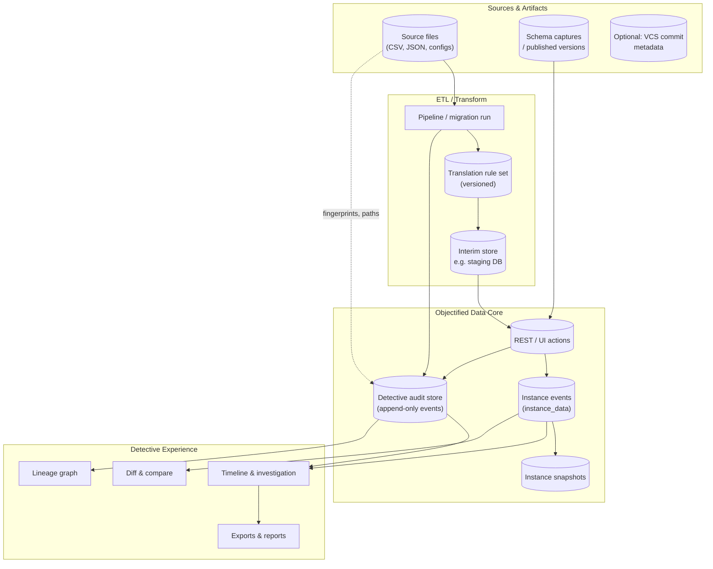
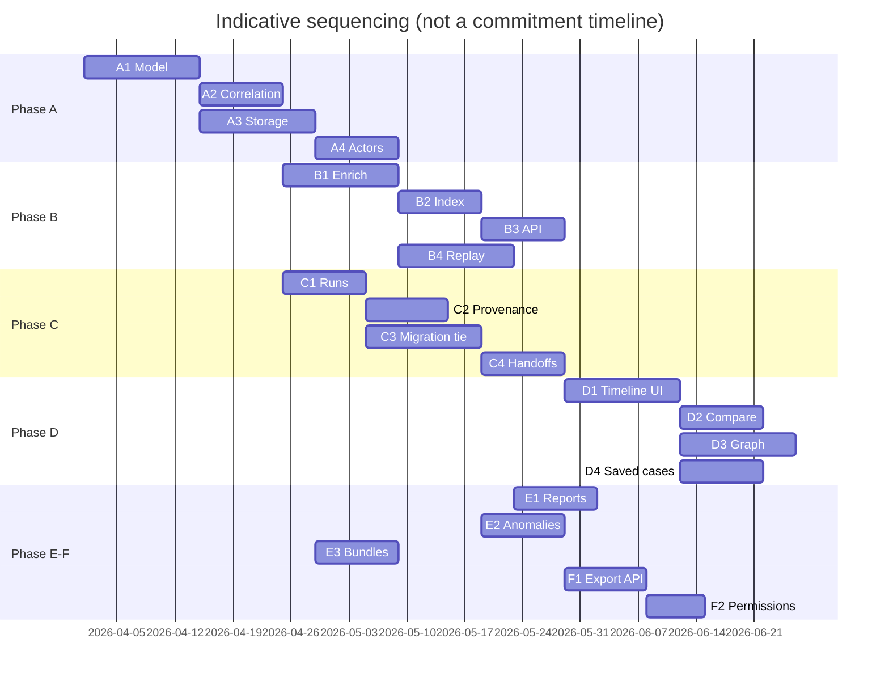

# Objectified - Data Detective & Provenance Roadmap

> Roadmap for **investigative** and **forensic** capabilities that let users trace **when**, **where**, **who**, and **how** data changed across **database-stored instances**, **ETL and transform pipelines**, and **related source artifacts**—supporting detection of corruption, tampering, policy violations, and operational mistakes.
>
> **Last Updated**: March 29, 2026  
> **Version**: 1.0 – Initial Detective / Provenance Plan  
> **Relationship**: Builds on [FEATURE_ROADMAP_DATABASE_DATA_STORAGE.md](FEATURE_ROADMAP_DATABASE_DATA_STORAGE.md) (event-sourced instances, snapshots) and [FEATURE_ROADMAP_DATA_TRANSFORM.md](FEATURE_ROADMAP_DATA_TRANSFORM.md) (migrations, translation rules, interim stores). Complements [FEATURE_ROADMAP_SECURITY.md](FEATURE_ROADMAP_SECURITY.md) (identity, RBAC, audit logging).

---

## Overview

**Detective** is not a single screen; it is a **cross-cutting capability** that connects:

| Surface | What users investigate |
|--------|-------------------------|
| **Database (instances)** | Per-record history (CREATE/UPDATE/DELETE), snapshot drift, who triggered API/UI changes, bulk imports |
| **ETL & transforms** | Pipeline runs, source file lineage, migration jobs, rule-set application, staging DB handoffs |
| **Related artifacts** | OpenAPI/schema versions, published captures, linked documents, external repo commits (where integrated) |

**Goals:**

1. **Attribution**: Tie every material change to an **actor** (human user, API key, service account, system job), **time** (UTC with tenant timezone display), and **channel** (UI, REST, batch, migration worker).
2. **Lineage**: From a suspicious field value, walk **backward** to contributing **files**, **jobs**, and **prior record versions**.
3. **Integrity**: Support **checksums**, **schema fingerprints**, and **reconciliation** between events, snapshots, and external sources to flag **tampering** or **silent divergence**.
4. **Operational clarity**: Distinguish **malice**, **misconfiguration**, and **expected migration side effects** using context (rule version, dry-run vs live, approval records).

**Non-goals (v1):** Real-time SIEM replacement, full blockchain ledger, or automated legal hold workflow—though exports and retention hooks should **align** with compliance programs.

---

## Guiding principles

| Principle | Implication |
|-----------|-------------|
| **Append-only audit** | Correction of audit metadata is rare; prefer **superseding** events with reason codes over silent edits. |
| **Correlation everywhere** | A single **correlation ID** (or trace ID) should connect API request → instance event → pipeline step → export row. |
| **Least-privilege read** | Detective views must respect RBAC: not all users see API key labels or cross-tenant admin actions. |
| **Explainable diffs** | Show **field-level** deltas with JSON Pointer paths, not only opaque blobs. |
| **Human + machine** | APIs and exports for auditors; UX for practitioners (support, data stewards). |

---

## Architecture at a glance

The following diagram situates **Detective** relative to storage and transform roadmaps (conceptual; actual services may differ).

---

## Example use cases

| Scenario | What happened | How Detective helps |
|----------|----------------|---------------------|
| **Suspected insider edit** | A financial field jumps after hours | Filter events by **time range**, **actor**, **API key**; view **diff**; check for linked **batch job** or **UI session**. |
| **Bad ETL row** | One region’s records have wrong currency | Trace instance version to **import batch ID**; open **source file hash** and **line/row range**; compare to **staging** output before load. |
| **Migration regression** | Post-migration, optional fields are null | Correlate **migration run ID** with **rule set version**; view **per-step counts** and **validation failures**; compare **before/after snapshot** for sample IDs. |
| **Tampering suspicion** | Snapshot disagrees with replayed events | Run **reconciliation report**: replay events → expected snapshot vs stored snapshot; flag **mismatch** with **last writer** event. |
| **Vendor dispute** | Partner claims “we never sent that update” | Show **signed request metadata** (if enabled), **ingress file** provenance, and **hash chain** of batches. |
| **Compliance audit** | Auditor asks “who deleted PII for user X?” | **DELETE** events with **actor**, **reason code**, **retention policy** reference; export **immutable audit bundle** for date range. |

---

## Feature set summary (v1)

| Group | Theme | Outcome for users |
|-------|--------|-------------------|
| **A** | Foundations & correlation | Every change is traceable end-to-end with stable IDs. |
| **B** | Database instance forensics | Rich history on instances: who/when/what changed, diffs, roll-forward. |
| **C** | ETL & migration forensics | Runs, steps, sources, and rule versions tied to data outcomes. |
| **D** | Investigation UX | One place to explore timelines, graphs, and saved cases. |
| **E** | Integrity & reconciliation | Detect drift, tampering indicators, and inconsistent states. |
| **F** | Governance exports | Signed or checksum’d bundles; retention-aware access. |

---

## Ordered micro-steps (for GitHub issues – create manually)

Issues are listed in **recommended implementation order**. Each block is intended to be **one or a small cluster** of GitHub issues (you may split further). **Do not** treat ticket numbers as assigned—they are **local IDs** for this document only.

**Legend**

| Field | Meaning |
|-------|---------|
| **Issue summary** | Short title suitable for a GitHub issue. |
| **Problem / opportunity** | Why this matters. |
| **Description** | Scope, acceptance notes, dependencies. |
| **Depends on** | Prior micro-steps from this list. |

---

### Phase A — Foundations & correlation fabric

#### A1 — Detective audit event model (canonical schema)

| | |
|--|--|
| **Issue summary** | Define canonical **Detective audit event** schema (envelope + payloads). |
| **Problem / opportunity** | Without a single event shape, database and ETL teams will duplicate fields and break cross-linking. |
| **Description** | Specify JSON/OpenAPI types for: `event_id`, `occurred_at`, `tenant_id`, `project_id`, `actor` (type: user \| api_key \| system \| service), `actor_id`, `correlation_id`, `causation_id` (parent event), `resource` (type + id), `action` (enum), `payload_summary` (non-PII fingerprint), `payload_ref` (pointer to detailed blob in secure store if large), `integrity` (hash of canonical serialization), `source_context` (optional: pipeline_run_id, file_fingerprint, line_range). Document **PII redaction** rules for indexed fields. Deliver: OpenAPI components + DB DDL sketch for append-only table. |
| **Depends on** | — |

#### A2 — Correlation & tracing standards

| | |
|--|--|
| **Issue summary** | Propagate **correlation_id** across REST, workers, and UI actions. |
| **Problem / opportunity** | Users cannot connect a single user click to downstream batch effects without a shared trace ID. |
| **Description** | Require/accept `X-Correlation-Id` (or generate). Pass through to instance mutations, import jobs, migration workers. Log correlation ID in application logs and audit events **A1**. UI: show correlation ID in “details” drawer for support. |
| **Depends on** | A1 |

#### A3 — Append-only audit storage & retention hooks

| | |
|--|--|
| **Issue summary** | Implement **append-only** storage for Detective events with **retention policies**. |
| **Problem / opportunity** | Mutable audit rows undermine forensic value; enterprises need retention alignment. |
| **Description** | PostgreSQL table(s) partitioned by time; no UPDATE/DELETE from app (soft legal hold via separate flag table). Admin APIs: configure retention (per tenant tier), export before purge. Document interaction with GDPR “right to erasure” (pseudonymize actor in audit vs delete business data). |
| **Depends on** | A1 |

#### A4 — Actor resolution & display policy

| | |
|--|--|
| **Issue summary** | **Resolve actors** for audit display (users, API keys, jobs) with RBAC-aware labels. |
| **Problem / opportunity** | Raw UUIDs frustrate investigations; over-exposure of key material is unsafe. |
| **Description** | Map `actor_id` to display name, role, masked key suffix. Define who may see **full** API key id vs **hash-only**. Integrate with [FEATURE_ROADMAP_SECURITY.md](FEATURE_ROADMAP_SECURITY.md) RBAC when available; interim role checks for “audit reader”. |
| **Depends on** | A1, A3 |

---

### Phase B — Database instance forensics

#### B1 — Enrich instance lifecycle events with forensic metadata

| | |
|--|--|
| **Issue summary** | Attach **actor, correlation_id, client metadata** to each `instance_data` / lifecycle event. |
| **Problem / opportunity** | Event-sourced history exists in the data storage roadmap but may lack attribution needed for detective work. |
| **Description** | On CREATE/UPDATE/DELETE: persist `actor`, `correlation_id`, optional `client` (user-agent, UI route), `request_id`, `change_reason` (optional enum + free text with length cap). Backfill strategy for legacy rows: “unknown actor” with migration script. Ensure OpenAPI + migration DDL. |
| **Depends on** | A1, A2 |

#### B2 — Field-level change index

| | |
|--|--|
| **Issue summary** | Index **JSON Pointer paths** (or key paths) touched by each UPDATE for fast queries. |
| **Problem / opportunity** | Investigators need “show all changes to `billing.amount` in March,” not full table scans. |
| **Description** | Store denormalized `changed_paths` array on event row or side table; GIN index. API: query by path prefix, class_id, time range. |
| **Depends on** | B1 |

#### B3 — Instance history API & pagination

| | |
|--|--|
| **Issue summary** | **REST API**: paginated **instance timeline** with cursor, filters (actor, path, action). |
| **Problem / opportunity** | UI and integrations need a stable contract for heavy histories. |
| **Description** | Cursor-based pagination; filters; include **diff summary** optional toggle (heavy). Rate limits documented. OpenAPI examples for “page through entire history”. |
| **Depends on** | B1, B2 |

#### B4 — Snapshot vs event replay (design + dry-run job)

| | |
|--|--|
| **Issue summary** | Design **replay** job: recompute snapshot from events; compare to `instance_snapshot`. |
| **Problem / opportunity** | Tampering or bugs may desynchronize snapshot and events; Detective must detect it. |
| **Description** | Background job per instance or sample-based: rebuild `current_data`, diff against snapshot, emit **reconciliation event** (see E1). Document performance limits (batch size, off-peak). |
| **Depends on** | B1 |

---

### Phase C — ETL & migration forensics

#### C1 — Pipeline run registry

| | |
|--|--|
| **Issue summary** | Introduce **pipeline / ETL run** entity: id, status, timestamps, owning actor, correlation_id. |
| **Problem / opportunity** | Source-file investigation needs a durable run record, not only log lines. |
| **Description** | Fields: `run_type` (import, export, migration_step, custom), links to project/version, input descriptors (file name, storage URI **reference**, hash), output descriptors, parent run for sub-steps. |
| **Depends on** | A1, A2 |

#### C2 — Source file fingerprinting & row-level provenance

| | |
|--|--|
| **Issue summary** | Capture **content hash**, **path/URI**, optional **line number / row index** for ingested records. |
| **Problem / opportunity** | “Which CSV row created this instance?” is a common audit question. |
| **Description** | On import: store `source_fingerprint` (sha256), `ingest_batch_id`, `row_offset` or similar; attach to instance CREATE event or sidecar table. Privacy: do not duplicate full file in audit if stored in customer bucket—store reference + hash. |
| **Depends on** | C1, B1 |

#### C3 — Migration run ↔ instance correlation

| | |
|--|--|
| **Issue summary** | Link **migration runs** (per [FEATURE_ROADMAP_DATA_TRANSFORM.md](FEATURE_ROADMAP_DATA_TRANSFORM.md)) to affected **instance_ids** or batch ranges. |
| **Problem / opportunity** | Post-migration incidents require binding rule-set version to concrete rows. |
| **Description** | When migration applies: write Detective events with `migration_run_id`, `rule_set_id` + version, `schema_capture_from`, `schema_capture_to`, counts. Support querying “all instances touched by run R”. |
| **Depends on** | C1, B1 |

#### C4 — Interim store handoff auditing

| | |
|--|--|
| **Issue summary** | Audit **handoffs** between PostgreSQL ↔ interim store (e.g. MongoDB) per transform roadmap. |
| **Problem / opportunity** | Multi-hop pipelines obscure where corruption entered. |
| **Description** | For each planned step: record row counts, checksum aggregates, duration, errors; `causation_id` chains step A → B. |
| **Depends on** | C1 |

---

### Phase D — Investigation experience (UI + API)

#### D1 — Instance “Detective” panel (timeline)

| | |
|--|--|
| **Issue summary** | UI: **timeline** of instance events with actor chips, expand for JSON diff. |
| **Problem / opportunity** | Non-engineers need a guided view. |
| **Description** | Filters: date range, actor, action, changed field search. Accessible in light/dark per UI standards. Use existing dialog patterns (no `alert()`). |
| **Depends on** | B3 |

#### D2 — Side-by-side version compare

| | |
|--|--|
| **Issue summary** | UI: select **two versions** (or version vs current) and show **structured diff**. |
| **Problem / opportunity** | Field-level accountability requires readable comparison. |
| **Description** | Monaco or structured diff component; JSON Pointer breadcrumbs; copy correlation IDs. |
| **Depends on** | B3, D1 |

#### D3 — Lineage mini-graph (instance ↔ runs ↔ sources)

| | |
|--|--|
| **Issue summary** | Visual **graph**: instance → import batch → file hash → pipeline runs (subset). |
| **Problem / opportunity** | Tables alone are insufficient for multi-hop reasoning. |
| **Description** | Read-only graph with click-through to run detail; cap nodes for performance; export as PNG/SVG later (optional v1.1). |
| **Depends on** | C2, C3, D1 |

#### D4 — Saved investigations & annotations

| | |
|--|--|
| **Issue summary** | Allow users to **save** a named investigation (filters + pinned entities + notes). |
| **Problem / opportunity** | Incidents span days; teams need shared workspace. |
| **Description** | Store investigation manifest per project; share with project members per RBAC; audit who created/edited notes (**A1** events). |
| **Depends on** | D1, A4 |

---

### Phase E — Integrity, anomalies, and policy signals

#### E1 — Reconciliation reports & tampering indicators

| | |
|--|--|
| **Issue summary** | Productize **reconciliation** outcomes: mismatch, missing events, snapshot ahead of log. |
| **Problem / opportunity** | Silent divergence erodes trust; users need explicit status. |
| **Description** | Report types: per-instance, per-class sample, scheduled tenant job. Severity: info/warn/critical. Emit **Detective** events on failures (A1). |
| **Depends on** | B4 |

#### E2 — Anomaly hints (heuristic, non-ML)

| | |
|--|--|
| **Issue summary** | **Heuristic flags**: unusual actor, unusual time, burst of deletes, path rarely changed. |
| **Problem / opportunity** | Guides attention before full manual review. |
| **Description** | Rule engine v1: thresholds configurable per tenant; no claim of “AI verdict”; copy explains each flag. |
| **Depends on** | B2, D1 |

#### E3 — Integrity checksums on audit export bundles

| | |
|--|--|
| **Issue summary** | Export **signed or hashed** audit bundles (manifest + events). |
| **Problem / opportunity** | Legal and security teams need tamper-evident handoff. |
| **Description** | Manifest lists event_id range + sha256 of JSONL body; optional org signing key integration (phase later if keys not ready). |
| **Depends on** | A3 |

---

### Phase F — Exports, compliance, and operations

#### F1 — Auditor export API (JSONL/CSV)

| | |
|--|--|
| **Issue summary** | Bulk export APIs filtered by **time, resource, actor** with async job pattern. |
| **Problem / opportunity** | SIEM and long-term archive need machine-readable streams. |
| **Description** | Async job + download link; document rate limits and PII warnings; correlate with **E3** manifest. |
| **Depends on** | A3, B3, C1 |

#### F2 — Detective permissions & audit of audit access

| | |
|--|--|
| **Issue summary** | Dedicated permission: `detective:read`, `detective:export`; log **access** to sensitive bundles. |
| **Problem / opportunity** | Reading audit data is itself sensitive. |
| **Description** | Access events with viewer actor; align permission names with RBAC roadmap when merged. |
| **Depends on** | A4, F1 |

---

## Cross-roadmap alignment (document only – do not edit source roadmaps here)

The following subsections describe **what should eventually be reflected** in adjacent roadmaps. This file is the **stakeholder view** for Detective; editors of the storage and transform roadmaps can lift items into those documents when ready.

### Additions suggested for `FEATURE_ROADMAP_DATABASE_DATA_STORAGE.md`

| Topic | Suggested addition |
|-------|-------------------|
| **Event enrichment** | Explicit fields on `instance_data` (or equivalent): `actor`, `correlation_id`, `change_reason`, `ingest_batch_id`, optional `source_fingerprint` / `row_offset`. |
| **Query support** | APIs and indexes for **changed_paths**, time + actor filters, cursor pagination for histories. |
| **Integrity** | Scheduled or on-demand **replay** job comparing materialized snapshot to event log; surfaced as Detective reconciliation. |
| **Bulk operations** | Imports and bulk PATCH must emit **batch-level** Detective events linking to all touched `instance_id`s (or ranges with expansion API). |
| **Links & relationships** | When `link` rows change, emit parallel audit events with **resource type** `link` for cross-object investigations. |
| **Retention** | Coordinate instance **soft-delete** and **audit retention** policies; document legal hold interaction. |

### Additions suggested for `FEATURE_ROADMAP_DATA_TRANSFORM.md`

| Topic | Suggested addition |
|-------|-------------------|
| **Run objects** | First-class **migration/transform run** with:id, **rule_set_id + version**, **schema capture pair**, status, step graph, **correlation_id**. |
| **Approval trail** | For cross-major migrations: store **approver**, timestamp, reason with run; surface in Detective. |
| **Per-step metrics** | Row counts, aggregate hashes, error samples; **causation** linking step N→N+1. |
| **Staging DB** | When interim MongoDB (or other) is used, record **namespace/collection**, **export batch ids**, and handoff checksums into Detective events. |
| **Rollback** | Rollback operations emit **explicit** audit action `ROLLBACK` with target run reference. |
| **Dry-run vs live** | Flag on run; Detective UI filters by “show only mutations with side effects”. |

---

## Dependency ordering (issue creation)

Use this table when batch-creating GitHub issues so **blockers** are scheduled first.

| Order | IDs | Theme |
|------:|-----|--------|
| 1 | A1, A2, A3 | Model, tracing, storage |
| 2 | A4, B1 | Actors + instance enrichment |
| 3 | B2, B3 | Indexes + instance API |
| 4 | C1, C2 | Pipeline + source provenance |
| 5 | B4, C3, C4 | Reconciliation design + migration correlation + handoffs |
| 6 | D1, D2, D3 | Core UX |
| 7 | E1, E2 | Integrity + heuristics |
| 8 | D4, E3, F1, F2 | Collaboration + exports + permissions |

---

## Version 2 (future) – advanced Detective

| Feature | Description |
|---------|-------------|
| **ML-assisted anomaly detection** | Models on change patterns; **human-in-the-loop** approvals for alerts. |
| **Cryptographic ledger / WORM storage** | Optional immutable log (vendor WORM bucket, ledger service) for regulated tenants. |
| **Cross-tenant analytics (admin)** | Aggregate tamper indicators for platform ops (strictly isolated; legal review). |
| **Graph database export** | Full provenance graph in Neo4j/Arango for large investigations. |
| **Real-time watch rules** | Subscriptions: “alert on DELETE where class = Customer”. |
| **Legal hold workflows** | Freeze deletes/retention for labeled cases; chain of custody UI. |
| **Automated incident packets** | One-click ZIP: timelines, graphs, rule versions, hashes, redacted PII tier. |
| **Partner API attestation** | Signed webhooks proving **ingress** payload hash at receipt time. |

---

## Success metrics (v1)

| Metric | How to interpret |
|--------|-------------------|
| **Time-to-root-cause** | Median minutes from open case to identified actor/run (self-reported or in-app survey). |
| **Replay coverage** | % of instances reconciled weekly vs total active instances (target by operations). |
| **Export adoption** | Number of successful auditor exports per quarter. |
| **False-flag rate** | User-dismissed heuristic flags / total flags (tune rules). |

---

## Document control

| Version | Date | Notes |
|---------|------|--------|
| 1.0 | 2026-03-29 | Initial Detective roadmap: phases A–F, cross-roadmap notes, v2 ideas. |

**Related documents:** [FEATURE_ROADMAP_DATABASE_DATA_STORAGE.md](FEATURE_ROADMAP_DATABASE_DATA_STORAGE.md), [FEATURE_ROADMAP_DATA_TRANSFORM.md](FEATURE_ROADMAP_DATA_TRANSFORM.md), [FEATURE_ROADMAP_SECURITY.md](FEATURE_ROADMAP_SECURITY.md).
