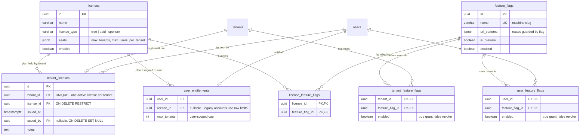

# Licensing entity model (ER)

How Apiome attaches licenses to tenants and users, as of **V183** (auto-issue Free, OLO-5.2,
#4212; `tenant_licenses` from **V182**, OLO-5.1, #4211). The catalog and feature-flag tables come
from **V097**; user entitlements from **V071/V097**.

## The split: user entitlement vs. tenant license

| Concept | Table | Answers |
|---------|-------|---------|
| **User entitlement** | `user_entitlements` | *How many tenants may this user create?* (`max_tenants`, via `license_id` → catalog `seats`, falling back to legacy raw limit columns) |
| **Tenant license** | `tenant_licenses` | *What may this tenant do?* — seat capacity (`max_users_per_tenant` from the plan's `seats` JSONB) and bundled features (`license_feature_flags`) |

Both point at the same `licenses` catalog; they license different subjects. A user's entitlement is
consulted when they try to **create** a tenant; a tenant's license is consulted for everything the
tenant does afterwards (adding members, gated features).

## Entity-relationship diagram



## Invariants

- **One active license per tenant** — `tenant_licenses.tenant_id` is `UNIQUE`
  (`uq_tenant_licenses_tenant_id`). A plan change is an upsert of the tenant's single row; history
  is not kept in this table (the `notes` column records provenance of the current attachment).
- **A held plan cannot vanish** — `tenant_licenses.license_id` → `licenses.id` is
  `ON DELETE RESTRICT`: deleting a catalog plan is refused while any tenant holds it.
- **License rows follow their tenant** — `tenant_id` is `ON DELETE CASCADE`; deleting a tenant
  removes its license attachment.
- **Provenance survives admin deletion** — `issued_by` → `users.id` is `ON DELETE SET NULL`;
  system-issued licenses (e.g. auto-issued Free, OLO-5.2) leave it `NULL`.
- **Every tenant holds a license from birth** (V183, OLO-5.2) —
  `apiome.attach_free_license(tenant_id)` is the single service function that attaches the Free
  plan; an `AFTER INSERT` trigger on `tenants` calls it for **every** create path in the same
  transaction as the insert, and V183 backfilled all pre-existing tenants. The function is
  idempotent (`ON CONFLICT (tenant_id) DO NOTHING`), so it never downgrades a tenant that already
  holds a plan.

## Feature composition (unchanged by V182)

A tenant's effective feature set remains, as established by V097:

```
license_feature_flags(plan)  ∪  tenant_feature_flags(tenant overrides, enabled=true)
                             ∖  tenant_feature_flags(enabled=false)
```

with `user_feature_flags` applying per-user grant/revoke on top. `tenant_licenses` only determines
*which plan* feeds the left-hand side.

## Related work

- **OLO-5.2 (#4212)** — ✅ auto-issue Free on tenant creation + backfill existing tenants (V183).
- **OLO-5.3 (#4213)** — enforcement guards (seats, tenant caps).
- **OLO-5.4/5.5 (#4214/#4215)** — REST surface and settings UI reading this model.
- **#3484** — Platform Foundations & Licensing epic (paid upgrades/billing); reconciled via
  OLO-5.6 (#4216).
