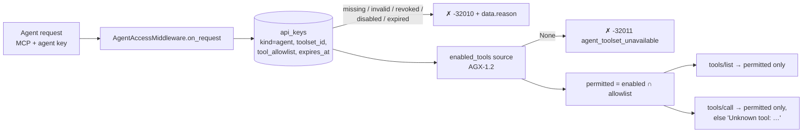

# Agent access (AGX-3.1)

**Ticket:** AGX-3.1 ([#4537](https://github.com/apiome/apiome/issues/4537)).
Module: [`apiome_mcp.agent_access`](../src/apiome_mcp/agent_access.py).
Keys are minted by apiome-rest's `/v1/tenants/{t}/agent-keys`
([agent_keys.md](../../apiome-rest/docs/agent_keys.md)).

An agent calling a tenant's API through a managed MCP toolset presents an **agent key**: an
`apiome.api_keys` row with `kind = 'agent'` (V269), bound to one toolset and carrying an explicit
tool allowlist. `AgentAccessMiddleware` is the FastMCP middleware that enforces it on the **agent
surface**. What an agent may use is

```
permitted = toolset's enabled tools (AGX-1.2)  ∩  key's tool_allowlist
```

and an agent cannot even *see* a tool outside that set.



## Per request

Every request except the `initialize` handshake goes through the same steps:

1. **Read the key.** It comes from `Authorization: Bearer <key>` over HTTP. Transports without
   headers can send it in `params._meta` (`authorization`, `apiome_authorization`,
   `apiome_api_key` or `api_key`), the same keys the catalog server reads.
2. **Resolve it.** `resolve_agent_key(pool, secret)` looks the key up by its 12-character prefix,
   `kind = 'agent'` only, and verifies the bcrypt hash in a worker thread. **After** the hash
   matches, it refuses the key in this order: revoked, disabled, expired. A caller without the real
   secret only ever gets `agent_key_invalid`. The row is read on every request, so a revoke, an
   expiry or an allowlist edit applies to the very next request, even within the same MCP session.
   Nothing is cached.
3. **Ask the toolset.** `enabled_tools(ctx, key)` returns the toolset's enabled tool names, or
   `None` when the toolset is missing or disabled.
4. **Narrow.** `tools/list` is filtered to the permitted set. `tools/call` on anything else raises
   FastMCP's own `Unknown tool: '<name>'`. A tool the key may not use therefore looks exactly like
   a tool that does not exist, so an agent cannot probe for tools.

The decided `AgentAccess` (key plus permitted set) is available to the rest of the request through
`current_agent_access()`. The AGX-2.1 invocation path uses that value instead of resolving the key
a second time.

## Errors

A refusal is an `AgentAccessDeniedError`, which is an `mcp.McpError`:

| `data.reason` | JSON-RPC code | When |
|---|---|---|
| `agent_key_missing` | `-32010` | No key presented |
| `agent_key_invalid` | `-32010` | Unknown key, wrong secret, workspace/catalog key, or disabled tenant |
| `agent_key_revoked` | `-32010` | Key revoked (`DELETE /agent-keys/{id}`) |
| `agent_key_disabled` | `-32010` | Key's `enabled` flag is off |
| `agent_key_expired` | `-32010` | `expires_at` has passed |
| `agent_toolset_unavailable` | `-32011` | The key is fine, but its toolset is missing, disabled, or not curated yet |
| `agent_access_unavailable` | `-32603` | Access could not be decided (e.g. database down). Fails closed and the cause is not echoed |

`-32010` and `-32011` sit in JSON-RPC's implementation-defined server-error range, clear of the
codes the MCP SDKs use (`-32000`, `-32001`, `-32002`, `-32042`).

- **`tools/list`** returns the error as a JSON-RPC error with that code and `data`.
- **`tools/call`**: the MCP Python SDK turns any error raised while handling a call into an
  `isError: true` tool result. The result text is the error message, which always starts with the
  reason (`agent_key_revoked: This agent key has been revoked.`).

No message contains the key, its hash or its prefix.

## Mounting it (AGX-2.1)

```python
from apiome_mcp.agent_access import AgentAccessMiddleware

agent_mcp = FastMCP("Apiome agent runtime", lifespan=database_lifespan)
agent_mcp.add_middleware(AgentAccessMiddleware(enabled_tools=load_enabled_tools))  # AGX-1.2 source
```

- **Never mount it on the catalog server** (`apiome_mcp.server`). The catalog's `tools/list`
  always returns the full registry (MTG-2.1, [LIST_ALWAYS.md](LIST_ALWAYS.md); rules in
  [AGX_COORDINATION.md](AGX_COORDINATION.md)). A test fails the build if the catalog app ever
  carries `AgentAccessMiddleware`.
- **The default `enabled_tools` fails closed.** `toolset_curation_pending` knows no toolset,
  because `agent_toolsets` / `agent_toolset_tools` are AGX-1.2 (#4530), which was still open when
  this shipped. Until a real source is passed, every request is refused with
  `agent_toolset_unavailable`. AGX-1.2's source should map the toolset's enabled operation refs to
  compiled tool names with `compile_mcp_tools` (the same names the allowlist holds), and return
  `None` for a missing or disabled toolset.
- `key_resolver` can be replaced too (tests pass a fake). The default resolves against `api_keys`
  through the lifespan pool.

## Tests

- `tests/test_agent_access.py` covers the intersection, the error mapping, the resolver against an
  in-memory `api_keys` (`tests/agent_access_fakes.py`), and the middleware driven through
  FastMCP's dispatch.
- `tests/test_agent_access_http.py` checks the acceptance criteria over real streamable HTTP
  (Uvicorn plus a FastMCP client):
  - `tools/list` returns exactly the intersection;
  - a non-permitted `tools/call` is indistinguishable from an unknown tool;
  - expired keys are rejected;
  - revocation and allowlist edits take effect on the same session's next request.
