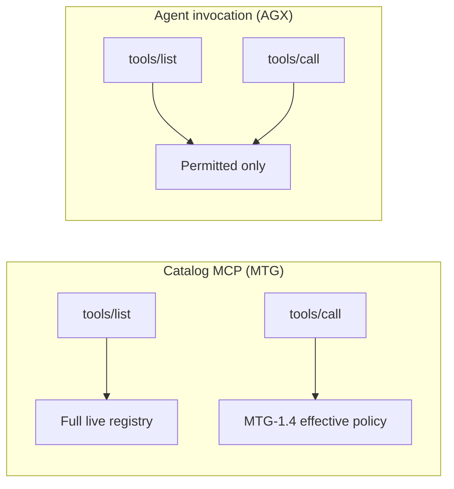

# Architecture — Catalog MCP (MTG) vs agent invocation (AGX)

**Ticket:** MTG-5.5 (#4789). Cross-links: AGX umbrella [#4503](https://github.com/apiome/apiome/issues/4503),
AGX-3.1 agent keys [#4537](https://github.com/apiome/apiome/issues/4537), list-always ADR
[LIST_ALWAYS.md](LIST_ALWAYS.md) (MTG-2.1 / #4770).

Apiome exposes two different MCP product surfaces that must **not** share
`tools/list` semantics, even if they later share auth helpers, registries, or
FastMCP middleware patterns.

## Two contracts

| | Catalog MCP (`apiome-mcp`) — **MTG** | Agent invocation tools — **AGX** |
|---|---|---|
| Purpose | Discover & read the published API catalog (search, describe, export) | Call tenant-selected operations as MCP tools (proxy to upstream / mock) |
| Credential | MCP API keys (`mcp_api_keys`) + optional anonymous | Agent keys (`api_keys` kind=`agent`, allowlist, expiry) — AGX-3.1 |
| `tools/list` | **Always full** live registry (MTG-2.1) | **Filtered** to permitted tools (AGX-3.1: enabled ∩ allowlist) |
| `tools/call` | Gated by tenant ceiling ∩ key enable-set (MTG-1.4 / 2.2) | Gated by the same permitted intersection as list |
| Roadmap | `ROADMAP_MCP_CONFIGURABILITY_IN_TENANTS.md` (#4759) | `ROADMAP_AGENT_EXPERIENCE.md` (#4503) |

Catalog discovery stays open so hosts and agents can **see** what Apiome offers;
governance controls **blast radius on call**. AGX does the opposite for invocation
tools: an agent key must not even *see* tools it may not call.

## Shared-code rule

When implementing AGX-3.1 (#4537) or refactoring auth/middleware shared with
`apiome-mcp`:

1. **Do not** apply agent allowlist / toolset intersection to catalog
   `on_list_tools` (or any path that builds the catalog `tools/list` response).
2. Prefer **separate** middleware, endpoints, or FastMCP apps for agent
   invocation vs catalog — copy patterns, do not merge list filters into one
   handler that branches on key kind unless the catalog branch is an explicit
   no-op passthrough.
3. Shared pure helpers (e.g. effective policy) may be reused for **`tools/call`**
   decisions only; list filtering belongs solely on the AGX surface.
4. CI: `tests/test_list_always_invariant.py` fails the build if catalog list is
   filtered or if catalog middleware `on_list_tools` stops being a pure
   passthrough (see source AST guard).

## Operator pointers

- List-always ADR: [LIST_ALWAYS.md](LIST_ALWAYS.md)
- Call gate / resolver: [EFFECTIVE_POLICY.md](EFFECTIVE_POLICY.md)
- Guide (list vs call for keys): [`docs/guide/mcp-quickstart.md`](../../docs/guide/mcp-quickstart.md)
