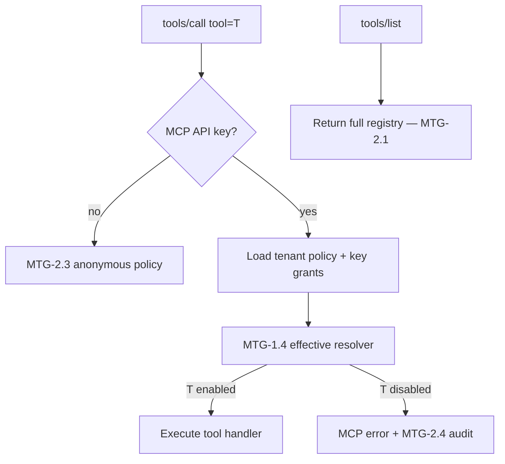

# Effective MCP tool policy (MTG-1.4)

Ceiling, tenant defaults, and per-key grants resolve to **one boolean per
tool** via a shared pure function in `apiome-rest`
(`app.mcp_effective_policy`). `apiome-mcp` re-exports the same helpers
from `apiome_mcp.effective_policy` so REST “preview effective” and the
future `tools/call` gate (MTG-2.2) cannot disagree.

## Formula

```
effective(tool) =
    tool ∈ registry
    AND tool ∈ tenant.ceiling
    AND (
          key.mode == inherit  → tool ∈ tenant.default_enable_set
          OR key.mode == explicit → tool ∈ key.enabled_tools
        )
```

Precedence is left-to-right AND. Ceiling always wins over an explicit
key grant.

## Tenant `default_mode`

| Mode | Missing tool row | Tool rows present |
|------|------------------|-------------------|
| `all` | Full registry (ceiling + defaults); **rows ignored** | Ignored |
| `inherit_registry` | In ceiling + default-enabled | Use `in_ceiling` / `default_enabled` |
| `explicit` | Out of both sets | Use flags |

Unseeded tenants (`tenant is None`) behave as `default_mode=all`
(legacy default). After MTG-1.5 (V163), every existing tenant is seeded
with `default_mode=all`; missing-policy handling remains for safety.

## Call flow



`tools/list` stays unfiltered (MTG-2.1) — see **[LIST_ALWAYS.md](LIST_ALWAYS.md)**.
Anonymous callers are out of scope for this resolver (MTG-2.3).

## API surface

| Helper | Use |
|--------|-----|
| `is_tool_effectively_enabled` | MCP call gate |
| `preview_effective_tools` | REST/admin effective table |
| `resolve_tool_effective` | Same decision + first `DenyReason` |
| `tool_in_ceiling` / `tool_in_default_enable_set` | Building / debugging sets |

Snapshots: `TenantMcpPolicySnapshot`, `KeyCapabilitySnapshot`,
`TenantToolFlags`.
