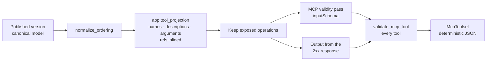

# Operation→tool compiler (AGX-1.1)

**Ticket:** AGX-1.1 ([#4529](https://github.com/apiome/apiome/issues/4529)).
Core: `app.mcp_tool_mapping` (apiome-rest), re-exported by
[`apiome_mcp.tool_compiler`](../src/apiome_mcp/tool_compiler.py).

The compiler turns the canonical model of a published version into the **toolset** an
agent sees: one MCP tool per exposed operation, with a name, a description (including
what a successful call returns) and an `inputSchema` every MCP host accepts. It is the
foundation the rest of the Agent Experience roadmap consumes: curation (AGX-1.2), the
golden corpus (AGX-1.4) and the invocation proxy (AGX-2.1).



## Usage

```python
from apiome_mcp.tool_compiler import compile_mcp_tools, compile_openapi_toolset, to_mcp_tools

toolset = compile_mcp_tools(canonical_api)                       # every non-deprecated operation
toolset = compile_mcp_tools(canonical_api, exposed=["GET /pets"])  # an AGX-1.2 selection
toolset = compile_openapi_toolset(openapi_document)                # from a revision's OpenAPI doc

toolset.mcp_tools()     # [{"name", "description", "inputSchema"}, …] — the tools/list entries
to_mcp_tools(toolset)   # the same, as mcp.types.Tool models
toolset.serialize()     # canonical JSON (the AGX-1.4 golden format)
toolset.fingerprint()   # sha256 of serialize()
toolset.losses          # what the compile could not carry, per operation
```

## One mapping, several packagings

Names, descriptions and argument flattening come from `app.tool_projection`, the shared
middle that the LLM tool-array emitter (FMT-2.5) renders too. The MCP-specific rules below
live in `app.mcp_tool_mapping`, in apiome-rest, so that every MCP packaging can import
them:

| Consumer | Packaging |
|---|---|
| AGX-2.1 invocation proxy ([#4533](https://github.com/apiome/apiome/issues/4533)) | serves the toolset from the MCP process |
| AGX-1.2 curation ([#4530](https://github.com/apiome/apiome/issues/4530)) | exposure = the operation keys a tenant enables |
| AGX-1.4 golden corpus ([#4532](https://github.com/apiome/apiome/issues/4532)) | `serialize()` output checked in per corpus spec |
| SDK-4.5 MCP server artifact ([#4499](https://github.com/apiome/apiome/issues/4499)) | the same tool definitions, embedded in generated code |
| MFX-32.1 MCP tool-definition emitter ([#4295](https://github.com/apiome/apiome/issues/4295)) | the same tool definitions, as a descriptor file |

None of these may re-derive a name or a schema.

## Rules

### Names

- Derived from `operationId`, falling back to the operation name and then its canonical
  key. Characters outside `[A-Za-z0-9_-]` fold to `_`, and names are capped at 64
  characters (with a hash suffix when truncated).
- **Collisions** are resolved in canonical key order: the second `list_items` becomes
  `list_items_2`.
- **Collision-stable:** names are computed over *every* callable operation of the version
  and only then filtered to the exposed ones. Enabling or disabling one operation never
  renames another tool.

### Exposure

- `exposed=None` exposes every callable operation that isn't deprecated.
- An explicit list of canonical keys (`GET /pets/{petId}`) exposes exactly those
  operations, including deprecated ones. A deprecated tool's description starts with
  `Deprecated.`.
- An unknown key, or an event/streaming operation (which has no tool form), raises
  `UnknownOperationError`.
- A model with no callable operation compiles to an **empty** toolset. There is no
  schema-only "submit a record" fallback, because an agent tool must invoke something.

### inputSchema

- Path, query and header parameters are merged with the request body into one object.
  The body merges flat, or nests under `body` if it isn't an object or a property name
  collides with a parameter.
- Named types are inlined. A `#/components/schemas/…` ref inside an inline body resolves
  to the named type, and refs into the schema's own `$defs`/`definitions` are inlined too.
  A cycle becomes a free-form `{}` at the recursion point.
- Credential-bearing headers and query parameters, and all cookie parameters, are never
  arguments. The runtime supplies credentials (AGX-2.2).

### MCP validity pass

Every schema, input and output alike, is reduced to the portable keyword subset
`MCP_SCHEMA_KEYWORDS`:

| Kept | Downgraded | Dropped |
|---|---|---|
| `type` `properties` `required` `additionalProperties` `items` `enum` `anyOf` `title` `description` `default` `examples` `format` `pattern` `minLength` `maxLength` `minimum` `maximum` `exclusiveMinimum` `exclusiveMaximum` `multipleOf` `minItems` `maxItems` `uniqueItems` `minProperties` `maxProperties` | `oneOf` → `anyOf` · `allOf` → merged into its parent · `const` → one-value `enum` · `nullable: true` → `null` type · `example` → `examples` · boolean `exclusiveMinimum`/`exclusiveMaximum` → numeric · `deprecated` → `Deprecated.` description marker | `$ref` (becomes `{}`) · `$defs` · `not` · `if`/`then`/`else` · `prefixItems` / tuple `items` · `patternProperties` · `dependent*` · `unevaluated*` · `readOnly`/`writeOnly` · `discriminator` · `xml` · `externalDocs` · `x-*` · anything else |

- Dropping a keyword only ever **widens** what a schema accepts. The upstream API still
  validates the real request.
- The argument root is always `type: object` with `properties`. A root composition is
  dropped, because model APIs reject one.
- `required` names with no declared property are removed.
- Every change is recorded on `toolset.losses` (`mcp-keyword-dropped`,
  `mcp-keyword-downgraded`, `mcp-unresolved-ref`, `mcp-root-combinator-dropped`), pointed
  at the operation.

### Output

- The **lowest explicit 2xx** response wins (`200` over `201`), then `2XX`. For
  non-HTTP paradigms, the response message with no status is used. `default` is never
  chosen.
- The tool description gains one sentence, for example
  `Returns HTTP 200 application/json (array of Pet): Success` or
  `Returns HTTP 204 with no body: No content`.
- The inlined, MCP-valid body schema is kept on `tool.output.schema` but **not** rendered
  as MCP `outputSchema`. Advertising an `outputSchema` obliges the server to return
  conforming `structuredContent` on every call, which only the invocation proxy (AGX-2.1)
  can promise.

### Determinism

- The model is order-normalized first, so the same spec produces a byte-identical
  `serialize()` in any input order. `mappingVersion` (currently `1`) is bumped whenever a
  mapping change alters output for an unchanged spec.
- `validate_mcp_tool` re-checks every tool before a toolset is returned: an invalid
  toolset raises `McpToolMappingError` instead of shipping.

## Known limitation

`OpenApiNormalizer` drops parameters, request bodies and responses that are `$ref`'d from
`#/components/parameters`, `#/components/requestBodies` and `#/components/responses`,
before the compiler ever sees the model. Studio-generated revisions inline these and are
unaffected; imported documents that use such refs lose those operations' arguments. This
is for the normalizer to fix; it is not a compiler rule.

## Tests

- `apiome-rest/tests/test_mcp_tool_mapping.py` covers:
  - the Petstore acceptance fixture;
  - every sanitizer rule;
  - output selection;
  - naming and exposure;
  - determinism across input orders;
  - a sweep of the whole examples corpus, compiled twice to identical bytes, with every
    schema MCP-valid and valid against the JSON-Schema 2020-12 metaschema.
- `apiome-mcp/tests/test_tool_compiler.py` covers:
  - re-export identity with the REST core;
  - `mcp.types.Tool` validation;
  - an in-process round trip: the compiled tools are served by a throwaway FastMCP server
    and listed and called through an MCP client, well-formed arguments validate and
    arrive, and malformed ones are rejected.
