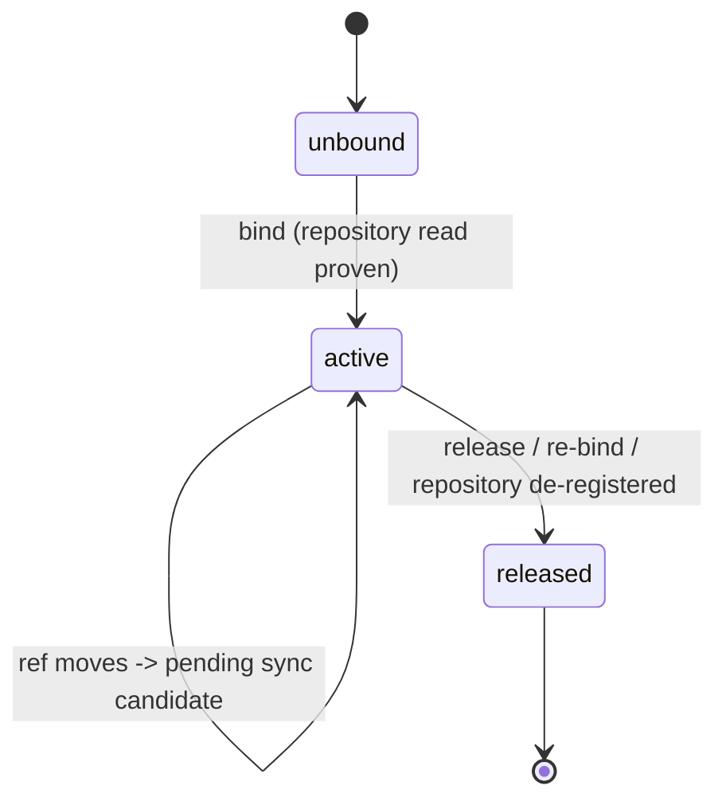
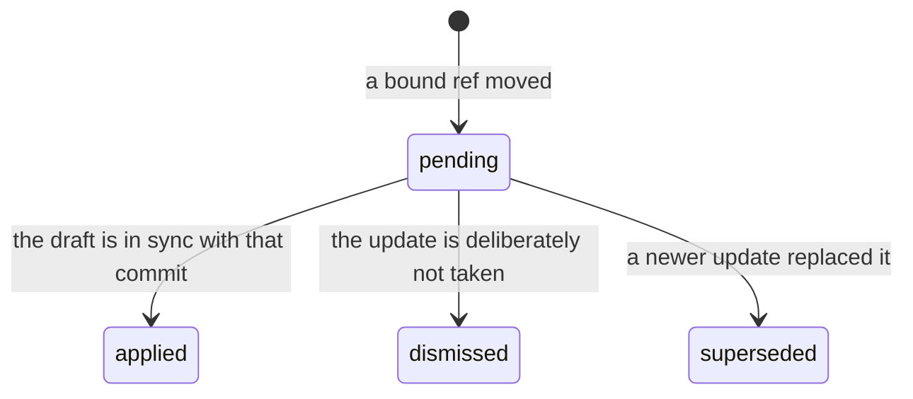

# Branch-to-draft bindings (GNC-2.1)

Importing a spec from a repository leaves a **snapshot**: a revision that records which repository
and which commit it came from. Binding leaves a **relationship**: one draft version becomes the API
review unit of one repository ref and source path, remembers the digest of the files that selection
resolved to, and gives every later push to that ref somewhere to land.

- Storage: apiome-db `V264__draft_repository_bindings_gnc_2_1.sql`
  (`draft_repository_bindings`, `draft_binding_sync_candidates`)
- Routes: `app/draft_binding_routes.py`
- Rules: `app/draft_binding_store.py`
- Models, codes, and the digest: `app/draft_bindings.py`
- Provider deliveries: `app/repository_webhook_dispatch.py` (REPO-4.3's endpoint, unchanged)

This is the base for the provider webhook and status adapter
([GNC-2.2](provider_checks.md)) and three-way spec synchronization
([GNC-2.3](spec_sync.md)).

## The one rule

**A ref update is never a change.** When a bound ref moves, a **sync candidate** is recorded — the
commit and digest the binding is at, and the commit the ref moved to — and nothing about the draft
changes. Somebody then applies or dismisses it, and whichever they choose is audited.





## Binding

`POST /v1/tenants/{tenant}/projects/{project}/versions/{version}/binding`

```json
{ "repository_id": "…", "ref": "main", "path": "spec/openapi.yaml", "replace": false }
```

Name the repository with either `repository_id` (a registered tenant repository, whose stored
linked-account credential authorizes the read) or `repo_url` (with an optional `linked_account_id`
of the caller's own). **A credential is never accepted in the body**, and an unknown field is a 422.

Before a row is written, the store resolves the stored credential and actually reads the ref and the
selection through the provider (`app.git_intake.fetch_git_fileset`, `require_root=False`). That read
*is* the authorization check — a repository the tenant cannot reach can never be bound — and it is
what produces the `commit_sha` and the `source_digest` the binding stores.

- Only a **draft** (unpublished) version can be bound (`409 binding-version-published`).
- A draft has **at most one active binding** (`409 binding-already-bound`); `replace: true` releases
  the current one and binds anew. V264's partial unique index on `version_id` backs it.
- What a binding *names* — tenant, project, version, provider, repository, ref, path — never
  changes. A different ref is a different review unit, so it is a new binding.

### The source digest

`source_digest` is `sha256:<hex>` over the selection's members: every member's path and body,
length-prefixed and NUL-separated, in sorted path order. Renaming a file, moving content between two
files, and adding an empty one therefore all change it, none of which a hash of the concatenated
bodies would catch. It is the base [three-way synchronization](spec_sync.md) diffs a ref
update against. (The spelling matches `openapi_source_fingerprint`; the two are different things and are
never mistaken for one another's format.)

## Sync candidates

A candidate is raised from three origins:

| Origin | Raised by | `to_digest` |
|---|---|---|
| `webhook` | A verified provider delivery on the bound ref | `null` — a delivery names a commit, not a document |
| `manual` | `POST …/binding/check` | The digest of the source at the new commit |
| `sweep` | Reserved for the refresh cadence | — |

Idempotency is twice over, both as partial unique indexes: one **pending** candidate per
`(binding, target commit)`, and one candidate per `(binding, provider delivery id)` — so a
redelivery raises nothing new, and cannot resurrect a candidate somebody already dismissed. Raising
a candidate supersedes any older pending one on the same binding, so at most one is ever decidable.

### From a provider delivery

Nothing new is exposed. The existing repository webhook endpoint (REPO-4.3,
`POST /v1/repository-webhooks/{provider}`) raises candidates as part of ingestion, **outside** the
tracked-branch gate the scan dispatch applies: a branch a draft is bound to need never have been
imported from. A push moves the branch it names; a pull request moves its **head** branch (and only
when that head lives in this repository), never its base. The count rides on the acceptance audit as
`bindingCandidates`, and a binding-store fault is logged rather than failing the delivery.

### From a person

`POST …/binding/check` asks the provider where the ref is now. It re-proves repository access, so a
binding whose repository the caller can no longer reach refuses here rather than reporting "no
change". A ref that has not moved is `409 binding-unchanged`.

### Settling one

`POST …/binding/candidates/{candidate_id}` with `{"status": "applied" | "dismissed", "note": "…"}`.

- **`applied`** records that the draft is in sync with the candidate's commit. The source is
  **re-read at that commit** first — so the digest stored is one that was actually fetched, never
  asserted from a delivery payload — and the binding's synchronized pair advances to it. It does
  **not** modify the draft; [three-way synchronization](spec_sync.md) settles a candidate this way
  once its merge has been dealt with.
- **`dismissed`** leaves the binding exactly where it is.
- `superseded` is the system's alone, and is not accepted over HTTP.
- A candidate settles **once** (`409 binding-candidate-resolved`); a trigger refuses every later
  change, whichever writer attempts it.

## Releasing, and history

`DELETE …/binding` stamps the row released (`unbound`) and supersedes its outstanding candidates —
a released binding can never act on one. The row itself **stays**, carrying the ref, path, commit
and digest it was bound at, and is frozen by a trigger. `GET …/binding` returns the active binding
and every row this version has had before.

Release reasons: `replaced` (re-bound elsewhere), `unbound` (explicitly removed),
`repository_removed` (the registration went away).

**De-registering a repository** releases every binding it authorized, in the same transaction as the
soft delete, with no releaser — nobody released them personally, the credential they depended on
went away.

## Endpoints

| Method | Path | Permission |
|---|---|---|
| `GET` | `…/projects/{project}/bindings` | `projects:view` |
| `GET` | `…/projects/{project}/bindings/{binding_id}` | `projects:view` |
| `GET` | `…/projects/{project}/versions/{version}/binding` | `projects:view` |
| `POST` | `…/projects/{project}/versions/{version}/binding` | `versions:edit` + a proven repository read |
| `DELETE` | `…/projects/{project}/versions/{version}/binding` | `versions:edit` |
| `POST` | `…/projects/{project}/versions/{version}/binding/check` | `versions:edit` + a proven repository read |
| `POST` | `…/projects/{project}/versions/{version}/binding/candidates/{id}` | `versions:edit` (+ a proven read to apply) |

There is deliberately **no binding RBAC resource**: binding changes a version's workflow, which
`versions:edit` already expresses, and the second half of the check — "can this tenant's stored
credential read that repository?" — is not something a role grid can state.

## Refusal codes

A client branches on the code, never on the message.

| Code | Status | Meaning |
|---|---|---|
| `binding-project-not-found` | 404 | No such project in this tenant |
| `binding-version-not-found` | 404 | No such version in this project |
| `binding-not-found` | 404 | The version is not bound |
| `binding-candidate-not-found` | 404 | No such candidate on this binding |
| `binding-repository-not-found` | 404 | The registration is not this tenant's, or the provider has no such repository/ref/path |
| `binding-repository-forbidden` | 403 | No stored credential grants a read of that repository |
| `binding-repository-unreachable` | 502 | The provider could not be reached |
| `binding-invalid-source` | 422 | The selection resolves to nothing, or to more than the intake budget allows |
| `binding-version-published` | 409 | Only a draft can be bound |
| `binding-already-bound` | 409 | The version is already bound; release it or pass `replace` |
| `binding-candidate-resolved` | 409 | That candidate already settled |
| `binding-unchanged` | 409 | The ref is exactly where the binding already is |
| `binding-released` | 409 | The binding is history |
| `binding-conflict` | 409 | Somebody else changed it mid-flight; read again and retry |

## Audit

Every bind, re-bind, release, candidate, and settlement is written to `workflow_audit` **inside the
same transaction** as the change it records — not best-effort — and is readable through
`GET /v1/tenants/{tenant}/workflow-audit?version_id=…`.

| Action | Written when |
|---|---|
| `binding.bound` | A draft was bound |
| `binding.rebound` | A draft was bound elsewhere, releasing the previous binding |
| `binding.released` | A binding stopped being active (any reason) |
| `binding.sync_candidate` | A bound ref was observed to have moved |
| `binding.sync_resolved` | A candidate was applied or dismissed |

## What this ticket deliberately does not do

- **It does not change a draft.** Applying a candidate moves the binding's synchronized pointer and
  nothing else. Reconciling repository changes with a draft is
  [GNC-2.3](spec_sync.md), which merges the two against their common base and settles the same
  candidates — and which likewise never rewrites a draft.
- **It writes nothing back to the provider.** Check runs and PR status are GNC-2.2, which builds
  on this schema exactly as predicted and needed no migration to it — see
  [provider_checks.md](provider_checks.md).
- **Only `github` can be read today** (`app.git_intake`). `gitlab` and `bitbucket` are accepted by
  the schema and the vocabulary, and GNC-2.2 ships a status adapter for all three — so a draft on
  either can be *reported on* before it can be *read from*.
