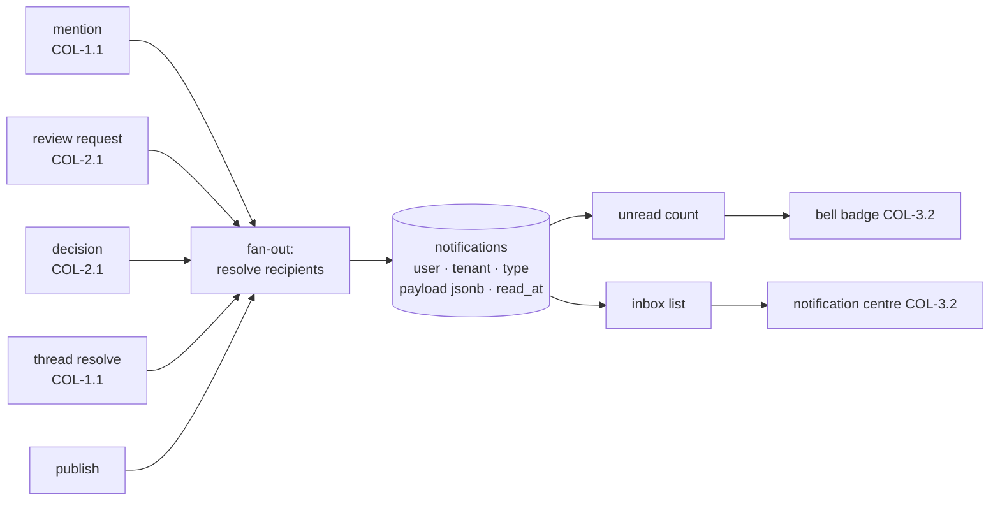

# Notification inbox & fan-out (COL-3.1)

Mentions, review requests, decisions, thread resolutions and publishes are worthless if the person
concerned never learns about them. This is the storage and the API behind "what needs me": one row
per recipient per event, written in the **same transaction as the event**, plus the reads the
notification centre (COL-3.2) draws its bell, its list and its mark-all-read from.

- Storage: apiome-db `V263__notifications_col_3_1.sql` (`notifications`)
- Routes: `app/notification_routes.py`
- Read/mark rules and the fan-out builders: `app/notification_store.py`
- Who an event concerns, and what its row says: `app/notification_fanout.py` (pure)
- Models, type vocabulary and error codes: `app/notifications.py`

## Events and recipients



| `type` | Written when | Recipients |
| --- | --- | --- |
| `mention` | A comment's `@name` tokens resolve to tenant members | Those members. An **edit** notifies only the members it *newly* names |
| `review_requested` | A review is requested, and on every re-request | That round's reviewers |
| `review_decision` | A reviewer approves or requests changes | The member who requested the review |
| `thread_resolved` | A thread moves to `resolved` | Everyone who took part: its opener and every comment author |
| `version_published` | A version is published | Its collaborators: review participants and thread participants of that version |

Two rules hold for all five:

- **Nobody is notified of their own action.** Resolving your own thread, mentioning yourself, or
  deciding a review you requested pages nobody.
- **A recipient set is bounded** (200). Comments already cap mentions at 50 and reviews cap
  reviewers at 20; the bound is the backstop for the collaborator set a publish resolves.

Reopening a thread, withdrawing a review, and deleting or editing away a mention notify nobody.

## Written with the event, never after it

Each write accessor takes a `notify` callable and runs it **inside its own transaction**
(`Database._insert_notifications`). A committed event always has its inbox rows, and a rolled-back
one never leaves any — no queue, no worker, no "the notification was lost because the process died
after the commit".

Two consequences worth knowing:

- The builders in `notification_store` resolve everything they need (thread participants, version
  collaborators) **before** the write opens its transaction, and close over it. The callable that
  runs inside the transaction is pure — issuing another query through the shared `db` connection
  there would commit the transaction out from under the write it is part of.
- The insert joins `users`, so a recipient deleted between resolving the set and writing it is
  skipped rather than raising. Fan-out is never the reason a publish or a decision rolls back.

The one deliberate exception is the publish path: if resolving a version's collaborators *fails*,
the publish goes ahead and notifies nobody (logged), because a read that could not answer is not a
reason to refuse a publish.

## Payload

`payload` is a JSON object holding what the notification's sentence and its deep link need. It is a
pointer to the event, never a copy of it.

| Key | On | Meaning |
| --- | --- | --- |
| `project_slug`, `project_name` | all | The project, for the sentence and the URL |
| `version_label` | all | The version, e.g. `1.2.0` |
| `thread_id` | `mention`, `thread_resolved` | The thread to open |
| `comment_id` | `mention` | The comment that named the recipient |
| `anchor_type`, `anchor_id` | `mention`, `thread_resolved` | The element the thread is anchored to |
| `excerpt` | `mention` | Up to 280 characters of the comment, whitespace collapsed |
| `review_id`, `round` | `review_requested`, `review_decision` | The review and the round |
| `decision` | `review_decision` | `approve` or `request_changes` |

A key whose value did not resolve is **absent** rather than null. `project_id` and `version_id` are
columns, not payload, so a deleted project or version takes its notifications with it.

The **actor** is a column too (`actor_id`), and their display name is read fresh on every list, so
a rename never leaves a stale name in stored JSON. Deleting the actor keeps the notification
(`ON DELETE SET NULL`) — "somebody mentioned you" survives that somebody leaving.

### What a payload may say

A payload carries ids, labels and one short excerpt — never credentials, never a whole document.
Note the consequence of COL-1.1's mention model: an `@name` resolves against **tenant members**, not
against who may read the project, so a mention can deliver a comment excerpt to a member who holds
no `projects:view`. That is the author addressing them deliberately, and it is the same reach the
mention itself already had; it is recorded here because the inbox is where it becomes visible. If
that ever needs narrowing, narrow *mentionability* in `comment_mentions`, not the payload — a
notification that will not say what it is about is worse than no notification.

## Retention

An inbox keeps its newest **500** rows per user. A statement-level trigger prunes the rest whenever
anything is inserted for that user, so the bound holds for every writer — including a future email
worker or a backfill script — rather than depending on each one to remember.

Pruning does **not** spare unread rows. An inbox nobody has read for five hundred events is not an
inbox, and an unread count that can grow without bound is a denial-of-service surface. The cap is
mirrored by `app.notifications.RETENTION_PER_USER`; a test holds the two together.

## API

All three routes need **only authentication** — an inbox is the caller's own, and no
`resource:action` can express "your own rows" (a tenant administrator does not read a colleague's
inbox either). A credential that resolves to no user — a legacy API key with no user behind it —
has no inbox and is answered `403 notification-forbidden`.

### `GET /v1/tenants/{tenant_slug}/notifications`

A page of the caller's inbox, newest first.

| Query | Meaning |
| --- | --- |
| `unread` | Only what has not been read |
| `type` | Only this event type |
| `limit`, `offset` | Paging (1–200, default 50) |

```json
{
  "notifications": [
    {
      "id": "…",
      "tenant_id": "…",
      "user_id": "…",
      "type": "mention",
      "payload": {
        "project_slug": "payments",
        "project_name": "Payments",
        "version_label": "1.2.0",
        "thread_id": "…",
        "comment_id": "…",
        "anchor_type": "class",
        "anchor_id": "…",
        "excerpt": "@bob does Customer.email need a format?"
      },
      "actor_id": "…",
      "actor_name": "Alice Anders",
      "project_id": "…",
      "version_id": "…",
      "read_at": null,
      "created_at": "2026-09-15T12:00:00Z"
    }
  ],
  "count": 1,
  "total": 1,
  "limit": 50,
  "offset": 0
}
```

**Reading the list never marks anything read.** The badge is the user's to clear.

### `GET /v1/tenants/{tenant_slug}/notifications/unread-count`

```json
{
  "total": 3,
  "by_type": {
    "mention": 2,
    "review_requested": 1,
    "review_decision": 0,
    "thread_resolved": 0,
    "version_published": 0
  }
}
```

Every type is reported, zeroes included, so a client can render a stable set of counters without
knowing which types exist.

### `POST /v1/tenants/{tenant_slug}/notifications/read`

`{"ids": ["…"]}` marks those notifications, `{"all": true}` marks the caller's whole inbox. Answers
with how many rows changed and the unread count that follows, so the badge needs no second call.

Marking is **idempotent** and scoped: an already-read notification is not counted again, and an id
that is not the caller's own simply matches nothing — an inbox must not become an oracle for which
notification ids exist.

## Not here yet

- **Per-type delivery preferences.** COL-3.2 lists in-app on/off per type; nothing is stored for it
  and nothing is muted at write time. When it arrives it should filter on **read**, not on write —
  a row suppressed at write time can never be recovered when the preference changes.
- **Email (COL-3.3) and Slack/Teams (COL-3.4).** These rows are the source both will read.
- **Grouping and deep-link resolution** belong to the notification centre (COL-3.2); the payload
  carries the ids it needs.
