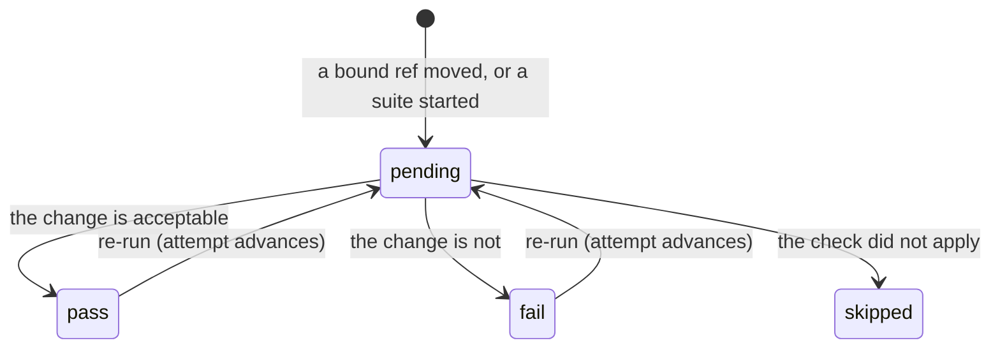

# Provider webhook and status adapter (GNC-2.2)

GNC-2.1 gave a draft a durable relationship to a repository ref, and a push to that ref became a
**sync candidate** — a row saying "this moved". What it could not do is answer the provider. A pull
request that changes an API still showed no verdict from this platform, because there was nowhere
to record one and nothing to send it with.

This ticket adds both halves: a **normalized check model** that belongs to the platform rather than
to any provider, and one **status adapter** interface with three implementations behind it.

- Storage: apiome-db `V265__provider_check_runs_gnc_2_2.sql`
  (`provider_check_runs`, `provider_check_deliveries`)
- Routes: `app/provider_check_routes.py`
- Rules: `app/provider_check_store.py`
- Vocabulary, models, and the provider spellings: `app/provider_checks.py`
- The three adapters: `app/provider_status_adapter.py`
- Provider deliveries: `app/repository_webhook_dispatch.py` (REPO-4.3's endpoint, extended)

This is the base for the API change check suite (GNC-3.1), which produces the verdicts this
machinery carries.

## Four words

A check is in exactly one of four states, and they are ours, not any provider's:

| State | What it means |
|---|---|
| `pending` | The check is running. It has no verdict and no `completed_at`. |
| `pass` | It ran and the change is acceptable. |
| `fail` | It ran and the change is not. This is what a merge gate blocks on. |
| `skipped` | It did not apply. **Not** a pass — "we did not look" and "we looked and it is fine" answer different questions. |

The three providers disagree about almost everything else. GitHub splits a status in two (`status`
says whether the run finished, `conclusion` says how); GitLab has a single commit `state` whose
`running` is GitHub's `in_progress`; Bitbucket has build states in capitals and no `skipped` at all.
Store any one of those and the other two become lossy translations of it. Store four words we chose
and every provider is an edge, none is the centre:

| Normalized | GitHub check run | GitLab commit status | Bitbucket build status |
|---|---|---|---|
| `pending` | `status: in_progress`, no conclusion | `running` | `INPROGRESS` |
| `pass` | `completed` / `success` | `success` | `SUCCESSFUL` |
| `fail` | `completed` / `failure` | `failed` | `FAILED` |
| `skipped` | `completed` / `skipped` | `canceled` | `STOPPED` |

Only `pass` ever maps to a provider's passing status. That is asserted directly, for every adapter.

## The two rules

**Recording comes before publishing, always.** A verdict is written first and only then offered to
the provider. A check that was recorded and not published is evidence somebody can act on; a check
that was published and not recorded is a green tick with nothing behind it. So a provider refusal
never rolls back a record — it appends a `failed` row to the publish ledger, and the verdict stands.

**Publishing is idempotent twice over.** A check is identified by `(binding, commit, name)`, so
recording the same verdict again moves one row rather than fanning out a second. And each publish
attempt carries a fingerprint of the *verdict*, unique per check, which is consulted **before** the
adapter runs — so a redelivered webhook costs the provider nothing, not just us.



## What a delivery does

A verified push or pull-request delivery on a ref a draft is bound to now does two things, side by
side and both outside the tracked-branch gate:

1. **GNC-2.1** raises a sync candidate — a question asked *here*: "this ref moved; what do you want
   to do?"
2. **GNC-2.2** seeds a `pending` check and publishes it — an answer given *there*, on the pull
   request. At that instant the only honest answer is "Apiome is looking at this", which is exactly
   what `pending` is for.

Both are best-effort. A binding-store fault, a provider having a bad day, or checks being switched
off can never turn a verified delivery into a 500 the provider will retry forever. The counts ride
on the acceptance audit (`bindingCandidates`, `checksSeeded`), so a failure shows up as a missing
check against a recorded delivery rather than as silence.

## Recording a verdict

`POST /v1/tenants/{tenant}/projects/{project}/versions/{version}/binding/checks`

```json
{
  "name": "apiome/api-change",
  "state": "fail",
  "title": "2 breaking changes",
  "summary": "`GET /pets` lost a required field.",
  "details_url": "https://app.apiome.dev/ade/checks/…"
}
```

`commit_sha` defaults to the commit the binding is synchronized with, and an explicit one must be
a hexadecimal object id (`check-invalid-commit`) — a verdict is never attached to something that is
not a commit. `details_url` must be `http`/`https` (`check-invalid-details-url`): a check's link is
rendered as a link on a pull request, and most providers reject a `javascript:` URL themselves, but
relying on that would make our safety their implementation detail. `publish: false` records
without sending — useful while a suite is being developed against a real repository; the attempt is
still ledgered, as `suppressed`. `rerun: true` says this is a fresh run of the same check, which
advances its attempt counter.

The response is the check **and its publish attempts**, so what the provider did is visible without
a second call:

```json
{
  "check": { "id": "…", "state": "fail", "attempt": 1, "last_publish_outcome": "dispatched" },
  "deliveries": [ { "outcome": "dispatched", "status_code": 201, "external_id": "4242" } ]
}
```

Reads: `GET …/projects/{project}/checks` (filters: `version`, `commit_sha`, `state`),
`GET …/projects/{project}/checks/{check_id}`, and `GET …/versions/{version}/binding/checks`.

## Authorization, and where a token lives

There is no check RBAC resource. Recording needs `versions:edit`; reading needs `projects:view`.

Beyond RBAC, **a verdict resolves to an authorized binding or it is refused**. Three things make a
binding authorized, and all three are properties of rows rather than of a request or a delivery:

- it is active (not released);
- it belongs to the repository the verified delivery resolved to; and
- that **registration still exists** — because the registration is the credential a verdict would
  be published with.

A delivery cannot nominate a binding. It names a ref, and the rows decide.

The repository token is resolved in server memory from that registration, through the same vault
lookup an import of the same file uses (`resolve_stored_git_token`). It is:

- never accepted in a request body — `CheckRunUpsert` forbids extras, so `{"token": …}` is a 422;
- never stored — V265 has no token column on either table, not an encrypted one, and the migration
  test asserts neither table even has a column *named* one;
- never returned — `CheckRunRecord` and `CheckDeliveryRecord` both forbid extras, so a column that
  later grew a secret would raise rather than leak;
- never quoted back — a provider's refusal passes through `redact_secrets` before it is written,
  because a provider's error body is outside our control.

## What a publish attempt records

Every attempt appends one row, and the row may not overstate its reach (the V187/V197 discipline):

| Outcome | Meaning |
|---|---|
| `dispatched` | The provider accepted it. Carries its status code, and its id for the check. |
| `suppressed` | Nothing was sent, on purpose: checks are off for the deployment, no credential resolved, the provider has no adapter, or the caller passed `publish: false`. Carries no status code. |
| `failed` | It was sent and refused. Carries the status code and a stable `error_code`. |

A `dispatched` attempt writes the provider's id back onto the check, which is what makes the *next*
publish move that check rather than stack a second one beside it on the pull request.

## Settings

| Setting | Default | Effect |
|---|---|---|
| `APIOME_PROVIDER_CHECKS_ENABLED` | `true` | Kill switch for the publish half. A verdict is still recorded and every attempt still ledgered, as `suppressed`. |
| `APIOME_PROVIDER_CHECKS_WEBHOOK_SEED` | `true` | Whether a delivery that moves a bound ref announces a `pending` check. |
| `APIOME_PROVIDER_CHECKS_DETAILS_BASE_URL` | unset | Base for the default details link. Unset leaves a seeded check with no link rather than a broken one. |

The recording half is never gated: a check that was not published is evidence; a check that was
never recorded is nothing.

## Audit

Every verdict is a `check.recorded` row and every publish attempt a `check.published` row in
`workflow_audit`, written in the same transaction as the change, and readable through
`GET /v1/tenants/{tenant}/workflow-audit?version_id=…`.

## What this ticket deliberately does not do

- **It produces no verdicts.** Everything here carries a verdict somebody else decided; the suite
  that decides one is GNC-3.1. What this ticket seeds on its own is a `pending` check, which claims
  only that the platform has seen the commit.
- **It does not make a check required.** Whether a merge is blocked on it is a provider-side branch
  protection setting, which is the repository owner's to make and not ours to set.
- **It does not change a draft.** A delivery still only ever raises a sync candidate (GNC-2.1);
  merging repository changes into a draft is GNC-2.3.
- **It reads nothing from the provider.** The adapters write a status and read back only what the
  provider returns about the status it was just given.
