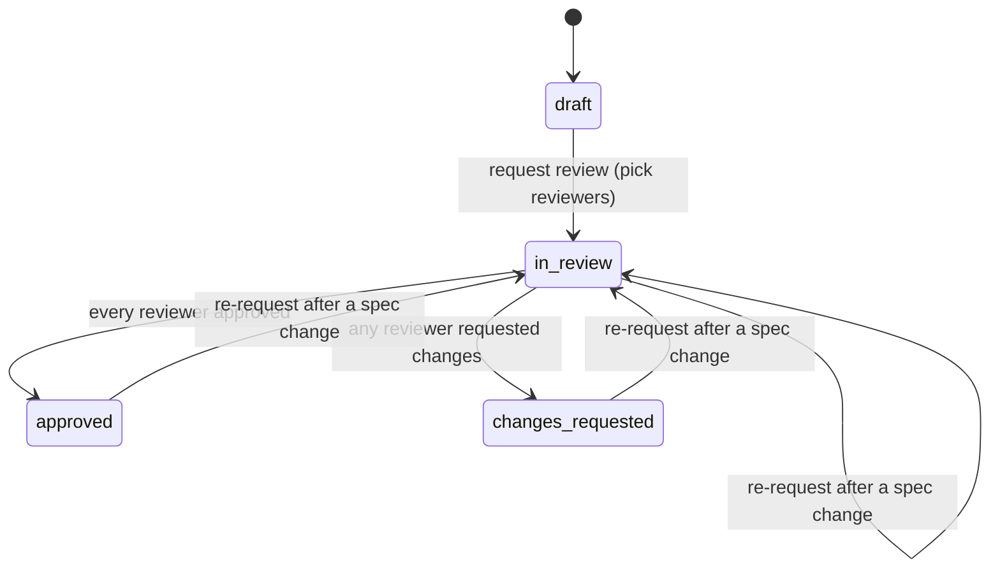

# Version reviews (COL-2.1)

A formal "is this version OK to publish?": request a review of a draft version from named
reviewers, record each reviewer's decision, re-request once the spec changes, and keep the whole
history for governance and audit.

- Storage: apiome-db `V261__review_requests_4517.sql` (`reviews`, `review_reviewers`)
- Routes: `app/review_routes.py`
- Rules: `app/review_store.py`
- State machine: `app/review_lifecycle.py`
- Models and error codes: `app/reviews.py`

This is the base for the review page (COL-2.2), the approval publish gate (COL-2.3), review status
surfaces (COL-2.4), and review notifications (COL-3.1).

## Lifecycle

- **`draft` is not stored.** A version with no open review is a draft. Requesting a review creates
  it already `in_review`.
- A review is decided in **rounds**. Requesting starts round 1 with a `pending` row per reviewer.
- Each reviewer records `approve` or `request_changes` **once**, with an optional note (up to 5,000
  characters). One `request_changes` moves the review to `changes_requested` at once. The last
  outstanding `approve` moves it to `approved`. A decided round takes no more decisions.
- A **re-request** starts the next round with fresh `pending` rows, so stale approvals never carry
  over to changed content. It is only allowed when the spec changed since the current round
  (`409 review-spec-unchanged` otherwise). It is also allowed while still `in_review`, because
  approvals given before a spec change are stale too.
- **Withdrawing** closes the review (`closed_at`, `closed_by`). Its state and decisions stay as
  recorded, and the version can be sent for review again. A withdrawn review is frozen.
- A version has **at most one open review** (`409 review-already-open`).
- Only **unpublished** versions can be requested, re-requested, or decided on
  (`409 review-version-published`). Withdrawing still works after a publish. Closing a review on
  publish belongs to the publish gate (COL-2.3).

## Spec changes

Each round stores `spec_fingerprint`: the sha256 of the version's rebuilt OpenAPI document (classes,
properties, paths, security schemes, servers, metadata), the same fingerprint lint freshness uses.
A content fingerprint is used instead of an edit timestamp because apiome-ui writes schema edits
straight to Postgres.

- A review read returns `spec_changed: true` once the version no longer matches the round, for
  example an `approved` review whose spec was edited afterwards. COL-2.3 should treat that as not
  approved.
- Recording a decision on changed content is refused (`409 review-spec-changed`). Re-request first.
- `spec_changed` is `null` for a withdrawn review.

## Decisions are immutable history

A reviewer row goes from `pending` to a decision exactly once. apiome-db enforces this with a
trigger, whichever writer tries: a decided row cannot change, and a decision can only be recorded
on the current round of an open review that is `in_review`.

A re-request never touches earlier rows. A review read returns the current round in `reviewers`
and every earlier round in `history`, oldest round first. A reviewer who had not decided before a
re-request keeps a `pending` row in that earlier round; its `round` shows it was superseded.
Deleting a user keeps their decisions with `user_id: null`.

## Endpoints

All paths are under `/v1/tenants/{tenant_slug}/projects/{project_ref}`, where `project_ref` is a
project slug or id. The authenticated tenant scopes every read and write.

| Method | Path | Permission | Does |
|---|---|---|---|
| `GET` | `/reviews` | `projects:view` | List reviews, most recently active first. Filters: `version`, `state`, `open`, `limit`, `offset` |
| `POST` | `/reviews` | `versions:edit` | Request a review: `{"version", "reviewers": [user ids]}` → `201` |
| `GET` | `/reviews/{review_id}` | `projects:view` | Review, current `reviewers`, `history`, `spec_changed` |
| `POST` | `/reviews/{review_id}/decision` | `projects:view` + current-round reviewer | `{"decision": "approve" \| "request_changes", "note"?}` |
| `POST` | `/reviews/{review_id}/re-request` | `versions:edit` | Next round. Optional `{"reviewers": [...]}`, which otherwise defaults to the current round's reviewers |
| `POST` | `/reviews/{review_id}/withdraw` | `versions:edit` + requester or tenant admin | Close the review |
| `GET` | `/versions/{version_ref}/review` | `projects:view` | `{state: draft \| in_review \| approved \| changes_requested, published, review}` |

`version` and `version_ref` accept a revision id or a version label such as `1.0.0`.

**Reviewers** are tenant members, active or pending (the same members a comment can mention), named
by user id. The list is capped at 20, duplicates are collapsed, and the requester cannot be one of
them.

**No new RBAC resource.** Assignment as a reviewer and withdrawal by the requester are ownership
rules a role grid cannot express, so apiome-rest enforces them.

A review's discussion is the version's comment threads (see [comments.md](comments.md)):
`GET …/comment-threads?version=<version_id>`.

### Error codes

Every refusal is `{"detail": {"code", "message"}}`. Branch on `code`, never on the message.

| Code | HTTP | When |
|---|---|---|
| `review-project-not-found` | 404 | No such project in the tenant |
| `review-version-not-found` | 404 | No such version in the project (or it was deleted) |
| `review-not-found` | 404 | No such review in the project |
| `review-invalid-reviewers` | 400 | Empty, over 20, not UUIDs, or not tenant members |
| `review-self-review` | 400 | The requester is in the reviewer list |
| `review-forbidden` | 403 | Withdrawing without being the requester or a tenant admin; an unattributable caller |
| `review-not-reviewer` | 403 | Deciding without being a reviewer of the current round |
| `review-version-published` | 409 | The version is published |
| `review-already-open` | 409 | The version already has an open review |
| `review-already-decided` | 409 | The caller already decided in this round |
| `review-not-in-review` | 409 | The round is already decided |
| `review-closed` | 409 | The review was withdrawn |
| `review-spec-unchanged` | 409 | Re-request without a spec change |
| `review-spec-changed` | 409 | Deciding on content that changed since the round was requested |
| `review-conflict` | 409 | Another write changed the review first. Read it again and retry |

## Audit

Every transition and decision is appended to `workflow_audit`, **in the same transaction** as the
change. It is not best-effort: an audit row commits or rolls back with the change it records. Read
the events with `GET /v1/tenants/{tenant_slug}/workflow-audit?version_id=…`.

| `action` | Actor | `detail` |
|---|---|---|
| `review.requested` | requester | `review_id`, `round: 1`, `from_state: draft`, `to_state: in_review`, `reviewers`, `spec_fingerprint` |
| `review.decision` | reviewer | `review_id`, `round`, `reviewer`, `decision`, `has_note` |
| `review.state_changed` | reviewer whose decision moved it | `review_id`, `round`, `from_state: in_review`, `to_state` |
| `review.re_requested` | re-requester | `review_id`, `round`, `previous_round`, `from_state`, `to_state: in_review`, `reviewers`, `spec_fingerprint` |
| `review.withdrawn` | withdrawer | `review_id`, `round`, `state` |

## Concurrency

Each write locks the review row (`SELECT … FOR UPDATE`) and re-checks its guard: open, the round the
caller read, and a state that allows the step. When a concurrent write wins, nothing is written and
the store reports what changed (`review-closed`, `review-not-in-review`, `review-already-decided`,
`review-already-open`, or `review-conflict`). The spec fingerprint is compared before the lock
because rebuilding the document is expensive. An edit that lands between that check and the write
is caught by `spec_changed` on the next read, and by COL-2.3 at publish.
