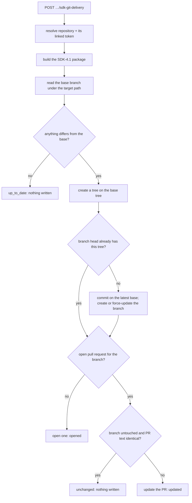

# Git delivery (PR mode) — SDK-4.2 (#4496)

Registry publishing (SDK-4.1) serves an SDK's *consumers*. Git delivery serves its *owners*: the
regenerated SDK arrives as a **pull request** against the tenant's own repository, so their normal
review and CI apply. It is the workflow Speakeasy and Fern made sticky, and it runs on the
repository integrations Apiome already has — no new credential type.

## Where the pieces live

| Layer | File |
|---|---|
| Shared redacting run log (extracted from SDK-4.1) | `src/app/sdk_run_log.py` |
| Target vocabulary, branch naming, repository eligibility | `src/app/sdk_git_delivery_targets.py` |
| File placement, delivery manifest, change plan (pure) | `src/app/sdk_git_delivery_changes.py` |
| Pull request title/body and commit message (pure) | `src/app/sdk_git_delivery_summary.py` |
| GitHub Git Database + pull request calls | `src/app/sdk_git_delivery_github.py` |
| Orchestration and the run ledger | `src/app/sdk_git_delivery_pipeline.py` |
| HTTP surface | `src/app/sdk_git_delivery_routes.py` |
| SQL accessors | `src/app/database.py` (`*_sdk_git_delivery_target*`, `*_sdk_git_delivery_run*`) |
| Schema | `apiome-db/scripts/V257__sdk_git_delivery_4496.sql` |

The package itself is SDK-4.1's: `app.sdk_publish_pipeline` now exposes
`resolve_release_branding`, `resolve_release_series` and `build_release_distribution`, and a
delivery commits exactly the file list a publish would upload.

## Credentials: the repository's existing integration

A delivery target names a repository **already registered** with Apiome (`tenant_repositories`).
A delivery pushes with that repository's linked-account token — the token repository scanning and
webhook provisioning already use, resolved by `resolve_linked_account_token` from the repository's
`linked_account_id` and the user who registered it. There is no token column in V257.

Two consequences follow, and both are refused with a reason rather than accepted and left to fail:

* **The repository must be registered through a linked GitHub account.** One registered from a
  public URL holds no credential (`sdk-git-delivery-repository-unlinked`).
* **GitHub only.** Registering a repository through a linked account is GitHub-only today, so a
  GitLab or Bitbucket repository cannot receive a delivery (`sdk-git-delivery-provider-unsupported`).

The token needs write access: a classic token with the `repo` scope, or a fine-grained token with
read and write on **Contents** and **Pull requests**. A token that can only read is caught before
anything is written (`permissions.push` is checked first).

## What a delivery writes



* **Branch:** `apiome/sdk-regen-<version>-<project>-<ecosystem>`, e.g.
  `apiome/sdk-regen-1.4.2-widgets-npm`. The ticket named `apiome/sdk-regen-<version>`; the project
  and ecosystem are appended because several projects — or one project's npm and PyPI SDKs — may
  deliver into one repository, and a branch named after the version alone would let them overwrite
  each other's pull requests.
* **Commit:** always built on the **latest base branch**, writing only files whose content differs
  (blob ids are computed locally and compared with the base) and removing only files a previous
  delivery generated. Its message carries `Apiome-Revision`, `Apiome-Version-Line`,
  `Apiome-Package` and `Apiome-Generator` trailers.
* **Pull request body:** the spec version and revision id, the generator version, a changed-files
  overview (exact counts, a capped file table) and the provenance table — deterministic, so an
  unchanged re-run compares equal and writes nothing.
* **Manifest:** `<target>/.apiome/sdk-delivery.json` lists every generated file. It is how the next
  delivery knows which stale files to remove, and it is why **a file Apiome did not generate is
  never touched** — a CI workflow or hand-written helper beside the SDK is safe, including on the
  first delivery into an existing directory.

### Idempotency

Re-running a delivery for the same (version, target) finds the same branch and the same open pull
request:

| Status | Means |
|---|---|
| `opened` | A pull request was opened (none was open for the branch). |
| `updated` | The open pull request's branch was rebuilt, or its title/description/base refreshed. |
| `unchanged` | The open pull request already carries exactly this SDK; no commit, branch or PR write. |
| `up_to_date` | The base branch already contains exactly this SDK; nothing is proposed. |
| `failed` | See `errorCode` and the log. |
| `in_progress` | Only while a delivery runs (or if the process died mid-delivery). |

Changing SDK-3.4 branding, the base branch or the target path changes a pull request's *content*,
never its identity: the next delivery updates the same pull request. A merged or closed pull
request is not reused; the next delivery with something to propose opens a new one on the same
branch name.

**The branch is Apiome's.** A delivery force-updates it (the way a dependency bot rebuilds its
branch), so it never accumulates conflicts with a moving base or stale files from a changed target
path. The pull request body says so. A branch protection rule that forbids force-pushing
`apiome/sdk-regen-*` makes deliveries fail with `sdk-git-delivery-push-rejected`.

### The committed version

The package version is the one the **next SDK-4.1 publish** of the series would claim — exactly
what a publish dry run reports — so merging the pull request and then publishing ships identical
files. Nothing is claimed: a pull request is not a release. `deliver(..., regen_counter=N)` pins it
instead, for SDK-4.3 to deliver the version it has just published.

## Routes

```
GET        /v1/projects/{t}/{project}/sdk-git-delivery-targets
PUT|DELETE /v1/projects/{t}/{project}/sdk-git-delivery-targets/{ecosystem}
POST       /v1/projects/{t}/{project}/sdk-git-delivery
GET        /v1/projects/{t}/{project}/sdk-git-delivery-runs[/{run_id}]
```

| Route | Permission | Audit |
|---|---|---|
| List targets | `projects:view` | — |
| Save a target | `projects:edit` **and** `imports:edit` | `sdk.git_delivery_target.update` |
| Remove a target | `projects:edit` | `sdk.git_delivery_target.clear` |
| Deliver | `versions:publish` | `sdk.git_delivery` |
| History | `versions:view` | — |

Saving a target needs `imports:edit` as well because it decides what Apiome pushes into a repository
with *that repository's* credential — the same authority as editing the repository's integration,
and repository routes are governed by `imports`. Without it, a project editor could turn someone
else's linked account into a push credential for their project. No new RBAC resource.

```bash
# Point the project's npm SDK at a registered repository (id from GET /v1/tenants/acme/repositories)
curl -sX PUT "$APIOME/v1/projects/acme/widgets/sdk-git-delivery-targets/npm" \
  -H "Authorization: Bearer $TOKEN" -H 'Content-Type: application/json' \
  -d '{"repositoryId": "5f0c…", "baseBranch": "main", "targetPath": "sdks/typescript"}'

# Deliver version 1.4.2 as a pull request
curl -sX POST "$APIOME/v1/projects/acme/widgets/sdk-git-delivery" \
  -H "Authorization: Bearer $TOKEN" -H 'Content-Type: application/json' \
  -d '{"ecosystem": "npm", "version": "1.4.2"}'
```

`POST …/sdk-git-delivery` answers **`200` with the run for every outcome once a target is
configured — including `failed`.** HTTP errors are reserved for requests that cannot start a
delivery: an unknown project or version (404), an unpublished revision
(400 `sdk-git-delivery-not-published`), an unsupported ecosystem
(400 `sdk-git-delivery-ecosystem-unsupported`) or no target (404 `sdk-git-delivery-target-missing`).

## Failures are runs, with actionable logs

Every failure once a target is known is recorded as a `failed` run carrying a stable code, a
message that names the fix, and the step-by-step log. The log and message are exact-substring
redacted of the repository token (`[git-token-redacted]`), so a GitHub error quoting it cannot land
in the ledger.

| Code | Cause | Fix the message names |
|---|---|---|
| `sdk-git-delivery-credential-missing` | The registering account is unlinked or holds no token | Re-link the account / re-register the repository |
| `sdk-git-delivery-credential-rejected` | GitHub answered 401 | Re-link the GitHub account |
| `sdk-git-delivery-permission-denied` | Read-only account, or 403/404 on a write | Grant write access; `repo` scope or Contents + Pull requests |
| `sdk-git-delivery-push-rejected` | 422/409 creating or force-updating the branch | Relax the branch rule, or delete the branch |
| `sdk-git-delivery-pull-request-refused` | GitHub refused the pull request | Open it by hand (the commit was pushed) |
| `sdk-git-delivery-rate-limited` | Rate limit exhausted (retryable) | Deliver again after the reset time |
| `sdk-git-delivery-provider-unavailable` | 5xx, timeout, network (retryable) | Try again |
| `sdk-git-delivery-repository-unreachable` | 404 reading the repository | Check it was not renamed/deleted |
| `sdk-git-delivery-repository-archived` / `-empty` | Archived / no commits | Unarchive / push an initial commit |
| `sdk-git-delivery-base-branch-missing` | The base branch does not exist | Create it or change the target |
| `sdk-git-delivery-target-path-invalid` / `tree-too-large` | Path runs through a file / directory too large to list | Point at a (smaller) directory |
| `sdk-git-delivery-repository-missing` / `-unlinked` / `provider-unsupported` | The repository changed since the target was saved | Re-register or re-target |
| `sdk-publish-package-name-missing` / `sdk-publish-version-line-invalid` / `sdk-publish-nothing-to-package` | The SDK-4.1 package cannot be built | The same fix as for a publish |

`deliver()` itself never raises for a delivery problem, which is what lets SDK-4.3's worker treat
every attempt uniformly; the in-process `DeliveryOutcome.retryable` flag (not persisted) tells it
which failures are worth retrying. See `sdk_regen_on_publish.md` for how a publish delivers
automatically, pinned to the version the same job just published.

## Why no job queue, and no git binary

SDK-1.1's job service was closed not-planned, so — as SDK-4.1 did — a delivery runs inline and
records its own run row, which has a job's shape (status, event log, outcome). A queue can be put
underneath without changing what a caller sees.

The git operations use GitHub's **Git Database API** (tree, commit, ref) rather than cloning: no
working copy, no disk, and the token never appears on a command line or in a `.git/config`. The
API host is fixed (`https://api.github.com`), so there is no tenant-supplied URL to guard.

## What is not in PR mode

* **Go modules.** `gomod` has no SDK-4.1 packaging layout, and a Go module is released by tagging;
  neither a Go-client target nor tag pushing is part of PR mode.
* **GitLab / Bitbucket merge requests.** There is no linked-account repository integration for
  them to reuse.

## Tests

| File | Asserts |
|---|---|
| `tests/test_sdk_git_delivery_pipeline.py` | end to end against an in-memory GitHub: opened / unchanged / updated / up_to_date, one PR per branch, rebuilt on a moved base, stale-file removal that spares hand-written files, every failure as a run, token redaction, concurrent-delivery races |
| `tests/fake_github_git.py` | the in-memory GitHub (real blob ids, base-tree semantics, pull requests, scripted faults) |
| `tests/test_sdk_git_delivery_changes.py` | blob ids match `git hash-object`, placement, deterministic manifest, deletion only from the previous manifest |
| `tests/test_sdk_git_delivery_summary.py` | body carries spec/generator versions, changes and provenance; deterministic; bounded; injection-safe |
| `tests/test_sdk_git_delivery_github.py` | request shapes, directory walk, and each refusal's code, retryability and redaction |
| `tests/test_sdk_git_delivery_targets.py` | branch naming and git ref rules, path/branch normalisation, repository eligibility, store |
| `tests/test_sdk_git_delivery_routes.py` | permissions (incl. `imports:edit`), status mapping, failed run as 200, audits |
| `tests/test_sdk_git_delivery_database.py` | id guards and SQL shape |
| `tests/test_sdk_git_delivery_migration.py` | V257's structural promises, including no credential column |
| `tests/test_sdk_run_log.py` | the shared log's redaction, marker, bound and levels |
| `apiome-db/test/sdk-git-delivery.test.ts` | the same promises, from the schema side |
