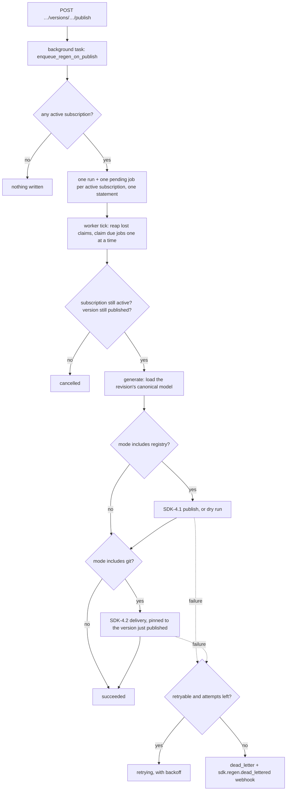

# Auto-regen on publish — SDK-4.3 (#4497)

SDK-4.1 publishes an SDK to a registry and SDK-4.2 delivers one as a pull request, but only when
someone remembers to ask after every new version. This is watch mode, the workflow Speakeasy and Fern
made standard: **subscribe** a project's SDK once, and every publish regenerates it and ships it. A
failure goes to a **dead letter** you can see, retry and be alerted about, and one SDK's failure never
holds back another's.

## Where the pieces live

| Layer | File |
|---|---|
| Subscription vocabulary, validation, store helpers, the publish hook | `src/app/sdk_regen_subscriptions.py` |
| Statuses, retry/dead-letter decisions, run status, alert payload (pure) | `src/app/sdk_regen_policy.py` |
| The worker: one job's steps, the lease sweep, the tick | `src/app/sdk_regen_worker.py` |
| HTTP surface | `src/app/sdk_regen_routes.py` |
| Tick loop and settings | `src/app/main.py` (`_sdk_regen_sweep`), `src/app/config.py` (`sdk_regen_*`) |
| SQL accessors | `src/app/database.py` (`*_sdk_regen_*`) |
| Schema | `apiome-db/scripts/V258__sdk_regen_on_publish_4497.sql` |

The worker adds **no regeneration or delivery machinery**. Every job calls SDK-4.1's `publish()` and
SDK-4.2's `deliver()` unchanged, so an automatic release and a manual one build the same package,
claim versions by the same rule, write the same ledgers and redact the same secrets.

## How a publish becomes deliveries



* **The trigger** is a background task on the publish route, beside the CTG-3.3 webhook fan-out. It
  never fails the publish. The run and its jobs are written by one statement, so a publish queues its
  whole subscription matrix or none of it. A project with no active subscription gains no rows.
* **Each publish is its own event.** Unpublishing a version and publishing it again queues another
  run. The git step then reports `unchanged` or `up_to_date`, and a registry subscription publishes
  the series' next version.
* **Why no SDK-1.1 generation job.** The ticket's worker enqueues "generation jobs (SDK-1.1)", but that
  job service was closed not-planned, and SDK-4.1/4.2 already regenerate inline from the persisted
  canonical model. A regen job *is* the generation job: its `generate` step loads the published
  revision, and its delivery steps build the package from it.

## Subscriptions

One subscription per project per ecosystem (`npm`, `pypi`, the SDK-4.1 package layouts):

| Field | Meaning |
|---|---|
| `deliveryMode` | `registry` publishes the package (SDK-4.1, with the project's registry credential). `git` opens or updates a pull request (SDK-4.2, with the project's git delivery target). `registry_and_git` publishes first, then delivers **the version that publish claimed**, so the registry and the pull request agree. **No default.** |
| `options.dryRun` | Registry modes only, default `false`. Rehearses every release: the package is built and the credential resolved and decrypted, and nothing is uploaded. A `registry_and_git` rehearsal still opens the pull request, carrying the version the next real publish would claim. |
| `active` | `false` keeps the configuration and stops future runs. |

Three decisions are worth knowing:

* **One per ecosystem, not one per mode.** The SDK-4.2 target and the SDK-4.1 credential are already
  one per ecosystem. Two subscriptions for the same ecosystem could each claim a registry version for
  the same publish.
* **`deliveryMode` has no default.** Publishing to a public registry is irreversible (the reason
  SDK-4.1's publish route defaults to a dry run), so a subscription never publishes unless its author
  named a registry mode.
* **Options are a closed vocabulary.** SDK-1.1's job options were cancelled with it, and SDK-3.4's
  settings supply the branding every run reads. `dryRun` is the only per-run knob left in the
  pipelines. An unknown option is refused (`422`), so a misspelt `dry_run` can never silently publish.

## Jobs, retries and the dead letter

| Status | Means |
|---|---|
| `pending` | Queued by a publish, or put back by a retry. |
| `running` | Claimed by a worker. |
| `retrying` | Failed in a way that could succeed unchanged; waiting for `nextAttemptAt`. |
| `succeeded` | Every step the subscription asks for completed. |
| `dead_letter` | Failed permanently or ran out of attempts. Alerted, and retried only by a person. |
| `cancelled` | Must not run: the subscription was disabled or removed, or the version unpublished or deleted, before the worker reached it. |

* **Only transient failures retry automatically.** A job gets 4 attempts, with waits of 60s, 5min and
  30min, and only failures the pipelines flag as retryable use them: a registry 5xx or timeout, a
  GitHub outage or rate limit, a lost version-claim race. A missing credential, no delivery target or
  a registry refusal would fail the same way four times, so it goes straight to the dead letter with a
  message that names the fix.
* **A step that succeeded is never repeated.** A job that published `1.4.0` and then failed to open its
  pull request only delivers on the retry, pinned to `1.4.0`. The registry result is written to the
  job *before* the git step starts, so this holds even if the worker dies mid-delivery. A dry-run
  result counts as done only while the subscription still asks for a dry run.
* **One subscription's failure never blocks another's.** Jobs are claimed one at a time with
  `FOR UPDATE SKIP LOCKED`, so replicas share the queue. The only ordering rule is *within* a
  subscription: an earlier publish's job runs first. A job waiting to retry holds back that
  subscription's later publishes and nothing else, so `1.4.3` can never take a lower package version
  than `1.4.2`.
* **A job runs with its subscription as it is now.** A dead letter retried after the subscription was
  fixed (say, switched from `registry_and_git` to `git`) runs with the fix. The job records the mode
  and options each attempt ran with.
* **A lost worker is dead-lettered, never retried.** A job still `running` after
  `APIOME_SDK_REGEN_LEASE_SECONDS` had its worker die, possibly after an upload. The lease sweep
  dead-letters it (`sdk-regen-worker-lost`) and alerts, carrying whatever the job had already
  published, so a person checks before anything runs again. Each claim carries a fresh token, so a
  worker that outlived its lease can still record what really happened, but can never overwrite a job
  that was retried and reclaimed since.
* **The alert** is a push-webhook event, `sdk.regen.dead_lettered`, fanned out over the tenant's
  existing subscriptions (#2587/#2588), with their signing, retry and dead-letter semantics:

  ```json
  {
    "event": "sdk.regen.dead_lettered",
    "projectId": "8b0c…", "projectSlug": "widgets",
    "runId": "…", "jobId": "…", "subscriptionId": "…",
    "ecosystem": "npm", "deliveryMode": "registry_and_git",
    "versionId": "44f2…", "versionLine": "1.4.2",
    "attemptCount": 4,
    "error": {"step": "git", "code": "sdk-git-delivery-provider-unavailable", "message": "…"},
    "publishRunId": "…", "publishStatus": "published", "packageName": "@acme/widgets-sdk", "packageVersion": "1.4.0",
    "deadLetteredAt": "2026-09-10T12:00:00+00:00"
  }
  ```

  Coordinates the job does not have are omitted rather than sent as `null`.

### Codes the worker adds

The pipelines' own codes (`sdk-publish-*`, `sdk-git-delivery-*`) pass through unchanged. See
`sdk_package_publishing.md` and `sdk_git_delivery.md`.

| Code | Status | Cause |
|---|---|---|
| `sdk-regen-git-target-missing` | `dead_letter` | A git mode with no SDK-4.2 target for the ecosystem. Configure one and retry, or switch to `registry`. |
| `sdk-regen-source-unavailable` | `dead_letter` | The revision has no captured source to regenerate from. |
| `sdk-regen-internal-error` | `retrying` / `dead_letter` | Something no refusal explains. An unexplained fault in the **registry** step is *not* retried: it may have come after the upload. |
| `sdk-regen-worker-lost` | `dead_letter` | The lease sweep found a claim no worker closed. |
| `sdk-regen-unsubscribed` / `sdk-regen-subscription-disabled` | `cancelled` | The subscription was removed or disabled after the publish queued the job. |
| `sdk-regen-version-unpublished` / `sdk-regen-version-missing` | `cancelled` | The version was unpublished or deleted first. |

## Routes

```
GET              /v1/projects/{t}/{project}/sdk-regen-subscriptions
PUT|PATCH|DELETE /v1/projects/{t}/{project}/sdk-regen-subscriptions/{ecosystem}
GET              /v1/projects/{t}/{project}/sdk-regen-runs[?status=][/{run_id}]
POST             /v1/projects/{t}/{project}/sdk-regen-jobs/{job_id}/retry
```

| Route | Permission | Audit |
|---|---|---|
| List subscriptions | `projects:view` | — |
| Subscribe (`PUT`) | `projects:edit` **and** `versions:publish` | `sdk.regen_subscription.update` |
| Enable (`PATCH {"active": true}`) | `projects:edit` **and** `versions:publish` | `sdk.regen_subscription.enable` |
| Disable (`PATCH {"active": false}`) | `projects:edit` | `sdk.regen_subscription.disable` |
| Unsubscribe (`DELETE`) | `projects:edit` | `sdk.regen_subscription.delete` |
| History | `versions:view` | — |
| Retry a dead letter | `versions:publish` | `sdk.regen_job.retry` |

A subscription publishes and delivers on the tenant's behalf on every later publish, so creating or
re-enabling one needs the authority a manual SDK-4.1 publish or SDK-4.2 delivery needs. Disabling or
removing one only *stops* releases. No new RBAC resource.

```bash
# Every publish of widgets: publish the npm SDK, then open a pull request carrying that version
curl -sX PUT "$APIOME/v1/projects/acme/widgets/sdk-regen-subscriptions/npm" \
  -H "Authorization: Bearer $TOKEN" -H 'Content-Type: application/json' \
  -d '{"deliveryMode": "registry_and_git"}'

# The dead letter
curl -s "$APIOME/v1/projects/acme/widgets/sdk-regen-runs?status=dead_letter" -H "Authorization: Bearer $TOKEN"

# Retry one job (after fixing what its error names)
curl -sX POST "$APIOME/v1/projects/acme/widgets/sdk-regen-jobs/$JOB/retry" -H "Authorization: Bearer $TOKEN"
```

### History: publish event → jobs → artifacts → deliveries

`GET …/sdk-regen-runs` returns one entry per publish (newest first), each with its jobs:

```json
{
  "runId": "…", "status": "succeeded",
  "versionId": "44f2…", "versionLine": "1.4.2",
  "versionHref": "/v1/versions/acme/8b0c…/44f2…",
  "jobs": [{
    "jobId": "…", "ecosystem": "npm", "deliveryMode": "registry_and_git", "status": "succeeded",
    "attemptCount": 1, "maxAttempts": 4, "retryable": false,
    "publish": {"runId": "…", "status": "published", "packageName": "@acme/widgets-sdk",
                "packageVersion": "1.4.0", "artifactSha256": "…",
                "href": "/v1/projects/acme/8b0c…/sdk-publish-runs/…"},
    "delivery": {"runId": "…", "status": "opened", "pullRequestNumber": 42,
                 "pullRequestUrl": "https://github.com/acme/widgets-sdk/pull/42",
                 "href": "/v1/projects/acme/8b0c…/sdk-git-delivery-runs/…"},
    "attempts": [{"attempt": 1, "outcome": "succeeded", "publishRunId": "…", "deliveryRunId": "…"}]
  }]
}
```

A run's `status` is read off its jobs: `in_progress` while any job has work left; otherwise
`dead_letter` if any job is dead-lettered; otherwise `cancelled` if every job was cancelled; otherwise
`succeeded`. Each attempt record names the publish and delivery runs *it* wrote, so a failed attempt
stays linked to its evidence after a later attempt succeeds.

**Unsubscribing stops future runs without touching past artifacts.** A job's subscription reference
is `ON DELETE SET NULL` (`subscriptionId: null`, `subscriptionActive: null`). Queued jobs are
cancelled when the worker reaches them, a dead letter can no longer be retried, and every run, job,
published package and pull request already produced is kept.

## Operating it

| Setting | Default | Meaning |
|---|---|---|
| `APIOME_SDK_REGEN_ENABLED` | `true` | Kill switch. `false` halts every tick. Queued jobs wait; nothing is lost. |
| `APIOME_SDK_REGEN_INTERVAL` | `30` | Seconds between ticks. |
| `APIOME_SDK_REGEN_BATCH_SIZE` | `5` | Most jobs run per tick. Each builds a package and writes to a registry or GitHub. |
| `APIOME_SDK_REGEN_LEASE_SECONDS` | `1800` | How long a claim may run before the lease sweep presumes its worker lost. |

The tick runs on its own database connection, like the other sweeps. There is no retention job:
like `sdk_publish_runs` and `sdk_git_delivery_runs`, a job row is a few kilobytes and is the record
that a publish was delivered. Its attempt log is capped at 50 entries.

## Tests

| File | Asserts |
|---|---|
| `tests/test_sdk_regen_worker.py` | one job's steps and outcomes; the matrix (isolation, in-order per subscription, batch, kill switch, lease); **end to end with the real SDK-4.1/4.2 pipelines**: publish then PR on the same version, a GitHub outage retried without republishing, token redaction, unsubscribing |
| `tests/fake_sdk_regen_store.py` | the in-memory queue with V258's claim, close-out and lease semantics |
| `tests/test_sdk_regen_policy.py` | retry vs dead letter, backoff, step-done rules, run status, the alert payload |
| `tests/test_sdk_regen_subscriptions.py` | vocabulary and options validation, store helpers, the publish hook, and that the publish route schedules it |
| `tests/test_sdk_regen_routes.py` | permissions, status mapping, history links, retry refusals, audits |
| `tests/test_sdk_regen_database.py` | id guards and SQL shape |
| `tests/test_sdk_regen_migration.py` | V258's structural promises, including that step statuses match the pipelines' |
| `apiome-db/test/sdk-regen-on-publish.test.ts` | the same promises, from the schema side |
