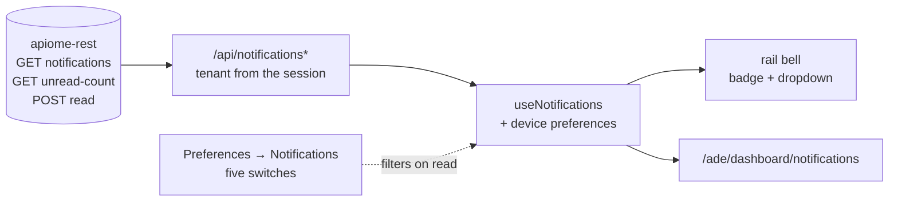

# In-app notification centre (COL-3.2)

COL-3.1 (#4521) writes an inbox row for every event that concerns somebody — a mention, a review
request, a decision, a thread resolution, a publish — and exposes three reads. Until this ticket
nothing in the product opened them, so every one of those rows was invisible.

This is the UI over those reads: a bell with an unread badge, a dropdown to glance at, deep links
that land on what the notification is about, a full page, and per-type on/off switches.

- Storage, fan-out and the API: `apiome-rest/docs/notifications.md`
- Rules (sentences, links, grouping, whitelists): `lib/notifications.ts`
- Preferences: `lib/notification-preferences.ts`, `src/app/hooks/useNotificationPreferences.ts`
- The read: `src/app/hooks/useNotifications.ts`
- Surfaces: `src/app/components/shell/NotificationsMenu.tsx`,
  `src/app/ade/dashboard/notifications/`
- BFF: `src/app/api/notifications/**`
- Stylesheet: the `NOTIFICATION CENTRE (COL-3.2, #4522)` section of `src/app/globals.css`

**No apiome-rest change and no migration.** Everything here reads endpoints COL-3.1 already ships.

## The surfaces

### Where the bell is, and why it is not in a header

The ticket says "bell in the ADE header". HIVE-3.8 (#5294) retired that header; the rail footer is
where the rest of its right-hand cluster went — the profile menu, the build badge, the release
notes. The bell is a footer row above **Help & docs**, first in the group because it is the only
row whose content changes while the reader is looking at it.

The dropdown is `railMenu.tsx`'s menu, the same object as the workspace switcher and the user menu:
roving arrow keys, `Esc` back to the trigger, dismissal on an outside click or on focus leaving.
Rows are grouped into **Today / Yesterday / Earlier this week / Older**; because a `role="menu"`
may own nothing but menu items, each run is a `role="group"` whose `aria-label` is the heading.

### What is read, and when

| Menu | What the hook reads | How often |
| --- | --- | --- |
| shut | the unread tallies only (`countsOnly`) | every 60 s while the tab is visible, and on the way back to a hidden one |
| open | the tallies **and** the newest 20 rows | the same, plus once when it opens |

The full page reads 50 at a time and pages with **Load more**. Every request is `no-store`: an
unread count is the one number on screen that must never be a cached answer the reader has already
acted on.

A failed read is quiet in the rail (a line of text, no badge) and loud on the page (an `Alert` with
**Try again**), because a bell is an aid and the page's whole job is the list.

## Deep links

`notificationHref(row)` decides where a notification goes. Every destination is an apiome-ui route:

| Type | Destination |
| --- | --- |
| `mention`, `thread_resolved` | `/ade/dashboard/versions?projectId=…&tab=discussion&thread=<id>` |
| `review_requested`, `review_decision` | `/ade/reviews/<review_id>` (COL-2.2) |
| `version_published` | `/ade/dashboard/versions?projectId=…` |

**Not the Studio.** The payload carries a thread's id but not the *names* its Studio address is
built from — COL-1.3 resolves `anchor_context` at list time; it is not stored — so a Studio link
would degrade to version scope, and would dead-end entirely where the suite is not licensed.
COL-1.3's Discussion tab always exists and always knows the thread.

Two pieces make the thread link land:

- `src/app/ade/dashboard/versions/page.tsx` reads `tab` and `thread` from the URL. The applied
  value is remembered in a ref, so the link decides the tab **once** — a later re-render cannot
  drag the reader back to it — and a second notification followed from the same screen still works,
  because that is a soft navigation with new parameters.
- `ProjectDiscussionPanel` takes `focusThreadId`: the matching row gets `.disc-thread--focused` and
  is scrolled into view. A thread that is not on the loaded page highlights nothing, deliberately —
  a jump to the wrong row would be worse than no jump.

A notification whose project or version has been deleted arrives with those columns nulled.
`notificationHref` answers `null` and the row is drawn **inert**: still readable, no longer a link.
"Somebody mentioned you" is worth reading after the project is gone.

## Per-type preferences

Five switches in **Preferences → Notifications**, one per event type, all on by default.

They are **device-local**, stored as `hive.notify.<type>` in `localStorage` alongside the rest of
the shell's preferences, and they are honoured on **read**:

- the badge is the sum of `by_type` over the types still switched on — which is why muting needs no
  second request and no upstream change;
- the dropdown and the page drop the muted rows after the read;
- the page offers a filter chip only for a type that is switched on, and clears a type filter the
  reader has just muted.

Nothing is discarded. `apiome-rest/docs/notifications.md` asks a client to filter on read for
exactly this reason: a row muted at write time could never be recovered when the reader changes
their mind. Switching a type back on brings its history back with no new request.

Two consequences worth knowing:

- **A reader with two machines sets the switches twice.** The tab says so in as many words.
- **A page can come back mostly muted**, because apiome-rest's `type` filter takes one value and the
  badge needs the whole `by_type` map regardless. Every surface therefore counts what it *shows*
  rather than echoing `total`.

An inbox that is empty because there is nothing in it, empty because a filter matches nothing, and
empty because the reader silenced all five are three different screens with three different
sentences — the last of which offers the tab that turns them back on.

## Marking read

- Following a notification marks it read and navigates; the POST is not awaited, and the row is
  stamped locally either way.
- The page also offers a per-row mark, for the notification whose subject line was the whole
  message.
- **Mark all read** clears the badge, muted types included — muted means "do not show me", and
  clearing the badge should clear it.

Marking is idempotent upstream, and the reply carries the unread count that follows, so the badge is
corrected from the answer rather than from a second read. A marked row **dims**; it does not leave
the list. Rows only disappear under a filter the reader chose and can undo.

## The BFF

Three thin routes over apiome-rest, modelled on COL-1.3's `comment-threads-proxy.ts`:

| Route | Upstream |
| --- | --- |
| `GET /api/notifications` | `GET /v1/tenants/{slug}/notifications` |
| `GET /api/notifications/unread-count` | `GET …/notifications/unread-count` |
| `POST /api/notifications/read` | `POST …/notifications/read` |

They add **no permission rules of their own**, and must not: COL-3.1's routes need only
authentication, because an inbox is the caller's own and no `resource:action` can express that. What
this layer owns is that the **tenant slug comes from the session**, that the signing secret stays
server-side, and that only a whitelist (`unread`, `type`, `limit`, `offset`) is forwarded. A
mark-read body that names nothing markable is refused with a 400 before a request is made, and only
UUIDs reach a `::uuid` cast.

## Tests

| File | Covers |
| --- | --- |
| `tests/notifications-model.test.ts` | sentences, every `notificationHref` branch, bucketing, both whitelists |
| `tests/notification-preferences.test.ts` | defaults, round-trip, `visibleUnreadTotal`, storage that throws |
| `tests/api/notifications-routes.test.ts` | the three BFF routes: session, whitelist, refusals |
| `tests/notifications-menu.test.tsx` | the bell: badge, grouping, deep links, mark-all-read, arrow keys, axe |
| `tests/notifications-page.test.tsx` | the page: filters, paging, marking, the three empty states |
| `tests/notifications-css.test.ts` | the stylesheet section: class parity, tokens, contrast, no frozen px |
| `tests/preferences-drawer.test.tsx` | the five switches in the pane |
| `tests/project-discussion-panel.test.tsx` | `focusThreadId` picks out the right row |

## Not here yet

- **Email (COL-3.3) and Slack/Teams (COL-3.4).** The preferences tab says so rather than letting
  five in-app switches imply they govern delivery.
- **Account-level preferences.** These five follow the device. Moving them to the account means a
  table, a REST route and a server-side filter — and it should still filter on read.
- **A rail-independent entry point.** The page is reached from the dropdown's *See all
  notifications*; it is deliberately not a navigation destination, because a rail row and a footer
  bell pointing at the same list is one row too many.
