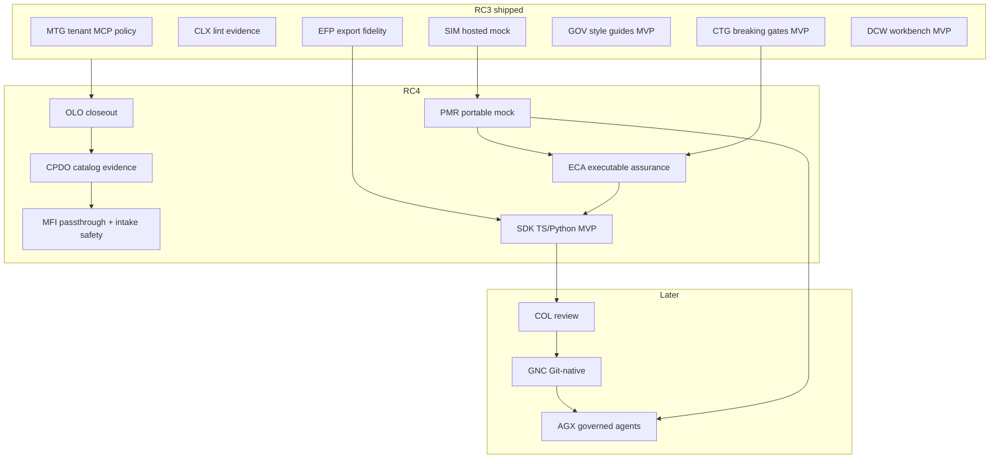

# PLAN — Next Features for RC4

> **Status:** Assessment & execution plan (2026-07-22)  
> **Audience:** release planning for **Apiome 07-2026 RC4**  
> **Sources:** open GitHub issues on `apiome/apiome` (+ Designer issues on `apiome/private-suite`), `private-suite/docs/roadmaps/ROADMAP_NEXT_PRODUCT_SEQUENCE.md`, `ROADMAP_FINAL_RC2.md`, and recent completion evidence (MTG / CLX / EFP / SIM / GOV / CTG / DCW).  
> **This document files no new issues** — it sequences already-filed work.

---

## 1. Assessment summary

| Metric | Count (approx.) | Notes |
|---|---:|---|
| Open issues (`apiome/apiome`) | ~841 | No GitHub milestones assigned |
| Open `mvp`-labeled issues | ~140 | Primary RC sequencing input |
| Dominant open backlog | MFX (~198) + MFI (~117) | Mostly long-tail emitters / adapters — **not** all RC4 |
| Recently completed themes (RC3 window) | MTG, CLX, EFP | Tenant MCP governance, catalog/MCP lint excellence, export fidelity projection |
| Hosted Mock / Try-It (SIM) | MVP children closed | Umbrella #4411 still open administratively |
| Governance style guides (GOV) | MVP closed | Remaining = Spectral importer / v2 cross-format |
| Breaking-change gates (CTG) | MVP closed | Remaining = consumer/live/scheduled v2 |
| Designer Contract Workbench (DCW) | MVP closed in private-suite | Remaining = v2 (0.5, 1.5, 2.4–2.5, 3.4) |

**Verdict:** RC3 closed the *evidence and governance substrate* (lint posture, export fidelity, tenant MCP policy). RC4 should convert that substrate into the next golden-path outcomes: **honest catalog conversion evidence**, **portable/executable contracts**, and the **first paid client artifacts (SDKs)** — without absorbing the entire MFX/MFI long tail.

### 1.1 What RC3 effectively shipped (do not re-plan)

| Theme | Umbrella / label | Evidence |
|---|---|---|
| Tenant MCP governance | MTG #4759 | MVP epics closed; WHATS_NEW RC3; only #4764 (v2 profiles/ops) + umbrella remain |
| Catalog & MCP lint excellence | CLX | All CLX-1…4 epics closed (2026-07-14/15) |
| Export fidelity projection | EFP #4807–#4809 | All EFP issues closed (2026-07-15) |
| Hosted mock + Try-It | SIM #4411 | SIM-1/2/3 (+ most v2) children closed |
| Style guides MVP | GOV #4423 | GOV-1.x / GOV-2.x closed |
| Breaking-change CI MVP | CTG #4458 | CTG-1.x / 2.x / 3.1–3.3 closed |
| Designer workbench MVP | DCW (private-suite) | DCW-0.1–0.4 and DCW-1.1–3.3 closed |

### 1.2 Remaining portfolio (grouped)

| Band | Initiatives | RC4 posture |
|---|---|---|
| **A — Foundation closeout** | OLO remaining polish; CPDO; MFI-22.7 passthrough; MFI-29.3–29.6 intake safety | **In RC4** (core) |
| **B — Make contracts executable everywhere** | PMR portable mock; ECA suite/runner/policy | **In RC4** (core) |
| **C — Monetizable consumption** | SDK jobs + TS/Python + UI/CLI + SGD manifest | **In RC4** if capacity after A+B |
| **D — Team workflows** | COL comments/review; GNC Git binding | **RC5 candidate** |
| **E — Category bet** | AGX managed invocation | **After** PMR + SDK + COL basics |
| **F — Breadth / defer** | MFX long-tail emitters, MFI-31/32 collections, GOV/CTG v2, MTG-5, Authoring APX polish | **Out of RC4** unless a specific demo needs one emitter fix |

---

## 2. RC4 product thesis

**RC4 exit demo (one sentence):** A newly provisioned user imports a non-OpenAPI (or multi-file) source, inspects **format-native catalog evidence** and an explainable Convert-to-OpenAPI projection graph, publishes under existing lint/breaking gates, runs the **same mock semantics locally/CI via a portable bundle**, verifies an **executable contract suite** against that mock, and downloads a **reproducible TypeScript or Python SDK** with a compatibility manifest.

That continues the suite thesis from `ROADMAP_NEXT_PRODUCT_SEQUENCE.md`: *heterogeneous definitions → trusted, governed, executable contracts → human / SDK / agent consumption.*

---

## 3. Ordered execution plan

Phases are dependency-ordered. Within a phase, **MVP tickets ship before v2**. Parallel tracks are called out explicitly.

### Phase 0 — Housekeeping & umbrella hygiene (½–1 day)

Close or update umbrellas whose MVP children are done so RC4 planning stays honest:

| Order | Action | Issues |
|---:|---|---|
| 0.1 | Close or mark “MVP complete / tracking leftovers” | SIM #4411, GOV #4423 (MVP), CTG #4458 (MVP), MTG #4759 (MVP), DCW epics in private-suite |
| 0.2 | Leave open for RC4/v2 | MTG-EPIC-5 #4764, GOV-1.5/1.6/3.x, CTG-3.4/4.x, MFX studio polish |

---

### Phase 1 — Front-door & entitlement closeout (OLO) · umbrella **#4184**

**Why first:** every later RC4 demo assumes a correctly identified actor, tenant, and license. Core OLO epics are largely implemented; remaining tickets are polish/hardening that block “private beta” credibility.

| Order | Work | Issues | Notes |
|---:|---|---|---|
| 1.1 | Sign-in/sign-up/link audit events | **#4191** OLO-1.6 | Completes EPIC-1 auditability |
| 1.2 | Link/unlink Azure in profile | **#4196** OLO-2.4 | Provider parity UX |
| 1.3 | Login a11y + visual tests | **#4203** OLO-3.5 | Ships with front door |
| 1.4 | Onboarding resumability + telemetry | **#4209** OLO-4.5 | First-run reliability |
| 1.5 | License reconcile with #3484 / #64 | **#4216** OLO-5.6 | One licensing source of truth |
| 1.6 | Member management / license alignment | **#4220** OLO-6.3 | Team-seat honesty |
| 1.7 | Multi-tenant e2e fixtures | **#4221** OLO-6.4 | Parallel with 1.6 |
| 1.8 | Auth threat-model checklist | **#4225** OLO-7.3 | Release gate |

**Exit evidence:** new user → OAuth → first tenant → Free license enforced → tenant switch → journey test green; epics #4185–#4222 closed or reduced to docs-only leftovers.

**Defer:** full Stripe billing, SCIM/SSO enterprise (Phase 7 enterprise readiness).

---

### Phase 2 — Catalog honesty: payload detail & conversion observability (CPDO) · **#4790–#4793**

**Why now:** EFP made *export* fidelity explainable; CPDO makes *import/catalog → OpenAPI* equally honest — especially EDI X12 and COBOL — which is the remaining credibility gap in the multi-format moat.

| Order | Work | Issues | Parallel? |
|---:|---|---|---|
| 2.1 | Revision-scoped payload analysis contract | **#4794** CPDO-1.1 | N — foundation |
| 2.2 | Native-analysis extractors at import | **#4795** CPDO-1.2 | N — after 2.1 |
| 2.3 | Projection manifest & graph API | **#4800** CPDO-1.3 | Y with early UI skeleton |
| 2.4 | Format capability / parsing-limit registry | **#4796** CPDO-2.4 | Y with 2.3 |
| 2.5 | Format detail tab + evidence navigation | **#4797** CPDO-2.1 | After 2.1–2.2 |
| 2.6 | X12 inspector | **#4798** CPDO-2.2 | Y with 2.7 |
| 2.7 | COBOL copybook inspector | **#4799** CPDO-2.3 | Y with 2.6 |
| 2.8 | Projection graph renderer + a11y fallback | **#4801** CPDO-3.1 | After 2.3 |
| 2.9 | Conversion evidence drawer + remediation | **#4802** CPDO-3.2 | After 2.8 |
| 2.10 | Conversion provenance history | **#4803** CPDO-3.3 | Y late |
| 2.11 | Fixture/contract corpus | **#4804** CPDO-4.1 | Growing from 2.2 |
| 2.12 | Perf / redaction / observability | **#4805** CPDO-4.2 | Before RC4 freeze |
| 2.13 | User guide | **#4806** CPDO-4.3 | Docs track |

**Epics:** #4790 (foundation) → #4791 (detail) → #4792 (convert UX) → #4793 (rollout).

**Exit evidence:** catalog item shows immutable analysis; Convert-to-OpenAPI shows retained/inferred/dropped/unavailable nodes with source pointers; API/CLI/UI agree for a fixed revision.

**Related but sequenced adjacent (not all required for CPDO demo):**

| Issue | Title | RC4 note |
|---|---|---|
| **#4008** MFI-22.7 | OpenAPI-native passthrough detection | **Include** — unlocks honest “already OpenAPI” path in conversion |
| **#4009** MFI-22.8 | Per-format conversion packs | Stretch / partial — only packs needed for CPDO fixtures |
| MFI-EPIC-25/26 leftovers | Catalog UI parity | Only if they block CPDO tabs |

---

### Phase 3 — Intake safety (MFI-29 remainder) · epic **#4384**

MVP slices 29.1/29.2 are closed. Remaining tickets harden real-world intake and should ship before portable/CI mocks amplify imported secrets.

| Order | Work | Issues | Priority |
|---:|---|---|---|
| 3.1 | SSRF-guarded remote `$ref` resolver | **#4391** MFI-29.4 | **Must** |
| 3.2 | Secret scrubbing on intake | **#4393** MFI-29.6 | **Must** |
| 3.3 | Git-repo intake for adapter formats | **#4390** MFI-29.3 | Should |
| 3.4 | Bulk import of independent specs | **#4392** MFI-29.5 | Should |

**Defer:** MFI-EPIC-31 drift (#4386), MFI-EPIC-32 collections/HAR (#4387) → post-RC4 (pair with CTG/ECA alerting later).

---

### Phase 4 — Export Studio RC4 polish (MFX) · epics **#4347 / #4353**

Five MVP emitters’ core tickets are largely closed; epics remain open for options/v2. RC4 should **not** chase Orchestra/UBL/CRD long-tail. Finish Studio polish that makes the moat demoable:

| Order | Work | Issues |
|---:|---|---|
| 4.1 | Deep links & resumable Studio state | **#4351** MFX-41.4 |
| 4.2 | Re-verify on change + result caching | **#4359** MFX-42.6 |
| 4.3 | Mockup/design/a11y parity | **#4352** MFX-41.5 |
| 4.4 | Large-output guards (if blocking demos) | **#4365** MFX-43.5 |

**Defer:** MFX-EPIC-37…46 breadth (Orchestra, delivery channels, batch schedules, test-drive tooling, viz modes) unless a customer demo requires a specific target.

**Optional emitter polish (only if a target is broken in the RC4 demo script):** OpenAPI 3.2 option #4342; GraphQL federation #4344; Connect-RPC flavor #4343 — treat as hotfix track, not a phase.

---

### Phase 5 — Portable Mock Runtime (PMR) · follows SIM

Hosted mock is done. Package the same semantics for CLI/Docker/CI so ECA and SDK validation have a deterministic offline target.

| Order | Work | Issues | MVP? |
|---:|---|---|---|
| 5.1 | Mock bundle format (version-pinned, secret-free) | **#4741** PMR-1.1 | Y |
| 5.2 | CLI + Docker mock runtime | **#4742** PMR-1.2 | Y |
| 5.3 | Declarative matching & templates | **#4744** PMR-2.1 | Y |
| 5.4 | Fixture packs & data lifecycle | **#4745** PMR-2.2 | Y |
| 5.5 | Mock CI action + conformance corpus | **#4748** PMR-3.1 | Y |

**Defer:** serverless adapter #4743, callbacks #4746, proxy capture #4747, attestation #4749.

**Exit evidence:** same fixture corpus passes against hosted SIM and `apiome mock` / Docker; CI job starts pinned mock, runs corpus, tears down.

---

### Phase 6 — Executable Contract Assurance (ECA)

CTG already classifies and gates diffs. ECA makes a published version *runnable* and policy-backed.

| Order | Work | Issues | Depends on |
|---:|---|---|---|
| 6.1 | Version contract-suite compiler | **#4729** ECA-1.1 | Published canonical model |
| 6.2 | Environment & target registry | **#4730** ECA-1.2 | Secrets/SSRF patterns from MFI-29.4 |
| 6.3 | Verification evidence schema | **#4731** ECA-1.3 | 6.1 + 6.2 |
| 6.4 | HTTP contract runner | **#4732** ECA-2.1 | Prefer PMR/SIM as first target |
| 6.5 | CLI `apiome verify contract` | **#4733** ECA-2.2 | 6.4 |
| 6.6 | Evidence-backed policy evaluator | **#4734** ECA-3.1 | 6.3 + existing CTG publish classification |

**Stretch (not required to call RC4 ECA-complete):** CTG-3.4 breaking-publish guardrail #4478; CTG-4.x consumer/live/scheduled.

**Exit evidence:** compile suite → run vs PMR mock → deliberate break fails → JUnit/JSON evidence → policy decision cites evidence IDs.

---

### Phase 7 — SDK Generation MVP (capacity-gated) · umbrella **#4457**

Only start after Phases 5–6 have a stable mock + verify loop (generators reuse export/job patterns and should be proven against the contract suite).

| Order | Work | Issues |
|---:|---|---|
| 7.1 | Generator job service & artifact store | **#4481** SDK-1.1 |
| 7.2 | Generator SPI & sandboxing | **#4482** SDK-1.2 |
| 7.3 | Spec preprocessing for codegen | **#4483** SDK-1.3 |
| 7.4 | Fixture corpus & snapshot CI | **#4484** SDK-1.4 (grows with 7.5–7.6) |
| 7.5 | TypeScript client generator | **#4485** SDK-2.1 |
| 7.6 | Python client generator | **#4486** SDK-2.2 |
| 7.7 | Generator compatibility manifest | **#4735** SGD-2.1 |
| 7.8 | CLI `apiome generate sdk` | **#4492** SDK-3.2 |
| 7.9 | Generate SDK dialog | **#4491** SDK-3.1 |

**Defer:** Go/stubs/snippets (#4487–#4490), package publishing (#4495+), Browse Get SDK (#4493), Terraform/MCP artifact (#4498–#4499), SGD beacon #4736.

**Exit evidence:** regenerate TS+Python for pinned corpus with stable digests; clients pass ECA suite against PMR mock; unsupported constructs appear in SGD manifest (never silent).

---

## 4. Explicitly out of RC4 (next candidates)

Keep these filed but **do not** pull them into the RC4 critical path:

| Initiative | Issues (entry points) | Why wait |
|---|---|---|
| Collaboration MVP | COL #4508 / #4513–#4522 | Needs durable review before Git sync; after SDK proves artifact value |
| Git-native collaboration | GNC #4737–#4740 | Depends on COL + three-way sync risk |
| Agent Experience | AGX #4503 / #4529–#4540 | Needs PMR, secrets, quotas, and stable contracts; MTG already supplies tenant ceilings |
| GOV v2 | #4431–#4432, #4438–#4442 | Spectral import & cross-format rules after CPDO/canonical evidence |
| CTG v2 | #4478–#4480, #4489, #4501–#4502 | Consumer/live/scheduled after ECA on-demand evidence |
| MFX delivery/batch/MCP export | #4327–#4341, #4338+ | Enterprise ops after Studio MVP polish |
| MFI drift & collections | #4386, #4387 | After intake safety + ECA alerting rail |
| Authoring Platform APX/UXE leftovers | private-suite | Parallel suite product — do not block OSS RC4 golden path |
| Enterprise SSO/SCIM / air-gap | portfolio Phase 7 | After team workflows exist |

**Suggested RC5 opener:** COL-1/2 MVP → GNC-2.1/2.2 → AGX-1/2/3 MVP.

---

## 5. Staffing / parallelization

| Track | Phases | Modules |
|---|---|---|
| **Identity** | 1 | apiome-ui, apiome-rest, apiome-db |
| **Catalog evidence** | 2 (+ #4008) | apiome-rest, apiome-ui, apiome-cli, apiome-db |
| **Intake security** | 3 | apiome-rest, apiome-cli |
| **Export Studio polish** | 4 | apiome-ui (thin rest) |
| **Mock portability** | 5 | apiome-mock, apiome-cli, CI |
| **Contract runtime** | 6 | apiome-rest, apiome-cli, apiome-db |
| **Codegen** | 7 | apiome-rest, generators, apiome-ui, apiome-cli |

Safe concurrency:

- Phase 1 ∥ early Phase 2 (after CPDO-1.1 schema lands)
- Phase 3 ∥ Phase 4
- Phase 5 backend ∥ Phase 2 UI finish
- Phase 6 starts when PMR-1.1/1.2 produce a runnable target
- Phase 7 starts when ECA-2.x can validate generated clients

Unsafe concurrency: AGX with unfinished secret/SSRF rails; SDK packaging before SPI/sandbox; GNC write-back before COL approvals.

---

## 6. RC4 release checklist

- [ ] OLO remaining tickets closed or waived with documented risk
- [ ] CPDO epics #4790–#4793 meet MVP definition in their roadmap
- [ ] MFI-29.4 + 29.6 closed; no secrets in catalog/analysis defaults
- [ ] Export Studio deep-link + re-verify polish demoable
- [ ] PMR MVP (#4741, #4742, #4744, #4745, #4748) green in CI
- [ ] ECA MVP (#4729–#4734) green against PMR
- [ ] (Stretch) SDK TS+Python + SGD-2.1 + CLI/UI retrieve same artifact
- [ ] OpenAPI version bumped for all REST contract changes (`AGENTS.md`)
- [ ] `apiome-ui/public/WHATS_NEW.md` updated for **RC4**
- [ ] Stale umbrellas closed or annotated (SIM/GOV/CTG/MTG MVP)

---

## 7. Ticket index (RC4-critical)

### Must-ship

| # | Title |
|---|---|
| 4191 | OLO-1.6 Sign-in/sign-up/link audit events |
| 4196 | OLO-2.4 Link/unlink Azure in profile settings |
| 4203 | OLO-3.5 Login a11y + visual tests |
| 4209 | OLO-4.5 Onboarding resumability + telemetry |
| 4216 | OLO-5.6 Reconcile licensing with #3484 / #64 |
| 4220 | OLO-6.3 Member management / license alignment |
| 4221 | OLO-6.4 Multi-tenant e2e fixtures & tests |
| 4225 | OLO-7.3 Auth threat-model checklist review |
| 4008 | MFI-22.7 OpenAPI-native passthrough detection |
| 4794 | CPDO-1.1 Revision-scoped payload analysis contract |
| 4795 | CPDO-1.2 Native-analysis extractors and import integration |
| 4800 | CPDO-1.3 Projection manifest and graph API |
| 4796 | CPDO-2.4 Format capability and parsing-limit registry |
| 4797 | CPDO-2.1 Format detail tab and evidence navigation |
| 4798 | CPDO-2.2 X12 interchange and transaction-set inspector |
| 4799 | CPDO-2.3 COBOL copybook layout inspector |
| 4801 | CPDO-3.1 Projection graph renderer and accessible fallback |
| 4802 | CPDO-3.2 Conversion evidence drawer and remediation flow |
| 4803 | CPDO-3.3 Conversion provenance evidence history |
| 4804 | CPDO-4.1 Cross-format fixture and contract corpus |
| 4805 | CPDO-4.2 Performance, redaction, and observability guardrails |
| 4806 | CPDO-4.3 User guide and format-detail documentation |
| 4391 | MFI-29.4 SSRF-guarded remote `$ref` resolver |
| 4393 | MFI-29.6 Secret scrubbing on intake |
| 4351 | MFX-41.4 Deep links & resumable Studio state |
| 4359 | MFX-42.6 Re-verify on change + result caching |
| 4741 | PMR-1.1 Mock bundle format |
| 4742 | PMR-1.2 CLI and Docker mock runtime |
| 4744 | PMR-2.1 Declarative mock matching and templates |
| 4745 | PMR-2.2 Mock fixture packs and data lifecycle |
| 4748 | PMR-3.1 Mock CI action and conformance corpus |
| 4729 | ECA-1.1 Version contract-suite compiler |
| 4730 | ECA-1.2 Environment and target registry |
| 4731 | ECA-1.3 Verification evidence schema |
| 4732 | ECA-2.1 HTTP contract runner |
| 4733 | ECA-2.2 CLI contract verification command |
| 4734 | ECA-3.1 Evidence-backed policy evaluator |

### Should-ship

| # | Title |
|---|---|
| 4390 | MFI-29.3 Git-repo intake for adapter formats |
| 4392 | MFI-29.5 Bulk import of independent specs |
| 4352 | MFX-41.5 Mockup extension + design/a11y parity pass |
| 4365 | MFX-43.5 Large-output guards + viewer actions |

### Stretch (RC4 if capacity; otherwise RC5 opener)

| # | Title |
|---|---|
| 4481–4486 | SDK-1.x + TS/Python generators |
| 4735 | SGD-2.1 Generator compatibility manifest |
| 4491–4492 | SDK UI + CLI |
| 4478 | CTG-3.4 Breaking-publish guardrail |

---

## 8. Relationship to prior plans

| Document | Role vs this plan |
|---|---|
| `ROADMAP_FINAL_RC2.md` | Historical RC2→GA sequence; early phases are partially stale (SIM/GOV/CTG MVP now done) |
| `ROADMAP_NEXT_PRODUCT_SEQUENCE.md` | Authoritative portfolio order — RC4 implements Phase 0 remainder + Phase 2 PMR + Phase 3 ECA (+ Phase 4 SDK stretch) |
| Individual `ROADMAP_*.md` files | Implementation detail / acceptance criteria — execute against those, not this summary |

---

*Last updated: 2026-07-22 · Target release: Apiome RC4*
