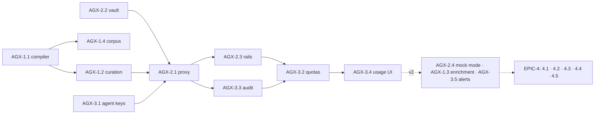

# Roadmap — Agent Experience (AX): Published APIs as Governed MCP Tools

> **Status:** ✅ **Issues filed on `apiome/apiome`** — umbrella **#4503**, epics **#4504–#4507**, and 18 issues **#4529–#4546** (issue numbers are non-contiguous with the epics: #4508–#4528 were filed by a concurrent roadmap).
> **Issue ID prefix:** `AGX`. Epics `AGX-EPIC-n`, issues `AGX-n.m`.
> **GitHub title format:** `apiome: [AGX-<epic>.<issue>] <title>`.
> **Recommended labels:** reuse `ai`, `registry`, `api-keys`, `portal`, `browser`, `rest`,
> `analytics`, `shield`, `mvp`, `epic`.
> **Related roadmaps (complementary, not overlapping):**
> `ROADMAP_MCP_CATALOGING.md` (#3637 — catalogs *external* MCP servers; this roadmap
> *serves tenant APIs as MCP tools*), `apiome-mcp` (read-only spec search — AGX extends it
> to invocation), `ROADMAP_SDK_CODE_GENERATION.md` (SDK-4.5 generates the standalone MCP
> artifact; AGX hosts the managed equivalent), `ROADMAP_MOCK_TRY_IT.md` (agents exercise
> mocks before production keys).
> **Existing backlog:** search for `mcp`-labeled issues at filing time and cross-link;
> umbrella #3637 epics V2-MCP-EPIC-15…27 are the cataloging side and must be referenced,
> not duplicated.

---

## 0. Source description (request, verbatim)

> Based on my direct competitors for Apiome, create a market analysis of the gaps that
> Apiome doesn't cover, and create ROADMAP files for each of the major features that should
> be implemented, along with gaps that the market doesn't provide that Apiome could. These
> ROADMAPs should then be iterated through in such a way that the create-issues skill could
> be used to generate the issues for the roadmaps. Follow the rules from the create-roadmap
> file to identify the items, products, and features that could — and should — be
> implemented first.

**This roadmap covers white-space W1** from `MARKET_ANALYSIS_COMPETITIVE_GAPS.md` — the
market gap *nobody* fills: Speakeasy/Fern generate MCP servers **per SDK build** (static,
self-hosted), Postman exposes **its own** MCP server for its workspace — but no platform
turns a **multi-tenant API catalog into live, governed, observable MCP toolsets**: scoped
agent credentials, per-tool allowlists, quotas, and agent-usage analytics on top of specs
that are already cataloged, versioned, and quality-scored. Apiome has every prerequisite
shipped: published-spec catalog, `apiome-mcp` (FTS + semantic search), API keys, RBAC,
audit, rate-limit patterns. This is the "genome → the map AI agents navigate" bet.

## 1. MVP Definition

A tenant can enable **Agent Access** on a published version: Apiome exposes an MCP
streamable-HTTP endpoint where each selected operation becomes a **callable MCP tool**
(name, description, JSON-Schema inputs derived from the spec) that **proxies to the real
upstream API** (or to the SIM mock) using tenant-configured upstream auth. Access requires
an **agent key** — a new scoped API-key kind carrying a tool allowlist and rate/spend
quotas. Every invocation is logged (who/tool/latency/status, bodies excluded by default)
and visible in a Control Panel usage view. The whole catalog stays discoverable through the
existing `apiome-mcp` search tools, so an agent can *find* an API and then *call* it with
one credential.

**Out of MVP** (v2): browse-side agent portal (`llms.txt`, agents.json, copy-paste MCP
config), OAuth token exchange to upstreams, per-agent budgets/spend metering, tool
composition (multi-call workflows from Arazzo), agent sandbox with mock-first promotion,
MCP tool quality scoring feedback into lint.

## 2. Epics

### AGX-EPIC-1 — Spec → MCP Tool Compiler · #4504

| Issue | Title | Summary | Labels | Par | MVP | Complexity | Modules |
|---|---|---|---|---|---|---|---|
| AGX-1.1 · #4529 | Operation→tool mapping engine | Deterministic tool names, descriptions, input schemas from canonical spec | `ai`, `validation` | N | Y | L | apiome-mcp |
| AGX-1.2 · #4530 | Tool selection & curation model | Per-version: which operations are exposed; safe-by-default (reads on, writes opt-in) | `database`, `governance` | N | Y | M | apiome-db, apiome-rest |
| AGX-1.3 · #4531 | Description enrichment pass | Tool/param descriptions synthesized from spec docs; flag agent-hostile ops (missing descriptions) | `ai`, `documentation` | Y | N | M | apiome-rest |
| AGX-1.4 · #4532 | Tool-schema regression corpus | Examples corpus → golden toolsets; MCP schema validity gate in CI | `validation`, `automation` | Y | Y | S | apiome-mcp |

### AGX-EPIC-2 — Managed MCP Invocation Runtime · #4505

| Issue | Title | Summary | Labels | Par | MVP | Complexity | Modules |
|---|---|---|---|---|---|---|---|
| AGX-2.1 · #4533 | Invocation proxy (tools/call → upstream HTTP) | Build request from tool args per spec; call upstream; map response/errors to MCP results | `ai`, `rest`, `shield` | N | Y | XL | apiome-mcp |
| AGX-2.2 · #4534 | Upstream auth vault | Tenant-stored upstream credentials (apiKey/bearer/basic) encrypted; injected server-side, never exposed to agents | `shield`, `api-keys` | N | Y | L | apiome-rest, apiome-db |
| AGX-2.3 · #4535 | Safety rails | SSRF guards, method allowlists, payload caps, timeout budget, idempotency notes on write tools | `shield`, `validation` | N | Y | M | apiome-mcp |
| AGX-2.4 · #4536 | Mock-target mode | Point a toolset at the SIM mock instead of production (agent sandbox) | `mock-server`, `ai` | Y | N | S | apiome-mcp |

### AGX-EPIC-3 — Agent Identity, Quotas & Analytics · #4506

| Issue | Title | Summary | Labels | Par | MVP | Complexity | Modules |
|---|---|---|---|---|---|---|---|
| AGX-3.1 · #4537 | Agent key kind + scopes | API-key extension: kind=agent, toolset binding, tool allowlist, expiry | `api-keys`, `database` | N | Y | M | apiome-db, apiome-rest |
| AGX-3.2 · #4538 | Quotas & rate limits per agent key | RPS + daily call caps by tier; 429/limit surfaces in MCP error payloads | `api-keys`, `monetization` | N | Y | M | apiome-mcp |
| AGX-3.3 · #4539 | Invocation audit & usage rollups | Per-call log (metadata only), daily rollups, retention policy | `analytics`, `database` | N | Y | M | apiome-db, apiome-mcp |
| AGX-3.4 · #4540 | Agent usage UI | Control Panel: toolsets, keys, calls/agent/tool charts, error rates | `ui`, `analytics` | N | Y | M | apiome-ui |
| AGX-3.5 · #4541 | Anomaly alerts | Spike/abuse detection on agent traffic → notifications (COL-3.1) | `analytics`, `shield` | Y | N | M | apiome-rest |

### AGX-EPIC-4 — Agent-Facing Portal & Discovery (v2) · #4507

| Issue | Title | Summary | Labels | Par | MVP | Complexity | Modules |
|---|---|---|---|---|---|---|---|
| AGX-4.1 · #4542 | Agent setup surface in Browse | "Use with AI" tab: MCP endpoint, config snippets (Claude/Cursor/VS Code), key request | `browser`, `portal`, `ai` | N | N | M | apiome-browse |
| AGX-4.2 · #4543 | llms.txt + agents manifest | Auto-generated llms.txt / agents.json per tenant and per spec (Fern parity, catalog-wide) | `portal`, `ai` | Y | N | S | apiome-browse, apiome-rest |
| AGX-4.3 · #4544 | Workflow tools from Arazzo | Compile Arazzo workflows into composite MCP tools (multi-step, one call) | `ai`, `multi-protocol` | N | N | XL | apiome-mcp |
| AGX-4.4 · #4545 | Agent-readiness score | Lint dimension scoring specs for agent usability (descriptions, examples, error docs) — feeds GOV rules | `governance`, `ai` | Y | N | M | apiome-rest |
| AGX-4.5 · #4546 | OAuth token exchange upstream | Delegated flows for upstreams requiring OAuth (client-credentials first) | `shield`, `integrations` | N | N | L | apiome-rest |

## 3. Detailed Issue Descriptions

### AGX-EPIC-1 — Spec → MCP Tool Compiler · #4504

**AGX-1.1 Operation→tool mapping engine**
- **Problem:** Agents can *search* specs via `apiome-mcp` but cannot *do* anything; turning operations into well-formed MCP tools is the core compiler.
- **Solution/Scope:** For each exposed operation: tool name from operationId (sanitized, collision-stable), description from summary+description, inputSchema merging path/query/header params + request body schema (refs resolved via SDK-1.3-style preprocessing), output description from 2xx response. Deterministic across runs; MCP-spec-valid JSON Schema (no unsupported keywords).
- **Acceptance Criteria:** Petstore yields tools that pass MCP schema validation and round-trip in Claude Desktop; corpus goldens (AGX-1.4) stable.
- **Parallelism/Dependencies:** Foundation; blocks 2.1. Reuse canonical model; coordinate with SDK-4.5 (same mapping, different packaging).
- **Technical Stack:** Python, FastMCP, `apiome-mcp` codebase.
- **Epic:** AGX-EPIC-1.

**AGX-1.2 Tool selection & curation model**
- **Problem:** Exposing every operation to agents is a governance nightmare; safe-by-default selection is the differentiator vs static generators.
- **Solution/Scope:** `agent_toolsets` (version_id, enabled, target prod|mock) + `agent_toolset_tools` (operation ref, enabled, write_op flag); default: GET/HEAD enabled, mutating ops opt-in with confirmation; REST CRUD; audit on changes.
- **Acceptance Criteria:** New toolset exposes only reads by default; enabling a DELETE requires explicit flag; contract updated.
- **Parallelism/Dependencies:** After 1.1 shape known; blocks 2.1, 3.4 UI.
- **Technical Stack:** Migrations, FastAPI.
- **Epic:** AGX-EPIC-1.

**AGX-1.3 Description enrichment pass** — optional AI-assisted (existing copilot infra/Ollama) enrichment of thin descriptions before compile; always human-reviewable; flags "agent-hostile" operations (no description, no examples) — feeds AGX-4.4. *Deps:* 1.1. **Epic:** AGX-EPIC-1.

**AGX-1.4 Tool-schema regression corpus** — golden toolset JSON for the examples corpus asserted in `apiome-mcp` CI (ruff/mypy/pytest gates already exist). *Deps:* 1.1. **Epic:** AGX-EPIC-1.

### AGX-EPIC-2 — Managed Invocation Runtime · #4505

**AGX-2.1 Invocation proxy**
- **Problem:** The live call is the product: `tools/call` must become a correct upstream HTTP request and a useful MCP result.
- **Solution/Scope:** In `apiome-mcp` (streamable-HTTP transport exists): validate args against tool schema → construct URL/query/headers/body per spec serialization rules → inject upstream auth (2.2) → call with timeout/retry budget → map response (status, JSON/text body, truncation markers) into MCP tool result; spec-shaped errors on 4xx/5xx with hint text for the agent.
- **Acceptance Criteria:** E2E: agent key + Petstore toolset against SIM mock — list/create pet through MCP client; error mapping tests; P95 overhead < 100ms over upstream.
- **Parallelism/Dependencies:** Needs 1.1/1.2, 2.2, 3.1. The hard core — size accordingly.
- **Technical Stack:** Python, FastMCP, httpx.
- **Epic:** AGX-EPIC-2.

**AGX-2.2 Upstream auth vault**
- **Problem:** Agents must never hold real API credentials; the platform injecting server-side is the governed-MCP value proposition.
- **Solution/Scope:** `upstream_credentials` encrypted at rest (reuse backup-encryption key patterns), bound to toolset + server URL; kinds: apiKey (header/query), bearer, basic; write-only API (create/rotate/delete, never read back); audit on use is metadata-only.
- **Acceptance Criteria:** Credential unreadable post-create via any API; rotation without toolset downtime; security review (`/security-review`) passes.
- **Parallelism/Dependencies:** Blocks 2.1. Parallel with 1.x.
- **Technical Stack:** FastAPI, pg + application-layer encryption.
- **Epic:** AGX-EPIC-2.

**AGX-2.3 Safety rails** — resolve-then-check SSRF guards on upstream hosts (same policy as SIM-3.2), per-tool method allowlist enforcement, request/response size caps, cumulative timeout budget per MCP call, `readOnlyHint`/`destructiveHint` MCP annotations set from write_op flags. *Deps:* 2.1. **Epic:** AGX-EPIC-2.

**AGX-2.4 Mock-target mode** — toolset `target: mock` routes invocations to the SIM mock URL; enables "let the agent practice" demos and CI agent tests with zero upstream risk. *Deps:* 2.1, SIM MVP. **Epic:** AGX-EPIC-2.

### AGX-EPIC-3 — Agent Identity, Quotas & Analytics · #4506

**AGX-3.1 Agent key kind + scopes** — extend `api_keys` (kind=agent, toolset_id, tool allowlist jsonb, expires_at); MCP auth middleware resolves key → permitted tools; `tools/list` returns only permitted tools. *Deps:* 1.2. **Epic:** AGX-EPIC-3.

**AGX-3.2 Quotas & rate limits** — per-key RPS + daily caps from license tier; MCP-conformant error payload with retry hint; counters shared with 3.3 rollups. *Deps:* 3.1. **Epic:** AGX-EPIC-3.

**AGX-3.3 Invocation audit & rollups** — `agent_invocations` (key, tool, ts, latency, status, sizes; bodies excluded by default, opt-in sampled capture) + daily rollup table; retention per tier. *Deps:* 2.1. **Epic:** AGX-EPIC-3.

**AGX-3.4 Agent usage UI** — Control Panel → MCP section grows: toolset editor (1.2), key management, usage charts (calls/tool, errors, latency, top agents) via dataviz components. *Deps:* 1.2, 3.1, 3.3. **Epic:** AGX-EPIC-3.

**AGX-3.5 Anomaly alerts** — threshold + spike detection on rollups → COL notification fan-out; "agent X hit quota 5 days running" nudges upsell. *Deps:* 3.3, COL-3.1. **Epic:** AGX-EPIC-3.

### AGX-EPIC-4 — Agent-Facing Portal & Discovery (v2) · #4507

**AGX-4.1 Agent setup surface in Browse** — "Use with AI" tab on published specs: endpoint URL, ready-to-paste MCP config for Claude Desktop/Cursor/VS Code, key request flow (tenant-approval queue). *Deps:* MVP; browse auth. **Epic:** AGX-EPIC-4.
**AGX-4.2 llms.txt + agents manifest** — generated per tenant portal + per spec; lists docs, MCP endpoints, toolsets (Fern generates llms.txt per docs site — catalog-wide generation is the differentiator). *Deps:* 1.2. **Epic:** AGX-EPIC-4.
**AGX-4.3 Workflow tools from Arazzo** — compile stored Arazzo workflows into composite tools executing multi-step sequences server-side with state passing; unique to Apiome (Arazzo already first-class). *Deps:* 2.1 mature. **Epic:** AGX-EPIC-4.
**AGX-4.4 Agent-readiness score** — lint dimension (via GOV custom-rule engine) scoring description coverage, example coverage, error documentation; surfaced beside A–F. *Deps:* GOV-1.4, 1.3. **Epic:** AGX-EPIC-4.
**AGX-4.5 OAuth token exchange** — client-credentials grant support in the vault (fetch/refresh/cache tokens per toolset); prerequisite for enterprise upstreams. *Deps:* 2.2. **Epic:** AGX-EPIC-4.

## 4. Work order

1. **AGX-1.1 (+1.4)** ∥ **AGX-2.2** ∥ **AGX-3.1** (three independent foundations).
2. **AGX-1.2** → **AGX-2.1** (the core) → **AGX-2.3 ∥ AGX-3.3** → **AGX-3.2** → **AGX-3.4**. MVP done — demo: agent key in Claude Desktop lists, searches, and *calls* a tenant API.
3. v2: AGX-2.4 (with SIM), AGX-1.3, AGX-3.5; then EPIC-4 (4.2 cheap/early, 4.1 with browse auth, 4.3/4.4/4.5 as demand shows).
