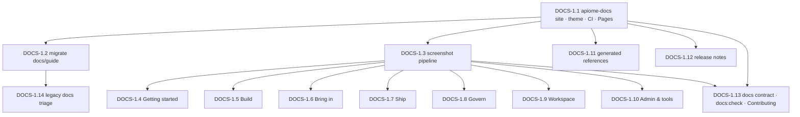

# Roadmap — Apiome documentation site (Docusaurus)

## 0. Roadmap request

> Modify issue #67 to include the use of Docusaurus, and add documentation tasks to all open issues so
> that they include documentation changes and improvements to include in the Docusaurus site automatically.
> These should be standard parts of the implement skill, so the skill should be updated. Include RC6
> milestones to include documentation for Apiome as it exists, along with screenshots of the application
> in the documentation.

### 0.1 What was done on 2026-10-07 alongside this roadmap

| Request | Action |
| --- | --- |
| Modify #67 for Docusaurus | #67 rewritten in place as **DOCS-1.1** (scaffold `apiome-docs`), moved from *Future* to **RC6**, labelled `documentation` |
| Documentation tasks on all open issues | A standard **Documentation (Docusaurus)** section appended to every open issue (768 at the time), marked `<!-- apiome-docs-tasks:v1 -->` so re-runs are idempotent; original bodies backed up before the edit |
| Standard part of the implement skill | `.claude/skills/implement/SKILL.md` gained a mandatory Documentation phase and PR-body requirements; `create-issues`, `create-roadmap`, `update-roadmap` emit the section; `AGENTS.md` states the rule |
| RC6 documentation of Apiome as it exists, with screenshots | This roadmap: one epic, fourteen issues (DOCS-1.1 → 1.14), all on RC6 |

### 0.2 Source of truth

| Item | Location |
| --- | --- |
| Existing user guides | `docs/guide/**` (42 pages, index in `docs/guide/README.md`) |
| REST reference | `apiome-rest/openapi.yaml`, `apiome-rest/CHANGELOG.md` (Keep a Changelog) |
| CLI | `apiome-cli/src/**` (`help_util.py`, `exit_codes.py`) |
| MCP | `apiome-mcp/src/apiome_mcp/**` |
| Seeded stack for screenshots | `scripts/golden_path/run.sh` (tenant `acme-corp`), `docker-compose.yml` |
| Fixture renders (no stack needed) | `apiome-ui/e2e/fixtures/hive-*/**` mounted into `/login` (see `e2e/support/a11y.ts`) |
| Design language (stays in-repo) | `docs/mockups/DESIGN.md`, `docs/mockups/assets/hive.css` |
| Legacy loose docs to triage | `apiome-ui/docs/**`, `apiome-browse/docs/**`, `apiome-rest/docs/**`, `docs/next-steps/**`, `docs/runbooks/**` |

### 0.3 Prior art — existing GitHub issues to reconcile (do **not** duplicate)

| Issue | Title | State | Disposition |
| --- | --- | --- | --- |
| [#67](https://github.com/apiome/apiome/issues/67) | Set up documentation site | OPEN | **Rewritten** as DOCS-1.1; keeps its number and its reference to [#3484](https://github.com/apiome/apiome/issues/3484) (Platform Foundations & Licensing) |
| [#5272](https://github.com/apiome/apiome/issues/5272) | [HIVE-EPIC-9] Admin console | OPEN | DOCS-1.10 documents the console as it exists and tags its screenshots `legacy` for refresh when Epic 9 lands |
| [#5617](https://github.com/apiome/apiome/issues/5617) | [HIVE-13.4] DESIGN.md amendments, mockup promotion | OPEN | Design docs stay in `docs/mockups/`; the site links to them from Contributing |
| [#5596](https://github.com/apiome/apiome/issues/5596) | [HIVE-EPIC-13] gates | OPEN | DOCS-1.13 `docs:check` sits beside the parity / a11y / copy-voice gates |

---

## 1. MVP Definition

### 1.1 What “MVP” means for the documentation site

A site with a theme and no pages helps nobody; a complete page set with hand-pasted screenshots rots
in a week. The MVP is **the site, the existing guides inside it, a repeatable screenshot pipeline, the
getting-started path illustrated, and the gate that keeps it that way.**

### 1.2 MVP scope (in)

| Ref | Why it is load-bearing |
| --- | --- |
| DOCS-1.1 | The site, theme, build and deploy — nothing else can land |
| DOCS-1.2 | The 42 existing guides become the first content; nothing is lost |
| DOCS-1.3 | Screenshots that regenerate are the difference between documentation and a scrapbook |
| DOCS-1.4 | The spine, illustrated — the page every new user reads |
| DOCS-1.13 | The issue section, the skill phase and `docs:check` — docs stay current by construction |

### 1.3 Post-MVP

DOCS-1.5 → 1.10 (one page set per job group, all screenshot-backed), 1.11 (generated references),
1.12 (release notes), 1.14 (legacy docs triage).

### 1.4 MVP exit criteria

- [ ] `apiome-docs` builds in CI and deploys to GitHub Pages from `main`; URL in `README.md`
- [ ] Every `docs/guide/` page is on the site; `docs/guide/README.md` maps old → new
- [ ] `yarn docs:screenshots` regenerates every manifest entry in both themes from the golden-path stack
- [ ] Getting started pages cover sign-in → publish → browse with current screenshots
- [ ] `yarn docs:check` runs on every PR; the implement skill’s Documentation phase and the issue section reference it

### 1.5 Non-goals

- Rewriting the product copy or the design language (DESIGN.md stays the authority, in-repo)
- Versioned docs per release (one “current” docs tree + release-notes posts is enough for RC6)
- Marketing site content; the site documents the product as it ships

---

## 2. Architecture of the change



### 2.1 Layer contract

```
┌──────────────────────────────────────────────────────────────┐
│ 1.1  site · theme · build · deploy                            │  ← nothing visible yet
├──────────────────────────────────────────────────────────────┤
│ 1.2 · 1.3 · 1.11 · 1.12  content engines: migrated guides,    │  ← parallel
│                           screenshots, references, notes     │
├──────────────────────────────────────────────────────────────┤
│ 1.4 → 1.10  one page set per job group, screenshot-backed    │  ← parallel after 1.3
├──────────────────────────────────────────────────────────────┤
│ 1.13 · 1.14  gates, contributing, triage                     │  ← keeps it true
└──────────────────────────────────────────────────────────────┘
```

### 2.2 Conventions every page issue inherits

1. One page per route; the page title is the route’s page title; the description is ≤ 14 words (copy-voice rule).
2. Every screen named gets a `<Screenshot id/>` with a manifest entry; both themes; 1440 × 900; comfortable density; `md` font scale; masked dynamic values.
3. Steps use bold UI nouns (“**click New version**”); buttons are quoted as they read in the product.
4. Each page links its REST endpoints, CLI commands and MCP tools in a “Reference” footer.
5. Feature-flagged or legacy surfaces carry a badge naming the flag or the pending epic.
6. `yarn docs:check` green; the PR body lists pages and screenshot ids touched (implement skill, Documentation phase).

---

## 3. Epic summary

| Epic | Name | GitHub | Issues | MVP issues | Depends on | Theme |
| --- | --- | --- | --- | --- | --- | --- |
| 1 | Documentation site — Apiome as it exists, in Docusaurus | #5618 | 14 | 5 | — | Documentation as a product surface |

Milestone: **RC6** (epic and every issue).

---

## Epic 1 — Documentation site — Apiome as it exists, in Docusaurus — [#5618](https://github.com/apiome/apiome/issues/5618)

**Goal:** Stand up `apiome-docs` (Docusaurus) as the single user-facing documentation site, document the product exactly as it ships today — every route, with light and dark screenshots captured by a repeatable pipeline — and make “update the docs” a standard, gated part of every issue and PR.

| # | GitHub | Title | Summary | Labels | Parallel | MVP | Complexity | Affected modules |
| --- | --- | --- | --- | --- | --- | --- | --- | --- |
| 1.2 | #5619 | Migrate `docs/guide/**` into the site, grouped by job | Move the 42 guide pages into `apiome-docs/docs/` under the job sidebars, rewrite links, keep generated counts, leave redirect stubs | `documentation`, `mvp` | N | Y | M | `apiome-docs/docs/**`, `docs/guide/**`, `scripts/** (format-count generator)` |
| 1.3 | #5620 | Screenshot pipeline — Playwright captures of every route, light and dark, from the seeded stack | `yarn docs:screenshots` renders a route manifest at 1440 × 900 against the golden-path stack (fixtures as fallback) into `static/img/screens/`; `<Screenshot id/>` swaps by theme; CI fails on missing ids | `documentation`, `testing`, `infrastructure`, `mvp` | Y | Y | L | `apiome-docs/scripts/screenshots.ts (new)`, `apiome-docs/screens.json (new)`, `apiome-docs/src/components/Screenshot.tsx (new)`, `scripts/golden_path/*`, `.github/workflows/apiome-docs.yml` |
| 1.4 | #5621 | Getting started & the spine — with screenshots | Sign in, launcher, onboarding, Home, first import, versions, publish, browse, export, MCP — the “first project in 10 minutes” path as it ships, every step illustrated | `documentation`, `mvp` | N | Y | M | `apiome-docs/docs/getting-started/**`, `apiome-docs/screens.json` |
| 1.5 | #5622 | Build — Projects, Versions, dialogs, Primitives & types, Studio | Document `/ade/dashboard/projects`, `/versions` (timeline, changes, change report, test bench, discussion, repository tabs; every dialog), `/primitives`, and the Studio editor/paths/code surfaces | `documentation`, `versions` | Y | N | M | `apiome-docs/docs/build/**`, `apiome-docs/screens.json` |
| 1.6 | #5623 | Bring in — Catalog, import wizard, Repositories, MCP servers | Document the catalog list/item/inspectors and conversion, the import wizard’s eight sources, all seven repository routes, and the five MCP routes | `documentation`, `catalog`, `repository`, `mcp` | Y | N | L | `apiome-docs/docs/bring-in/**`, `apiome-docs/screens.json` |
| 1.7 | #5624 | Ship — Published, Sunset timeline, Export studio, SDK settings, mock try-out | Document the publish surface, visibility, hosted mocks and scenarios, the EOL timeline and CSV, the five-step export studio, SDK generation settings | `documentation`, `export`, `mock-server` | Y | N | M | `apiome-docs/docs/ship/**`, `apiome-docs/screens.json` |
| 1.8 | #5625 | Govern — Style guides, Lint posture, Access audit, Reviews | Document style guides and revisions, assignment and policies, the lint posture workspace (views, waivers, bulk actions), the audit ledger and drawer, and the review page | `documentation`, `governance`, `linting` | Y | N | M | `apiome-docs/docs/govern/**`, `apiome-docs/screens.json` |
| 1.9 | #5626 | Workspace & account — Members, Roles, API keys, Tenants, Profile, Linked accounts, Preferences, Notifications, Help | Document tenant administration and the personal surfaces, including the Preferences pane (themes, font size, density) and the keyboard reference | `documentation`, `tenancy`, `api-keys`, `profile` | Y | N | M | `apiome-docs/docs/workspace/**`, `apiome-docs/screens.json` |
| 1.10 | #5627 | Admin console & tools — as they exist today | Document `/admin/**` (sign-in, overview, users & signups, tenants, licenses, feature flags, property templates, auth providers) and `/ade/database`, `/ade/migration` honestly, with a note that the Hive redesign (Epic 9) is pending | `documentation`, `security`, `database` | Y | N | S | `apiome-docs/docs/admin/**`, `apiome-docs/screens.json` |
| 1.11 | #5628 | Reference — REST (OpenAPI), CLI, MCP tools, mock runtime, CI actions | Generate the REST reference from `apiome-rest/openapi.yaml`, the CLI reference from `apiome` help output, the MCP tool reference from the registry; fold mock-runtime and diff/mock-action docs under Reference | `documentation`, `rest`, `cli`, `mcp`, `openapi` | Y | N | L | `apiome-docs/docs/reference/**`, `apiome-docs/docusaurus.config.ts (openapi plugin)`, `apiome-cli/src/*/help_util.py`, `apiome-mcp/src/apiome_mcp/*`, `scripts/** (generators)` |
| 1.12 | #5629 | Release notes — per-RC pages fed from the REST changelog and the UI What’s new | A `release-notes` blog instance with one post per release candidate, generated from `apiome-rest/CHANGELOG.md` entries and the apiome-ui What’s new feed; the in-app What’s new links to it | `documentation`, `enhancement` | Y | N | S | `apiome-docs/release-notes/**`, `apiome-rest/CHANGELOG.md`, `apiome-ui/src/app/components/shell/whatsNewSeen.ts`, `scripts/** (generator)` |
| 1.13 | #5630 | Docs contract & gates — the “Documentation (Docusaurus)” issue section, `docs:check`, Contributing page | Define the standard Documentation section every issue carries, the implement-skill phase that fulfils it, and `yarn docs:check` (links, orphans, screenshot ids, stale images) wired into CI | `documentation`, `testing`, `infrastructure`, `mvp` | Y | Y | M | `apiome-docs/scripts/check.ts (new)`, `apiome-docs/docs/contributing/**`, `.claude/skills/implement/SKILL.md`, `.claude/skills/create-issues/SKILL.md`, `AGENTS.md`, `.github/workflows/apiome-docs.yml` |
| 1.14 | #5631 | Triage the legacy package docs — migrate, archive or delete | Sort `apiome-ui/docs/*.md` (hundreds), `apiome-browse/docs/`, `apiome-rest/docs/`, `docs/next-steps/`, `docs/runbooks/` into site pages, `docs/archive/`, or deletion; add a lint that blocks new loose Markdown outside the site | `documentation`, `refactor` | Y | N | M | `apiome-ui/docs/**`, `apiome-browse/docs/**`, `apiome-rest/docs/**`, `docs/next-steps/**`, `docs/runbooks/**`, `docs/archive/** (new)` |

### ✅ `apiome: [DOCS-1.1] Scaffold the apiome-docs Docusaurus site, theme, build and deploy` — [#67](https://github.com/apiome/apiome/issues/67) — **Complete**
**Problem statement.** Apiome has no documentation site. User-facing docs live as 42 Markdown files under `docs/guide/`, hundreds of loose notes under `apiome-ui/docs/`, `apiome-browse/docs/` and `apiome-rest/docs/`, and the REST reference is only the running Swagger UI. Nothing is searchable, versioned, themed or screenshot-backed, and there is no place for an issue to say “the docs changed here”.

**Solution / scope.**
- Create `apiome-docs/` with `npx create-docusaurus@latest apiome-docs classic --typescript`; add it to the root `workspaces` and to `turbo.json` (`build` outputs `build/**`).
- Two content instances: `docs/` (the guide) and a `release-notes/` blog instance (DOCS-1.12). Sidebars grouped by the product’s jobs, mirroring the rail: Getting started · Build · Bring in · Ship · Govern · Workspace & account · Admin & tools · Reference · Release notes.
- Theme: Hive tokens from `docs/mockups/assets/hive.css` as Infima variables (navy ink, azure accent, honey ornament only), Inter + JetBrains Mono, the bee glyph as logo and favicon (`apiome-ui/public`), dark mode following the OS with a toggle, local search plugin (`@easyops-cn/docusaurus-search-local`) until Algolia is set up.
- Scripts: `yarn docs:dev`, `yarn docs:build`, `yarn docs:serve`, `yarn docs:check` (DOCS-1.13); `onBrokenLinks: "throw"`, `onBrokenMarkdownLinks: "throw"`.
- CI: `.github/workflows/apiome-docs.yml` builds on every PR touching `apiome-docs/**` or `docs/**`, deploys to GitHub Pages on `main` (`actions/deploy-pages`), same self-hosted runner conventions as `apiome-ui.yml`. Base URL and `trailingSlash` documented in the README.
- MDX components folder with `<Screenshot/>` placeholder (implemented in DOCS-1.3), `<Route/>` (renders a route badge), `<Kbd/>`.
- The repository `README.md` and `docs/guide/README.md` link to the site; `docs/mockups/README.md` keeps pointing at the design mockups (design docs stay in the repo, not on the site).

**Acceptance criteria.**
- [x] `yarn workspace apiome-docs build` succeeds from a clean clone; `turbo run build` includes it
- [x] Site deploys from `main` to GitHub Pages and the URL is recorded in `README.md` (`.github/workflows/apiome-docs.yml`; needs **Settings → Pages → Source: GitHub Actions** once)
- [x] Light and dark themes use Hive tokens; the bee mark is the logo and favicon; honey appears only as ornament
- [x] Sidebar skeleton has the nine job groups with an index page each (content lands in DOCS-1.2 → 1.11)
- [x] Broken links fail the build; the README explains how to run and write docs

**Parallelism / dependencies.** First. Blocks every other DOCS issue. Parallel with everything outside this epic.

**Documentation (Docusaurus).** This issue *is* documentation work; the standard section still applies: pages and screenshot ids touched are listed in the PR, `docs:check` is green.

**Technical stack.** Docusaurus 3 (TypeScript, classic preset) in a new `apiome-docs` yarn workspace · MDX · Playwright (screenshots) · the golden-path seeded stack (`scripts/golden_path/run.sh`) · GitHub Actions (self-hosted, same conventions as `apiome-ui.yml`) · GitHub Pages. Sources: `docs/guide/**`, `apiome-rest/openapi.yaml` + `CHANGELOG.md`, `apiome-cli` help output, `apiome-mcp` tool registry, the apiome-ui What’s new feed.

---

### `apiome: [DOCS-1.2] Migrate docs/guide/** into the site, grouped by job` — [#5619](https://github.com/apiome/apiome/issues/5619)
**Problem statement.** `docs/guide/` is the only user-facing documentation and it is a flat folder of 42 files joined by a hand-maintained README table. It has no search, no navigation hierarchy and no screenshots, and its “How do I…?” table duplicates what a sidebar should do.

**Solution / scope.**
- Map each guide page to a sidebar group (Getting started: README/golden path · Bring in: import, supported formats, catalog format details, convert to OpenAPI, Spectral/Schematron import · Build: edit classes & properties, edit paths, lint & quality, axis score, custom rules, lint rules · Ship: cut/publish a version, browse, export, export fidelity, mock pages, serverless adapter, release attestation · Govern: style-guide revisions, MCP conformance/surface/trust rules · Reference: API reference, CLI quick-start, CI diff gate (GitHub/GitLab/Bitbucket), MCP quick-start, keyboard, accessibility, content voice).
- Rewrite relative links and the `<!--format-count:…-->` markers; keep the generator that fills the counts working against the new paths.
- Front matter per page: `title`, `description` (≤ 14 words, matching the copy-voice rule), `sidebar_position`, `tags`.
- Leave `docs/guide/README.md` as a one-paragraph pointer to the site plus the path map (old → new) so inbound links and the in-app Help page keep working; update the Help page links in `apiome-ui`.

**Acceptance criteria.**
- [ ] Every page under `docs/guide/` has a counterpart on the site and the old README lists the mapping
- [ ] No broken links in the build; in-app Help & docs links resolve to the site
- [ ] `supported-formats` counts still regenerate

**Parallelism / dependencies.** Depends on DOCS-1.1.

**Documentation (Docusaurus).** This issue *is* documentation work; the standard section still applies: pages and screenshot ids touched are listed in the PR, `docs:check` is green.

**Technical stack.** Docusaurus 3 (TypeScript, classic preset) in a new `apiome-docs` yarn workspace · MDX · Playwright (screenshots) · the golden-path seeded stack (`scripts/golden_path/run.sh`) · GitHub Actions (self-hosted, same conventions as `apiome-ui.yml`) · GitHub Pages. Sources: `docs/guide/**`, `apiome-rest/openapi.yaml` + `CHANGELOG.md`, `apiome-cli` help output, `apiome-mcp` tool registry, the apiome-ui What’s new feed.

---

### `apiome: [DOCS-1.3] Screenshot pipeline — Playwright captures of every route, light and dark, from the seeded stack` — [#5620](https://github.com/apiome/apiome/issues/5620)
**Problem statement.** Screenshots in docs rot the day after they are taken unless a script can retake them all. The product has ~60 routes, nine themes and two densities; hand-captured images cannot keep up with a release train that ships several UI PRs a day.

**Solution / scope.**
- `screens.json` manifest: `{ id, route, waitFor, clip?, mask?: string[], theme: ["light","dark"], viewport: {1440×900}, density: "comfortable", fontScale: "md", data: "golden-path" | "fixture:<dir>/<file>" }`. Dynamic values (dates, ids, counts) are masked or frozen via a fixed clock.
- `scripts/screenshots.ts` (Playwright, reusing `apiome-ui/e2e/support/a11y.ts` pinning): boots or attaches to the golden-path stack (`scripts/golden_path/run.sh`, seeded tenant `acme-corp`), signs in with the seeded user, pins theme/density/font scale, captures each manifest entry to `static/img/screens/<id>.<theme>.png`; `--route` / `--id` filters; fixture mode mounts `apiome-ui/e2e/fixtures/**` into `/login` when no stack is available.
- `<Screenshot id="catalog" alt="…" caption="…"/>` MDX component: renders the light image and swaps to dark with the site theme, lazy-loads, links to the full-size image, shows the route badge.
- `yarn docs:check` fails when an MDX page references an id without both theme images, or when a manifest entry has no image (DOCS-1.13); a weekly workflow regenerates all screenshots and opens a PR with the diff.
- Document the manifest and the “add a screenshot” recipe on the site’s Contributing page.

**Acceptance criteria.**
- [ ] `yarn docs:screenshots` produces both themes for every manifest entry from a clean golden-path stack in CI
- [ ] Masked/frozen values make two consecutive runs byte-identical for ≥ 90 % of entries
- [ ] `<Screenshot/>` swaps with the theme toggle and passes axe (alt text required)
- [ ] Weekly refresh workflow opens a PR when images change

**Parallelism / dependencies.** Depends on DOCS-1.1. Parallel with DOCS-1.2. Blocks DOCS-1.4 → 1.10 (they consume it).

**Documentation (Docusaurus).** This issue *is* documentation work; the standard section still applies: pages and screenshot ids touched are listed in the PR, `docs:check` is green.

**Technical stack.** Docusaurus 3 (TypeScript, classic preset) in a new `apiome-docs` yarn workspace · MDX · Playwright (screenshots) · the golden-path seeded stack (`scripts/golden_path/run.sh`) · GitHub Actions (self-hosted, same conventions as `apiome-ui.yml`) · GitHub Pages. Sources: `docs/guide/**`, `apiome-rest/openapi.yaml` + `CHANGELOG.md`, `apiome-cli` help output, `apiome-mcp` tool registry, the apiome-ui What’s new feed.

---

### `apiome: [DOCS-1.4] Getting started & the spine — with screenshots` — [#5621](https://github.com/apiome/apiome/issues/5621)
**Problem statement.** The README’s “first project in ~10 minutes” and the golden path are the only end-to-end narratives, and neither shows what the screens look like after the Hive redesign.

**Solution / scope.**
- Pages: Welcome (what Apiome is, the spine in one line), Sign in & create an account (SSO-first layout, 2FA, OAuth sign-up), First-tenant onboarding, The launcher and the Home overview (checklist, stats, continue cards, needs attention), Your first project (import wizard, source types), Versions & publishing, Browse & export, Connect an MCP host, Keyboard & preferences.
- Each page: ≤ 14-word description, numbered steps with bold UI nouns, one `<Screenshot/>` per step where the screen changes, a “Where next” footer.
- Add the corresponding `screens.json` entries (login, launcher, onboarding-welcome, home, import-wizard-source, versions, publish-dialog, published, export-studio, preferences).

**Acceptance criteria.**
- [ ] A new user can follow the pages from sign-in to a published, browsable spec on the golden-path stack without reading anything else
- [ ] Every screen named has a current light + dark screenshot
- [ ] Copy-voice rules hold (sentence case, verbs on buttons, no “Manage…” titles)

**Parallelism / dependencies.** Depends on DOCS-1.1, 1.3.

**Documentation (Docusaurus).** This issue *is* documentation work; the standard section still applies: pages and screenshot ids touched are listed in the PR, `docs:check` is green.

**Technical stack.** Docusaurus 3 (TypeScript, classic preset) in a new `apiome-docs` yarn workspace · MDX · Playwright (screenshots) · the golden-path seeded stack (`scripts/golden_path/run.sh`) · GitHub Actions (self-hosted, same conventions as `apiome-ui.yml`) · GitHub Pages. Sources: `docs/guide/**`, `apiome-rest/openapi.yaml` + `CHANGELOG.md`, `apiome-cli` help output, `apiome-mcp` tool registry, the apiome-ui What’s new feed.

---

### `apiome: [DOCS-1.5] Build — Projects, Versions, dialogs, Primitives & types, Studio` — [#5622](https://github.com/apiome/apiome/issues/5622)
**Problem statement.** The Build surfaces carry the most controls in the product (six version dialogs, gitlike panels, mock switches, primitives resolver) and have no page-level documentation beyond `edit-classes-and-properties.md` and `edit-paths.md`.

**Solution / scope.**
- One page per route plus a “Version dialogs” page (New version, Edit, Publish, Sunset, Compare, Export, Merge/Fork/Tag [gitlike]) and a “Primitives & types” page (registry, namespaces, resolver, settings, import).
- Screenshots for each tab and dialog; call out feature-flagged surfaces (`FEATURE_GITLIKE`) with a badge.
- Link each page to its REST endpoints (Reference) and CLI commands.

**Acceptance criteria.**
- [ ] Every Build route and dialog has a page or section with a current screenshot
- [ ] Flagged features are marked and the flag named
- [ ] No broken links

**Parallelism / dependencies.** Depends on DOCS-1.1, 1.3. Parallel with 1.6–1.10.

**Documentation (Docusaurus).** This issue *is* documentation work; the standard section still applies: pages and screenshot ids touched are listed in the PR, `docs:check` is green.

**Technical stack.** Docusaurus 3 (TypeScript, classic preset) in a new `apiome-docs` yarn workspace · MDX · Playwright (screenshots) · the golden-path seeded stack (`scripts/golden_path/run.sh`) · GitHub Actions (self-hosted, same conventions as `apiome-ui.yml`) · GitHub Pages. Sources: `docs/guide/**`, `apiome-rest/openapi.yaml` + `CHANGELOG.md`, `apiome-cli` help output, `apiome-mcp` tool registry, the apiome-ui What’s new feed.

---

### `apiome: [DOCS-1.6] Bring in — Catalog, import wizard, Repositories, MCP servers` — [#5623](https://github.com/apiome/apiome/issues/5623)
**Problem statement.** Bring-in is the widest surface (catalog, 50+ formats, repositories with webhooks/telemetry/allowlists, MCP catalog/endpoint/analytics/capabilities/compare) and the existing guides cover import and conversion only.

**Solution / scope.**
- Catalog: list, cards/table, filters and saved views, item overview/format details/source/provenance/conversions/lint/test bench/versions, convert to OpenAPI; link `supported-formats` and `catalog-format-details`.
- Import wizard: each source (file, URL, clipboard, git, SwaggerHub, Postman, MCP server) with its analyze/preview/import/done steps; bulk import (Repository “Import selected”).
- Repositories: add repository (GitHub/GitLab/Bitbucket/Azure DevOps/public URL), detail (preview, files, specs, imports, settings), discovered specs, quota & rate limits, webhook IP allowlist, telemetry.
- MCP servers: catalog, endpoint (versions, capabilities, lint, settings), analytics, capabilities directory, compare, agent access.

**Acceptance criteria.**
- [ ] Every Bring-in route has a page with a current screenshot
- [ ] Each import source has a worked example with sample data
- [ ] Cross-links to the REST and MCP reference pages

**Parallelism / dependencies.** Depends on DOCS-1.1, 1.3.

**Documentation (Docusaurus).** This issue *is* documentation work; the standard section still applies: pages and screenshot ids touched are listed in the PR, `docs:check` is green.

**Technical stack.** Docusaurus 3 (TypeScript, classic preset) in a new `apiome-docs` yarn workspace · MDX · Playwright (screenshots) · the golden-path seeded stack (`scripts/golden_path/run.sh`) · GitHub Actions (self-hosted, same conventions as `apiome-ui.yml`) · GitHub Pages. Sources: `docs/guide/**`, `apiome-rest/openapi.yaml` + `CHANGELOG.md`, `apiome-cli` help output, `apiome-mcp` tool registry, the apiome-ui What’s new feed.

---

### `apiome: [DOCS-1.7] Ship — Published, Sunset timeline, Export studio, SDK settings, mock try-out` — [#5624](https://github.com/apiome/apiome/issues/5624)
**Problem statement.** Publishing, export fidelity and the mock runtime are documented as REST/CLI guides, but the UI surfaces (Published table, mock switches, Export studio wizard, SDK settings) are not.

**Solution / scope.**
- Pages: Published versions (visibility, access URL, mock on/off, scenarios, correlation), Sunset timeline, Export studio (source → target → options → verify → generate; fidelity badges; jobs), SDK settings & “Get SDK”, Mock try-out.
- Fold the existing mock guides under a “Mock runtime” subsection with the UI pages above them.

**Acceptance criteria.**
- [ ] Every Ship route has a page with a current screenshot
- [ ] Export fidelity and mock guides are reachable from the UI pages
- [ ] No broken links

**Parallelism / dependencies.** Depends on DOCS-1.1, 1.3.

**Documentation (Docusaurus).** This issue *is* documentation work; the standard section still applies: pages and screenshot ids touched are listed in the PR, `docs:check` is green.

**Technical stack.** Docusaurus 3 (TypeScript, classic preset) in a new `apiome-docs` yarn workspace · MDX · Playwright (screenshots) · the golden-path seeded stack (`scripts/golden_path/run.sh`) · GitHub Actions (self-hosted, same conventions as `apiome-ui.yml`) · GitHub Pages. Sources: `docs/guide/**`, `apiome-rest/openapi.yaml` + `CHANGELOG.md`, `apiome-cli` help output, `apiome-mcp` tool registry, the apiome-ui What’s new feed.

---

### `apiome: [DOCS-1.8] Govern — Style guides, Lint posture, Access audit, Reviews` — [#5625](https://github.com/apiome/apiome/issues/5625)
**Problem statement.** Governance is documented at the rule level (lint rules, custom rules, Spectral/Schematron import, style-guide revisions) but not at the workflow level: how a reviewer triages findings, requests a waiver, assigns a guide, or reads the audit ledger.

**Solution / scope.**
- Pages: Style guides (list, detail, rule catalog, custom rules editor, policies, import/export), Lint posture (saved views, severity/state/axis/grade filters, bulk acknowledge/fix/waive, owner assignment), Access audit (filters, event drawer, hash chain, CSV), Reviews & approval gate (COL-2.x).
- Link the rule-level guides from each page.

**Acceptance criteria.**
- [ ] Every Govern route has a page with a current screenshot
- [ ] Waiver and approval flows have step-by-step sections
- [ ] No broken links

**Parallelism / dependencies.** Depends on DOCS-1.1, 1.3.

**Documentation (Docusaurus).** This issue *is* documentation work; the standard section still applies: pages and screenshot ids touched are listed in the PR, `docs:check` is green.

**Technical stack.** Docusaurus 3 (TypeScript, classic preset) in a new `apiome-docs` yarn workspace · MDX · Playwright (screenshots) · the golden-path seeded stack (`scripts/golden_path/run.sh`) · GitHub Actions (self-hosted, same conventions as `apiome-ui.yml`) · GitHub Pages. Sources: `docs/guide/**`, `apiome-rest/openapi.yaml` + `CHANGELOG.md`, `apiome-cli` help output, `apiome-mcp` tool registry, the apiome-ui What’s new feed.

---

### `apiome: [DOCS-1.9] Workspace & account — Members, Roles, API keys, Tenants, Profile, Linked accounts, Preferences, Notifications, Help` — [#5626](https://github.com/apiome/apiome/issues/5626)
**Problem statement.** Tenant admin (seats, roles matrix, scoped keys, agent keys) and the personal surfaces (2FA, linked providers, preferences) have no user documentation; support questions go to the README.

**Solution / scope.**
- Pages: Members & seats, Roles & permissions matrix, API keys & agent keys (scopes, rotation, expiry), Tenants & the manage drawer (plan, limits, MCP policy), Profile & security (password, TOTP, backup codes, sessions), Linked accounts, Preferences (nine themes with a screenshot each, font size, density, motion), Notifications, Help & shortcuts.
- Reuse `docs/guide/keyboard.md` and `accessibility.md` under this group.

**Acceptance criteria.**
- [ ] Every Workspace/account route has a page with a current screenshot
- [ ] The theme gallery shows all nine themes
- [ ] No broken links

**Parallelism / dependencies.** Depends on DOCS-1.1, 1.3.

**Documentation (Docusaurus).** This issue *is* documentation work; the standard section still applies: pages and screenshot ids touched are listed in the PR, `docs:check` is green.

**Technical stack.** Docusaurus 3 (TypeScript, classic preset) in a new `apiome-docs` yarn workspace · MDX · Playwright (screenshots) · the golden-path seeded stack (`scripts/golden_path/run.sh`) · GitHub Actions (self-hosted, same conventions as `apiome-ui.yml`) · GitHub Pages. Sources: `docs/guide/**`, `apiome-rest/openapi.yaml` + `CHANGELOG.md`, `apiome-cli` help output, `apiome-mcp` tool registry, the apiome-ui What’s new feed.

---

### `apiome: [DOCS-1.10] Admin console & tools — as they exist today` — [#5627](https://github.com/apiome/apiome/issues/5627)
**Problem statement.** Operators configure sign-in providers, licenses and flags in the admin console, which has README-level notes only (`apiome-ui/src/app/admin/README.md`). The console is still the legacy UI, so screenshots must say so to avoid confusion when Epic 9 lands.

**Solution / scope.**
- Pages per admin route plus Data browser and Migrations; an “Operating Apiome” index linking `docs/runbooks/`, the env reference (`.env.example`) and the Docker compose stack.
- A callout on each page: “This surface predates the Hive redesign; it is scheduled under #5272.” Screenshots carry a `legacy` tag in the manifest so the weekly refresh flags them when Epic 9 ships.

**Acceptance criteria.**
- [ ] Every admin and tools route has a page with a current screenshot and the legacy callout
- [ ] Runbooks and env reference are linked
- [ ] No broken links

**Parallelism / dependencies.** Depends on DOCS-1.1, 1.3.

**Documentation (Docusaurus).** This issue *is* documentation work; the standard section still applies: pages and screenshot ids touched are listed in the PR, `docs:check` is green.

**Technical stack.** Docusaurus 3 (TypeScript, classic preset) in a new `apiome-docs` yarn workspace · MDX · Playwright (screenshots) · the golden-path seeded stack (`scripts/golden_path/run.sh`) · GitHub Actions (self-hosted, same conventions as `apiome-ui.yml`) · GitHub Pages. Sources: `docs/guide/**`, `apiome-rest/openapi.yaml` + `CHANGELOG.md`, `apiome-cli` help output, `apiome-mcp` tool registry, the apiome-ui What’s new feed.

---

### `apiome: [DOCS-1.11] Reference — REST (OpenAPI), CLI, MCP tools, mock runtime, CI actions` — [#5628](https://github.com/apiome/apiome/issues/5628)
**Problem statement.** The REST reference is only the running Swagger UI; the CLI and MCP tool surfaces are documented by hand in quick-starts that drift from the code; `AGENTS.md` requires an OpenAPI version bump on every REST change but nothing publishes it.

**Solution / scope.**
- REST: `docusaurus-plugin-openapi-docs` (or Redocusaurus) rendering `apiome-rest/openapi.yaml` per tag; the build fails if `openapi.yaml` is newer than the generated pages (regenerate in CI).
- CLI: `scripts/gen-cli-reference.py` walks the command tree (`apiome --help` recursively) into one MDX page per command group; exit codes page from `exit_codes.py`.
- MCP: tools/resources/prompts reference generated from the registry, with the conformance/surface/trust rule pages beneath it.
- Move mock bundle/runtime/fixture/callback/attestation guides and the diff-action / mock-action READMEs under Reference → Mock runtime / CI.

**Acceptance criteria.**
- [ ] REST, CLI and MCP references regenerate from source in CI and fail on drift
- [ ] Every REST tag has a page; every CLI command has a page
- [ ] Quick-starts link to the generated reference instead of restating it

**Parallelism / dependencies.** Depends on DOCS-1.1. Parallel with 1.2–1.10.

**Documentation (Docusaurus).** This issue *is* documentation work; the standard section still applies: pages and screenshot ids touched are listed in the PR, `docs:check` is green.

**Technical stack.** Docusaurus 3 (TypeScript, classic preset) in a new `apiome-docs` yarn workspace · MDX · Playwright (screenshots) · the golden-path seeded stack (`scripts/golden_path/run.sh`) · GitHub Actions (self-hosted, same conventions as `apiome-ui.yml`) · GitHub Pages. Sources: `docs/guide/**`, `apiome-rest/openapi.yaml` + `CHANGELOG.md`, `apiome-cli` help output, `apiome-mcp` tool registry, the apiome-ui What’s new feed.

---

### `apiome: [DOCS-1.12] Release notes — per-RC pages fed from the REST changelog and the UI What’s new` — [#5629](https://github.com/apiome/apiome/issues/5629)
**Problem statement.** Release information lives in three places that never meet: the REST Keep-a-Changelog file, the UI’s What’s new dialog, and GitHub milestones.

**Solution / scope.**
- Generator: `scripts/gen-release-notes.ts` merges changelog sections and What’s new entries by version into `release-notes/<version>.md` with issue links; run on tag.
- Pages: RC4, RC5, RC6 (as they close) and a rolling “Unreleased”.
- The UI What’s new dialog gains a “Full release notes” link to the site.

**Acceptance criteria.**
- [ ] One post per RC with issue links; “Unreleased” regenerates on `main`
- [ ] In-app link resolves
- [ ] No broken links

**Parallelism / dependencies.** Depends on DOCS-1.1.

**Documentation (Docusaurus).** This issue *is* documentation work; the standard section still applies: pages and screenshot ids touched are listed in the PR, `docs:check` is green.

**Technical stack.** Docusaurus 3 (TypeScript, classic preset) in a new `apiome-docs` yarn workspace · MDX · Playwright (screenshots) · the golden-path seeded stack (`scripts/golden_path/run.sh`) · GitHub Actions (self-hosted, same conventions as `apiome-ui.yml`) · GitHub Pages. Sources: `docs/guide/**`, `apiome-rest/openapi.yaml` + `CHANGELOG.md`, `apiome-cli` help output, `apiome-mcp` tool registry, the apiome-ui What’s new feed.

---

### `apiome: [DOCS-1.13] Docs contract & gates — the “Documentation (Docusaurus)” issue section, docs:check, Contributing page` — [#5630](https://github.com/apiome/apiome/issues/5630)
**Problem statement.** Documentation only stays current if it is part of the definition of done. Today no issue template, skill or CI gate mentions docs, so pages and screenshots drift the moment a feature ships.

**Solution / scope.**
- Standard section (already appended to every open issue on 2026-10-07 and emitted by `create-issues`): identify affected pages → update copy/steps → capture or refresh screenshots → regenerate reference if REST/CLI/MCP changed → release-notes entry → `docs:check` green → PR lists pages touched.
- `yarn docs:check`: broken internal links, orphan pages (not in any sidebar), `<Screenshot id/>` without both theme images, manifest entries without images, images older than N releases for routes that changed (uses git log on the route’s source paths), and front-matter description length.
- Contributing page: how to run the site, write a page, add a screenshot, regenerate references, and what the gates check; a PR checklist snippet.
- `implement` skill: the Documentation phase is mandatory; the PR body lists docs pages and screenshot ids changed.

**Acceptance criteria.**
- [ ] `docs:check` runs in CI on every PR and fails on each listed condition (negative fixtures included)
- [ ] Contributing page published
- [ ] Skills and AGENTS.md reference the section and the check

**Parallelism / dependencies.** Depends on DOCS-1.1 and 1.3. The issue-section and skill parts are already in place; this issue makes them enforceable.

**Documentation (Docusaurus).** This issue *is* documentation work; the standard section still applies: pages and screenshot ids touched are listed in the PR, `docs:check` is green.

**Technical stack.** Docusaurus 3 (TypeScript, classic preset) in a new `apiome-docs` yarn workspace · MDX · Playwright (screenshots) · the golden-path seeded stack (`scripts/golden_path/run.sh`) · GitHub Actions (self-hosted, same conventions as `apiome-ui.yml`) · GitHub Pages. Sources: `docs/guide/**`, `apiome-rest/openapi.yaml` + `CHANGELOG.md`, `apiome-cli` help output, `apiome-mcp` tool registry, the apiome-ui What’s new feed.

---

### `apiome: [DOCS-1.14] Triage the legacy package docs — migrate, archive or delete` — [#5631](https://github.com/apiome/apiome/issues/5631)
**Problem statement.** Hundreds of implementation notes (fix summaries, feature write-ups, test journeys) sit beside the code with no index. Some are the only description of a feature; most are stale. They mislead both people and agents.

**Solution / scope.**
- Inventory every `.md` outside `apiome-docs/` and `docs/mockups/` with a disposition column: migrate (becomes a site page or section), archive (`docs/archive/<package>/`, read-only, linked from Contributing), delete (duplicated by code or the site).
- Migrate the keepers under the right job group; runbooks become “Operating Apiome” pages (DOCS-1.10).
- A repo lint (`scripts/check-loose-docs.sh` in CI) that fails when a new `.md` appears under `apiome-*/docs/` unless allow-listed (README, CHANGELOG, AGENTS).

**Acceptance criteria.**
- [ ] Inventory committed with a disposition for every file
- [ ] No user-facing content remains outside the site or the archive
- [ ] Loose-docs lint active in CI

**Parallelism / dependencies.** Depends on DOCS-1.2. Can run late; independent of 1.4–1.12.

**Documentation (Docusaurus).** This issue *is* documentation work; the standard section still applies: pages and screenshot ids touched are listed in the PR, `docs:check` is green.

**Technical stack.** Docusaurus 3 (TypeScript, classic preset) in a new `apiome-docs` yarn workspace · MDX · Playwright (screenshots) · the golden-path seeded stack (`scripts/golden_path/run.sh`) · GitHub Actions (self-hosted, same conventions as `apiome-ui.yml`) · GitHub Pages. Sources: `docs/guide/**`, `apiome-rest/openapi.yaml` + `CHANGELOG.md`, `apiome-cli` help output, `apiome-mcp` tool registry, the apiome-ui What’s new feed.

---

## 4. Work to be done, in order

| Step | Issues | Why this order |
| --- | --- | --- |
| 1 | 1.1 | The site must exist before any content |
| 2 | 1.2, 1.3, 1.11, 1.12 | Content engines — all parallel once 1.1 lands |
| 3 | 1.4 | The spine, first page set, proves the screenshot pipeline end to end |
| 4 | 1.5, 1.6, 1.7, 1.8, 1.9, 1.10 | One page set per job group — all parallel |
| 5 | 1.13 | Gate goes live once there is content to gate (the issue section and skill phase are already in force) |
| 6 | 1.14 | Triage the legacy notes once the site holds the keepers |

```
step 1  1.1
step 2  1.2  1.3  1.11  1.12
step 3        1.4
step 4        1.5 1.6 1.7 1.8 1.9 1.10
step 5  1.13
step 6  1.14
```

## 5. Cross-cutting definition of done

- [ ] `yarn workspace apiome-docs build` and `yarn docs:check` green
- [ ] Every screenshot referenced exists in both themes and was produced by `docs:screenshots`, not by hand
- [ ] Front-matter description ≤ 14 words; sentence case; buttons quoted as they read in the product
- [ ] Pages link their REST / CLI / MCP reference entries
- [ ] PR body lists docs pages and screenshot ids touched
- [ ] `apiome-docs/package.json` bumped (AGENTS.md)

