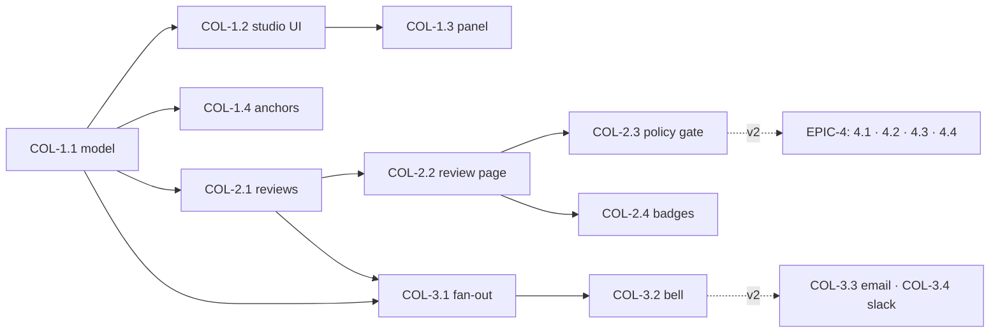

# Roadmap — Collaboration: Comments, Reviews & Approvals

> **Status:** ✅ **Issues filed on `apiome/apiome`** — umbrella **#4508**, epics
> **#4509–#4512**, and 16 issues **#4513–#4528**.
> **Issue ID prefix:** `COL`. Epics `COL-EPIC-n`, issues `COL-n.m`.
> **GitHub title format:** `apiome: [COL-<epic>.<issue>] <title>`.
> **Recommended labels:** reuse `collaboration`, `ui`, `integrations`, `rest`, `database`,
> `versions`, `governance`, `mvp`, `epic`.
> **Existing backlog to absorb/cross-link (do NOT duplicate):** #1010 (Inline Annotation &
> Comments), #2276 (Paths Annotations & Comments P4), #1445 (Review Assignment & Review
> Tools), #1481 (Notification Center & Preferences), #1484 (External Integrations — Slack &
> Teams). Merge-session/conflict infrastructure already in `apiome-rest` is the base for
> the review workflow — do not build a second merge path.
> **Related roadmaps:** `ROADMAP_GOVERNANCE_STYLE_GUIDES.md` (approval policies read like
> guide policies), `ROADMAP_CONTRACT_TESTING_GATES.md` (review page embeds classified diff
> CTG-1.3), `ROADMAP_OAUTH_LOGIN_ONBOARDING.md` (identity/emails).

---

## 0. Source description (request, verbatim)

> Based on my direct competitors for Apiome, create a market analysis of the gaps that
> Apiome doesn't cover, and create ROADMAP files for each of the major features that should
> be implemented, along with gaps that the market doesn't provide that Apiome could. These
> ROADMAPs should then be iterated through in such a way that the create-issues skill could
> be used to generate the issues for the roadmaps. Follow the rules from the create-roadmap
> file to identify the items, products, and features that could — and should — be
> implemented first.

**This roadmap covers gaps G6 + G7** from `MARKET_ANALYSIS_COMPETITIVE_GAPS.md`: SwaggerHub
ships real-time commenting/issue tracking, Apidog ships Google-Docs-style co-editing on the
free tier, Postman ships Git-native workspaces. Apiome has members/roles/tenancy and merge
sessions, but a second designer cannot *discuss*, *review*, or *approve* anything — the
feature that converts single-seat tenants into team plans (Pro/Startup/Ultra tiers already
assume teams).

## 1. MVP Definition

Any member can attach a **comment thread** to a class, property, path, or operation in
Studio (anchored by stable element id, not coordinates); threads support replies,
@mentions, resolve/reopen, and appear in a per-project **Discussion panel** with unresolved
counts. A version can be sent for **review**: the author picks reviewers, reviewers see a
review page (spec render + classified diff vs previous published + open threads), and
record **Approve / Request changes**; publish shows review status and a tenant policy can
require N approvals to publish (force-publish escape stays, audited). **In-app
notification center** (bell + unread list) covers mentions, review requests, decisions, and
resolutions on your threads. Email/Slack are v2.

**Out of MVP** (v2): real-time co-editing/presence, email digests, Slack/Teams apps,
suggested-change patches, branch/PR-style spec workflows (G7), portal-consumer feedback.

## 2. Epics

### COL-EPIC-1 — Comments & Threads (absorbs #1010, #2276) · #4509

| Issue | Title | Summary | Labels | Par | MVP | Complexity | Modules |
|---|---|---|---|---|---|---|---|
| COL-1.1 · #4513 | Comment data model & REST | Threads/comments tables, element anchoring, mentions, resolve; CRUD API | `database`, `rest`, `collaboration` | N | Y | L | apiome-db, apiome-rest |
| COL-1.2 · #4514 | Studio thread UI | Comment affordance on canvas nodes/paths panels; thread popover; unresolved badges | `ui`, `canvas`, `collaboration` | N | Y | L | apiome-ui |
| COL-1.3 · #4515 | Project Discussion panel | All threads: filter open/resolved/mine; deep-link to element | `ui`, `collaboration` | Y | Y | M | apiome-ui |
| COL-1.4 · #4516 | Anchor resilience | Threads survive rename/move; orphan state + relink UX when element deleted | `collaboration`, `validation` | Y | Y | M | apiome-rest, apiome-ui |

### COL-EPIC-2 — Review & Approval (absorbs #1445) · #4510

| Issue | Title | Summary | Labels | Par | MVP | Complexity | Modules |
|---|---|---|---|---|---|---|---|
| COL-2.1 · #4517 | Review request model & lifecycle | `reviews` + `review_decisions`; states draft→in_review→approved/changes_requested | `database`, `rest`, `versions` | N | Y | M | apiome-db, apiome-rest |
| COL-2.2 · #4518 | Review page UI | Spec summary, classified diff (CTG-1.3), open threads, decision buttons + comment | `ui`, `collaboration`, `diff` | N | Y | L | apiome-ui |
| COL-2.3 · #4519 | Approval policy & publish gate | Tenant policy: required approvals / required reviewers; publish blocked until met (force+audit) | `governance`, `versions` | N | Y | M | apiome-rest, apiome-ui |
| COL-2.4 · #4520 | Review status surfaces | Badges on version rows, dashboards, and publish dialog | `ui` | Y | Y | S | apiome-ui |

### COL-EPIC-3 — Notifications (absorbs #1481, #1484) · #4511

| Issue | Title | Summary | Labels | Par | MVP | Complexity | Modules |
|---|---|---|---|---|---|---|---|
| COL-3.1 · #4521 | Notification model & fan-out | Events (mention, review-request, decision, resolve, publish) → per-user inbox rows | `database`, `rest` | N | Y | M | apiome-db, apiome-rest |
| COL-3.2 · #4522 | In-app notification center | Bell + unread count, list, mark-read, click-through deep links; preferences page | `ui` | N | Y | M | apiome-ui |
| COL-3.3 · #4523 | Email delivery | Per-event emails + daily digest; per-user prefs; reuse SMTP infra from onboarding roadmap | `integrations` | Y | N | M | apiome-rest |
| COL-3.4 · #4524 | Slack/Teams integration | Tenant-connected channels; review/publish/breaking events (#1484) | `integrations`, `collaboration` | Y | N | L | apiome-rest |

### COL-EPIC-4 — Team Workflows v2 (G7 track) · #4512

| Issue | Title | Summary | Labels | Par | MVP | Complexity | Modules |
|---|---|---|---|---|---|---|---|
| COL-4.1 · #4525 | Presence & soft locks | Who's-viewing avatars; per-element edit locks to prevent clobbering (pre-CRDT step) | `collaboration`, `ui` | N | N | L | apiome-ui, apiome-rest |
| COL-4.2 · #4526 | Suggested changes | Reviewer proposes concrete field edits; author applies in one click (patch model) | `collaboration`, `versions` | N | N | XL | apiome-rest, apiome-ui |
| COL-4.3 · #4527 | Branch/PR-style spec workflow | Draft branches off a version line + merge-request UX over existing merge sessions | `versions`, `collaboration` | N | N | XL | apiome-rest, apiome-ui |
| COL-4.4 · #4528 | Portal consumer feedback | Signed-in browse users open feedback threads visible to the owning team | `portal`, `browser`, `collaboration` | Y | N | M | apiome-browse, apiome-rest |

## 3. Detailed Issue Descriptions

### COL-EPIC-1 — Comments & Threads

**COL-1.1 Comment data model & REST**
- **Problem:** No storage or API exists for discussion; competitors treat commenting as core (SwaggerHub real-time comments — source: SwaggerHub feature pages).
- **Solution/Scope:** Tables `comment_threads` (tenant, project, version, anchor_type enum class|property|path|operation|version, anchor_id, status open|resolved, created_by) and `comments` (thread_id, author, body md, mentions uuid[], edited_at); REST CRUD + resolve/reopen + list-by-project/version with filters; RBAC: project read → comment; author/admin edit-delete; rate limits; mention parsing server-side.
- **Acceptance Criteria:** Thread on a class survives version listing; mention array populated; permissions enforced in tests; OpenAPI contract updated.
- **Parallelism/Dependencies:** Foundation; blocks 1.2/1.3, 3.1 events.
- **Technical Stack:** Flyway-style migrations, FastAPI.
- **Epic:** COL-EPIC-1.

**COL-1.2 Studio thread UI**
- **Problem:** Comments must live where design happens — canvas nodes and paths panels — or they won't be used.
- **Solution/Scope:** Comment affordance on node headers / property rows / operation cards; popover thread view (reply, resolve, mention autocomplete from members); unresolved-count badge per element; "comment mode" toggle on canvas to declutter.
- **Acceptance Criteria:** Create/reply/resolve round-trip without reload; badge counts match panel; keyboard accessible; Playwright e2e.
- **Parallelism/Dependencies:** After 1.1. Supersedes #1010/#2276 UI scope.
- **Technical Stack:** Next.js, existing Studio component system, React Flow node adornments.
- **Epic:** COL-EPIC-1.

**COL-1.3 Project Discussion panel** — dashboard tab listing threads (filters: open/resolved/mentions-me/element type); clicking deep-links into Studio with the element focused and popover open. *Deps:* 1.1; link format from 1.2. **Epic:** COL-EPIC-1.

**COL-1.4 Anchor resilience** — anchors reference stable element UUIDs (already primary keys); on delete, thread → `orphaned` with last-known label + relink action; rename keeps anchor (id-based) and is tested. *Deps:* 1.1. **Epic:** COL-EPIC-1.

### COL-EPIC-2 — Review & Approval

**COL-2.1 Review model & lifecycle**
- **Problem:** "Is this version OK to publish?" happens in Slack screenshots today; no record exists for governance/audit.
- **Solution/Scope:** `reviews` (version_id, requested_by, state, created/closed), `review_reviewers` (review_id, user, decision approve|request_changes|pending, note, decided_at); transitions REST-enforced (re-request resets decisions on spec change); audit events; only draft (unpublished) versions reviewable.
- **Acceptance Criteria:** State machine tests incl. re-request; decisions immutable history.
- **Parallelism/Dependencies:** After COL-1.1 (threads embed); blocks 2.2–2.4.
- **Technical Stack:** FastAPI, migrations.
- **Epic:** COL-EPIC-2.

**COL-2.2 Review page UI**
- **Problem:** Reviewers need one page with everything: what changed, what's discussed, where to decide.
- **Solution/Scope:** `/ade/reviews/{id}`: header (version, requester, status), tabs — **Changes** (classified diff via CTG-1.3 when available, plain diff fallback), **Spec** (read-only render), **Discussion** (open threads); sticky decision bar (Approve / Request changes + required note on the latter).
- **Acceptance Criteria:** Reviewer completes a decision entirely on this page; diff tab lazy-loads; e2e covers approve + request-changes.
- **Parallelism/Dependencies:** Needs 2.1; CTG-1.3 optional-integrated (feature-flag if CTG later).
- **Technical Stack:** Next.js; reuse browse diff components.
- **Epic:** COL-EPIC-2.

**COL-2.3 Approval policy & publish gate** — tenant governance setting: `required_approvals: n`, optional required reviewer role; publish endpoint enforces (422 like existing gates) with force-publish + reason → audit; policy UI beside style-guide policies. *Deps:* 2.1; pattern from GOV-2.5. **Epic:** COL-EPIC-2.

**COL-2.4 Review status surfaces** — pill (In review / Approved / Changes requested) on version rows, project cards, publish dialog; links to review page. *Deps:* 2.1. **Epic:** COL-EPIC-2.

### COL-EPIC-3 — Notifications

**COL-3.1 Notification model & fan-out** — `notifications` (user, tenant, type, payload jsonb, read_at) written transactionally with source events (mention/review/decision/resolve/publish); retention cap; unread count endpoint. *Deps:* 1.1, 2.1 event sources. **Epic:** COL-EPIC-3.

**COL-3.2 In-app notification center** — bell in ADE header (unread badge), dropdown list w/ grouping, mark-all-read, `/ade/dashboard/notifications` full page + per-type preferences (in-app on/off). Absorbs #1481. *Deps:* 3.1. **Epic:** COL-EPIC-3.

**COL-3.3 Email delivery** — worker renders templates per event honoring prefs; daily digest option; unsubscribe link; depends on SMTP creds from `ROADMAP_OAUTH_LOGIN_ONBOARDING.md` email infra. *Deps:* 3.1. **Epic:** COL-EPIC-3.

**COL-3.4 Slack/Teams integration** — tenant admin connects webhook/app to channels; event filter (reviews, publishes, breaking changes via CTG-3.3); message cards deep-link back. Absorbs #1484. *Deps:* 3.1; CTG-3.3 payloads. **Epic:** COL-EPIC-3.

### COL-EPIC-4 — Team Workflows v2

**COL-4.1 Presence & soft locks** — websocket presence channel; avatars on project/studio; element-level advisory locks with takeover flow — the pragmatic step before CRDT co-editing (Apidog free-tier co-editing is the bar; full CRDT is deliberately deferred). *Deps:* MVP shipped. **Epic:** COL-EPIC-4.
**COL-4.2 Suggested changes** — reviewer edits become a stored patch (canonical-model JSON patch) the author can apply/reject; requires patch-apply engine — shares machinery with merge sessions. *Deps:* 2.2, merge-session internals. **Epic:** COL-EPIC-4.
**COL-4.3 Branch/PR-style workflow (G7)** — named draft branches from a version line; merge request = review (EPIC-2) + merge session (existing) + classified diff (CTG); delivers Postman-style Git-native feel without external git. *Deps:* 2.x, CTG-1.x. **Epic:** COL-EPIC-4.
**COL-4.4 Portal consumer feedback** — authenticated browse users file feedback threads on published specs; appear in Discussion panel tagged `consumer`; closes the producer↔consumer loop SwaggerHub sells. *Deps:* 1.1, browse auth (OAuth roadmap). **Epic:** COL-EPIC-4.

## 4. Work order

1. **COL-1.1** → **COL-1.2** (∥ **COL-1.4**) → **COL-1.3**.
2. **COL-2.1 → COL-2.2 → COL-2.3/2.4** (review track can start once 1.1 lands).
3. **COL-3.1 → COL-3.2** closes the MVP.
4. v2: COL-3.3 ∥ COL-3.4; then EPIC-4 in order 4.1 → 4.2 → 4.3 (4.4 anytime after browse auth).
