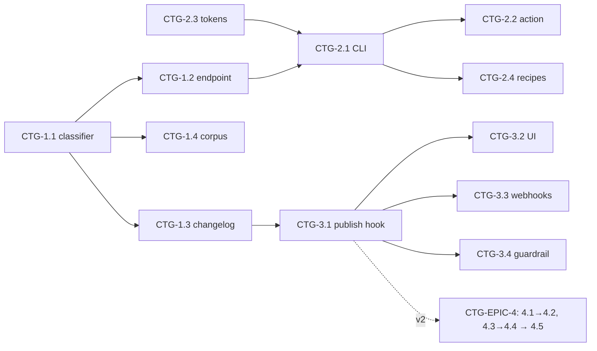

# Roadmap — Contract Testing & Breaking-Change CI Gates

> **Status:** ✅ **Issues filed on `apiome/apiome`** — umbrella **#4458**, epics
> **#4459–#4461, #4466**, and 17 issues **#4467–#4480, #4489, #4501–#4502**
> (ranges non-contiguous; intervening numbers were taken by other issues/PRs).
> **Issue ID prefix:** `CTG`. Epics `CTG-EPIC-n`, issues `CTG-n.m`.
> **GitHub title format:** `apiome: [CTG-<epic>.<issue>] <title>`.
> **Recommended labels:** reuse `contracts`, `diff`, `versions`, `automation`, `rest`,
> `devex`, `validation`, `mock-server`, `mvp`, `epic`.
> **Existing backlog to absorb/cross-link (do NOT duplicate):** #2259 (Contract Testing),
> #4239 ([Epic] Contract Testing & Deploy Gating (Pact)), #1294 ([Epic] Contract Testing
> Engine), #1914 ([Epic] Contract Testing & CI/CD Pipeline), MFI-EPIC-31 #4386 (live-source
> drift alerts — re-discovery side), existing push/webhook subscription + dead-letter
> infrastructure in `apiome-rest`.
> **Related roadmaps:** `ROADMAP_MOCK_TRY_IT.md` (SIM — provider verification reuses the
> mock runtime's validator), `ROADMAP_GOVERNANCE_STYLE_GUIDES.md` (GOV-3.5 CLI lint shares
> the CI entry point), `PLANNED_ROADMAP_CLI.md` (TS CLI; CI commands land in whichever CLI
> is current at build time).

---

## 0. Source description (request, verbatim)

> Based on my direct competitors for Apiome, create a market analysis of the gaps that
> Apiome doesn't cover, and create ROADMAP files for each of the major features that should
> be implemented, along with gaps that the market doesn't provide that Apiome could. These
> ROADMAPs should then be iterated through in such a way that the create-issues skill could
> be used to generate the issues for the roadmaps. Follow the rules from the create-roadmap
> file to identify the items, products, and features that could — and should — be
> implemented first.

**This roadmap covers gap G3** from `MARKET_ANALYSIS_COMPETITIVE_GAPS.md`: **Bump.sh**
leads with automatic breaking-change detection and changelogs; **Speakeasy** ships contract
tests; **Apidog/Postman** run spec-driven tests in CI. Apiome already has the hard parts —
a version diff engine, publish lifecycle, webhook/push subscriptions with a dead-letter
queue — but exposes no CI artifact, no breaking-change semantics, no consumer contracts,
and no spec-vs-live verification.

## 1. MVP Definition

A team can (1) run `apiome diff <spec-file> --against <project>@<version> --fail-on
breaking` in CI and get a non-zero exit + human/JSON report when the proposed spec breaks
the published contract (removed path/operation/property, narrowed type, new required
field, removed enum value, auth tightening); (2) see the same **breaking / non-breaking /
docs-only** classification on every version diff in the UI and in the auto-generated
**changelog** on the published/browse pages; (3) subscribe a webhook that fires with the
classified changelog when a new version is published (upgrade of existing subscriptions).

**Out of MVP** (v2): consumer-driven contracts (Pact-style, per-consumer verification),
provider verification against live deployments (drift), scheduled replay/scenario tests,
performance assertions, deploy-gating dashboard.

## 2. Epics

### CTG-EPIC-1 — Breaking-Change Semantics (classifier core) · #4459

| Issue | Title | Summary | Labels | Par | MVP | Complexity | Modules |
|---|---|---|---|---|---|---|---|
| CTG-1.1 · #4467 | Change taxonomy & classifier | Classify diff-engine output: breaking / non-breaking / docs-only, w/ rule table | `diff`, `contracts`, `validation` | N | Y | L | apiome-rest |
| CTG-1.2 · #4468 | Classified diff REST endpoint | `POST /v1/diff/classified` (two stored versions, or uploaded spec vs stored) | `rest`, `diff` | N | Y | M | apiome-rest |
| CTG-1.3 · #4469 | Changelog generator | Ordered, grouped human-readable changelog (md/json) from classified diff | `diff`, `versions` | Y | Y | M | apiome-rest |
| CTG-1.4 · #4470 | Classifier regression corpus | Fixture pairs per rule; golden classification outputs in CI | `contracts`, `validation` | Y | Y | M | apiome-rest |

### CTG-EPIC-2 — CI Surface (the Bump.sh-style hook) · #4460

| Issue | Title | Summary | Labels | Par | MVP | Complexity | Modules |
|---|---|---|---|---|---|---|---|
| CTG-2.1 · #4471 | CLI `apiome diff --fail-on` | Spec-file vs published version; exit codes; text/json/markdown output | `devex`, `automation` | N | Y | M | apiome-cli |
| CTG-2.2 · #4472 | GitHub Action `apiome/diff-action` | Wrap 2.1; PR comment with classified changelog | `automation`, `integrations` | Y | Y | M | new action repo/dir |
| CTG-2.3 · #4473 | CI tokens & scoped keys | Machine keys scoped read-only diff/lint (reuse api_keys) | `api-keys`, `shield` | Y | Y | S | apiome-rest, apiome-db |
| CTG-2.4 · #4474 | GitLab/Bitbucket CI recipes | Documented pipelines + container image entrypoint | `documentation`, `automation` | Y | N | S | docs, deploy |

### CTG-EPIC-3 — Change Communication (publish-time) · #4461

| Issue | Title | Summary | Labels | Par | MVP | Complexity | Modules |
|---|---|---|---|---|---|---|---|
| CTG-3.1 · #4475 | Publish pipeline classification | Auto-classify vs previous published version at publish; store changelog | `versions`, `rest` | N | Y | M | apiome-rest, apiome-db |
| CTG-3.2 · #4476 | Changelog UI (dashboard + browse) | Changelog tab on version/published pages; breaking badges on diff views | `ui`, `browser`, `diff` | N | Y | M | apiome-ui, apiome-browse |
| CTG-3.3 · #4477 | Webhook payload upgrade | Existing subscriptions emit classified changelog + severity filter option | `integrations`, `automation` | Y | Y | S | apiome-rest |
| CTG-3.4 · #4478 | Breaking-publish guardrail | Warn (optionally block, per style-guide policy) publishing breaking changes without a major-version bump | `governance`, `versions` | Y | N | M | apiome-rest, apiome-ui |

### CTG-EPIC-4 — Contract Verification (v2; absorbs #4239/#1294/#1914 scope) · #4466

| Issue | Title | Summary | Labels | Par | MVP | Complexity | Modules |
|---|---|---|---|---|---|---|---|
| CTG-4.1 · #4479 | Consumer contract registry | Consumers declare used operations/fields (Pact-import + UI picker); stored per project | `contracts`, `database` | N | N | L | apiome-rest, apiome-db, apiome-ui |
| CTG-4.2 · #4480 | Consumer-aware breaking analysis | Diff classified *per consumer contract* — "breaks 2 of 7 consumers" | `contracts`, `diff` | N | N | L | apiome-rest |
| CTG-4.3 · #4489 | Provider verification vs live | Replay spec/example requests against a target base URL; conformance report (drift) | `contracts`, `test-lab` | Y | N | XL | apiome-rest or apiome-mock |
| CTG-4.4 · #4501 | Scheduled verification & alerts | Cron verify + notify on drift (reuse webhook infra; pairs with MFI-EPIC-31) | `automation`, `monitoring` | Y | N | M | apiome-rest |
| CTG-4.5 · #4502 | Deploy-gating status API | `GET /v1/projects/{id}/gate` aggregate (lint grade + breaking + consumer breaks) for CD pipelines | `automation`, `contracts` | Y | N | M | apiome-rest |

## 3. Detailed Issue Descriptions

### CTG-EPIC-1 — Breaking-Change Semantics · #4459

**CTG-1.1 Change taxonomy & classifier**
- **Problem:** The diff engine reports *what* changed but not *whether it breaks consumers* — the entire value of Bump.sh's headline feature (source: bump.sh/api-change-management).
- **Solution/Scope:** Rule table over diff output: **breaking** = removed path/operation/response, removed/renamed property, type narrowed, optional→required, enum value removed, param added as required, security added/tightened, server removed; **non-breaking** = additive optional; **docs-only** = description/example/tag changes. Each classified change carries rule id, JSON pointer, before/after. Extensible registry so GOV guides can re-severity rules later.
- **Acceptance Criteria:** Corpus (CTG-1.4) 100% expected classifications; unknown diff kinds default to breaking (fail-safe) with `unclassified` flag.
- **Parallelism/Dependencies:** Foundation; blocks everything.
- **Technical Stack:** Python in `apiome-rest` (extends existing diff module).
- **Epic:** CTG-EPIC-1.

**CTG-1.2 Classified diff REST endpoint**
- **Problem:** CI and UI need one canonical API for classification, including "uploaded candidate spec vs stored version" (the PR use case).
- **Solution/Scope:** `POST /v1/diff/classified` with `{base: {project, version}, head: {project, version} | {inline spec}}`; response = classified change list + summary counts + max severity. Auth via existing keys; size limits; OpenAPI contract updated.
- **Acceptance Criteria:** Both stored-vs-stored and inline-vs-stored paths tested; 10MB spec guard.
- **Parallelism/Dependencies:** After 1.1; blocks 2.1, 3.x.
- **Technical Stack:** FastAPI.
- **Epic:** CTG-EPIC-1.

**CTG-1.3 Changelog generator** — deterministic ordering (breaking first, grouped by path), markdown + JSON renderers, "since <version>" aggregation across multiple versions. *Deps:* 1.1. Feeds 3.1/3.2/3.3 and browse. **Epic:** CTG-EPIC-1.

**CTG-1.4 Classifier regression corpus** — fixture spec pairs per taxonomy rule under `apiome-rest/tests/fixtures/diff/`; golden outputs asserted in CI so classification changes are deliberate. *Deps:* 1.1 (co-developed). **Epic:** CTG-EPIC-1.

### CTG-EPIC-2 — CI Surface · #4460

**CTG-2.1 CLI `apiome diff --fail-on`**
- **Problem:** Teams adopt change management only if it fails their PR builds; today nothing connects Apiome to CI.
- **Solution/Scope:** `apiome diff <file> --against <project>@<version|latest> [--fail-on breaking|warn] [--format text|json|md]`; exit 0/1(breaking)/2(error); wraps CTG-1.2 inline mode; respects CTG-2.3 tokens.
- **Acceptance Criteria:** Golden-path fixture with a removed property exits 1 and prints the rule id; json output schema-stable.
- **Parallelism/Dependencies:** Needs 1.2, 2.3.
- **Technical Stack:** current `apiome-cli` (Python/uv); note in issue if TS CLI (PLANNED_ROADMAP_CLI) has superseded it at implementation time.
- **Epic:** CTG-EPIC-2.

**CTG-2.2 GitHub Action** — composite/container action: inputs (spec path, project, fail-on), posts/updates one sticky PR comment with the markdown changelog; example workflow in docs. *Deps:* 2.1. **Epic:** CTG-EPIC-2.

**CTG-2.3 CI tokens & scoped keys** — extend `api_keys` with scopes (`diff:read`, `lint:read`); Control Panel key page grows scope picker; no write access from CI creds. *Deps:* none (parallel start). **Epic:** CTG-EPIC-2.

**CTG-2.4 GitLab/Bitbucket recipes** — documented `.gitlab-ci.yml`/pipelines using the container image; smoke-tested in CI matrix. *Deps:* 2.1. **Epic:** CTG-EPIC-2.

### CTG-EPIC-3 — Change Communication · #4461

**CTG-3.1 Publish pipeline classification** — on publish, classify vs previous published version on the line; persist `version_changelogs` (jsonb + max severity); backfill latest pair for existing tenants. *Deps:* 1.1, 1.3. **Epic:** CTG-EPIC-3.

**CTG-3.2 Changelog UI** — Versions page + browse spec page gain "Changes" tab: severity badges, grouped list, diff-view deep links; browse RSS/JSON feed per project (Bump.sh parity). *Deps:* 3.1. **Epic:** CTG-EPIC-3.

**CTG-3.3 Webhook payload upgrade** — publish-event payload embeds summary + top changes + severity; subscription config gains `min_severity` filter; dead-letter behavior unchanged. *Deps:* 3.1. **Epic:** CTG-EPIC-3.

**CTG-3.4 Breaking-publish guardrail** — if head classifies breaking vs previous published and semver major not bumped → publish dialog warning; tenant policy (via GOV guide setting) can escalate to block+force pattern. *Deps:* 3.1, GOV-2.5 pattern. **Epic:** CTG-EPIC-3.

### CTG-EPIC-4 — Contract Verification (v2) · #4466

**CTG-4.1 Consumer contract registry** — `consumers` + `consumer_contracts` tables; ingest Pact files (map interactions → operations/fields) or pick operations in UI; consumer list on project page. Absorbs #4239 intent. *Deps:* EPIC-1. **Epic:** CTG-EPIC-4.
**CTG-4.2 Consumer-aware breaking analysis** — intersect classified changes with each contract's used surface; CI/report shows per-consumer verdicts ("breaks billing-service"). *Deps:* 4.1. **Epic:** CTG-EPIC-4.
**CTG-4.3 Provider verification vs live** — execute spec-derived requests (examples + synthesized minimal cases, safe methods by default; opt-in mutating with fixtures) against a base URL; report response-schema conformance; reuses SIM-1.3 synthesis + SIM-1.4 validators. *Deps:* SIM-EPIC-1. **Epic:** CTG-EPIC-4.
**CTG-4.4 Scheduled verification & alerts** — tenant-scheduled runs; failures → webhook/notification; complements MFI-EPIC-31 source drift (that watches *sources*, this watches *deployments*). *Deps:* 4.3. **Epic:** CTG-EPIC-4.
**CTG-4.5 Deploy-gating status API** — single aggregate verdict endpoint for CD ("can I promote?"): latest lint grade (GOV), breaking status (CTG-3.1), consumer verdicts (4.2), verification freshness (4.4). *Deps:* 4.2/4.4 partial ok. **Epic:** CTG-EPIC-4.

## 4. Work order

1. **CTG-1.1 (+1.4 co-developed)** → **CTG-1.2 ∥ CTG-1.3**; **CTG-2.3** parallel from day one.
2. **CTG-2.1 → CTG-2.2** (CI story shippable) ∥ **CTG-3.1 → CTG-3.2/3.3** (publish story). MVP done.
3. v2: CTG-2.4, CTG-3.4, then EPIC-4: 4.1→4.2 (consumer track) ∥ 4.3→4.4 (live track) → 4.5.
