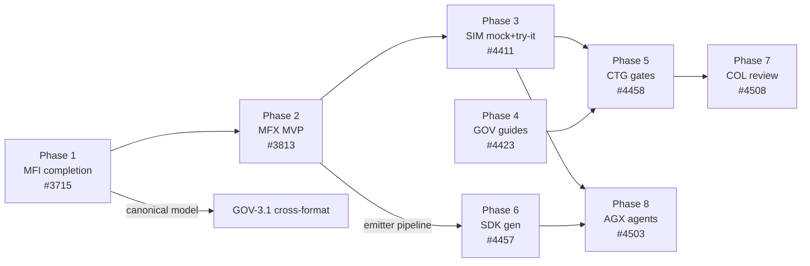

 # ROADMAP — FINAL RC2: Implementation Order

> **Status:** 📋 **Consolidated execution plan** (2026-07-04). This document files **no new
> issues** — it sequences already-filed work into the order it should be implemented for
> the RC2 → GA push. Every item references its umbrella/epic/issue numbers on
> `apiome/apiome` (older MFI/MFX numbers were filed under the pre-rename
> `objectified-project/objectified` org and migrated with the repo).
> **Companion analysis:** `MARKET_ANALYSIS_COMPETITIVE_GAPS.md` (why this order).
> **Source roadmaps:** `ROADMAP_MULTI_FORMAT_IMPORT*.md` (#3715), `ROADMAP_MULTI_FORMAT_EXPORT*.md`
> (#3813), `ROADMAP_MOCK_TRY_IT.md` (#4411), `ROADMAP_GOVERNANCE_STYLE_GUIDES.md` (#4423),
> `ROADMAP_CONTRACT_TESTING_GATES.md` (#4458), `ROADMAP_SDK_CODE_GENERATION.md` (#4457),
> `ROADMAP_COLLABORATION_REVIEW.md` (#4508), `ROADMAP_AGENT_EXPERIENCE.md` (#4503).

---

## 0. Source description (request, verbatim)

> Let's create the issues using create-issue with as much detail as possible, then create a
> ROADMAP_FINAL_RC2.md file that contains the next items to implement in order of
> implementation. They should also include the import and export features, as these are
> EXTREMELY important, and I don't believe these competitors can even touch me with that
> feature.

## 1. Strategy in one paragraph

**The moat ships first.** Multi-format import (MFI) and any-to-any export/transcoding
(MFX) are the capability no direct competitor has — SwaggerHub, Stoplight, Postman,
Apidog, Bump.sh, and Redocly are OpenAPI-first with at most one or two side formats, and
none of them can *import 30+ API description formats, catalog and score them, then emit
any of them from one canonical model* (see `MARKET_ANALYSIS_COMPETITIVE_GAPS.md` §4 W2).
Phases 1–2 finish that moat to demo quality. Phases 3–5 then close the three
demo-killing parity gaps (mock/try-it, governance rulesets, breaking-change gates) that
block competitive evaluations, each deliberately reusing engines the moat work hardens.
Phases 6–8 monetize teams (SDKs, collaboration) and convert the MCP head start into the
category-defining Agent Experience bet. Within every phase, the **MVP-flagged issues ship
first**; v2 issues in the same roadmap wait until all phases' MVPs are done unless noted.

## 2. Implementation order

### Phase 1 — Import moat completion (MFI) · umbrella **#3715**

The MVP shipped; what remains is the credibility cleanup that makes "we import anything"
true in a demo against real-world repos.

| Order | Work | Issues | Why now |
|---|---|---|---|
| 1.1 | **OpenAPI-family adapter completeness** — Swagger 2.0 canonical normalizer, Arazzo `ImportSource` adapter, OpenAPI 3.2 | epic **#4385** (MFI-EPIC-30) | Formats advertised as importable today bypass/break the canonical pipeline — an integrity bug in the moat story |
| 1.2 | **Intake hardening MVP slice** — archives/multi-file + git-repo intake | epic **#4384** (MFI-EPIC-29, issues 29.1/29.2 first) | gRPC — a *shipped MVP format* — is multi-file in every real repo; single-file intake breaks the first serious demo |
| 1.3 | **Catalog→OpenAPI passthrough & dry-run promotions** | MFI-22.7 (#4002–#4009 range, epic #4000) + UI MFI-26.4 | Promoted to MVP in the 2026-07-03 gap analysis; the §5 work order already sequences 22.7 first |
| 1.4 | **Cross-format API identity** | **#4410** (MFI-6.4) | One API tracked across formats — prerequisite for honest cross-format diff/lint later (GOV-3.1) |

*Defer:* MFI-EPIC-31 (drift re-discovery, #4386) pairs better with CTG Phase 5; MFI-EPIC-32
(collections/HAR, #4387) and §9.7 candidate formats ride behind MFX MVP.

### Phase 2 — Export moat: MFX MVP ("model → 5 targets with honest fidelity") · umbrella **#3813**

The headline differentiator: **import once, publish in every format** — with fidelity
badges instead of silent loss. 260 issues are filed; implement the MVP band only:

| Order | Work | Issues |
|---|---|---|
| 2.1 | Export foundation — capability profiles, fidelity engine (DROP/APPROX/SYNTH/OK), job pipeline | MFX-EPIC-1…2 (#3814–…) |
| 2.2 | Five MVP emitters — OpenAPI/Swagger, AsyncAPI, gRPC/Protobuf, GraphQL, Avro | MFX-EPIC-9, 11, 12, 13, 19 |
| 2.3 | Version-scoped Export dialog + fidelity pre-summary + preserved-% ring (ui + browse) | MFX-6.x, 7.2; Export Studio shell MFX-EPIC-41 (#4347–…) as the container |
| 2.4 | CLI export parity (`apiome export --to <format>`) | MFX CLI issues under EPIC-6/7 |

**Exit criterion for Phases 1–2 (the moat demo):** import a multi-file gRPC repo *and* an
AsyncAPI doc → both cataloged, scored, diffable → convert to OpenAPI with fidelity
preview → publish → export the same version as GraphQL SDL and Avro with fidelity badges
→ pull it via CLI and MCP. That demo is un-answerable by every competitor in the analysis.

### Phase 3 — Mock servers & Try-It console (SIM) · umbrella **#4411**

MVP issues, in dependency order (all `mvp`-labeled):

1. **#4416** SIM-1.1 mock service skeleton → **#4422** SIM-2.1 enable/disable per version
2. Parallel on the runtime: **#4417** examples resolver · **#4418** schema synthesis · **#4419** request validation · **#4420** rate limits/audit; parallel on browse: **#4448** SIM-3.2 CORS-safe proxy
3. **#4443** SIM-2.2 settings UI · **#4444** SIM-2.3 browse badge → **#4447** SIM-3.1 Try-It panel → **#4449** SIM-3.3 response viewer
4. **#4421** SIM-1.6 golden-path gate closes the phase

Every imported format from Phase 1 instantly gains a mock + console — the moat multiplies.

### Phase 4 — Governance style guides (GOV) · umbrella **#4423**

MVP issues in order: **#4427** GOV-1.1 data model ∥ **#4428** GOV-1.2 rule registry →
**#4429** GOV-1.3 custom-rule DSL → **#4430** GOV-1.4 engine integration → **#4433**
GOV-2.1 screen → **#4434** GOV-2.2 catalog tab ∥ **#4435** GOV-2.3 custom-rules tab;
**#4436** GOV-2.4 violation display ∥ **#4437** GOV-2.5 publish gate any time after the
engine. Highest-leverage parity item: extends the existing lint engine, unlocks
enterprise conversations, and (v2 GOV-3.1 #4438) becomes cross-format governance on the
Phase-1 canonical model — white space nobody else can follow into.

### Phase 5 — Breaking-change gates & contract testing (CTG) · umbrella **#4458**

MVP issues: **#4467** CTG-1.1 classifier (+ **#4470** corpus co-developed) → **#4468**
CTG-1.2 endpoint ∥ **#4469** CTG-1.3 changelog; **#4473** CTG-2.3 CI tokens from day one →
**#4471** CTG-2.1 `apiome diff --fail-on` → **#4472** CTG-2.2 GitHub Action; publish
track: **#4475** CTG-3.1 → **#4476** CTG-3.2 changelog UI ∥ **#4477** CTG-3.3 webhooks.
This is the daily-active-usage hook (Bump.sh's entire business). Pull MFI-EPIC-31
(#4386, source drift) into this phase's v2 alongside CTG-4.4 (#4501) — same alerting rail.

### Phase 6 — SDK generation (SDK) · umbrella **#4457**

MVP issues: **#4481** SDK-1.1 jobs/artifacts → **#4482** SDK-1.2 SPI/sandbox ∥ **#4483**
SDK-1.3 preprocessing → **#4485** SDK-2.1 TypeScript ∥ **#4486** SDK-2.2 Python with
**#4484** SDK-1.4 snapshot CI growing alongside → **#4492** SDK-3.2 CLI (thin, early) →
**#4491** SDK-3.1 Generate dialog. Generation is another emitter family on the Phase-2
export pipeline — deliberately sequenced after MFX so the job/queue/UI scaffolding is
proven. v2 flag: **#4499** SDK-4.5 (MCP artifact) is the bridge into Phase 8.

### Phase 7 — Collaboration & review (COL) · umbrella **#4508**

MVP issues: **#4513** COL-1.1 comments model → **#4514** COL-1.2 studio threads (∥
**#4516** COL-1.4 anchors) → **#4515** COL-1.3 panel; review track after 1.1: **#4517**
COL-2.1 → **#4518** COL-2.2 review page (embeds Phase-5 changelog #4469) → **#4519**
COL-2.3 approval gate ∥ **#4520** COL-2.4 badges; notifications: **#4521** COL-3.1 →
**#4522** COL-3.2 bell. Converts single-seat tenants into the team tiers pricing assumes.

### Phase 8 — Agent Experience (AGX) · umbrella **#4503** — the category bet

MVP issues: three parallel foundations **#4529** AGX-1.1 tool compiler (+ **#4532**
corpus) ∥ **#4534** AGX-2.2 credential vault ∥ **#4537** AGX-3.1 agent keys → **#4530**
AGX-1.2 curation → **#4533** AGX-2.1 invocation proxy (the core) → **#4535** AGX-2.3
safety rails ∥ **#4539** AGX-3.3 audit → **#4538** AGX-3.2 quotas → **#4540** AGX-3.4
usage UI. **Exit demo:** an agent key pasted into Claude Desktop lists, semantically
searches, and *live-calls* a tenant API — governed, quota'd, audited. Positions Apiome as
the agent-ready API platform while competitors are still shipping static MCP artifacts.

## 3. Dependency & overlap map

**Two-track staffing note.** Phases are dependency-ordered, not strictly serial. A
backend track and a frontend track can run one phase apart (e.g., SIM runtime while MFX
Export Studio UI finishes; GOV engine while SIM console lands). Safe concurrent pairs:
1∥2 (different pipeline halves), 3∥4 (disjoint modules), 5∥6 after 2+3 land. Phases 7–8
touch the widest surface — keep them last and single-focus.

## 4. Summary table

| Phase | Umbrella | MVP scope | Modules touched | Competitive effect |
|---|---|---|---|---|
| 1. MFI completion | #3715 (+#4384/#4385/#4410) | 29.1–29.2, EPIC-30, 22.7, 26.4, 6.4 | rest, ui, db, cli | Moat: intake credibility |
| 2. MFX MVP | #3813 | EPIC-1,2,9,11,12,13,19,41 + 6.x | rest, ui, browse, cli | **Moat: any-to-any — untouchable** |
| 3. SIM MVP | #4411 | #4416–#4422, #4443–#4444, #4447–#4449 | new apiome-mock, browse, ui | Parity: kills "no mock" objection |
| 4. GOV MVP | #4423 | #4427–#4430, #4433–#4437 | rest, ui, db | Parity → cross-format white space |
| 5. CTG MVP | #4458 | #4467–#4473, #4475–#4477 | rest, cli, ui, browse | Parity: Bump.sh-class gates; DAU hook |
| 6. SDK MVP | #4457 | #4481–#4486, #4491–#4492 | rest, new generators, ui, cli | Parity: Speakeasy/Fern table stakes |
| 7. COL MVP | #4508 | #4513–#4522 | rest, ui, db | Monetize: seats & team tiers |
| 8. AGX MVP | #4503 | #4529–#4530, #4532–#4535, #4537–#4540 | apiome-mcp, rest, ui, db | Category: governed agent tools |

## 5. Standing rules while executing

1. **MVP issues only, per phase**, until all eight MVPs are shipped; v2 issues (including
   all of SIM-EPIC-4, CTG-EPIC-4, SDK-EPIC-4, COL-EPIC-4, AGX-EPIC-4, GOV-EPIC-3) queue
   behind them except where a phase explicitly pulls one forward.
2. **Every phase lands a golden-path extension** before it is called done (the SIM
   pattern, #4421 — apply the same discipline to MFX export, CTG diff, SDK generate).
3. **Cross-roadmap contracts are already wired in the issues** (SIM↔CTG↔GOV↔COL↔AGX
   cross-references carry real issue numbers) — when scope shifts, update the referenced
   issues, not just the roadmap files.
4. Close absorbed legacy issues (#1894, #1482, #1153, #2282, #1074, #1879–#1883, #2259,
   #1294, #1914, #2252, #2364, #1410, #1469, #1010, #2276, #1445, #1481, #1484) as
   duplicates pointing at their SIM/CTG/SDK/COL successors as each phase starts, so the
   backlog converges instead of forking.
