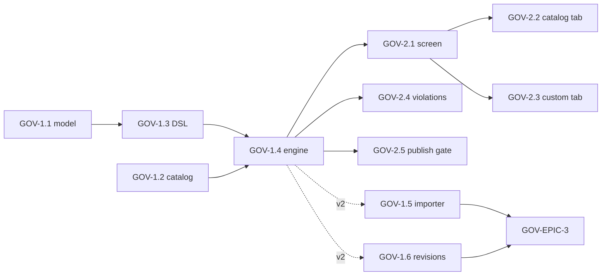

# Roadmap — Governance Style Guides & Custom Lint Rulesets

> **Status:** ✅ **Issues filed on `apiome/apiome`** — umbrella **#4423**, epics **#4424–#4426**, and 16 issues **#4427–#4442**.
> **Issue ID prefix:** `GOV`. Epics `GOV-EPIC-n`, issues `GOV-n.m`.
> **GitHub title format:** `apiome: [GOV-<epic>.<issue>] <title>`.
> **Recommended labels:** reuse `governance`, `validation`, `rest`, `ui`, `database`,
> `versions`, `enterprise-hub`, `mvp`, `epic` (existing `linting`-adjacent backlog items
> should be cross-linked when found during filing).
> **Related roadmaps:** `ROADMAP_TYPE_REGISTRY_GOVERNANCE.md` (type-level governance —
> complementary, not overlapping: Primitives govern *what types exist*; this roadmap
> governs *how specs are written*), `ROADMAP_MULTI_FORMAT_IMPORT.md` (canonical model that
> makes rules cross-format), Scribe style guides (#3409 — prose tone, unrelated engine).

---

## 0. Source description (request, verbatim)

> Based on my direct competitors for Apiome, create a market analysis of the gaps that
> Apiome doesn't cover, and create ROADMAP files for each of the major features that should
> be implemented, along with gaps that the market doesn't provide that Apiome could. These
> ROADMAPs should then be iterated through in such a way that the create-issues skill could
> be used to generate the issues for the roadmaps. Follow the rules from the create-roadmap
> file to identify the items, products, and features that could — and should — be
> implemented first.

**This roadmap covers gap G5 and white-space W4** from
`MARKET_ANALYSIS_COMPETITIVE_GAPS.md`: Stoplight **Spectral** custom style guides,
SwaggerHub **style validators**, and Redocly **configurable rulesets** are the governance
backbone of every enterprise design-first sale. Apiome's lint engine ships one fixed
ruleset with an A–F score; tenants cannot encode *their* API standards. White space: run
**one org style guide across every cataloged format** (REST + events + RPC + data schemas)
via the MFI canonical model — no competitor does cross-format governance.

## 1. MVP Definition

A tenant admin can create a **Style Guide**: a named, versioned set of rules composed from
(a) the built-in rule catalog (toggle + severity override) and (b) **custom rules**
declared in a Spectral-compatible YAML subset (`given` JSONPath + core functions: pattern,
casing, enumeration, defined/undefined, length). The guide is assigned tenant-wide or
per-project; lint runs (import, editor, publish) evaluate it, the A–F score reflects
configured severities, violations display rule id + rationale + docs link, and **publish
can be blocked** on error-severity violations (with force-publish audit trail, matching the
existing force-publish pattern). A read-only "Apiome Recommended" guide ships as default.

**Out of MVP** (v2): JS-function custom rules, cross-format rule packs, scorecard
dashboards/leaderboards, guide marketplace/sharing, CI export of guides.

## 2. Epics

### GOV-EPIC-1 — Ruleset Engine & Storage · #4424

| Issue | Title | Summary | Labels | Par | MVP | Complexity | Modules |
|---|---|---|---|---|---|---|---|
| GOV-1.1 · #4427 | Style-guide data model | `style_guides`, `style_guide_rules`, assignments (tenant/project) + migrations | `database`, `governance` | N | Y | M | apiome-db |
| GOV-1.2 · #4428 | Built-in rule catalog registry | Enumerate existing lint rules w/ ids, categories, default severities, docs strings | `governance`, `validation` | Y | Y | M | apiome-rest |
| GOV-1.3 · #4429 | Custom rule DSL (Spectral-compatible subset) | Parse/validate YAML rules: given/then, 6 core functions, severity | `governance`, `validation` | N | Y | L | apiome-rest |
| GOV-1.4 · #4430 | Engine integration & score mapping | Evaluate assigned guide in all lint paths; severity-weighted A–F | `governance`, `rest`, `versions` | N | Y | L | apiome-rest |
| GOV-1.5 · #4431 | Spectral ruleset importer | Ingest `.spectral.yaml`; map supported rules, report unsupported | `governance`, `import` | Y | N | M | apiome-rest |
| GOV-1.6 · #4432 | Guide versioning & audit | Immutable guide revisions; lint results pin guide revision; audit events | `governance`, `versions` | Y | N | M | apiome-db, apiome-rest |

### GOV-EPIC-2 — Governance UI (Control Panel → Governance) · #4425

| Issue | Title | Summary | Labels | Par | MVP | Complexity | Modules |
|---|---|---|---|---|---|---|---|
| GOV-2.1 · #4433 | Style Guides list + assignment screen | CRUD, default badge, tenant/project assignment | `ui`, `governance` | N | Y | M | apiome-ui |
| GOV-2.2 · #4434 | Guide editor — rule catalog tab | Toggle built-ins, severity dropdowns, category filter, live count | `ui`, `governance` | N | Y | M | apiome-ui |
| GOV-2.3 · #4435 | Guide editor — custom rules tab | Monaco YAML editor w/ schema validation + test-against-spec preview | `ui`, `governance` | N | Y | L | apiome-ui |
| GOV-2.4 · #4436 | Violation display upgrades | Rule id, rationale, doc link, guide name in Studio lint panel + reports | `ui`, `canvas` | Y | Y | M | apiome-ui |
| GOV-2.5 · #4437 | Publish gate UX | Blocked-publish dialog listing error violations; force-publish carries reason → audit | `ui`, `governance`, `versions` | Y | Y | S | apiome-ui, apiome-rest |

### GOV-EPIC-3 — Cross-Format & Enterprise Governance (v2 — white space W4) · #4426

| Issue | Title | Summary | Labels | Par | MVP | Complexity | Modules |
|---|---|---|---|---|---|---|---|
| GOV-3.1 · #4438 | Rules over the canonical model | Evaluate guides against MFI canonical model → same guide lints AsyncAPI/gRPC/GraphQL catalogs | `governance`, `multi-protocol` | N | N | XL | apiome-rest |
| GOV-3.2 · #4439 | Format-conditional rules | `formats:` scoping per rule (openapi/asyncapi/proto/graphql) | `governance` | Y | N | M | apiome-rest |
| GOV-3.3 · #4440 | Governance scorecards | Per-team/project compliance dashboard, trends, worst-offender rules | `ui`, `analytics`, `governance` | Y | N | L | apiome-ui, apiome-rest |
| GOV-3.4 · #4441 | Guide sharing & templates | Export/import guides; starter packs (Zalando, enterprise REST, event naming) | `governance`, `templates`, `community` | Y | N | M | apiome-rest, apiome-ui |
| GOV-3.5 · #4442 | CLI + CI: lint with tenant guide | `apiome lint --guide <id> --fail-on error` for pipelines (pairs with CTG roadmap) | `devex`, `automation` | Y | N | M | apiome-cli |

## 3. Detailed Issue Descriptions

### GOV-EPIC-1 — Ruleset Engine & Storage · #4424

**GOV-1.1 Style-guide data model**
- **Problem:** Lint configuration is code-constant; nothing tenant-scoped can exist without storage.
- **Solution/Scope:** Migrations: `style_guides` (tenant_id, name, description, is_default, source enum builtin|custom), `style_guide_rules` (guide_id, rule_id, enabled, severity, custom_def jsonb), `style_guide_assignments` (guide_id, tenant_id|project_id). Seed the read-only "Apiome Recommended" guide mirroring current behavior so **existing scores don't change** on upgrade.
- **Acceptance Criteria:** Migration up/down clean on 139-migration baseline; seed guide present for every tenant; FK integrity tests.
- **Parallelism/Dependencies:** Foundation; blocks 1.3/1.4/2.x.
- **Technical Stack:** SQL (Flyway-style in `apiome-db/scripts`), pg.
- **Epic:** GOV-EPIC-1.

**GOV-1.2 Built-in rule catalog registry**
- **Problem:** Existing rules are anonymous internals — can't be toggled, documented, or referenced by violations.
- **Solution/Scope:** Assign stable ids (`apiome:oas:operation-description`, …), category, default severity, one-line rationale, docs anchor; expose `GET /v1/lint/rules`. Refactor lint engine to emit rule ids in results.
- **Acceptance Criteria:** Every current rule appears in the registry; lint output includes rule id; REST contract updated.
- **Parallelism/Dependencies:** Parallel with 1.1; blocks 1.4, 2.2, 2.4.
- **Technical Stack:** Python (`apiome-rest` `schema_lint`).
- **Epic:** GOV-EPIC-1.

**GOV-1.3 Custom rule DSL (Spectral-compatible subset)**
- **Problem:** Org standards ("all list endpoints paginate", "headers use Train-Case") can't be expressed; Spectral-compatibility eases migration from Stoplight/Redocly (source: stoplight.io/open-source, redocly docs).
- **Solution/Scope:** YAML schema: `rules.<id>: {description, severity, given (JSONPath), then {field?, function, functionOptions}}`; functions: `pattern`, `casing`, `enumeration`, `truthy`/`defined`, `undefined`, `length`. Strict validation with actionable errors; evaluation sandboxed (no regex catastrophic backtracking — re2-style timeouts).
- **Acceptance Criteria:** 10-rule sample guide validates + evaluates correctly on Petstore; malformed rule → 422 with pointer; fuzz test on JSONPath eval budget.
- **Parallelism/Dependencies:** After 1.1; blocks 1.4/1.5, 2.3.
- **Technical Stack:** Python, jsonpath-ng (bounded), jsonschema.
- **Epic:** GOV-EPIC-1.

**GOV-1.4 Engine integration & score mapping**
- **Problem:** Guides are inert unless every lint entry point (import scoring, editor lint, publish check, catalog lint) resolves and applies the assigned guide.
- **Solution/Scope:** Guide resolution order project → tenant → default; severity-weighted scoring (error≫warn≫info) recalibrated so default guide reproduces current A–F within ±1 grade on the regression corpus; publish check consumes error-level count (feeds GOV-2.5). Cache compiled guides.
- **Acceptance Criteria:** Regression corpus grades stable under default guide; project-assigned guide overrides tenant guide; lint P95 within 1.5× current.
- **Parallelism/Dependencies:** Needs 1.1–1.3. Blocks MVP done.
- **Technical Stack:** Python.
- **Epic:** GOV-EPIC-1.

**GOV-1.5 Spectral ruleset importer** — accept `.spectral.yaml`/URL, map `extends: spectral:oas` to built-ins, import supported custom rules, list unsupported with reasons. *AC:* Zalando-style public ruleset imports ≥70% mapped. *Deps:* 1.3. **Epic:** GOV-EPIC-1.

**GOV-1.6 Guide versioning & audit** — immutable revisions on edit; lint results store `guide_revision_id`; audit events for create/edit/assign; needed for compliance narratives. *Deps:* 1.1. **Epic:** GOV-EPIC-1.

### GOV-EPIC-2 — Governance UI · #4425

**GOV-2.1 Style Guides screen** — new Control Panel → Governance → Style Guides: list (name, rules on, assignments, updated), create/duplicate ("start from Recommended"), assign dialog (tenant default / per-project). *AC:* assignment reflected in next Studio lint. *Deps:* 1.1, 1.4. **Epic:** GOV-EPIC-2.

**GOV-2.2 Rule catalog tab** — table of built-ins grouped by category with enable switch + severity select + search; dirty-state save bar. *Deps:* 1.2, 2.1. **Epic:** GOV-EPIC-2.

**GOV-2.3 Custom rules tab** — Monaco YAML with DSL JSON-schema completion; right pane "Test against…" picks a project/version and shows live violations before saving. *AC:* invalid YAML blocks save with inline markers. *Deps:* 1.3, 2.1. **Epic:** GOV-EPIC-2.

**GOV-2.4 Violation display upgrades** — Studio lint panel + import report + catalog lint views show rule id chip, guide name, rationale tooltip, "view rule" link; group-by-rule toggle. *Deps:* 1.2, 1.4. **Epic:** GOV-EPIC-2.

**GOV-2.5 Publish gate UX** — publish dialog gains guide-violation summary; error-severity violations block Publish (server 422 like today's description gate); Force-publish requires a reason string → audit (extends existing force flow). *Deps:* 1.4. **Epic:** GOV-EPIC-2.

### GOV-EPIC-3 — Cross-Format & Enterprise (v2) · #4426

**GOV-3.1 Rules over the canonical model** — evaluate `given` paths against the MFI canonical model so one guide governs REST+events+RPC catalogs; the W4 differentiator no competitor ships. *Deps:* MFI-EPIC-2 shipped; 1.4. **Epic:** GOV-EPIC-3.
**GOV-3.2 Format-conditional rules** — `formats: [asyncapi2, proto3]` scoping; mirrors Spectral `formats` for migration ease. *Deps:* 3.1. **Epic:** GOV-EPIC-3.
**GOV-3.3 Governance scorecards** — compliance % per project/team over time; top failing rules; exportable report (enterprise reporting pull). *Deps:* 1.6. **Epic:** GOV-EPIC-3.
**GOV-3.4 Guide sharing & templates** — export/import JSON; curated starter guides; groundwork for marketplace (label `community`, `templates`). *Deps:* 1.6. **Epic:** GOV-EPIC-3.
**GOV-3.5 CLI/CI guide lint** — `apiome lint <file|project> --guide` exits non-zero on error violations; consumed by CTG-EPIC-2 CI gates. *Deps:* 1.4. **Epic:** GOV-EPIC-3.

## 4. Work order

1. **GOV-1.1 ∥ GOV-1.2** → **GOV-1.3** → **GOV-1.4** (engine MVP).
2. **GOV-2.1** → **GOV-2.2 ∥ GOV-2.3**; **GOV-2.4 ∥ GOV-2.5** anytime after 1.4. MVP done.
3. v2: GOV-1.5, GOV-1.6, then EPIC-3 (3.1→3.2; 3.3/3.4/3.5 parallel).
