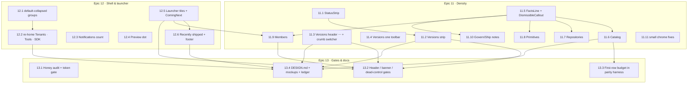

# Roadmap — HIVE-11 “Quiet pass” (round-2 look & feel proposals)

## 0. Roadmap request

> HIVE-11 Quiet pass — round-2 look & feel proposals from `docs/mockups/PROPOSALS.md`, RC6 milestone.
> Make issues to help support this change in GitHub for the RC6 milestone.

### 0.1 Source of truth

| Item | Location | Notes |
| --- | --- | --- |
| Findings, measurements, rationale | `docs/mockups/PROPOSALS.md` | 2026-10-07 review of `apiome-ui` 0.351.0 (after HIVE-10.6) |
| Mockups | `docs/mockups/proposals/{versions-status-strip,catalog-quiet,launcher-focused,rail-compact}.html` | Browser-openable; **Notes** (route, problem, keeps, states) and numbered **Callouts** in the mock bar |
| Design authority | `docs/mockups/DESIGN.md` (§14 points at the proposals until HIVE-13.4 folds them in) | Rules this roadmap amends: §2, §5.2–5.4, §8, §10, §12 |
| Parity ledger | `apiome-ui/e2e/visual/routes.ts` | The four proposals are registered as `awaiting-redesign` |
| Previous plan | `ROADMAP_APIOME_UI_VISUAL_REDESIGN.md` (private-suite) | Epics 1–10; this roadmap continues the numbering at 11 |

### 0.2 Prior art — existing GitHub issues to reconcile (do **not** duplicate)

| Issue | Title | State | Overlap | Disposition |
| --- | --- | --- | --- | --- |
| [#5272](https://github.com/apiome/apiome/issues/5272) | [HIVE-EPIC-9] Admin console | OPEN | PROPOSALS.md finding 6: `/admin/**` is still the legacy UI | **Not duplicated.** Finding 6 is Epic 9 as already planned; recommend adding #5272 and its HIVE-9.x children to RC6 alongside this roadmap. |
| [#5294](https://github.com/apiome/apiome/issues/5294) | [HIVE-3.8] Retire TopHeader, ConditionalHeader and DashboardSideNav | CLOSED | Shell | HIVE-12.x builds on the shipped `AppShell`; nothing reopened. |
| [#5291](https://github.com/apiome/apiome/issues/5291) | [HIVE-3.5] PageHeader component | CLOSED | Header | HIVE-11.3 adds slots to the shipped component; HIVE-13.2 gates it. |
| [#5337](https://github.com/apiome/apiome/issues/5337) | [HIVE-10.1] Visual-parity harness | CLOSED | Harness | HIVE-13.3 extends it with a first-row budget; HIVE-13.4 moves the proposals into `PARITY_ROUTES`. |
| Tools (`/ade/database`, `/ade/migration`) | deferred in the previous roadmap §7 | — | Finding 6 | Unchanged scope; HIVE-12.2 only gives them a user-menu entry. |

---

## 1. MVP Definition

### 1.1 What “MVP” means for the quiet pass

The review measured the problem on three surfaces that every user crosses daily — the
**Versions** page, the **Catalog** list and the **rail** — and on those the first row of data
or the last navigation group sits below a 900 px fold. The MVP is the slice that fixes those
three with the shared primitives they need, so the fix is a pattern and not a one-off.

**MVP = on a 1440 × 900 window, the first revision row (Versions), the first catalog row and
every rail group are visible without scrolling, using `StatusStrip`, `FactsLine`,
`DismissibleCallout` and default-collapsed nav groups.**

### 1.2 MVP scope (in)

| Epic | Included | Why it is load-bearing |
| --- | --- | --- |
| **11 — Density** | 11.1, 11.2, 11.3, 11.5, 11.6 | The two primitives plus the two measured-worst pages |
| **12 — Shell** | 12.1, 12.2 | The rail fits 900 px only with Workspace collapsed and two rows re-homed |
| **13 — Gates & docs** | 13.4 | The design authority and the ledger must say what the code does |

### 1.3 Post-MVP

11.4, 11.7–11.11 (the rule applied to the remaining list pages and three small chrome fixes),
12.3–12.6 (footer count, Preview dot, launcher), 13.1–13.3 (honey audit and the gates).

### 1.4 MVP exit criteria

- [ ] Versions: first revision row ≤ 700 px from the top at 1440 × 900 with the status strip open; header has ≤ 1 primary + 2 secondaries + ⋯
- [ ] Catalog: first row ≤ 360 px; explainer reachable from the header after dismissal
- [ ] Rail: no vertical scroll at 900 px tall with Workspace collapsed; Tenants and SDK settings reachable in ≤ 2 clicks
- [ ] `StatusStrip`, `FactsLine`, `DismissibleCallout` have `/design-system` specimens and the gallery test passes
- [ ] DESIGN.md §14 removed; §5.4 / §8 / §5.2 amended; proposals moved into `PARITY_ROUTES`
- [ ] Parity, a11y, copy-voice and token gates green

### 1.5 Non-goals

- Removing any fact, filter, action or state a page has today — everything folds, nothing is deleted
- Data fetching, routes, permissions (routes are unchanged throughout; two URLs gain redirects)
- The admin console and Tools redesign (Epic 9 / deferred Tools — see §0.2)
- New features beyond the “Adds” in each proposal’s Notes panel

---

## 2. Architecture of the change



### 2.1 Layer contract

```
┌───────────────────────────────────────────────────────────────┐
│ 11.1 · 11.5 · 12.5  new primitives: StatusStrip · FactsLine ·  │  ← gallery specimens first
│                     DismissibleCallout · ComingNext            │
├───────────────────────────────────────────────────────────────┤
│ 11.2–11.4 · 11.6–11.11  one issue per page, mockup-for-mockup  │  ← parallel after the primitives
├───────────────────────────────────────────────────────────────┤
│ 12.1–12.6  nav model · rail footer · launcher                  │  ← parallel with Epic 11
├───────────────────────────────────────────────────────────────┤
│ 13.1–13.4  gates · docs · ledger                               │  ← closes the loop
└───────────────────────────────────────────────────────────────┘
```

### 2.2 Conventions every page issue inherits

1. Open the proposal mockup’s **Notes** panel. Everything under **Keeps (1:1)** must still work; everything under **Callouts** must be implemented; every state under **States** must be reachable.
2. Numbers in the acceptance criteria are measured at 1440 × 900, comfortable density, `md` font scale, light theme — the same setup as `PROPOSALS.md` §1.
3. No raw hex, no hard-coded `px` type; status strings use `Badge[data-status]`; honey only per DESIGN.md §2 (as amended by HIVE-13.1).
4. Every page that changes re-dumps its fixture under `apiome-ui/e2e/fixtures/` and keeps the parity, a11y and copy-voice gates green.
5. Bump `apiome-ui/package.json` (AGENTS.md); no REST changes are expected, so no OpenAPI bump.

---

## 3. Epic summary

| Epic | Name | GitHub | Issues | MVP issues | Depends on | Theme |
| --- | --- | --- | --- | --- | --- | --- |
| 11 | List-page density — the “quiet pass” | #5594 | 11 | 5 | — | Density & attention on pages |
| 12 | Shell & launcher fit | #5595 | 6 | 2 | — | Density & attention in the chrome |
| 13 | Brand discipline, gates & design docs | #5596 | 4 | 1 | 11, 12 | Release gate |
| — | **Total** | 3 epics | **21** | **8** | | |

Milestone: **RC6** (all epics and issues).

---

## Epic 11 — List-page density — the “quiet pass” — [#5594](https://github.com/apiome/apiome/issues/5594)

**Goal:** Get the first row of data back above the fold on every list page without removing a single fact or control: status banners become a status strip, stat strips fold into a facts line, explanatory copy shows once and then lives behind a link, and every table owns exactly one toolbar.

| # | GitHub | Title | Summary | Labels | Parallel | MVP | Complexity | Affected modules |
| --- | --- | --- | --- | --- | --- | --- | --- | --- |
| 11.1 | #5597 | `StatusStrip` component — one row of status chips, one open detail | New `components/ui/StatusStrip` (chips · one detail open · severity-first · session persistence) + design-system specimen | `ui`, `design-system`, `redesign`, `mvp` | Y | Y | M | `src/app/components/ui/StatusStrip.tsx (new)`, `src/app/design-system/galleries/*`, `tests/status-strip.test.tsx (new)` |
| 11.2 | #5598 | Versions — status strip replaces the three stacked banners | Compatible · What’s new · Deprecated (· gitlike Server ahead) become one `StatusStrip`; first revision row rises ≈ 200 px | `ui`, `versions`, `redesign`, `mvp` | N | Y | M | `src/app/components/ade/versions/VersionsBanners.tsx`, `src/app/ade/dashboard/versions/*`, `e2e/fixtures/hive-versions/*`, `tests/versions-hive-redesign.test.tsx` |
| 11.3 | #5599 | Versions header — ⋯ overflow menu and breadcrumb project switcher | Six header controls → Compare · Import · ⋯ · New version; the project `<select>` becomes the last breadcrumb | `ui`, `versions`, `redesign`, `mvp` | Y | Y | M | `src/app/components/shell/PageHeader.tsx`, `src/app/ade/dashboard/versions/*`, `src/app/components/ade/versions/VersionGitlikePanels.tsx` |
| 11.4 | #5600 | Versions — one table toolbar (date popover, author menu, lifecycle, chips) | Merge the “Timeline” filter bar and the lifecycle toolbar into the table’s own toolbar; dates become an “Any time” popover | `ui`, `versions`, `redesign` | Y | N | M | `src/app/components/ade/versions/VersionsTimelineFilters.tsx`, `src/app/components/ade/versions/VersionsTable.tsx`, `src/app/components/ui/DataTable.tsx` |
| 11.5 | #5601 | `FactsLine` and `DismissibleCallout` primitives (+ `hive.seen.*` persistence) | The stat strip folded into one tabular line with “Show stats”; a first-visit callout with Got it / Learn more that persists per device | `ui`, `design-system`, `redesign`, `mvp` | Y | Y | M | `src/app/components/ui/FactsLine.tsx (new)`, `src/app/components/ui/DismissibleCallout.tsx (new)`, `src/lib/seen.ts (new)`, `src/app/design-system/galleries/*` |
| 11.6 | #5602 | Catalog — quiet list page | Explainer → first-visit callout + “How the catalog works” dialog; stat strip → facts line; one card owns toolbar, chips and table; formats list moves into the dialog and Import step 1 | `ui`, `catalog`, `redesign`, `mvp` | N | Y | M | `src/app/ade/dashboard/catalog/*`, `src/app/components/ui/catalog/*`, `e2e/fixtures/hive-catalog/*`, `tests/catalog-*.test.tsx` |
| 11.7 | #5603 | Repositories and repository detail — facts line, activity chip | Both 5-stat strips fold into facts lines; the Refresh activity panel becomes a “1 stale · 1 failed” chip that opens it | `ui`, `repository`, `redesign` | Y | N | M | `src/app/ade/dashboard/repositories/*`, `e2e/fixtures/hive-repositories/*`, `e2e/fixtures/hive-repository-detail/*` |
| 11.8 | #5604 | Primitives & types — facts line over the registry | The 5-stat strip (core · tenant · imported · bound · unresolved) becomes a facts line; unresolved `$ref` stays a danger chip linking to the resolver | `ui`, `redesign` | Y | N | S | `src/app/ade/dashboard/primitives/*`, `e2e/fixtures/hive-primitives/*` |
| 11.9 | #5605 | Members — seat facts line; Identity provider cards → “Coming next” line | Seat meter folds into “4 of 5 seats · 1 pending”; SSO/SCIM cards with dead buttons become one text line | `ui`, `redesign`, `tenancy` | Y | N | S | `src/app/ade/dashboard/members/*`, `e2e/hive-members.spec.ts` |
| 11.10 | #5606 | Style guides, Sunset timeline, Lint posture — standing notes → links; lint stat rows → facts | “Read-only for members” and “Rows include the same structured warnings…” become header links; Lint posture’s two stat rows fold into a facts line + grade chips | `ui`, `governance`, `linting`, `redesign` | Y | N | M | `src/app/ade/dashboard/style-guides/*`, `src/app/ade/dashboard/versions/sunset-timeline/*`, `src/app/ade/dashboard/lint-workspace/*`, `e2e/fixtures/hive-sunset-timeline/*` |
| 11.11 | #5607 | Small chrome fixes — Export studio header, Import wizard height, profile hero | Standard header on Export studio; Import dialog height follows content and “Next →” becomes “Continue”; profile hero gradient → subtle surface | `ui`, `redesign` | Y | N | S | `src/app/ade/dashboard/export/studio/*`, `src/app/components/ade/dashboard/ImportDialog*`, `src/app/ade/dashboard/profile/*` |

### `apiome: [HIVE-11.1] StatusStrip component — one row of status chips, one open detail` — [#5597](https://github.com/apiome/apiome/issues/5597)
**Problem statement.** Pages that have several things to say about an object (compatibility, what’s new, deprecation, a gitlike “server is ahead”) stack one full-width `Alert` per statement. On Versions that is three banners and ≈ 200 px before the first card. DESIGN.md §5.4 has no overlay-free pattern for “several statuses, one page”, so each page invents its own stack.

**Solution / scope.** Mockup: `docs/mockups/proposals/versions-status-strip.html` (callouts 3); rationale: `docs/mockups/PROPOSALS.md`.
- Add `StatusStrip` to `components/ui`: a `.status-strip` card with a row of `StatusChip`s (icon · label · muted detail) and at most one open `StatusDetail` row below it (icon · title · body · actions).
- Tones follow the status vocabulary: `ok`, `accent`, `warn`, `danger`. The most severe chip opens on first paint (danger > warn > accent > ok); clicking an open chip or **Collapse** hides the detail row.
- Persistence: which chip is open (or none) is remembered per `storageKey` for the session (`sessionStorage`), never across devices.
- A strip with one status renders that chip already open and no Collapse button; a strip with zero statuses renders nothing; a `loading` prop renders one skeleton chip.
- Accessibility: chips are `<button aria-expanded>` in a `role="group"` with `aria-label`; the detail row is `aria-live="polite"`; Escape collapses when focus is inside.
- Specimen on `/design-system` (tests/design-system-gallery.test.ts requires it) showing 1, 3 and loading states in every tone.

**Acceptance criteria.**
- [ ] Specimen renders on `/design-system` with the gallery test passing
- [ ] Exactly one `.status-strip__detail` is visible at any time; severity order is covered by a unit test
- [ ] Keyboard: Tab reaches every chip, Enter/Space toggles, Escape collapses; axe reports no serious/critical violations in light, dark and high contrast
- [ ] Session persistence covered by a test; no `localStorage` writes
- [ ] No raw hex, no `px` type; works in all nine themes and both densities

**Parallelism / dependencies.** Blocks HIVE-11.2. Independent of everything else — start here.

**Technical stack.** Next.js 16 · React 19 · TypeScript 5.9 · Tailwind CSS v4 · Radix UI / Radix Themes 3.3 · lucide-react. Tests: Jest + Testing Library, Playwright (e2e / a11y / visual parity).

---

### `apiome: [HIVE-11.2] Versions — status strip replaces the three stacked banners` — [#5598](https://github.com/apiome/apiome/issues/5598)
**Problem statement.** Measured on the shipped page at 1440 × 900: the compatibility, what’s-new and deprecation banners stack above the content and the first revision row lands ≈ 870 px down — below the fold — on every visit, including visits where nothing has changed.

**Solution / scope.** Mockup: `docs/mockups/proposals/versions-status-strip.html` (callouts 3); rationale: `docs/mockups/PROPOSALS.md`.
- Replace `VersionsBanners` with a `StatusStrip` fed by the same three data sources (compat check, head draft changelog, deprecation schedule) plus the gitlike `ServerAheadPushBanner` as a fourth `warn` chip when `FEATURE_GITLIKE` is on.
- Each detail row keeps its actions verbatim: **View report**, **Open changes**, **Sunset timeline** + **Migration guide ↗**, **Pull** + **Open merge**.
- Storage key `hive.versions.status.<projectId>`.
- Re-dump `e2e/fixtures/hive-versions/timeline.html`; update the jsdom suite and the parity landmark for the Versions page.

**Acceptance criteria.**
- [ ] With all three statuses present the strip is ≤ 110 px tall with one detail open and ≤ 48 px collapsed (comfortable density)
- [ ] First revision row at 1440 × 900 is ≤ 700 px from the top with the strip open (today ≈ 870 px)
- [ ] Every action from the old banners is reachable from the strip; copy unchanged
- [ ] Parity harness passes against `proposals/versions-status-strip.html` once promoted (HIVE-13.4); a11y gate green in the three gate themes

**Parallelism / dependencies.** Depends on HIVE-11.1. Can land in the same PR as HIVE-11.3 / HIVE-11.4 or separately.

**Technical stack.** Next.js 16 · React 19 · TypeScript 5.9 · Tailwind CSS v4 · Radix UI / Radix Themes 3.3 · lucide-react. Tests: Jest + Testing Library, Playwright (e2e / a11y / visual parity).

---

### `apiome: [HIVE-11.3] Versions header — ⋯ overflow menu and breadcrumb project switcher` — [#5599](https://github.com/apiome/apiome/issues/5599)
**Problem statement.** The Versions header carries a project `<select>`, Import, Compare, Merge branches (disabled), a honey `gitlike` flag and the primary New version — six controls against DESIGN.md §1.2 (“one primary, secondaries, overflow”) and §5.3.

**Solution / scope.** Mockup: `docs/mockups/proposals/versions-status-strip.html` (callouts 1, 2); rationale: `docs/mockups/PROPOSALS.md`.
- `PageHeader` gains an `overflow` slot that renders a ⋯ icon button opening a `DropdownMenu`; a `crumbSwitcher` slot renders the last breadcrumb as a typeahead menu button (`aria-haspopup="menu"`).
- Versions: actions become **Compare** · **Import** · **⋯** · **New version**. The ⋯ menu holds Merge branches [gitlike, disabled with reason], Sunset timeline, Published surface, Export studio, Copy link (⌘⇧C).
- The project switcher moves into the breadcrumb: search field, format pill per project, current project checked, “All projects” at the bottom. Catalog items stay excluded as today.
- The `gitlike` flag leaves the header; feature-flagged rows in the ⋯ menu carry an outline badge instead (see HIVE-13.1).

**Acceptance criteria.**
- [ ] Header renders at most one primary and two secondary buttons plus ⋯ at every viewport ≥ 1280 px (no wrapping to a second row)
- [ ] Every former header action is reachable in ≤ 2 clicks; keyboard path documented in `docs/guide/keyboard.md`
- [ ] Breadcrumb switcher is a `menu` with typeahead; arrow keys move, Enter switches, Escape closes and restores focus
- [ ] axe: zero serious/critical in the three gate themes; `hive-page-header.spec.ts` extended

**Parallelism / dependencies.** Independent. Prerequisite for the header gate in HIVE-13.2.

**Technical stack.** Next.js 16 · React 19 · TypeScript 5.9 · Tailwind CSS v4 · Radix UI / Radix Themes 3.3 · lucide-react. Tests: Jest + Testing Library, Playwright (e2e / a11y / visual parity).

---

### `apiome: [HIVE-11.4] Versions — one table toolbar (date popover, author menu, lifecycle, chips)` — [#5600](https://github.com/apiome/apiome/issues/5600)
**Problem statement.** Two filter surfaces act on one table: a “Timeline” card (search, author, from/to date inputs, Reset) and the table toolbar (lifecycle select, All/Drafts/Published chips, sort). Together they cost ≈ 130 px and split the mental model of “filter the list”.

**Solution / scope.** Mockup: `docs/mockups/proposals/versions-status-strip.html` (callouts 5); rationale: `docs/mockups/PROPOSALS.md`.
- One `.table-toolbar` inside the `DataTable`: search · lifecycle select · **Any time ▾** (popover with from/to + Last 7 days / 30 days / This quarter chips) · **All authors ▾** (menu with avatars) · state chips · sort.
- Filters keep their URL state (`useDataTableUrlState`); Reset becomes a “Clear filters (n)” chip that appears only when a filter is active.
- Delete the standalone Timeline card and its CSS.

**Acceptance criteria.**
- [ ] All previous filters work with identical URL parameters; e2e `hive-data-table.spec.ts` covers the popover and menu
- [ ] Toolbar is one row at ≥ 1280 px and wraps gracefully below
- [ ] Date popover and author menu trap focus, close on Escape and restore focus

**Parallelism / dependencies.** Independent of 11.2/11.3; coordinate on the Versions fixture re-dump.

**Technical stack.** Next.js 16 · React 19 · TypeScript 5.9 · Tailwind CSS v4 · Radix UI / Radix Themes 3.3 · lucide-react. Tests: Jest + Testing Library, Playwright (e2e / a11y / visual parity).

---

### `apiome: [HIVE-11.5] FactsLine and DismissibleCallout primitives (+ hive.seen.* persistence)` — [#5601](https://github.com/apiome/apiome/issues/5601)
**Problem statement.** Seven list pages open with a 4–6 tile `Stat` strip (≈ 125 px) and several with a standing explanatory `Alert` (≈ 75 px) that teaches once and costs forever. There is no primitive for “the same numbers, in one line” or for “show this once, keep it one click away”.

**Solution / scope.** Mockup: `docs/mockups/proposals/catalog-quiet.html` (callouts 2, 4); rationale: `docs/mockups/PROPOSALS.md`.
- `FactsLine`: a `.facts` row of `<b>n</b> label` segments separated by dots, optional inline `FormatPill`s, `font-variant-numeric: tabular-nums`, and a trailing ghost **Show stats / Hide stats** toggle that reveals the page’s existing `StatGrid` in place. Expanded state persists per page in `localStorage` (`hive.<page>.stats`).
- `DismissibleCallout`: tone `accent` by default, icon · body · **Learn more** (optional handler) · **Got it**. Dismissal persists under `hive.seen.<id>` via `lib/seen.ts` (read-through safe when storage is blocked). A `reopenFrom` prop documents where the content lives afterwards (used by the copy-voice gate).
- Specimens on `/design-system`; unit tests for persistence and for the empty (“0 items”) facts line.

**Acceptance criteria.**
- [ ] Both components have gallery specimens and the gallery test passes
- [ ] `FactsLine` renders ≤ 32 px tall in comfortable density and wraps without horizontal scroll at 1280 px with eight segments
- [ ] Dismissal survives reload; a cleared storage shows the callout again; storage failures never throw
- [ ] axe clean in the three gate themes; the toggle has `aria-expanded` + `aria-controls`

**Parallelism / dependencies.** Blocks HIVE-11.6 → 11.10 and the Members change in 11.9. Independent of Epic 11’s Versions issues.

**Technical stack.** Next.js 16 · React 19 · TypeScript 5.9 · Tailwind CSS v4 · Radix UI / Radix Themes 3.3 · lucide-react. Tests: Jest + Testing Library, Playwright (e2e / a11y / visual parity).

---

### `apiome: [HIVE-11.6] Catalog — quiet list page` — [#5602](https://github.com/apiome/apiome/issues/5602)
**Problem statement.** Measured at 1440 × 900: the “Catalog items are non-publishable” banner, the Supported import formats row, the 4-stat strip and two toolbar rows precede the list, so the first catalog row is ≈ 600 px down on every visit (Published, the baseline, is ≈ 236 px).

**Solution / scope.** Mockup: `docs/mockups/proposals/catalog-quiet.html` (callouts 1–4); rationale: `docs/mockups/PROPOSALS.md`.
- Page description gains a ghost link **How the catalog works** (`circle-help` icon) opening a dialog with the explainer’s three points and the supported-formats list (pills + “+n more” + link to `docs/guide/supported-formats.md`).
- First visit: `DismissibleCallout id="catalog-explainer"` with the same copy, **Learn more** opens the dialog.
- `FactsLine`: items · formats (pills) · avg quality · converted · deleted/disabled; **Show stats** reveals the unchanged `StatGrid`.
- The Supported import formats card is removed from the page; the Import wizard’s step 1 gains a “Which formats can I import?” link to the same dialog.
- One `DataTable` card contains the filter row, the view chips + sort row, the Cards/Table switch and the table/grid.
- Re-dump `e2e/fixtures/hive-catalog/*`; update the jsdom suite and parity landmarks.

**Acceptance criteria.**
- [ ] First catalog row at 1440 × 900 is ≤ 360 px from the top (today ≈ 600 px); empty state still renders inside the card
- [ ] Every fact from the stat strip is present in the facts line; the strip expands in place and remembers the choice
- [ ] The explainer copy is reachable after dismissal via the header link and from Import step 1
- [ ] Cards view, protocol grouping, URL filters, Show deleted, bulk actions and inspectors unchanged (jsdom suite green)
- [ ] Copy-voice gate (`tests/copy-voice-gate.test.ts`) and a11y gate green

**Parallelism / dependencies.** Depends on HIVE-11.5. First page to apply the rule; 11.7–11.10 copy it.

**Technical stack.** Next.js 16 · React 19 · TypeScript 5.9 · Tailwind CSS v4 · Radix UI / Radix Themes 3.3 · lucide-react. Tests: Jest + Testing Library, Playwright (e2e / a11y / visual parity).

---

### `apiome: [HIVE-11.7] Repositories and repository detail — facts line, activity chip` — [#5603](https://github.com/apiome/apiome/issues/5603)
**Problem statement.** Repositories opens with a 5-stat strip and a Refresh activity panel (≈ 240 px) before its toolbar; repository detail opens with a 5-stat strip, a branch bar, a four-field filter form and a selection bar before the file table (first row ≈ 650 px).

**Solution / scope.** Mockup: `docs/mockups/proposals/catalog-quiet.html` (callouts 2, 3); rationale: `docs/mockups/PROPOSALS.md`.
- Repositories: `FactsLine` (repositories · files indexed · imports 30d · last scan · needs attention) + **Show stats**; Refresh activity collapses to a `warn` chip in the facts line (“1 stale · 1 failed”) that opens the panel as a `Drawer`.
- Repository detail: `FactsLine` under the title (files · importable · branches · imports · last scan); the filter form collapses behind a **Filters (n)** button in the table toolbar, with the preset select left inline.
- Re-dump both fixtures; parity landmarks updated.

**Acceptance criteria.**
- [ ] First repository row ≤ 360 px and first file row ≤ 420 px at 1440 × 900
- [ ] All stats and the activity panel content are reachable; chip count equals stale + failed
- [ ] Filters keep URL state; jsdom and e2e suites green

**Parallelism / dependencies.** Depends on HIVE-11.5. Parallel with 11.6/11.8–11.10.

**Technical stack.** Next.js 16 · React 19 · TypeScript 5.9 · Tailwind CSS v4 · Radix UI / Radix Themes 3.3 · lucide-react. Tests: Jest + Testing Library, Playwright (e2e / a11y / visual parity).

---

### `apiome: [HIVE-11.8] Primitives & types — facts line over the registry` — [#5604](https://github.com/apiome/apiome/issues/5604)
**Problem statement.** The registry tab opens with a five-tile strip; the types table starts ≈ 815 px down behind the collections card and two asides.

**Solution / scope.** Mockup: `docs/mockups/proposals/catalog-quiet.html` (callouts 2); rationale: `docs/mockups/PROPOSALS.md`.
- `FactsLine` with the same five numbers; the unresolved-`$ref` count renders as a `danger` chip that opens the Resolver tab.
- The “Relative $ref resolution” aside becomes a **How resolution works** ghost link + dialog (same copy); “Recent activity” stays.
- Re-dump fixtures; parity landmarks updated.

**Acceptance criteria.**
- [ ] Types table first row ≤ 560 px at 1440 × 900
- [ ] All five numbers present; chip opens the Resolver tab
- [ ] Suites green

**Parallelism / dependencies.** Depends on HIVE-11.5.

**Technical stack.** Next.js 16 · React 19 · TypeScript 5.9 · Tailwind CSS v4 · Radix UI / Radix Themes 3.3 · lucide-react. Tests: Jest + Testing Library, Playwright (e2e / a11y / visual parity).

---

### `apiome: [HIVE-11.9] Members — seat facts line; Identity provider cards → “Coming next” line` — [#5605](https://github.com/apiome/apiome/issues/5605)
**Problem statement.** Members opens with a seat-meter card above the table and closes with two “Coming soon” cards whose **Configure SSO** / **Enable SCIM** buttons do nothing — a §10 violation and a trust problem.

**Solution / scope.** Mockup: `docs/mockups/proposals/launcher-focused.html` (callouts 3); rationale: `docs/mockups/PROPOSALS.md`.
- `FactsLine`: members · active · pending · suspended · seats used (with a thin `Progress` when ≥ 80 %); the meter card is removed.
- Identity provider section becomes a single `ComingNext` line (shared with the launcher, HIVE-12.5): “Coming next: SSO (OIDC/SAML) · SCIM 2.0 provisioning — follow in What’s new”. No buttons.

**Acceptance criteria.**
- [ ] First member row ≤ 300 px at 1440 × 900
- [ ] No disabled or no-op buttons on the page (copy-voice gate extended, HIVE-13.2)
- [ ] Seat numbers identical to today’s meter

**Parallelism / dependencies.** Depends on HIVE-11.5 and the `ComingNext` component from HIVE-12.5 (or inline it and refactor).

**Technical stack.** Next.js 16 · React 19 · TypeScript 5.9 · Tailwind CSS v4 · Radix UI / Radix Themes 3.3 · lucide-react. Tests: Jest + Testing Library, Playwright (e2e / a11y / visual parity).

---

### `apiome: [HIVE-11.10] Style guides, Sunset timeline, Lint posture — standing notes → links; lint stat rows → facts` — [#5606](https://github.com/apiome/apiome/issues/5606)
**Problem statement.** Three Govern/Ship pages carry a standing note between header and content. Lint posture additionally opens with four stat tiles plus a grades/axes card (≈ 240 px) before its saved views and filters.

**Solution / scope.** Mockup: `docs/mockups/proposals/catalog-quiet.html` (callouts 1, 2); rationale: `docs/mockups/PROPOSALS.md`.
- Style guides: the read-only note becomes a `DismissibleCallout` on first visit and a lock icon + tooltip beside the title afterwards.
- Sunset timeline: the warning note becomes a ghost link “Where these warnings come from” → dialog.
- Lint posture: `FactsLine` (unwaived security errors · missing coverage · new findings · waivers) with the grade distribution as A/B/C/D/F chips inline; **Show stats** reveals the current cards.

**Acceptance criteria.**
- [ ] Each page’s first data row rises by ≥ 60 px at 1440 × 900 (measured in HIVE-13.3)
- [ ] No information removed; dialogs/tooltips carry the exact former copy
- [ ] Suites and gates green

**Parallelism / dependencies.** Depends on HIVE-11.5.

**Technical stack.** Next.js 16 · React 19 · TypeScript 5.9 · Tailwind CSS v4 · Radix UI / Radix Themes 3.3 · lucide-react. Tests: Jest + Testing Library, Playwright (e2e / a11y / visual parity).

---

### `apiome: [HIVE-11.11] Small chrome fixes — Export studio header, Import wizard height, profile hero` — [#5607](https://github.com/apiome/apiome/issues/5607)
**Problem statement.** Three small departures from DESIGN.md: Export studio draws its icon tile above the title and a breadcrumb that reads “Ship › Back to Versions”; the Import wizard is a fixed-height dialog that leaves ≈ 450 px empty under eight source tiles and uses a “Next →” glyph; the profile hero is the only gradient surface in the app.

**Solution / scope.** Mockup: `docs/mockups/proposals/catalog-quiet.html` (callouts —); rationale: `docs/mockups/PROPOSALS.md`.
- Export studio: crumbs `Acme Corp › Ship › Export studio`, icon in the title row, “Back to Versions” as a ghost button in the actions slot.
- Import wizard: `Dialog size="lg"` with `min-height` reserved for the stepper only; primary reads **Continue** (§8 Wizard); when recent imports exist, step 1 lists the last three under the source tiles.
- Profile: hero band uses `--bg-subtle` with the hex avatar; no gradient.

**Acceptance criteria.**
- [ ] Export studio header passes the header gate (HIVE-13.2)
- [ ] Import step 1 has no empty region taller than 120 px at 1440 × 900
- [ ] Profile hero has no gradient; visual parity for profile unchanged otherwise

**Parallelism / dependencies.** Independent.

**Technical stack.** Next.js 16 · React 19 · TypeScript 5.9 · Tailwind CSS v4 · Radix UI / Radix Themes 3.3 · lucide-react. Tests: Jest + Testing Library, Playwright (e2e / a11y / visual parity).

---

---

## Epic 12 — Shell & launcher fit — [#5595](https://github.com/apiome/apiome/issues/5595)

**Goal:** Make the rail fit a 900 px window and the launcher show only what can be opened: default-collapsed groups with counts, three destinations re-homed, a Notifications count, and “coming soon” reduced to one line.

| # | GitHub | Title | Summary | Labels | Parallel | MVP | Complexity | Affected modules |
| --- | --- | --- | --- | --- | --- | --- | --- | --- |
| 12.1 | #5608 | Nav model — default-collapsed groups with counts | `lib/platform-nav.ts` groups gain `defaultCollapsed`; Workspace starts collapsed; collapsed labels show their item count | `ui`, `redesign`, `mvp` | Y | Y | S | `lib/platform-nav.ts`, `src/app/components/shell/RailNav.tsx`, `src/app/components/shell/navGroupCollapse.ts`, `e2e/fixtures/hive-a11y/shell.html` |
| 12.2 | #5609 | Re-home Tenants, Data browser · Migrations and SDK settings | Tenants → workspace switcher menu (“Manage workspaces…”); Tools → user menu; SDK settings → Export studio tab | `ui`, `redesign`, `mvp` | N | Y | M | `lib/platform-nav.ts`, `src/app/components/shell/WorkspaceSwitcher.tsx`, `src/app/components/shell/UserMenu.tsx`, `src/app/ade/dashboard/export/studio/*`, `src/app/ade/dashboard/sdk-settings/*` |
| 12.3 | #5610 | Rail footer — Notifications count and order | Notifications leads the footer and shows an unread count (dot in the icon rail) | `ui`, `redesign` | Y | N | S | `src/app/components/shell/RailFooter.tsx`, `src/app/components/shell/NotificationsMenu.tsx` |
| 12.4 | #5611 | “Preview” rail pill → honey dot | The always-on honey pill on Lint posture becomes a 6 px dot with the word in the tooltip | `ui`, `redesign` | Y | N | S | `lib/platform-nav.ts`, `src/app/components/shell/RailNav.tsx` |
| 12.5 | #5612 | Launcher — only openable tiles; `ComingNext` line | Applications shows Control Panel (emphasised), Browser and host-injected tiles; three “coming soon” surfaces collapse into one `ComingNext` text line | `ui`, `dashboard`, `redesign` | Y | N | M | `src/app/components/ade/AdeHome.tsx`, `src/app/components/ade/launcher/*`, `src/app/components/ui/ComingNext.tsx (new)`, `e2e/fixtures/hive-a11y/launcher.html` |
| 12.6 | #5613 | Launcher — “Recently shipped” from What’s new; build string to the footer | The stale “On the roadmap” card becomes the three latest What’s new entries; the version badge leaves the top row | `ui`, `dashboard`, `redesign` | N | N | S | `src/app/components/ade/AdeHome.tsx`, `src/app/components/shell/whatsNewSeen.ts`, `src/app/components/ade/launcher/ResourceRow.tsx` |

### `apiome: [HIVE-12.1] Nav model — default-collapsed groups with counts` — [#5608](https://github.com/apiome/apiome/issues/5608)
**Problem statement.** The expanded rail carries 17 destinations in 5 groups plus a 4-row footer: ≈ 1 030 px of content measured on the shipped shell. At 900 px tall (a 1440 × 900 laptop, or 1536 × 864 at 125 %) the nav scrolls behind a hidden scrollbar and the Workspace group is below the fold.

**Solution / scope.** Mockup: `docs/mockups/proposals/rail-compact.html` (callouts 1); rationale: `docs/mockups/PROPOSALS.md`.
- `PlatformNavGroup.defaultCollapsed?: boolean`; `readCollapsedNavGroups()` seeds from the model on first run and keeps the reader’s choice afterwards (same `hive.navCollapsed` key).
- Workspace is `defaultCollapsed: true`; Build / Bring in / Ship / Govern stay open.
- `RailNav` renders a mono count on a collapsed group label (hidden in the icon rail); the chevron keeps its rotation; `aria-expanded` reflects state.
- Re-dump the shell fixture; update `hive-one-chrome.spec.ts`.

**Acceptance criteria.**
- [ ] Fresh profile: Workspace collapsed with “3”; existing profiles keep their stored choice
- [ ] Rail content ≤ 900 px tall with Workspace collapsed (comfortable, md) — measured in e2e
- [ ] axe clean; keyboard toggling unchanged

**Parallelism / dependencies.** Independent; lands before HIVE-12.2 for a clean diff.

**Technical stack.** Next.js 16 · React 19 · TypeScript 5.9 · Tailwind CSS v4 · Radix UI / Radix Themes 3.3 · lucide-react. Tests: Jest + Testing Library, Playwright (e2e / a11y / visual parity).

---

### `apiome: [HIVE-12.2] Re-home Tenants, Data browser · Migrations and SDK settings` — [#5609](https://github.com/apiome/apiome/issues/5609)
**Problem statement.** Two rail rows duplicate destinations that already have a natural home (Tenants beside the switcher that switches them; SDK settings beside Export studio, which configures how a version leaves the system), and the Tools pages have no navigation entry at all since the Tools group was deferred.

**Solution / scope.** Mockup: `docs/mockups/proposals/rail-compact.html` (callouts 2, 3, 4); rationale: `docs/mockups/PROPOSALS.md`.
- Workspace switcher menu gains a separator + **Manage workspaces…** → `/ade/dashboard/tenants`; the `tenants` nav item is removed from the model (route unchanged, palette entry kept).
- User menu gains **Data browser** and **Migrations** rows under Admin console (gated as the routes are).
- Export studio gains an **SDK & branding** tab that mounts the existing SDK settings page; `/ade/dashboard/sdk-settings` redirects to it; the `sdk-settings` nav item is removed.
- Command palette “Jump to” keeps all three destinations.

**Acceptance criteria.**
- [ ] Rail has 15 items; every removed destination reachable in ≤ 2 clicks and via ⌘K
- [ ] Old URLs still resolve (redirect covered by a test)
- [ ] Shell fixture re-dumped; parity + a11y gates green

**Parallelism / dependencies.** Depends on HIVE-12.1.

**Technical stack.** Next.js 16 · React 19 · TypeScript 5.9 · Tailwind CSS v4 · Radix UI / Radix Themes 3.3 · lucide-react. Tests: Jest + Testing Library, Playwright (e2e / a11y / visual parity).

---

### `apiome: [HIVE-12.3] Rail footer — Notifications count and order` — [#5610](https://github.com/apiome/apiome/issues/5610)
**Problem statement.** The footer shows a bell with no count, so unread notifications are invisible until the menu is opened.

**Solution / scope.** Mockup: `docs/mockups/proposals/rail-compact.html` (callouts 5); rationale: `docs/mockups/PROPOSALS.md`.
- Footer order: Notifications (accent count pill, `aria-label="n unread"`) · Help & docs · Preferences · user.
- Icon rail: a 6 px dot on the bell; tooltip carries the count.
- Count comes from the existing notification center query; capped at “99+”.

**Acceptance criteria.**
- [ ] Count matches the notification center; updates live
- [ ] Collapsed rail shows the dot; axe clean

**Parallelism / dependencies.** Independent.

**Technical stack.** Next.js 16 · React 19 · TypeScript 5.9 · Tailwind CSS v4 · Radix UI / Radix Themes 3.3 · lucide-react. Tests: Jest + Testing Library, Playwright (e2e / a11y / visual parity).

---

### `apiome: [HIVE-12.4] “Preview” rail pill → honey dot` — [#5611](https://github.com/apiome/apiome/issues/5611)
**Problem statement.** DESIGN.md §2 reserves honey for brand moments; the rail’s “Preview” pill is the loudest object on every page, in every theme.

**Solution / scope.** Mockup: `docs/mockups/proposals/rail-compact.html` (callouts 6); rationale: `docs/mockups/PROPOSALS.md`.
- `PlatformNavItem.pill` renders as `.dot` (honey) after the label with `title="Preview"` and `aria-label` on the link; the pill style stays available for the command palette’s result rows.

**Acceptance criteria.**
- [ ] No `.badge--honey` in the rail; screen reader announces “Lint posture, preview”
- [ ] Contrast test and visual parity green

**Parallelism / dependencies.** Independent.

**Technical stack.** Next.js 16 · React 19 · TypeScript 5.9 · Tailwind CSS v4 · Radix UI / Radix Themes 3.3 · lucide-react. Tests: Jest + Testing Library, Playwright (e2e / a11y / visual parity).

---

### `apiome: [HIVE-12.5] Launcher — only openable tiles; ComingNext line` — [#5612](https://github.com/apiome/apiome/issues/5612)
**Problem statement.** Of eight tiles and rows on the launcher, four cannot be opened (“Developer Suite — coming soon”, “Community — soon”, “Marketplace — soon”, “Audit — Planned”). Disabled cards with hover affordances invite clicks that do nothing.

**Solution / scope.** Mockup: `docs/mockups/proposals/launcher-focused.html` (callouts 2, 3); rationale: `docs/mockups/PROPOSALS.md`.
- `ComingNext` primitive (`components/ui`): icon · “Coming next:” · outline tags · **Follow in What’s new** link. No buttons, no disabled controls. Gallery specimen.
- Launcher Applications grid becomes 3-up: Control Panel (`app-card--primary`, “last opened 2 h ago” from recents), commercial host-injected tile(s), Browser. Developer Suite / Community / Marketplace become tags on the `ComingNext` line.
- Hero: drop the eyebrow pill and the filler paragraph; keep greeting, title and the summary chips, adding “n need attention” when lint findings exist.

**Acceptance criteria.**
- [ ] No `aria-disabled` cards or rows on `/ade`
- [ ] Keyboard order: tiles → Coming next link → Resources
- [ ] Launcher fixture re-dumped; a11y gate green

**Parallelism / dependencies.** Independent; HIVE-11.9 reuses `ComingNext`.

**Technical stack.** Next.js 16 · React 19 · TypeScript 5.9 · Tailwind CSS v4 · Radix UI / Radix Themes 3.3 · lucide-react. Tests: Jest + Testing Library, Playwright (e2e / a11y / visual parity).

---

### `apiome: [HIVE-12.6] Launcher — “Recently shipped” from What’s new; build string to the footer` — [#5613](https://github.com/apiome/apiome/issues/5613)
**Problem statement.** “On the roadmap: Audit — Planned” is hand-written and stale (Access audit shipped and sits in the rail). The “v0.346.0 RC” badge beside the brand is the placement DESIGN.md §5.1 retired.

**Solution / scope.** Mockup: `docs/mockups/proposals/launcher-focused.html` (callouts 1, 4, 5); rationale: `docs/mockups/PROPOSALS.md`.
- `RecentlyShipped` card: the three newest entries from the What’s new source (title, one line, version), **All release notes** opens the dialog. Omitted when the source is empty (Resources spans the row).
- Top row: brand · What’s new icon with honey unread dot · Preferences · account · Sign out. Footer: `vX.Y.Z RC · build …` as a button that opens What’s new, with the unread dot.
- Resources rows: Help & docs, Video walkthroughs, Keyboard shortcuts (opens the sheet).

**Acceptance criteria.**
- [ ] No hand-written roadmap copy remains in `AdeHome`
- [ ] Unread dot clears when What’s new is opened (existing `whatsNewSeen`)
- [ ] Launcher fixture re-dumped; copy-voice and a11y gates green

**Parallelism / dependencies.** Depends on HIVE-12.5.

**Technical stack.** Next.js 16 · React 19 · TypeScript 5.9 · Tailwind CSS v4 · Radix UI / Radix Themes 3.3 · lucide-react. Tests: Jest + Testing Library, Playwright (e2e / a11y / visual parity).

---

---

## Epic 13 — Brand discipline, gates & design docs — [#5596](https://github.com/apiome/apiome/issues/5596)

**Goal:** Turn the review’s rules into tests so the quiet pass cannot regress: honey only in brand moments, a header action cap, no stacked banners, a measured first-row-of-data budget — and fold the proposals back into DESIGN.md and the mockup set.

| # | GitHub | Title | Summary | Labels | Parallel | MVP | Complexity | Affected modules |
| --- | --- | --- | --- | --- | --- | --- | --- | --- |
| 13.1 | #5614 | Honey audit — saved-search chip, gitlike flags, token gate | MCP saved searches use `.chip`; feature-flag markers are outline badges; `hive-design-tokens.test.ts` fails on honey outside the allow-list | `ui`, `design-system`, `testing`, `mcp` | Y | N | S | `src/app/ade/dashboard/mcp/*`, `src/app/components/ade/versions/GitlikeFlag.tsx`, `tests/hive-design-tokens.test.ts` |
| 13.2 | #5615 | Gates — header action cap, single banner, no dead controls | Jest/Playwright rules: ≤ 1 primary + 2 secondaries + ⋯ per `PageHeader`; at most one `Alert` between header and body; no disabled buttons that lead nowhere | `testing`, `ui`, `design-system` | N | N | M | `tests/page-header-gate.test.tsx (new)`, `tests/copy-voice-gate.test.ts`, `e2e/hive-page-header.spec.ts`, `docs/guide/content-voice.md` |
| 13.3 | #5616 | Parity harness — first-row-of-data budget per list page | The visual-parity harness measures the y-offset of the first data row at 1440 × 900 and fails above a per-page budget | `testing`, `ui` | N | N | M | `e2e/visual/landmarks.ts`, `e2e/visual/score.ts`, `e2e/visual/routes.ts`, `e2e/visual/README.md` |
| 13.4 | #5617 | DESIGN.md amendments, mockup promotion and fixture re-dump | Fold PROPOSALS.md into DESIGN.md §2 · §5 · §8 · §10 · §12; replace the superseded parts of the original mockups; move the four proposals into `PARITY_ROUTES` | `documentation`, `design-system`, `mvp` | N | Y | S | `docs/mockups/DESIGN.md`, `docs/mockups/PROPOSALS.md`, `docs/mockups/build/versions.html`, `docs/mockups/sources/catalog.html`, `docs/mockups/home/launcher.html`, `docs/mockups/foundations/shell.html`, `apiome-ui/e2e/visual/routes.ts` |

### `apiome: [HIVE-13.1] Honey audit — saved-search chip, gitlike flags, token gate` — [#5614](https://github.com/apiome/apiome/issues/5614)
**Problem statement.** Honey has leaked into non-brand roles: a honey-filled “Public A/B servers” saved-search chip on MCP servers, the always-on `gitlike` honey flag in the Versions header and tabs. DESIGN.md §2 limits honey to the mark, new/starred/preview markers, the first-run checklist, empty-state art and the theme grid.

**Solution / scope.** Mockup: `docs/mockups/proposals/rail-compact.html` (callouts 6); rationale: `docs/mockups/PROPOSALS.md`.
- MCP saved searches render as `.chip` (active = ink); honey is not a selection colour.
- `GitlikeFlag` renders `Badge variant="outline"` with a flag icon, and only when `FEATURE_GITLIKE` is on.
- `tests/hive-design-tokens.test.ts` gains a rule: `--honey*` / `bg-honey*` / `text-honey*` may appear only in an allow-list of files (BrandMark, EmptyState art, Preferences theme grid, `Badge[data-status=new|starred|pinned|preview]`, the first-run checklist).

**Acceptance criteria.**
- [ ] Token test fails on a new honey usage outside the allow-list (negative test included)
- [ ] No honey chip on MCP servers; no honey flag in Versions
- [ ] Contrast gate green

**Parallelism / dependencies.** Independent; coordinate with HIVE-11.3 on the Versions header.

**Technical stack.** Next.js 16 · React 19 · TypeScript 5.9 · Tailwind CSS v4 · Radix UI / Radix Themes 3.3 · lucide-react. Tests: Jest + Testing Library, Playwright (e2e / a11y / visual parity).

---

### `apiome: [HIVE-13.2] Gates — header action cap, single banner, no dead controls` — [#5615](https://github.com/apiome/apiome/issues/5615)
**Problem statement.** DESIGN.md §1.2 and §5.3 state the one-primary rule and §10 the voice rules, but nothing enforces action count, banner stacking or no-op controls, which is how Versions reached six header controls and three banners.

**Solution / scope.** Mockup: `docs/mockups/proposals/versions-status-strip.html` (callouts 2); rationale: `docs/mockups/PROPOSALS.md`.
- `page-header-gate.test.tsx`: every route’s `PageHeader` renders ≤ 1 `Button variant="primary"`, ≤ 2 other buttons, and an optional overflow; a `<select>` in the actions slot fails.
- Banner rule: at most one `Alert`/banner directly under the header; several statuses must use `StatusStrip`.
- Copy-voice gate extension: a disabled button must carry a reason (`title` or `aria-describedby`); “Coming soon” text may not be inside a `button`.
- Document the rules in `docs/guide/content-voice.md` and DESIGN.md (HIVE-13.4).

**Acceptance criteria.**
- [ ] Gates fail on the pre-11.3 Versions header and pre-11.2 banner stack (fixtures kept as negative cases)
- [ ] All routes green after Epics 11–12 land
- [ ] CI wiring documented in the workflow

**Parallelism / dependencies.** Depends on HIVE-11.2, 11.3, 11.9, 12.5 landing (or the gate is introduced with allow-listed exceptions that are removed as they land).

**Technical stack.** Next.js 16 · React 19 · TypeScript 5.9 · Tailwind CSS v4 · Radix UI / Radix Themes 3.3 · lucide-react. Tests: Jest + Testing Library, Playwright (e2e / a11y / visual parity).

---

### `apiome: [HIVE-13.3] Parity harness — first-row-of-data budget per list page` — [#5616](https://github.com/apiome/apiome/issues/5616)
**Problem statement.** The review had to measure first-row offsets by hand (Published 236 px, Catalog 600, Repositories 600, Versions 870). Without a measured budget the quiet pass regresses the first time a new strip or banner is added.

**Solution / scope.** Mockup: `docs/mockups/proposals/catalog-quiet.html` (callouts —); rationale: `docs/mockups/PROPOSALS.md`.
- Each `PARITY_ROUTES` entry may declare `firstRow: { selector, budgetPx }`; the harness mounts the fixture at 1440 × 900 (comfortable, md) and records the selector’s top.
- Budgets from the proposals: list pages ≤ 360 px, detail pages ≤ 560 px, Versions ≤ 700 px; Home and Analytics exempt.
- Report the measurement in the parity report next to the parity score.

**Acceptance criteria.**
- [ ] Harness fails on the pre-quiet-pass Catalog fixture and passes on the post-11.6 one
- [ ] Numbers appear in `visual-parity-report`
- [ ] README documents how to set a budget

**Parallelism / dependencies.** Depends on HIVE-11.6 for the first green run; can be written in parallel with allow-listed budgets.

**Technical stack.** Next.js 16 · React 19 · TypeScript 5.9 · Tailwind CSS v4 · Radix UI / Radix Themes 3.3 · lucide-react. Tests: Jest + Testing Library, Playwright (e2e / a11y / visual parity).

---

### `apiome: [HIVE-13.4] DESIGN.md amendments, mockup promotion and fixture re-dump` — [#5617](https://github.com/apiome/apiome/issues/5617)
**Problem statement.** DESIGN.md §14 marks the proposals as “proposed, not yet adopted” and the parity ledger lists them as `awaiting-redesign`. Once the pages ship, the design authority and the mockup set must say the same thing as the code.

**Solution / scope.** Mockup: `docs/mockups/proposals/*.html` (callouts —); rationale: `docs/mockups/PROPOSALS.md`.
- DESIGN.md: §2 honey rule; §5.2 default-collapsed groups and footer order; §5.3 header action cap and breadcrumb switcher; §5.4 status strip; §8 list-page anatomy (facts line, dismissible explainer, one card); §10 “coming soon” rule; §12 adds P8 — Quiet pass; §14 removed.
- Mockups: update `build/versions.html`, `sources/catalog.html`, `home/launcher.html`, `foundations/shell.html` to the adopted state; keep `proposals/` as the record of the change with a “adopted in HIVE-11.x” note.
- Parity ledger: move the four proposals (or the updated originals) into `PARITY_ROUTES` with their re-dumped fixtures; drop the `awaiting-redesign` rows.
- README page → route table and index updated.

**Acceptance criteria.**
- [ ] `tests/visual-parity-routes.test.ts` and `tests/a11y-routes.test.ts` green with no proposal rows under `awaiting-redesign`
- [ ] DESIGN.md has no “proposed” language left for adopted rules
- [ ] Mockup sweep (console, overflow, icons, links, notes) green on every touched page

**Parallelism / dependencies.** Last. Requires HIVE-11.2, 11.3, 11.6, 12.1, 12.2, 12.5, 12.6.

**Technical stack.** Next.js 16 · React 19 · TypeScript 5.9 · Tailwind CSS v4 · Radix UI / Radix Themes 3.3 · lucide-react. Tests: Jest + Testing Library, Playwright (e2e / a11y / visual parity).

---

## 4. Work to be done, in order

| Step | Issues | Why this order |
| --- | --- | --- |
| 1 | 11.1, 11.5, 12.1, 12.5 (`ComingNext`) | Primitives and the nav-model flag — everything else composes them; all four are parallel |
| 2 | 11.2, 11.3, 11.4 | Versions, the worst-measured page; can ship as one PR or three |
| 3 | 11.6 | Catalog, the reference list page for the rule |
| 4 | 12.2, 12.3, 12.4 | Rail fits 900 px; footer count; Preview dot |
| 5 | 11.7, 11.8, 11.9, 11.10, 11.11, 12.6 | The rule applied to the remaining pages; the launcher’s second half — all parallel |
| 6 | 13.1, 13.2, 13.3 | Gates, introduced with allow-listed exceptions that empty as steps 2–5 land |
| 7 | 13.4 | DESIGN.md, mockups and the ledger catch up with the code — last |

```
step 1  11.1 ─┐   11.5 ─┐   12.1 ─┐   12.5 ─┐
              ▼         ▼         ▼         ▼
step 2  11.2 11.3 11.4  │         │         │
step 3                 11.6       │         │
step 4                           12.2 12.3 12.4
step 5  11.7 11.8 11.9 11.10 11.11                12.6
step 6  13.1 13.2 13.3   (allow-lists shrink as 2–5 land)
step 7  13.4
```

## 5. Cross-cutting definition of done

- [ ] No raw hex outside the allow-list (brand, `.fmt--*`, `.method--*`); honey only per §2
- [ ] No hard-coded `px` font sizes or control heights
- [ ] Works in all nine themes, both densities and all six font scales
- [ ] No horizontal document scroll at ≥ 1280 px
- [ ] axe: zero serious/critical violations in light, dark and high contrast
- [ ] Focus visible, trapped in overlays, restored on close
- [ ] The proposal mockup’s **Notes → Keeps (1:1)** list still works in full
- [ ] Fixture re-dumped; parity, a11y, copy-voice and token gates green
- [ ] `apiome-ui/package.json` bumped

