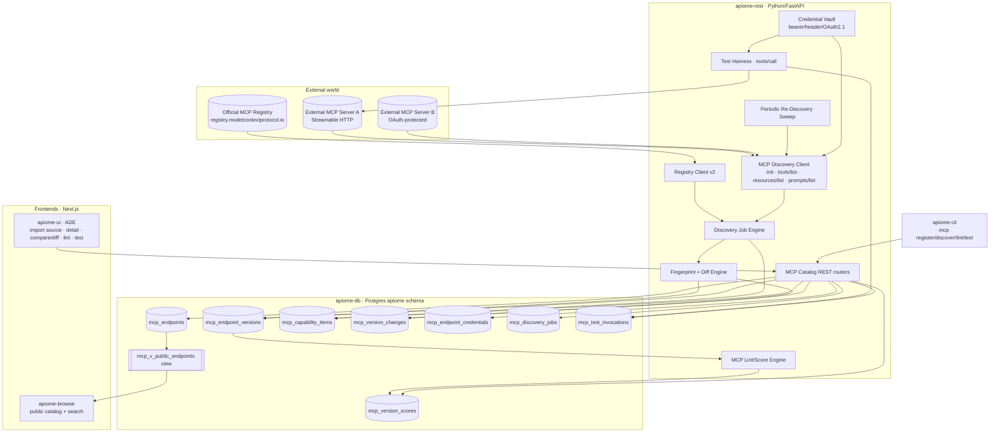
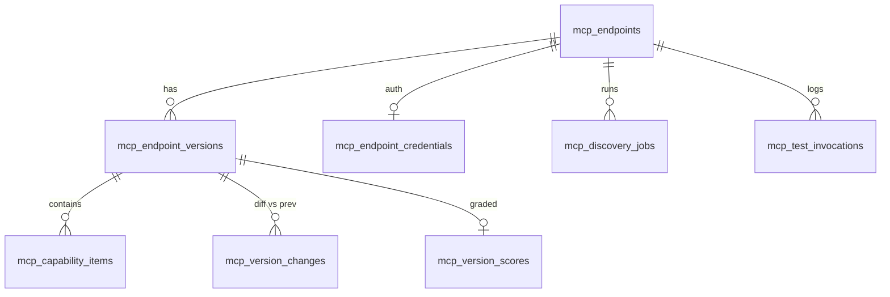
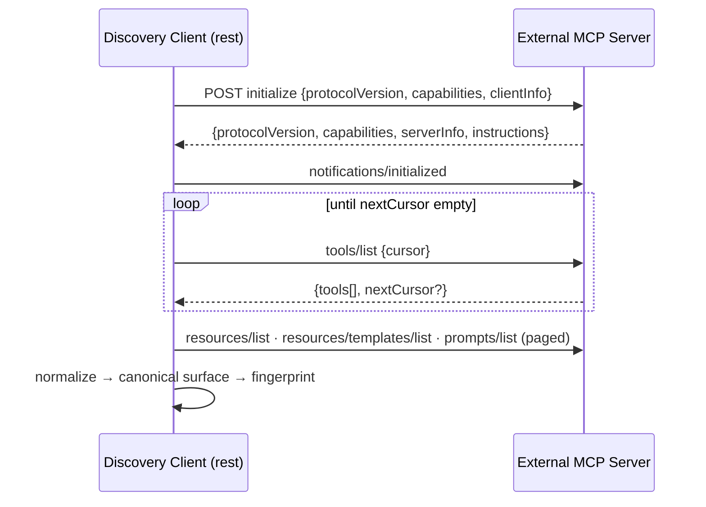
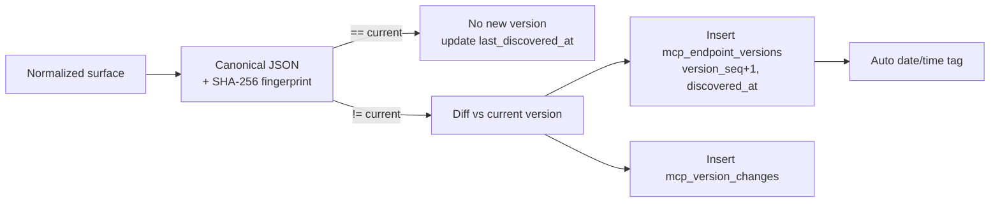
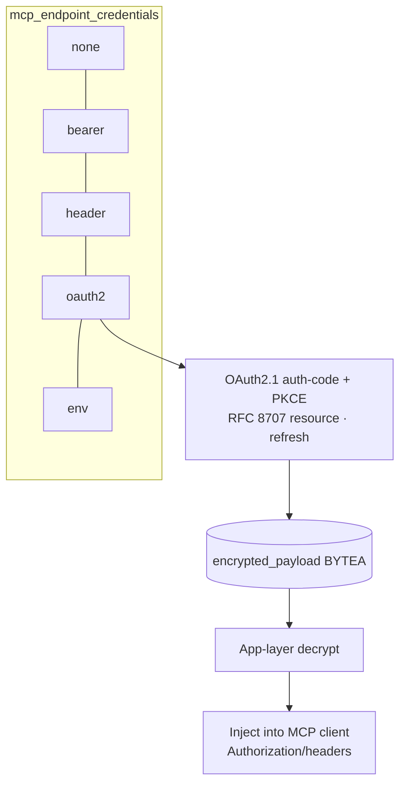
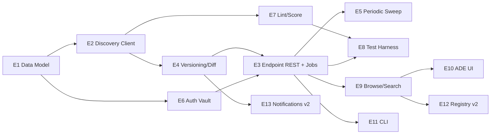
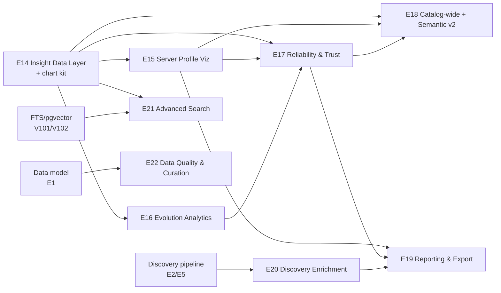

# Roadmap — MCP Cataloging, Versioning, Scoring & Browse

> **Status:** ✅ **Issues filed on `objectified-project/objectified`** — umbrella **#3637**,
> epics **#3638–#3650** (V2-MCP-EPIC-15…27), and 69 issues — the original 64 **#3651–#3714**
> plus 5 UI-design issues **#3938–#3942** added in the 2026-06-27 update. Each epic/issue
> heading below is annotated with its `#number`; epics track their children as GitHub
> sub-issues, all under umbrella #3637.
>
> **Positioning (decided):** this work is **folded into the existing V2-MCP roadmap**
> as a new *External MCP Catalog* track — it does **not** start a standalone line. The
> 13 epics below continue the V2-MCP epic sequence (the existing open epics are
> `V2-MCP-EPIC-7…14`, #3029–#3036), so they are created as **`V2-MCP-EPIC-15` … `V2-MCP-EPIC-27`**
> and carry the same V2-MCP roadmap label, each linked to the V2-MCP epic umbrella.
>
> **Document-local shorthand vs. created IDs.** To keep the dense cross-references in
> this design doc readable, epics/issues use a local `MCAT-<epic>.<issue>` shorthand
> (epics 1–13). The **mapping to the IDs actually created** is in §4
> (`MCAT-EPIC-1 → V2-MCP-EPIC-15`, …, `MCAT-EPIC-13 → V2-MCP-EPIC-27`).
> **GitHub title format:** `apiome: [<V2-MCP epic>.<issue>] <title>`
> (e.g. `apiome: [15.1] MCP catalog data model & migrations` for MCAT-1.1).
>
> **Update (2026-06-27) — UI design coverage.** The REST/versioning backend (EPIC-15…19) is
> largely shipped, but the **UI work was under-specified** against the resolved design mockup
> ([`docs/planning/mockups/mcp-catalog/`](planning/mockups/mcp-catalog/)). This revision
> **enriches the six ADE-UI issues (10.1–10.6) to mockup fidelity** and adds **five proposed
> issues** that cover the screens/foundation they did not break out: **10.7** design-system
> foundation & shared primitives, **10.8** grade-led catalog grid, **10.9** Settings tab,
> **10.10** dark-theme + density polish, and **9.7** public-browse relevance ordering. These were
> **filed as #3938–#3942** and linked as sub-issues of EPIC-24 (#3647) / EPIC-23 (#3646).
>
> **Update (2026-07-06) — Insight & Visualization expansion (✅ filed: epics #4618–#4626, issues #4627–#4667).** With the
> import → discover → version → score → browse → test loop shipped, the catalog is *informational*
> (a top-down inventory of what each server offers) but not yet *informative* (insight into the
> server itself — its shape, safety posture, evolution, reliability, and how it compares). This
> revision **adds nine new epics — MCAT-EPIC-14…22, to be created as `V2-MCP-EPIC-28…36`**. Epics
> 14–18 turn the already-captured data (`mcp_capability_items` schemas/annotations,
> `mcp_endpoint_versions` + `mcp_version_changes`, `mcp_version_scores.report`, `mcp_discovery_jobs`
> timings, `mcp_test_invocations` latency/errors) into browser visualizations and cross-catalog
> analytics; epics 19–22 broaden the **discovery + reporting** surface (shareable reports/exports,
> richer discovery enrichment & provenance, advanced search, and catalog data-quality/curation).
> All stay strictly within *cataloging* — discovering and reporting on what is found; the catalog is
> **not** a place to consume the servers (users connect to a server directly to use it).
> These are **filed** (see §10 for per-issue numbers) and linked as GitHub sub-issues under umbrella
> #3637. They deliberately **supersede the stub 13.3 (#3713) / 13.4 (#3714)** (health monitoring /
> analytics dashboard) with fully-specified work — those two stubs should be closed as folded into
> #4641 / #4645. New label created: **`mcp-insights`** (on top of `mcp-catalog`).

---

## 0. Source description (user request, verbatim)

> MCP cataloging tool that will go out to an MCP server in a registry that will
> catalog and categorize the different MCP services that the endpoint provides.
> Put this information into a database, and store the information as a version. On
> a periodic basis, the service will go back to the MCP service and re-query it for
> the services it provides through discovery. Any changes recorded will be reported
> as a new version in the MCP service catalog, with a tagged date and time so that
> the version history can be tracked. This service will also be available through
> our own browse catalog where the browser can show MCPs provided by a specific
> site, along with the ability to search for MCPs through the browser. Tenants can
> store MCP catalog information for each endpoint (given a name for cataloging
> purposes in the UI), and the information can be stored there. MCP data can be
> stored for private usage, or published as public MCP cataloged endpoints. MCP
> services that are imported need to be able to be graded and linted, given service
> scoring, and storing this information. There also needs to be a way to query and
> test the MCP that was stored, along with the ability to pass in any authentication
> data to the MCP services if one requires it.

---

## 1. Scope clarification — what this is, and what it is NOT

This repo **already** contains a large body of MCP work, but it is the **opposite
direction** of this request:

| Existing work | Direction | This roadmap |
|---|---|---|
| `apiome-mcp`, `MCP-EPIC-*` (#2815/#2816/#2818/#2820), `V2-MCP-EPIC-*` (#3029–#3036) | **apiome _is_ an MCP server** — it exposes its own specs/discovery actions to MCP clients | apiome **_consumes / catalogs_ external** MCP servers |
| #2878 "Action catalog browser", #2820 "MCP Onboarding & Catalog" | Browse **apiome's own** MCP actions | Browse **third-party** MCP endpoints registered by tenants |

**This roadmap = an MCP _aggregator / catalog_** — a downstream consumer that
connects out to arbitrary external MCP servers (and, in v2, the official MCP
Registry), discovers their tools/resources/prompts, versions and diffs that surface
over time, scores it, and exposes it through private + public browse with a live
test harness.

The MCP Registry team explicitly positions such downstream aggregators as the
intended consumers of the official registry
([registry/about](https://modelcontextprotocol.io/registry/about)).

**How this slots into the existing V2-MCP roadmap.** Although the *direction* is the
inverse of the current V2-MCP work (which hardens apiome's own MCP server), this
"consume external MCP servers" capability is being tracked **as part of the V2-MCP
roadmap line**, not as a separate program. Concretely: the 13 epics here are created
as **`V2-MCP-EPIC-15` … `V2-MCP-EPIC-27`** (continuing the `V2-MCP-EPIC-7…14`
sequence), share the V2-MCP roadmap label, and each links to the V2-MCP epic umbrella
and the most-related existing item (see §9). A new umbrella issue —
**"V2-MCP: External MCP Catalog (consume third-party MCP servers)"** — should be opened
to group epics 15–27, mirroring how #3029–#3036 are grouped.

### What already exists that we REUSE (do not rebuild)

| Capability | Where | Reuse for |
|---|---|---|
| Versioning + git-like tags | `versions`, `version_tags` (V003/V073) | Pattern for `mcp_endpoint_versions` + date/time tags |
| Quality score / grade / fingerprint columns | `versions.quality_score/quality_grade/quality_report_fingerprint` (V124) | Same shape on MCP version scores |
| Deterministic linter (pure fn → findings + score + grade + fingerprint) | `apiome-rest/.../schema_lint.py`, `lint_routes.py` | Template for `mcp_lint.py` |
| Public/private visibility + published flag + public read view | `visibility_type` enum (V006), `mcp_v_public_specs` (V095), `browse_public_routes.py` | `mcp_v_public_endpoints`, public browse |
| Async job engine (submit → poll → commit) | `spec_import_engine.py`, `spec_import_routes.py` | Discovery-job lifecycle |
| Periodic background sweep (cadence, change-detect, enqueue) | `repository_refresh_sweep.py`, `repository_import_spec` (RAR epic) | Periodic re-discovery sweep |
| Encrypted secrets / API keys per tenant | `api_keys`, tenant-scoping patterns | Credential vault for MCP auth |
| Browse app (search, tenant pages) | `apiome-browse` | Public MCP browse/search |
| Typer CLI + HTTP client + job polling | `apiome-cli` | `apiome mcp …` commands |

### The gaps this roadmap closes

1. No outbound **MCP protocol client** (Streamable HTTP / SSE, initialize handshake, `*/list` discovery).
2. No model of an **external MCP endpoint** owned by a tenant.
3. No **capability-surface versioning / diffing** for an external server (MCP has **no** built-in capability version/etag — the catalog MUST compute its own hash).
4. No **MCP-specific** linter/scorer (the existing one lints OpenAPI/JSON-Schema, not MCP tool hygiene).
5. No **outbound auth vault** (OAuth 2.1 / bearer / headers) for connecting to protected servers.
6. No **test harness** to invoke a discovered tool.
7. No **browse** surface for third-party MCP endpoints.

### Design decisions from the mockup review

These were settled while iterating on the design mockup
([`docs/planning/mockups/mcp-catalog/`](planning/mockups/mcp-catalog/)) and are reflected
in the issues below:

1. **Ingestion is an Import source, not a "register" action.** Adding an MCP server is a
   new **"MCP Server" source card in apiome-ui's existing `ImportDialog`** (alongside
   File/URL/Clipboard/Git/SwaggerHub/Postman) → endpoint URL + transport + auth → discovery
   commits catalog v1 via the spec-import job pipeline. (EPIC-17, EPIC-24.1)
2. **Lives in the sidebar under *Specifications › MCP Servers***, adopting the
   `DashboardSideNav` look & feel. (EPIC-24.1)
3. **Catalog is grade-led and grouped by site/host** by default. (EPIC-23.1, EPIC-24.1)
4. **Lint = a dedicated tab plus a compact grade summary on the Overview tab.** (EPIC-24.2/24.4)
5. **Version history can diff any two versions on demand** (base→target selectors or tick two
   in the list), not just consecutive versions. (EPIC-18.2/18.5, EPIC-24.3)
6. **Test is always available; tools with `destructiveHint` require an explicit confirm.** (EPIC-22)
7. **Public browse ranks grade-led** when idle, switching to **relevance→grade while searching**. (EPIC-23.6, EPIC-23.7)
8. **A shared design-system foundation** (grade glyph, badges, health/recency pills, tab shell, tokens) underpins every MCP screen, CSS-class/token-driven so theming is centralized. (EPIC-24.7)
9. **The catalog is a grade-led card grid** with a **grid↔dense-list density toggle** and a **"changed since last view"** indicator. (EPIC-24.8)
10. **A dark-theme variant** covers all MCP screens, honoring apiome-ui's existing theme switch. (EPIC-24.10)

---

## 2. MVP definition

**MVP (v1) — "import → discover → version → score → browse → test, manually":**

1. A tenant **imports** an external MCP server through apiome-ui's existing Import flow (a new **"MCP Server" source**) with a **friendly catalog name**, URL, and transport; stored **private** by default. *(MCAT-1, MCAT-3, MCAT-10.1)*
2. The service connects via **Streamable HTTP**, performs the `initialize` handshake with **protocol-version negotiation**, and discovers `tools/list`, `resources/list`, `resources/templates/list`, `prompts/list` with **cursor pagination**. *(MCAT-2)*
3. The discovered surface is **normalized + fingerprinted** and stored as **version 1** (immutable snapshot, date/time tagged). *(MCAT-2, MCAT-4)*
4. **Manual re-discovery** re-queries, **diffs** against the current version, and on any change writes a **new dated version** + a **change report**. *(MCAT-4)*
5. **Lint + score** the discovered surface → 0–100 score, A–F grade, stored per version. *(MCAT-7)*
6. **Browse (private)**: reached via the sidebar's **Specifications › MCP Servers**; endpoints are grade-led and grouped by site/host. View an endpoint's tools/resources/prompts, version history, lint report, and **compare/diff any two versions** on demand. *(MCAT-9, MCAT-10)*
7. **Test harness (basic)**: invoke a discovered tool (`tools/call`) with **stored bearer/header auth**, capture result/latency/errors. *(MCAT-6 partial, MCAT-8)*
8. **CLI**: `apiome mcp register | discover | list | show | lint | test`. *(MCAT-11)*
9. **Periodic sweep (basic, single global cadence)** that re-discovers enabled endpoints and versions changes automatically. *(MCAT-5)* — included in MVP because "on a periodic basis" is a core requirement.

**v2 / later:**

- Full **OAuth 2.1** authorization flow (RFC 8707/9728 discovery, DCR, token refresh). *(MCAT-6 advanced)*
- **Public publishing** + **public browse/search** in `apiome-browse`, faceted search across tool/resource/prompt text. *(MCAT-9 advanced)*
- **Categorization / auto-categorization** of MCP services. *(MCAT-9.x)*
- **Official MCP Registry ingestion** (`registry.modelcontextprotocol.io /v0.1/servers`, `server.json`). *(MCAT-12)*
- **Webhooks / notifications** on version change; **observability**. *(MCAT-13)*
- **stdio / local** server introspection; advanced scoring; rate-limit-aware polling.

---

## 3. Label strategy

There is **no `mcp` label** in the repo today (MCP work is tracked by title prefix).
**Action:** create a `mcp-catalog` label (and reuse existing ones below). Until
created, issues use the closest existing labels.

Primary labels used across this roadmap: `mcp-catalog` *(new)*, `registry`,
`integrations`, `multi-protocol`, `linting`, `validation`, `version-control`,
`versions`, `browser`, `community`, `rest`, `ui`, `database`, `python`,
`typescript`, `auth`, `api-keys`, `security`, `automation`, `polling`, `webhook`,
`monitoring`, `analytics`, `testing`, `devex`, `epic`, `mvp`, `v2`.

---

## 4. Epics overview

The **Created-as** column is the real `V2-MCP-EPIC-*` number each epic gets when
filed (continuing the existing `V2-MCP-EPIC-7…14` sequence). The `MCAT-*` shorthand
is document-local only.

| Created as | Local | Theme | Issues | MVP weight |
|---|---|---|---|---|
| **V2-MCP-EPIC-15** | MCAT-EPIC-1 | Data Model & Persistence Foundation | 1.1–1.6 | ●●● core |
| **V2-MCP-EPIC-16** | MCAT-EPIC-2 | MCP Discovery Client & Capability Normalization | 2.1–2.6 | ●●● core |
| **V2-MCP-EPIC-17** | MCAT-EPIC-3 | Endpoint Registration & Management (REST + jobs) | 3.1–3.5 | ●●● core |
| **V2-MCP-EPIC-18** | MCAT-EPIC-4 | Versioning, Fingerprinting & Change Detection | 4.1–4.5 | ●●● core |
| **V2-MCP-EPIC-19** | MCAT-EPIC-5 | Periodic Re-Discovery Sweep | 5.1–5.4 | ●● MVP |
| **V2-MCP-EPIC-20** | MCAT-EPIC-6 | Authentication & Secret Vault (outbound) | 6.1–6.5 | ●● MVP+v2 |
| **V2-MCP-EPIC-21** | MCAT-EPIC-7 | Linting, Grading & Service Scoring | 7.1–7.5 | ●●● core |
| **V2-MCP-EPIC-22** | MCAT-EPIC-8 | Query & Test Harness | 8.1–8.4 | ●● MVP |
| **V2-MCP-EPIC-23** | MCAT-EPIC-9 | Browse Catalog, Search & Categorization | 9.1–9.7 | ●● MVP+v2 |
| **V2-MCP-EPIC-24** | MCAT-EPIC-10 | ADE UI | 10.1–10.10 | ●● MVP+v2 |
| **V2-MCP-EPIC-25** | MCAT-EPIC-11 | CLI | 11.1–11.4 | ●● MVP |
| **V2-MCP-EPIC-26** | MCAT-EPIC-12 | Official MCP Registry Integration | 12.1–12.4 | ○ v2 |
| **V2-MCP-EPIC-27** | MCAT-EPIC-13 | Notifications, Webhooks & Observability | 13.1–13.4 | ○ v2 |
| **V2-MCP-EPIC-28** | MCAT-EPIC-14 | Insight Data Layer & Visualization Foundation | 14.1–14.4 | ✅ done |
| **V2-MCP-EPIC-29** | MCAT-EPIC-15 | Server Profile & Capability-Surface Visualization | 15.1–15.5 | ✅ done |
| **V2-MCP-EPIC-30** | MCAT-EPIC-16 | Surface Evolution & Change Analytics | 16.1–16.5 | ◐ in progress — 16.1 ✅ (§10) |
| **V2-MCP-EPIC-31** | MCAT-EPIC-17 | Reliability, Latency & Trust Signals | 17.1–17.4 | ◐ next (§10) |
| **V2-MCP-EPIC-32** | MCAT-EPIC-18 | Catalog-wide Analytics, Comparison & Semantic Discovery | 18.1–18.5 | ○ v2 (§10) |
| **V2-MCP-EPIC-33** | MCAT-EPIC-19 | Reporting, Export & Shareable Artifacts | 19.1–19.5 | ○ v2 (§10) |
| **V2-MCP-EPIC-34** | MCAT-EPIC-20 | Discovery Enrichment & Provenance | 20.1–20.5 | ○ v2 (§10) |
| **V2-MCP-EPIC-35** | MCAT-EPIC-21 | Advanced Search, Facets & Cross-Server Discovery | 21.1–21.4 | ○ v2 (§10) |
| **V2-MCP-EPIC-36** | MCAT-EPIC-22 | Catalog Data Quality & Curation | 22.1–22.4 | ○ v2 (§10) |

> **Epics 14–22 (2026-07-06)** are fully specified in **§10** and **filed as `#4618`–`#4667`**
> (epics #4618–#4626 = EPIC-28…36; issues #4627–#4667), linked under umbrella #3637.
> ◐ = "next up" (buildable now on shipped data); ○ = later v2. Epics 19–22 broaden the catalog's
> **discovery + reporting** surface (richer capture of what's found and better ways to report/navigate
> it) — they deliberately do **not** make the catalog a place to *consume* the servers; apiome
> catalogs them, and users connect to a server directly if they want to use it.

**Total: 13 epics (V2-MCP-EPIC-15…27), 69 issues** — the original 64 (#3651–#3714) plus the
5 UI-design issues added in this update (#3938–#3942: 9.7 and 10.7–10.10). Issue `MCAT-E.N` is
created as `V2-MCP-(E+14).N` — e.g. MCAT-7.4 → `V2-MCP-21.4`, GitHub title
`apiome: [21.4] Scoring, grading & fingerprint persistence`.

### Issue index

| ID | Title | ID | Title |
|----|-------|----|----|
| 1.1 | MCP catalog data model & migrations | 7.1 | MCP lint rule engine (pure fn) |
| 1.2 | Capability-item normalized store | 7.2 | Tool/resource/prompt hygiene rules |
| 1.3 | Version + change-record tables | 7.3 | Annotation-consistency & error-design rules |
| 1.4 | Credential vault table (encrypted) | 7.4 | Scoring, grading & fingerprint persistence |
| 1.5 | Scores, discovery-jobs, test-log tables | 7.5 | Lint REST + re-lint endpoint |
| 1.6 | Public read views + visibility/publish | 8.1 | Tool invocation service (`tools/call`) |
| 2.1 | MCP transport client (Streamable HTTP) | 8.2 | Test-harness REST endpoints |
| 2.2 | Initialize handshake + version negotiation | 8.3 | Invocation logging & safety guards |
| 2.3 | Discovery list methods + pagination | 8.4 | CLI/UI test integration |
| 2.4 | Capability-surface normalization | 9.1 | Private browse: endpoints & detail |
| 2.5 | Legacy HTTP+SSE fallback transport | 9.2 | Capability search index & query |
| 2.6 | Discovery error taxonomy & resilience | 9.3 | Categorization model & manual tags |
| 3.1 | Endpoint CRUD REST | 9.4 | Auto-categorization heuristics |
| 3.2 | Manual discovery trigger + async job | 9.5 | Public publish workflow + guards |
| 3.3 | Endpoint Pydantic models & validation | 9.6 | apiome-browse public MCP pages |
| 3.4 | Discovery job status/polling API | 10.1 | ADE nav + endpoint list + import source |
| 3.5 | Endpoint lifecycle (enable/disable/delete) | 10.2 | Endpoint detail: Overview + Capabilities tabs |
| 4.1 | Canonical surface fingerprint | 10.3 | Versions tab: history & compare/diff viewer |
| 4.2 | Surface diff engine | 10.4 | Lint & Score tab + Overview grade summary |
| 4.3 | Version creation on change | 10.5 | Test/query panel (auth-aware) |
| 4.4 | Date/time version tagging | 10.6 | Credential management UI |
| 4.5 | Change-report & compare API | 11.1 | CLI: register/list/show |
| 5.1 | Sweep scheduler & cadence config | 11.2 | CLI: discover + poll |
| 5.2 | Per-endpoint poll/diff/version step | 11.3 | CLI: lint + score |
| 5.3 | Failure handling, backoff & status | 11.4 | CLI: test/invoke |
| 5.4 | Sweep observability & metrics | 12.1 | Registry client (`/v0.1/servers`) |
| 6.1 | Auth-type model + none/bearer/header | 12.2 | server.json → endpoint import |
| 6.2 | Encryption-at-rest for credentials | 12.3 | Registry sync & namespacing |
| 6.3 | OAuth 2.1 discovery (RFC 9728/8414) | 12.4 | Federated search incl. registry |
| 6.4 | OAuth 2.1 auth-code+PKCE + refresh | 13.1 | Change-notification events |
| 6.5 | Credential REST + redaction | 13.2 | Webhook subscriptions on change |
| | | 13.3 | Health/uptime monitoring |
| | | 13.4 | Catalog analytics dashboard |

#### UI design coverage additions (this update — ✅ filed)

These close the gap between the filed issues and the resolved design mockup
([`docs/planning/mockups/mcp-catalog/`](planning/mockups/mcp-catalog/)). They extend existing
epics (no new epic) and were filed as GitHub issues **#3938–#3942**, each linked as a sub-issue
of its epic.

All UI-design coverage additions (**#3938–#3942**) are now complete — see the per-ticket
sections below (each marked ✅ **DONE**).

---

## 5. Architecture overview



---

# Epics & issues

> Each issue below uses the GitHub title format
> `apiome: [<epic>.<issue>] <title>`. Complexity ∈ {S, M, L, XL}.

---

## MCAT-EPIC-1 — Data Model & Persistence Foundation  ·  _created as **V2-MCP-EPIC-15**_  ·  **#3638**

Establishes every table, enum, index, and read view the feature needs. Pure
`apiome-db` Flyway migrations starting at **V126**, following existing
conventions (UUID PKs, `tenant_id` scoping, soft delete via `deleted_at`,
`created_at/updated_at`, JSONB metadata, composite indexes).



| ID | Title | Summary | Labels | Parallel | MVP | Complexity | Affected Modules |
|----|-------|---------|--------|----------|-----|-----------|------------------|
| 1.2 | Capability-item normalized store | `mcp_capability_items` (tool/resource/template/prompt rows + JSONB schemas) | mcp-catalog,database,mvp | N | Y | M | apiome-db |
| 1.3 | Version + change-record tables | `mcp_endpoint_versions`, `mcp_version_changes` (immutable snapshots + diffs) | mcp-catalog,database,version-control,mvp | N | Y | M | apiome-db |
| 1.4 | Credential vault table (encrypted) | `mcp_endpoint_credentials` (auth_type enum, encrypted payload, OAuth fields) | mcp-catalog,database,security,mvp | Y | Y | M | apiome-db |
| 1.5 | Scores, discovery-jobs, test-log tables | `mcp_version_scores`, `mcp_discovery_jobs`, `mcp_test_invocations` | mcp-catalog,database,mvp | Y | Y | M | apiome-db |
| 1.6 | Public read views + visibility/publish | `mcp_v_public_endpoints` view + publish columns/indexes | mcp-catalog,database,browser | Y | N | S | apiome-db |

### MCAT-1.1 — MCP catalog data model & migrations  ·  **#3651**  ·  ✅ Done (V126)
- **Problem.** There is no table representing an external MCP endpoint a tenant wants to catalog.
- **Solution / Scope.** Create `apiome.mcp_endpoints` (migration **V126**). Columns: `id UUID PK`, `tenant_id`, `creator_id`, `name` (friendly UI label), `slug`, `endpoint_url TEXT`, `transport VARCHAR` (`streamable_http`|`sse`|`stdio`), `description`, `category`, `visibility visibility_type DEFAULT 'private'` (reuse enum from V006), `published BOOLEAN DEFAULT false`, `enabled BOOLEAN DEFAULT true`, `discovery_cadence_seconds INT NULL`, `last_discovered_at`, `last_discovery_status VARCHAR`, `current_version_id UUID NULL` (FK added after 1.3), `metadata JSONB`, soft-delete + audit columns. `UNIQUE(tenant_id, slug)`. Indexes on `(tenant_id)`, `(tenant_id, slug)`, `(published, visibility)`, `(enabled, last_discovered_at)`. Transport values per [MCP transports spec](https://modelcontextprotocol.io/specification/2025-06-18/basic/transports).
- **Acceptance Criteria.** Migration applies cleanly on a fresh DB and over V125; rollback notes documented; `flyway`/CI migration check passes; column comments present (matches house style).
- **Dependencies / Parallelism.** Root of the feature — blocks most REST/UI work. Not parallel with 1.3/1.6 (FK ordering) but 1.4/1.5 can follow independently.
- **Technical Stack.** PostgreSQL, Flyway SQL (`apiome-db/scripts`).

```
mcp_endpoints
└─ id, tenant_id, creator_id, name, slug, endpoint_url, transport,
   visibility, published, enabled, discovery_cadence_seconds,
   current_version_id?, last_discovered_at, last_discovery_status, metadata
```

### MCAT-1.2 — Capability-item normalized store  ·  **#3652**  ·  ✅ Done (V127)
- **Problem.** Discovered tools/resources/prompts must be queryable (search, diff, render) — not just blobs.
- **Solution / Scope.** Create `apiome.mcp_capability_items` (V127): `id`, `version_id FK`, `item_type VARCHAR` (`tool`|`resource`|`resource_template`|`prompt`), `name`, `title`, `description TEXT`, `input_schema JSONB`, `output_schema JSONB`, `annotations JSONB`, `uri/uri_template` (resources), `raw JSONB` (verbatim entry for fidelity), `ordinal INT`. Indexes on `(version_id, item_type)`, `(name)`, and a `to_tsvector` GIN index on `coalesce(name||' '||description)` for search (MCAT-9.2). Field set per [tools](https://modelcontextprotocol.io/specification/2025-06-18/server/tools)/[resources](https://modelcontextprotocol.io/specification/2025-06-18/server/resources)/[prompts](https://modelcontextprotocol.io/specification/2025-06-18/server/prompts).
- **Acceptance Criteria.** Stores all four item types; nullable fields tolerate 2025-03-26 servers (no `title`/`outputSchema`); FTS index present.
- **Dependencies / Parallelism.** Needs `version_id` from 1.3. V127 lands before 1.3's table (V128), so — as with V126's `current_version_id` — `version_id` is a plain `NOT NULL UUID` here and the FK to `mcp_endpoint_versions(id)` is added in **V128** (FK ordering). Parallel with 1.4/1.5.
- **Technical Stack.** PostgreSQL JSONB + GIN/tsvector.

### MCAT-1.3 — Version + change-record tables  ·  **#3653**  ·  ✅ Done (V128)
- **Problem.** Each meaningful discovery result must be stored as an immutable, tagged version with a recorded diff.
- **Solution / Scope.** `apiome.mcp_endpoint_versions` (V128): `id`, `endpoint_id FK`, `version_seq INT` (monotonic per endpoint), `protocol_version`, `server_name`, `server_title`, `server_version`, `instructions TEXT`, `capabilities JSONB`, `surface_fingerprint TEXT`, `discovered_at TIMESTAMPTZ`, `created_at`, `UNIQUE(endpoint_id, version_seq)`. `apiome.mcp_version_changes`: `id`, `version_id FK`, `change_type` (`added`|`removed`|`modified`), `item_type`, `item_name`, `detail JSONB` (before/after). Add FK `mcp_endpoints.current_version_id → mcp_endpoint_versions.id`.
- **Acceptance Criteria.** A version is immutable once written; `version_seq` strictly increases; change rows link to the version that introduced them.
- **Dependencies / Parallelism.** After 1.1. Blocks 1.2/1.5/4.x.
- **Technical Stack.** PostgreSQL.

### MCAT-1.4 — Credential vault table (encrypted)  ·  **#3654**  ·  ✅ Done (V129)
- **Problem.** Connecting to protected MCP servers requires storing secrets safely.
- **Solution / Scope.** `apiome.mcp_endpoint_credentials` (V129): `id`, `endpoint_id FK UNIQUE`, `auth_type VARCHAR` (`none`|`bearer`|`header`|`oauth2`|`env`), `encrypted_payload BYTEA`, `key_version INT`, `oauth_metadata JSONB` (token/authorize/registration endpoints, scopes, resource indicator), `last_refreshed_at`, audit columns. No plaintext secret columns. Encryption handled in app layer (MCAT-6.2). Auth model per [MCP authorization spec](https://modelcontextprotocol.io/specification/2025-06-18/basic/authorization).
- **Acceptance Criteria.** Schema stores ciphertext only; supports all five auth types; one credential row per endpoint.
- **Dependencies / Parallelism.** After 1.1. Parallel with 1.2/1.3/1.5.
- **Technical Stack.** PostgreSQL `BYTEA`.

### MCAT-1.5 — Scores, discovery-jobs, test-log tables  ·  **#3655**  ·  ✅ Done (V130)
- **Problem.** Need persistence for scores, async discovery jobs, and test invocations.
- **Solution / Scope.** (V130) `mcp_version_scores`: `version_id FK`, `score SMALLINT`, `grade TEXT`, `report JSONB`, `report_fingerprint TEXT`, `scored_at` (mirrors `versions.quality_*` from V124). `mcp_discovery_jobs`: `id`, `endpoint_id`, `tenant_id`, `state` (`queued|running|completed|failed`), `trigger` (`manual|sweep|registry`), `started_at`, `finished_at`, `error TEXT`, `result JSONB`. `mcp_test_invocations`: `id`, `endpoint_id`, `version_id`, `item_type`, `item_name`, `arguments JSONB`, `response JSONB`, `is_error BOOLEAN`, `latency_ms INT`, `invoked_by`, `created_at`.
- **Acceptance Criteria.** All three tables created with appropriate indexes (`(endpoint_id, created_at)`, `(state)`); FK cascades on endpoint delete.
- **Dependencies / Parallelism.** After 1.3. Parallel with 1.4.
- **Technical Stack.** PostgreSQL.

### MCAT-1.6 — Public read views + visibility/publish  ·  **#3656**  ·  ✅ View shipped (apiome-db 0.16.0, V134)
- **Problem.** Public browse needs a filtered, safe read model (no secrets, only published/public).
- **Solution / Scope.** (V134) Create `apiome.mcp_v_public_endpoints` view filtering `enabled = true AND published = true AND visibility = 'public' AND deleted_at IS NULL`, exposing endpoint + current version + score/grade and a userinfo-stripped `host` (mirrors `mcp_v_public_specs` from V095). Reuses the existing `idx_mcp_endpoints_published_visibility` (V126) index; never selects the raw `endpoint_url` or any credentials. Delivered alongside the 9.6/9.7 browse work.
- **Acceptance Criteria.** View returns only published/public endpoints; excludes credential columns; query plan uses indexes.
- **Dependencies / Parallelism.** After 1.1/1.3/1.5. Parallel with most REST work.
- **Technical Stack.** PostgreSQL view.

---

## MCAT-EPIC-2 — MCP Discovery Client & Capability Normalization  ·  _created as **V2-MCP-EPIC-16**_  ·  **#3639**

The outbound MCP protocol client. This is the technical heart of the feature.



| ID | Title | Summary | Labels | Parallel | MVP | Complexity | Affected Modules |
|----|-------|---------|--------|----------|-----|-----------|------------------|
| 2.2 | Initialize handshake + version negotiation | `initialize` + `notifications/initialized`, negotiate 2025-06-18/03-26 | mcp-catalog,multi-protocol,python,mvp | N | Y | M | apiome-rest |
| 2.3 | Discovery list methods + pagination | tools/resources/templates/prompts list with cursor paging | mcp-catalog,python,mvp | N | Y | M | apiome-rest |
| 2.4 | Capability-surface normalization | Canonical, version-tolerant in-memory surface model | mcp-catalog,python,mvp | Y | Y | M | apiome-rest |
| 2.5 | Legacy HTTP+SSE fallback transport | 2024-11-05 two-endpoint SSE for back-compat | mcp-catalog,multi-protocol,python,v2 | Y | N | M | apiome-rest |
| 2.6 | Discovery error taxonomy & resilience | Timeouts, JSON-RPC errors, version mismatch, partial results | mcp-catalog,python,mvp | Y | Y | M | apiome-rest |

### MCAT-2.1 — MCP transport client (Streamable HTTP)  ·  **#3657**  ·  ✅ Done (apiome-rest 1.6.1)
- **Problem.** No client exists to speak MCP over the network.
- **Solution / Scope.** Implement `mcp_client/transport_http.py`: JSON-RPC 2.0 over **Streamable HTTP** to a single `…/mcp` endpoint. POST with `Accept: application/json, text/event-stream`; handle 200 JSON vs `text/event-stream` SSE responses and `202` accepts; capture/echo **`Mcp-Session-Id`**; send **`MCP-Protocol-Version`** on post-init requests; `DELETE` to end session; honor `Origin`/HTTPS. Uses `httpx` (already a dep). Spec: [transports 2025-06-18](https://modelcontextprotocol.io/specification/2025-06-18/basic/transports).
- **Acceptance Criteria.** Can complete a request/response and an SSE-streamed response against a local reference MCP server; session header round-trips; 400/404/405 handled per spec; unit tests with mocked httpx + an integration test against a stub server.
- **Dependencies / Parallelism.** Foundation of the epic — blocks 2.2/2.3.
- **Technical Stack.** Python, `httpx`, SSE parsing.

### MCAT-2.2 — Initialize handshake + version negotiation  ·  **#3658**  ·  ✅ Done (apiome-rest 1.6.2)
- **Problem.** Discovery is gated by the `initialize` handshake and capability negotiation.
- **Solution / Scope.** Send `initialize` with our `protocolVersion`, `capabilities`, `clientInfo`; parse `serverInfo`, `capabilities`, `instructions`; send `notifications/initialized`; implement version negotiation (echo, fallback, disconnect on unsupported) handling `-32602`. Record negotiated version for downstream field-set branching. Spec: [lifecycle](https://modelcontextprotocol.io/specification/2025-06-18/basic/lifecycle).
- **Acceptance Criteria.** Negotiates against both 2025-06-18 and 2025-03-26 servers; persists `protocol_version`, `server_name/title/version`, `instructions`, `capabilities`; refuses unsupported versions gracefully.
- **Dependencies / Parallelism.** After 2.1. Blocks 2.3.
- **Technical Stack.** Python.

### MCAT-2.3 — Discovery list methods + pagination  ·  **#3659**  ·  ✅ Done (apiome-rest 1.6.3)
- **Problem.** Must enumerate the full capability surface, not just the first page.
- **Solution / Scope.** Implement `tools/list`, `resources/list`, `resources/templates/list` (result key `resourceTemplates`), `prompts/list`, each looping on opaque `cursor`/`nextCursor` until exhausted, **only** for capabilities the server declared. Spec: [pagination](https://modelcontextprotocol.io/specification/2025-06-18/basic/utilities/pagination).
- **Acceptance Criteria.** Pages through multi-page lists; skips undeclared capabilities; returns complete item sets; cursor-loop guarded against non-terminating servers.
- **Dependencies / Parallelism.** After 2.2. Blocks 2.4.
- **Technical Stack.** Python.

### MCAT-2.4 — Capability-surface normalization  ·  **#3660**  ·  ✅ Done (apiome-rest 1.6.4)
- **Problem.** Field sets differ across protocol versions; downstream diff/lint/store need a stable shape.
- **Solution / Scope.** Define a canonical `DiscoverySurface` dataclass (serverInfo, capabilities, instructions, tools[], resources[], resourceTemplates[], prompts[]) with version-tolerant parsing (absent `title`/`outputSchema` on 2025-03-26 → null), deterministic ordering, and a clean mapping to `mcp_capability_items`. Preserve `raw` per item.
- **Acceptance Criteria.** Same logical server yields a byte-stable normalized surface regardless of map ordering; round-trips to/from DB rows.
- **Dependencies / Parallelism.** After 2.3. Parallel with 2.5/2.6. Blocks 4.1.
- **Technical Stack.** Python, Pydantic/dataclasses.

### MCAT-2.5 — Legacy HTTP+SSE fallback transport  ·  **#3661**
- **Problem.** Some servers still use the deprecated 2024-11-05 HTTP+SSE transport.
- **Solution / Scope.** Implement two-endpoint SSE transport (server sends `endpoint` event with POST URL). Used only when Streamable HTTP fails or `transport='sse'`. Spec: [2024-11-05 transports](https://modelcontextprotocol.io/specification/2024-11-05/basic/transports).
- **Acceptance Criteria.** Connects to a legacy SSE stub; auto-falls back from Streamable HTTP on protocol signature.
- **Dependencies / Parallelism.** After 2.1. **v2.** Parallel with 2.4/2.6.
- **Technical Stack.** Python, SSE.

### MCAT-2.6 — Discovery error taxonomy & resilience  ·  **#3662**  ·  ✅ Done (apiome-rest 1.6.5)
- **Problem.** Remote discovery fails in many ways; results must be trustworthy and diagnosable.
- **Solution / Scope.** Define typed errors (connect timeout, TLS, auth-required `401` + `WWW-Authenticate`, JSON-RPC error, version mismatch, partial-page failure). Enforce per-call timeouts, total budget, SSRF guard (block private IP ranges per [security best practices](https://modelcontextprotocol.io/specification/2025-06-18/basic/security_best_practices)). Surface structured failures to the job record.
- **Acceptance Criteria.** Each failure mode maps to a stable error code stored on `mcp_discovery_jobs.error`; SSRF to private ranges blocked; partial discovery never silently recorded as complete.
- **Dependencies / Parallelism.** After 2.1. Parallel with 2.4/2.5.
- **Technical Stack.** Python.

---

## MCAT-EPIC-3 — Endpoint Registration & Management (REST + jobs)  ·  _created as **V2-MCP-EPIC-17**_  ·  **#3640**

Tenant-facing CRUD + the async discovery job lifecycle (mirrors `spec_import` engine).

> **UX decision (design review):** an MCP endpoint is **registered through apiome-ui's
> existing Import flow as a new "MCP Server" import source** — *not* a bespoke "register"
> wizard. Registering = selecting the MCP source, entering endpoint URL + transport + auth,
> and running discovery, which commits catalog version 1 via the spec-import job pipeline.
> The CRUD endpoints here back that source. The catalog is surfaced in the sidebar under
> **Specifications › MCP Servers** (see EPIC-10). See
> [`docs/planning/mockups/mcp-catalog/`](planning/mockups/mcp-catalog/) for the design.

| ID | Title | Summary | Labels | Parallel | MVP | Complexity | Affected Modules |
|----|-------|---------|--------|----------|-----|-----------|------------------|
| 3.1 | Endpoint CRUD REST | create/list/get/patch endpoints, tenant-scoped | mcp-catalog,rest,mvp | N | Y | M | apiome-rest |
| 3.2 | Manual discovery trigger + async job | `POST …/discover` → job, runs client → persists version | mcp-catalog,rest,automation,mvp | N | Y | L | apiome-rest |
| 3.3 | Endpoint Pydantic models & validation | request/response models, URL/transport validation | mcp-catalog,rest,validation,mvp | Y | Y | S | apiome-rest |
| 3.4 | Discovery job status/polling API | `GET …/jobs/{id}` status snapshots | mcp-catalog,rest,mvp | Y | Y | S | apiome-rest |
| 3.5 | Endpoint lifecycle (enable/disable/delete) | soft delete, enable/disable, cascade cleanup | mcp-catalog,rest | Y | Y | S | apiome-rest |

### MCAT-3.1 — Endpoint CRUD REST  ·  **#3663**  ·  ✅ Done (apiome-rest 1.6.6)
- **Problem.** Tenants need to register/manage MCP endpoints with a friendly catalog name.
- **Solution / Scope.** New `mcp_catalog_routes.py` with `mcp_endpoints_router`: `POST /mcp/endpoints`, `GET /mcp/endpoints`, `GET /mcp/endpoints/{id}`, `PATCH /mcp/endpoints/{id}`. Tenant-scoped via existing auth (API key/Bearer). DB access in `database.py`. Register router in `main.py`.
- **Acceptance Criteria.** Full CRUD with tenant isolation; slug auto-derived/unique per tenant; 404 on cross-tenant access; OpenAPI docs generated.
- **Dependencies / Parallelism.** After 1.1, 3.3. Blocks UI/CLI.
- **Technical Stack.** FastAPI, psycopg3.

### MCAT-3.2 — Manual discovery trigger + async job  ·  **#3664**  ·  ✅ Done (apiome-rest 1.7.0)
- **Problem.** Registering an endpoint must be followed by an actual discovery run.
- **Solution / Scope.** `POST /mcp/endpoints/{id}/discover` creates a `mcp_discovery_jobs` row (`trigger='manual'`), runs the Epic-2 client (loading credentials via Epic-6), normalizes (2.4), fingerprints/diffs (Epic-4), and persists a version when changed (or v1 on first run). Mirror the submit→poll pattern of `spec_import_engine.py`.
- **Acceptance Criteria.** First discover creates version 1; job transitions queued→running→completed/failed; result references `version_id`; concurrent discover on same endpoint is de-duplicated.
- **Dependencies / Parallelism.** After 2.x, 4.x, 6.1. Core MVP path.
- **Technical Stack.** FastAPI async, job engine.

### MCAT-3.3 — Endpoint Pydantic models & validation  ·  **#3665**  ·  ✅ Done (apiome-rest 1.7.1)
- **Problem.** Inputs (URL, transport, cadence) need strict validation.
- **Solution / Scope.** Pydantic v2 models in `models.py`: `McpEndpointCreate/Update/Out`, transport enum, URL must be https (or localhost in dev), cadence bounds. Redacts credentials in `Out`.
- **Acceptance Criteria.** Invalid URL/transport rejected with 422; models reused by 3.1/3.2.
- **Dependencies / Parallelism.** Parallel with 3.1 (slight ordering). 
- **Technical Stack.** Pydantic.

### MCAT-3.4 — Discovery job status/polling API  ·  **#3666**  ·  ✅ Done (apiome-rest 1.8.0)
- **Problem.** UI/CLI must follow a discovery job to completion.
- **Solution / Scope.** `GET /mcp/endpoints/{id}/jobs` and `…/jobs/{job_id}` returning state, timings, error, result. Same status contract used by CLI poller (Epic-11) and UI.
- **Acceptance Criteria.** Returns terminal state with `version_id` or structured error; tenant-scoped.
- **Dependencies / Parallelism.** After 1.5, 3.2. Parallel with 3.5.
- **Technical Stack.** FastAPI.

### MCAT-3.5 — Endpoint lifecycle (enable/disable/delete)  ·  **#3667**  ·  ✅ Done (apiome-rest 1.8.1)
- **Problem.** Endpoints must be pausable (excluded from sweep) and removable.
- **Solution / Scope.** Enable/disable already shipped in 3.1 via the `enabled` PATCH field (skipped by the Epic-5 sweep through the `enabled, last_discovered_at` partial index). This adds `DELETE …/endpoints/{id}`: soft delete the endpoint (`deleted_at`, `enabled=false`, `current_version_id` cleared) so it leaves browse and the sweep while its slug stays reserved, and hard-purge its children in one tenant-scoped transaction — credentials (security purge), discovery jobs, and version snapshots (cascade-reaping capability items/changes/scores via `mcp_endpoint_versions`'s `ON DELETE CASCADE`). New `soft_delete_mcp_endpoint` DB method and `McpEndpointDeleteResponse` model.
- **Acceptance Criteria.** Disabled endpoints skipped by sweep; deleted endpoints disappear from browse and purge credentials.
- **Dependencies / Parallelism.** After 3.1. Parallel with 3.4.
- **Technical Stack.** FastAPI, SQL cascades.

---

## MCAT-EPIC-4 — Versioning, Fingerprinting & Change Detection  ·  _created as **V2-MCP-EPIC-18**_  ·  **#3641**

MCP has **no built-in capability version/etag** — the catalog computes its own.



| ID | Title | Summary | Labels | Parallel | MVP | Complexity | Affected Modules |
|----|-------|---------|--------|----------|-----|-----------|------------------|
| 4.1 | Canonical surface fingerprint | Stable SHA-256 over normalized surface | mcp-catalog,python,version-control,mvp | N | Y | M | apiome-rest |
| 4.2 | Surface diff engine | added/removed/modified between **any two** version surfaces | mcp-catalog,python,version-control,mvp | N | Y | M | apiome-rest |
| 4.3 | Version creation on change | persist new version + change rows only when fingerprint differs | mcp-catalog,rest,versions,mvp | N | Y | M | apiome-rest |
| 4.4 | Date/time version tagging | auto-tag each version with discovery timestamp label | mcp-catalog,versions,mvp | Y | Y | S | apiome-rest,apiome-db |
| 4.5 | Change-report & compare API | version history + diff vs previous **+ compare any two versions** | mcp-catalog,rest,version-control | Y | Y | S | apiome-rest |

### MCAT-4.1 — Canonical surface fingerprint  ·  **#3668**  ·  ✅ Done (apiome-rest 1.8.2)
- **Problem.** Need a deterministic signal for "did the server's offering change?"
- **Solution / Scope.** Serialize the normalized surface to canonical JSON (sorted keys, stable item ordering, excluding volatile fields), SHA-256 → `surface_fingerprint`. Choose which fields are semantically meaningful (tool name/description/inputSchema/outputSchema/annotations; resource uri/mimeType; prompt args; serverInfo.version; instructions; protocolVersion). Research note: no official etag exists — diffing is our responsibility ([schema.ts](https://raw.githubusercontent.com/modelcontextprotocol/modelcontextprotocol/main/schema/2025-06-18/schema.ts)).
- **Acceptance Criteria.** Identical offerings → identical fingerprint across runs/hosts; a single tool-description change flips it; documented field list.
- **Dependencies / Parallelism.** After 2.4. Blocks 4.2/4.3.
- **Technical Stack.** Python, `hashlib`.

### MCAT-4.2 — Surface diff engine  ·  **#3669**  ·  ✅ Done (apiome-rest 1.8.3)
- **Problem.** A new version must report *what* changed — and (per mockup review) users must be able to diff **any two versions on demand**, not only consecutive ones.
- **Solution / Scope.** A pure `diff_surfaces(base, target)` that compares **two arbitrary normalized surfaces** and returns structured changes: tools/resources/prompts added/removed, and per-item field-level `modified` (description, schema, annotations, server metadata) with before/after detail and counts. Used in two ways: (a) `previous → new` to persist `mcp_version_changes` at version-creation time (4.3), and (b) on-demand `vX → vY` for the compare API (4.5). Diffing arbitrary versions directly (not chaining adjacent steps) keeps it exact; deterministic, stable item keys.
- **Acceptance Criteria.** Correctly classifies add/remove/modify on fixtures for both adjacent and non-adjacent pairs; identical surfaces → empty diff + "fingerprint unchanged"; modified entries include before/after; stable ordering.
- **Dependencies / Parallelism.** After 4.1. Blocks 4.3/4.5.
- **Technical Stack.** Python.

### MCAT-4.3 — Version creation on change  ·  **#3670**  ·  ✅ Done (apiome-rest 1.8.4)
- **Problem.** Only changes should create versions (avoid version spam).
- **Solution / Scope.** In the discovery pipeline: if `fingerprint == current` → update `last_discovered_at` only; else insert a new `mcp_endpoint_versions` (`version_seq+1`, `discovered_at`), persist capability items + change rows, and set `mcp_endpoints.current_version_id`. Transactional.
- **Acceptance Criteria.** Re-discovering an unchanged server creates no version; a changed server creates exactly one new version with diffs; `current_version_id` advances.
- **Dependencies / Parallelism.** After 4.2, 1.3. Used by 3.2 and Epic-5.
- **Technical Stack.** FastAPI, SQL transaction.

### MCAT-4.4 — Date/time version tagging  ·  **#3671**  ·  ✅ Done (apiome-db 0.13.0, apiome-rest 1.8.5)
- **Problem.** Version history must be navigable by tagged date/time (explicit user requirement).
- **Solution / Scope.** Auto-create a human-readable tag per version (e.g. `2026-06-26T14:03Z`) — either a column on the version or reuse a `version_tags`-style table for MCP. Expose in history listings.
- **Acceptance Criteria.** Every version is addressable by its date/time tag; tags are unique per endpoint and immutable.
- **Dependencies / Parallelism.** After 4.3. Parallel with 4.5.
- **Technical Stack.** PostgreSQL, FastAPI.

### MCAT-4.5 — Change-report & compare API  ·  **#3672**  ·  ✅ Done (apiome-rest 1.8.6)
- **Problem.** UI/CLI need to render version history, per-version change records, **and an on-demand diff between any two chosen versions** (mockup's compare bar).
- **Solution / Scope.** `GET /mcp/endpoints/{id}/versions` (list with seq, date tag, score, change counts), `GET …/versions/{vid}` (full surface), `GET …/versions/{vid}/changes` (stored diff vs previous), and `GET …/versions/compare?base={vid}&target={vid}` → on-demand structured diff (added/removed/modified + counts + `fingerprintChanged`) computed via 4.2. Normalizes order (older→newer) and handles `base == target`. Pydantic models.
- **Acceptance Criteria.** History returns newest-first; compare endpoint returns a structured diff for any base/target pair (adjacent or not); same version → empty diff; tenant-scoped.
- **Dependencies / Parallelism.** After 4.2/4.3. Parallel with 4.4.
- **Technical Stack.** FastAPI.

---

## MCAT-EPIC-5 — Periodic Re-Discovery Sweep  ·  _created as **V2-MCP-EPIC-19**_  ·  **#3642**

Reuses the `repository_refresh_sweep.py` pattern: a cadence-driven background loop
that re-discovers enabled endpoints, diffs, and versions changes automatically.

| ID | Title | Summary | Labels | Parallel | MVP | Complexity | Affected Modules |
|----|-------|---------|--------|----------|-----|-----------|------------------|
| 5.1 | Sweep scheduler & cadence config | due-selection loop + per-endpoint cadence | mcp-catalog,polling,automation,mvp | N | Y | M | apiome-rest |
| 5.2 | Per-endpoint poll/diff/version step | run discovery→diff→version for due endpoints | mcp-catalog,polling,automation,mvp | N | Y | M | apiome-rest |
| 5.3 | Failure handling, backoff & status | retries, exponential backoff, disable on chronic failure | mcp-catalog,polling,monitoring,mvp | Y | Y | M | apiome-rest |
| 5.4 | Sweep observability & metrics | per-run counters, last-status, surfaced via API | mcp-catalog,monitoring,analytics | Y | N | S | apiome-rest |

### MCAT-5.1 — Sweep scheduler & cadence config  ·  **#3673**  ·  ✅ Done (apiome-rest 1.9.0, V132)
- **Problem.** Endpoints must be re-queried "on a periodic basis."
- **Solution / Scope.** A background async loop (mirror `repository_refresh_sweep.py`) selecting endpoints where `enabled AND (last_discovered_at + cadence) <= now()`. Global default cadence + per-endpoint override (`discovery_cadence_seconds`). Registry-recommended aggregator cadence is ~hourly ([registry/about](https://modelcontextprotocol.io/registry/about)).
- **Acceptance Criteria.** Due endpoints selected fairly; disabled/deleted skipped; cadence override respected; loop is idempotent and singleton-safe.
- **Dependencies / Parallelism.** After 3.2/4.3. Blocks 5.2.
- **Technical Stack.** Python asyncio.
- **Implementation.** Due-selection DAO `Database.list_due_mcp_endpoints` (enabled + live filter, `COALESCE(discovery_cadence_seconds, default)` cadence, oldest-first ordering). Sweep `app/mcp_discovery_sweep.py` (`process_mcp_discovery_sweep`) dispatches each due endpoint through the shared `trigger_discovery` pipeline tagged `trigger='sweep'`; the existing per-endpoint enqueue dedup (advisory lock + active-state check) provides idempotency/singleton-safety. Background loop `_mcp_discovery_sweep` wired in `app/main.py`. Config: `APIOME_MCP_DISCOVERY_ENABLED` (kill switch), `APIOME_MCP_DISCOVERY_DEFAULT_CADENCE` (~hourly), `APIOME_MCP_DISCOVERY_MIN_INTERVAL` (tick floor). Migration **V132** corrects the `discovery_cadence_seconds` column comment: null now means "use the global default cadence" (the `enabled` column is the on/off switch). Per-endpoint poll→diff→version concurrency bounding + timeouts are MCAT-5.2.

### MCAT-5.2 — Per-endpoint poll/diff/version step  ·  **#3674**  ·  ✅ Done (apiome-rest 1.10.0)
- **Problem.** The sweep must reuse the same discovery→diff→version pipeline as manual runs.
- **Solution / Scope.** For each due endpoint, create a `mcp_discovery_jobs` row (`trigger='sweep'`) and execute the shared pipeline; concurrency cap; per-endpoint timeout.
- **Acceptance Criteria.** Sweep produces new versions on change, none on no-change; jobs labeled `sweep`; bounded concurrency.
- **Dependencies / Parallelism.** After 5.1. Blocks 5.3.
- **Technical Stack.** Python.
- **Implementation.** The discovery engine's enqueue and run halves are split: `enqueue_discovery_job` creates (or coalesces onto) a `trigger='sweep'` job *without* starting it, and `run_discovery_job` drives one job to terminal state bounded by a per-endpoint wall-clock timeout (an overrun is recorded as a `budget_exceeded` failure so a slow endpoint can't hold a slot). `trigger_discovery` (manual route) is unchanged — it enqueues then schedules the run in the background. The sweep `process_mcp_discovery_sweep` now enqueues every due endpoint up front (dedup-aware) and drives the freshly-created jobs through the shared discovery→diff→version pipeline under an `asyncio.Semaphore` concurrency cap, awaiting them so the cap is real and the next tick can't pile on. Version-on-change / no-version-on-no-change comes for free from reusing the MCAT-3.2/4.x engine. New config: `APIOME_MCP_DISCOVERY_MAX_CONCURRENCY` (default 4), `APIOME_MCP_DISCOVERY_ENDPOINT_TIMEOUT` (default 150s, above the client's ~120s network budget).

### MCAT-5.3 — Failure handling, backoff & status  ·  **#3675**  ·  ✅ Done (apiome-rest 1.11.0, apiome-db 0.15.0, V133)
- **Problem.** Flaky/dead endpoints must not wedge the sweep or spam failures.
- **Solution / Scope.** Exponential backoff on repeated failures; `last_discovery_status`; auto-disable (or quarantine) after N consecutive failures with an emitted event; respect rate limits.
- **Acceptance Criteria.** Failing endpoint backs off and eventually quarantines; healthy endpoints unaffected; status visible via API.
- **Dependencies / Parallelism.** After 5.2. Parallel with 5.4.
- **Technical Stack.** Python.
- **Implementation.** Migration **V133** adds per-endpoint failure state to `mcp_endpoints`: `consecutive_failures`, `next_discovery_after` (backoff anchor), `quarantined_at`, `quarantine_reason` (+ a partial due-selection index excluding quarantined rows). The sweep's due-selection `Database.list_due_mcp_endpoints` now skips quarantined endpoints and any inside their backoff window, so healthy endpoints are unaffected. On failure, `Database.record_mcp_discovery_failure` increments the counter, stamps `last_discovery_status` with the *specific* error code (e.g. `connect_error`, `rate_limited`), writes an exponential backoff anchor (`app/mcp_discovery_backoff.py` — `base * 2**(n-1)` clamped to a ceiling), and quarantines once the count crosses the threshold, emitting a one-shot WARNING quarantine event; a successful/unchanged discovery resets all of it so a recovered endpoint rejoins the sweep automatically. Rate limits are respected: HTTP 429 is surfaced as a dedicated `McpRateLimitedError`/`rate_limited` error carrying the parsed `Retry-After`, which is honoured as a backoff floor (even above the ceiling). Status is exposed via `McpEndpointOut` (`consecutive_failures`, `quarantined`, `quarantined_at`, `quarantine_reason`, `next_discovery_after`). New config: `APIOME_MCP_DISCOVERY_QUARANTINE_THRESHOLD` (default 5), `APIOME_MCP_DISCOVERY_BACKOFF_BASE` (default 60s), `APIOME_MCP_DISCOVERY_BACKOFF_MAX` (default 6h).

### MCAT-5.4 — Sweep observability & metrics  ·  **#3676**
- **Problem.** Operators need visibility into sweep health.
- **Solution / Scope.** Per-run counters (checked/changed/failed), durations, last-run timestamp; surfaced via an admin/status endpoint (and feeds 13.4).
- **Acceptance Criteria.** Metrics queryable; counts reconcile with job rows.
- **Dependencies / Parallelism.** After 5.2. **v2.**
- **Technical Stack.** Python, FastAPI.

---

## MCAT-EPIC-6 — Authentication & Secret Vault (outbound)  ·  _created as **V2-MCP-EPIC-20**_  ·  **#3643**

Stores and applies the auth needed to connect to protected MCP servers.



| ID | Title | Summary | Labels | Parallel | MVP | Complexity | Affected Modules |
|----|-------|---------|--------|----------|-----|-----------|------------------|
| 6.1 | Auth-type model + none/bearer/header | apply static auth to outbound client | mcp-catalog,auth,security,mvp | N | Y | M | apiome-rest |
| 6.2 | Encryption-at-rest for credentials | envelope encryption of stored secrets | mcp-catalog,security,mvp | N | Y | M | apiome-rest |
| 6.3 | OAuth 2.1 discovery (RFC 9728/8414) | parse `WWW-Authenticate`, fetch AS metadata | mcp-catalog,auth,security,v2 | Y | N | M | apiome-rest |
| 6.4 | OAuth 2.1 auth-code+PKCE + refresh | full token acquisition + refresh + DCR | mcp-catalog,auth,security,v2 | N | N | L | apiome-rest |
| 6.5 | Credential REST + redaction | set/clear creds, never echo secrets | mcp-catalog,rest,security,mvp | Y | Y | S | apiome-rest |

### MCAT-6.1 — Auth-type model + none/bearer/header  ·  **#3677**  ·  ✅ Done (apiome-rest 1.12.0)
- **Problem.** Many servers need a bearer token or custom header; this is the MVP auth path.
- **Solution / Scope.** Apply `none`/`bearer`/`header` credentials to the Epic-2 client (`Authorization: Bearer …` or arbitrary headers); never put tokens in URLs (per spec). `env` type supported for future stdio.
- **Acceptance Criteria.** Discovery/test succeed against a bearer-protected stub; tokens only ever sent in headers.
- **Dependencies / Parallelism.** After 1.4, 2.1. Blocks 3.2 protected path.
- **Technical Stack.** Python.
- **Implementation.** New `app/mcp_auth.py` holds the pure auth-type model: `build_auth_headers(auth_type, payload)` maps a **decrypted** credential onto request headers — `none`→`{}`, `bearer`→`Authorization: Bearer <token>`, `header`→one arbitrary `<name>: <value>`, `oauth2`→presents an already-obtained `access_token` as a bearer (full flow is 6.3/6.4), `env`→no HTTP headers (its `vars` bundle is surfaced via `env_vars_for_payload` for a future stdio transport). The model returns headers only — never a URL — and validates header names against the RFC 9110 token grammar while rejecting CR/LF/control characters in values, so a stored secret can't inject headers or split a request; secrets are never logged. `app/mcp_credentials.py` routes the stored row through the model behind a single `decrypt_credential_payload` seam: `none` is the anonymous fast path, and every sealed type degrades to an unauthenticated run until the MCAT-6.2 (#3678) decrypting key is wired into that one function. An end-to-end test drives the full `initialize`→`*/list` discovery against a bearer-protected loopback stub, asserting success and that the token appears only in headers, never in any request path.

### MCAT-6.2 — Encryption-at-rest for credentials  ·  **#3678**  ·  ✅ Done (apiome-rest 1.13.0)
- **Problem.** Secrets must never be stored in plaintext.
- **Solution / Scope.** Envelope encryption (app-managed key, e.g. AES-GCM via a KMS/master key from env) for `encrypted_payload`; key-version column for rotation; decrypt only in-memory at connect time.
- **Acceptance Criteria.** DB contains only ciphertext; rotation supported; decrypt path covered by tests; secrets absent from logs.
- **Dependencies / Parallelism.** After 1.4. Blocks 6.1 real storage.
- **Technical Stack.** Python `cryptography`.
- **Implementation.** New `app/mcp_credential_crypto.py` seals secrets with **AES-256-GCM envelope encryption**: a per-secret random data-encryption key (DEK) encrypts the JSON payload, and a long-lived master key from the environment wraps that DEK — only the wrapped DEK and the ciphertext are persisted (`seal_credential_payload` → `(encrypted_payload, key_version)`), so the DB holds ciphertext only. `unseal_credential_payload` decrypts in-memory at connect time and is fail-safe: a tampered/foreign/wrong-version blob or a missing key yields `None`, so discovery degrades to an unauthenticated run rather than crashing. **Rotation** rides the `key_version` column — `APIOME_MCP_CREDENTIAL_ENCRYPTION_KEYS` is a JSON version→key map and `APIOME_MCP_CREDENTIAL_ACTIVE_KEY_VERSION` selects the active key, so older rows stay decryptable while new secrets seal under the active version; `reseal_credential_payload` migrates a row onto it, and the key-version is bound into the GCM AAD so a row can't be silently re-pointed at another key. The MCAT-6.1 `decrypt_credential_payload` seam in `app/mcp_credentials.py` now delegates here, and `validate_credential_encryption_keys` fails fast at startup on a misconfigured key map. Secrets never appear in logs or error messages; covered by `tests/test_mcp_credential_crypto.py` (round-trip, ciphertext-only, rotation, fail-safe/fail-closed paths, secret-absent-from-logs) plus an end-to-end seal→decrypt→header test in `tests/test_mcp_credentials.py`.

### MCAT-6.3 — OAuth 2.1 discovery (RFC 9728/8414)  ·  **#3679**
- **Problem.** Protected remote servers advertise an authorization server to use.
- **Solution / Scope.** On `401` parse `WWW-Authenticate` → fetch `/.well-known/oauth-protected-resource` (RFC 9728) → AS metadata `/.well-known/oauth-authorization-server` (RFC 8414); persist endpoints + scopes + resource indicator. Spec: [authorization](https://modelcontextprotocol.io/specification/2025-06-18/basic/authorization).
- **Acceptance Criteria.** Resolves AS metadata for a compliant server; stored in `oauth_metadata`.
- **Dependencies / Parallelism.** After 2.6. **v2.** Parallel with 6.1/6.2.
- **Technical Stack.** Python, `httpx`.

### MCAT-6.4 — OAuth 2.1 auth-code + PKCE + refresh  ·  **#3680**
- **Problem.** Full token acquisition for OAuth-protected servers.
- **Solution / Scope.** Authorization-code + **PKCE** (required), RFC 8707 `resource` param, optional Dynamic Client Registration (RFC 7591); store access/refresh tokens; auto-refresh; audience validation. UI-assisted consent redirect (ties to 10.6).
- **Acceptance Criteria.** Obtains and refreshes tokens against a reference AS; tokens scoped to the resource; expiry handled transparently during sweep/test.
- **Dependencies / Parallelism.** After 6.3. **v2.** Largest auth item.
- **Technical Stack.** Python OAuth, PKCE.

### MCAT-6.5 — Credential REST + redaction  ·  **#3681**  ·  ✅ Done (apiome-rest 1.14.0)
- **Problem.** Tenants set/update/clear credentials safely.
- **Solution / Scope.** `PUT /mcp/endpoints/{id}/credentials`, `DELETE …/credentials`; responses **redact** secrets (return masked indicators only). Reuses 6.2 encryption.
- **Acceptance Criteria.** Secrets never returned; setting then GET shows masked status; clearing removes the row.
- **Dependencies / Parallelism.** After 6.1/6.2. Parallel with 6.3.
- **Technical Stack.** FastAPI.
- **Implementation.** Three tenant-scoped routes under `/v1/mcp/{tenant_slug}/endpoints/{id}/credentials` in `app/mcp_catalog_routes.py`: `PUT` sets/replaces a credential, `GET` returns its redacted status, `DELETE` clears it (idempotent). Every route re-validates the endpoint against the caller's token tenant (`_require_tenant_endpoint`), so a cross-tenant id reads as `404`. **Secrets travel inbound only**: the plaintext `payload` on `PUT` is validated against its `auth_type` by a new `validate_credential_payload` in `app/mcp_auth.py` (reuses the MCAT-6.1 header model, so a missing field, wrong type, or CR/LF header-injection attempt is rejected `422` at the boundary), then sealed by the MCAT-6.2 `seal_credential_payload` and upserted as ciphertext via the new `db.upsert_mcp_endpoint_credentials` (one row per endpoint, bumps `last_refreshed_at`). No response can leak a secret: every read projects through `mcp_credential_status_from_row`, whose `McpCredentialStatusOut` carries only `auth_type`, a `configured` flag, a fixed `masked_secret` placeholder, `key_version`, non-secret `oauth_metadata` and timestamps — there is no field for the ciphertext or the decrypted secret. `auth_type` on `PUT` must be a secret-bearing scheme (`bearer`/`header`/`oauth2`/`env`); the anonymous `none` state is reached by `DELETE` (new `db.delete_mcp_endpoint_credentials`, returns whether a row was dropped). A `PUT` while credential encryption is unconfigured fails closed with `503` rather than storing an unprotected secret. Covered by `tests/test_mcp_credentials_routes.py` (seal-and-redact round-trip asserting the secret never appears in the response, set→GET masked status, idempotent clear, cross-tenant `404`, payload/injection `422`, unconfigured `503`, and the redaction/validation units).

---

## MCAT-EPIC-7 — Linting, Grading & Service Scoring  ·  _created as **V2-MCP-EPIC-21**_  ·  **#3644**

An MCP-specific linter, modeled on the existing deterministic `schema_lint.py`
(pure fn → findings + 0–100 score + A–F grade + fingerprint), persisted per version.

| ID | Title | Summary | Labels | Parallel | MVP | Complexity | Affected Modules |
|----|-------|---------|--------|----------|-----|-----------|------------------|
| 7.1 | MCP lint rule engine (pure fn) | deterministic linter over a discovery surface | mcp-catalog,linting,python,mvp | N | Y | M | apiome-rest |
| 7.2 | Tool/resource/prompt hygiene rules | descriptions, inputSchema validity, titles, mimeType | mcp-catalog,linting,mvp | Y | Y | M | apiome-rest |
| 7.3 | Annotation-consistency & error-design rules | contradictory hints, isError vs JSON-RPC, security posture | mcp-catalog,linting,security,mvp | Y | Y | M | apiome-rest |
| 7.4 | Scoring, grading & fingerprint persistence | 0–100 + A–F + report, stored per version | mcp-catalog,linting,analytics,mvp | N | Y | S | apiome-rest,apiome-db |
| 7.5 | Lint REST + re-lint endpoint | fetch/compute lint for a version | mcp-catalog,rest,linting,mvp | Y | Y | S | apiome-rest |

### MCAT-7.1 — MCP lint rule engine (pure fn)  ·  **#3682**  ·  ✅ Done (apiome-rest 1.15.0)
- **Problem.** Imported MCP services must be graded/linted; the existing linter targets OpenAPI/JSON-Schema, not MCP.
- **Solution / Scope.** New `mcp_lint.py`: pure function taking a normalized surface → ordered `LintFinding[]` with stable IDs (hash of `path|rule|message`), severity, and rule group. Mirrors `schema_lint.py` structure for consistency.
- **Acceptance Criteria.** No DB/network in the function; deterministic findings + stable IDs; unit-tested on fixtures.
- **Dependencies / Parallelism.** After 2.4. Blocks 7.2/7.3/7.4.
- **Technical Stack.** Python.

### MCAT-7.2 — Tool/resource/prompt hygiene rules  ·  **#3683**  ·  ✅ Done (apiome-rest 1.16.0)
- **Problem.** Need concrete quality signals from the surface.
- **Solution / Scope.** New `mcp_lint_hygiene.py` rule pack auto-registered by the engine. Rules: tool missing/empty `description` (warning); `inputSchema` absent / non-object / not `type:object` / structurally invalid (error); missing `title` on any kind (info); tools without `outputSchema` (info); resources missing `mimeType` (warning) / invalid `uri` (error); resource templates with malformed `uriTemplate` (error) / missing `mimeType` (warning); prompt args lacking `description` (warning) / `required` (info). Two new rule groups: `schema` (MUST/error) and `quality` (SHOULD/advisory). Per [tools](https://modelcontextprotocol.io/specification/2025-06-18/server/tools)/[resources](https://modelcontextprotocol.io/specification/2025-06-18/server/resources)/[prompts](https://modelcontextprotocol.io/specification/2025-06-18/server/prompts) (separate normative MUST fails from best-practice soft signals).
- **Acceptance Criteria.** Each rule fires on a crafted bad surface and stays silent on a clean one; MUST vs SHOULD severities distinguished.
- **Dependencies / Parallelism.** After 7.1. Parallel with 7.3.
- **Technical Stack.** Python, `jsonschema`.

### MCAT-7.3 — Annotation-consistency & error-design rules  ·  **#3684**  ·  ✅ Done (apiome-rest 1.17.0)
- **Problem.** The highest-signal MCP-specific checks are annotation consistency and error design.
- **Solution / Scope.** Rules: contradictory annotations (`readOnlyHint:true` with `destructiveHint:true`/`idempotentHint:false`); missing server `instructions` (info); over-broad scopes / token-passthrough indicators in auth metadata; SSRF-risky resource URIs. Per [security best practices](https://modelcontextprotocol.io/specification/2025-06-18/basic/security_best_practices) and Anthropic [writing tools for agents](https://www.anthropic.com/engineering/writing-tools-for-agents).
- **Acceptance Criteria.** Detects contradictory annotation sets; flags security-posture gaps; documented rationale per rule.
- **Dependencies / Parallelism.** After 7.1. Parallel with 7.2.
- **Technical Stack.** Python.

### MCAT-7.4 — Scoring, grading & fingerprint persistence  ·  **#3685**  ·  ✅ Done (apiome-rest 1.18.0)
- **Problem.** Findings must roll up to a stored score/grade per version.
- **Solution / Scope.** Weighted 0–100 score (MUST fails weighted heavier than SHOULD), A–F bands (reuse V124 thresholds A≥90…F<60), stable report fingerprint; persist to `mcp_version_scores`; capture automatically at version creation (best-effort, like `_capture_version_quality_score()`).
- **Acceptance Criteria.** Score deterministic for a fixed surface; grade bands match house standard; auto-captured on new version.
- **Dependencies / Parallelism.** After 7.2/7.3, 1.5. Blocks 7.5.
- **Technical Stack.** Python, PostgreSQL.

### MCAT-7.5 — Lint REST + re-lint endpoint  ·  **#3686**  ·  ✅ Done (apiome-rest 1.19.0)
- **Problem.** UI/CLI need to fetch and recompute lint.
- **Solution / Scope.** `GET /mcp/endpoints/{id}/versions/{vid}/lint` (stored or computed) and `POST …/lint` to recompute. Mirrors `lint_routes.py`.
- **Acceptance Criteria.** Returns findings + score + grade + fingerprint; recompute updates stored score; tenant-scoped.
- **Dependencies / Parallelism.** After 7.4. Parallel with 7.2/7.3 wrap-up.
- **Technical Stack.** FastAPI.

---

## MCAT-EPIC-8 — Query & Test Harness  ·  _created as **V2-MCP-EPIC-22**_  ·  **#3645**

Invoke a stored MCP tool with stored auth and capture the result.

| ID | Title | Summary | Labels | Parallel | MVP | Complexity | Affected Modules |
|----|-------|---------|--------|----------|-----|-----------|------------------|
| 8.1 | Tool invocation service (`tools/call`) | call a discovered tool via the client | mcp-catalog,testing,python,mvp | N | Y | M | apiome-rest |
| 8.2 | Test-harness REST endpoints | `POST …/test` with arguments + auth | mcp-catalog,rest,testing,mvp | N | Y | M | apiome-rest |
| 8.3 | Invocation logging & safety guards | log to `mcp_test_invocations`, guard destructive calls | mcp-catalog,testing,security,mvp | Y | Y | S | apiome-rest |
| 8.4 | CLI/UI test integration | wire test into CLI + ADE panel | mcp-catalog,devex,ui | Y | N | S | apiome-cli,apiome-ui |

### MCAT-8.1 — Tool invocation service (`tools/call`)  ·  **#3687**  ·  ✅ Done (apiome-rest 1.20.0)
- **Problem.** Users need to query/test a cataloged MCP, passing arguments.
- **Solution / Scope.** Service calling `tools/call` (and optionally `resources/read`, `prompts/get`) through the Epic-2 client with Epic-6 auth; capture result content, `isError`, latency. Distinguish MCP execution errors (`isError:true` in result) from JSON-RPC protocol errors per [tools spec](https://modelcontextprotocol.io/specification/2025-06-18/server/tools).
- **Acceptance Criteria.** Calls a stub tool and returns content + latency; `isError` results surfaced distinctly from transport errors.
- **Dependencies / Parallelism.** After 2.x, 6.1. Blocks 8.2.
- **Technical Stack.** Python.

### MCAT-8.2 — Test-harness REST endpoints  ·  **#3688**  ·  ✅ Done (apiome-rest 1.21.0)
- **Problem.** Expose invocation to UI/CLI.
- **Solution / Scope.** `POST /mcp/endpoints/{id}/test` `{item_type, item_name, arguments, auth_override?}`; validates arguments against the stored `inputSchema`; returns response + latency + error.
- **Acceptance Criteria.** Argument validation against schema; per-call timeout; tenant-scoped; optional ephemeral auth override (not persisted).
- **Dependencies / Parallelism.** After 8.1. Blocks 8.3/8.4.
- **Technical Stack.** FastAPI, `jsonschema`.

### MCAT-8.3 — Invocation logging & safety guards  ·  **#3689**  ·  ✅ Done (apiome-rest 1.22.0)
- **Problem.** Test calls hit live external systems and may be destructive.
- **Solution / Scope.** Log every invocation to `mcp_test_invocations`; warn/confirm when tool annotations indicate `destructiveHint`/`openWorldHint`; rate-limit per endpoint; never log secret args/headers.
- **Acceptance Criteria.** Invocations recorded with redaction; destructive tools require an explicit confirm flag; rate limit enforced.
- **Dependencies / Parallelism.** After 8.2. Parallel with 8.4.
- **Technical Stack.** FastAPI.

### MCAT-8.4 — CLI/UI test integration  ·  **#3690**
- **Problem.** Surface the harness to humans.
- **Solution / Scope.** CLI `apiome mcp test` (Epic-11) and ADE test panel (Epic-10.5) call 8.2.
- **Acceptance Criteria.** End-to-end test from CLI and UI returns a tool result.
- **Dependencies / Parallelism.** After 8.2. **v2 polish.** Parallel with 8.3.
- **Technical Stack.** Typer, React.

---

## MCAT-EPIC-9 — Browse Catalog, Search & Categorization  ·  _created as **V2-MCP-EPIC-23**_  ·  **#3646**

Private browse (MVP) and public browse/search (v2), plus categorization.

| ID | Title | Summary | Labels | Parallel | MVP | Complexity | Affected Modules |
|----|-------|---------|--------|----------|-----|-----------|------------------|
| 9.1 | Private browse: endpoints & detail | list a tenant's MCPs + view capabilities | mcp-catalog,browser,rest,mvp | N | Y | M | apiome-rest,apiome-ui |
| 9.2 | Capability search index & query | search tools/resources/prompts by text | mcp-catalog,browser,rest,mvp | N | Y | M | apiome-rest,apiome-db |
| 9.3 | Categorization model & manual tags | categories + tenant-assigned tags per endpoint | mcp-catalog,community,database | Y | N | S | apiome-rest,apiome-db |
| 9.4 | Auto-categorization heuristics | infer category from tool semantics | mcp-catalog,ai-llm,analytics | Y | N | M | apiome-rest |
| 9.5 | Public publish workflow + guards | publish endpoint public; gate on score/secret checks | mcp-catalog,governance,security | N | N | M | apiome-rest |
| 9.6 | apiome-browse public MCP pages | public browse-by-site + search UI | mcp-catalog,browser,community,v2 | N | N | L | apiome-browse |
| 9.7 | Public browse: relevance→grade search ordering | grade-led when idle, relevance→grade while searching | mcp-catalog,browser,community,v2 | Y | N | S | apiome-browse |

### MCAT-9.1 — Private browse: endpoints & detail  ·  **#3691**  ·  ✅ Done (apiome-rest 1.23.0 / apiome-ui 0.16.0)
- **Problem.** Tenants must browse their cataloged MCPs and inspect what each provides.
- **Solution / Scope.** REST list/detail (reusing 3.1/4.5) consumed by an ADE browse view (Epic-10) showing endpoints grouped by site/host, with capability counts, score, last-discovered.
- **Acceptance Criteria.** Browse lists endpoints by host; detail shows tools/resources/prompts + version/score.
- **Dependencies / Parallelism.** After 3.1/4.5. Blocks 9.2.
- **Technical Stack.** FastAPI, React.

### MCAT-9.2 — Capability search index & query  ·  **#3692**  ·  ✅ Done (apiome-rest 1.24.0)
- **Problem.** "Ability to search for MCPs through the browser."
- **Solution / Scope.** `GET /mcp/search?q=…&scope=tool|resource|prompt|endpoint` using the `tsvector` GIN index from 1.2 (and a public variant via 1.6). Rank by relevance + score; filter by host/category/grade.
- **Acceptance Criteria.** Free-text query returns matching tools/endpoints; filters compose; respects visibility (private vs public scope).
- **Dependencies / Parallelism.** After 9.1, 1.2/1.6. Blocks 9.6.
- **Technical Stack.** PostgreSQL FTS, FastAPI.

### MCAT-9.3 — Categorization model & manual tags  ·  **#3693**
- **Problem.** "Catalog and categorize the different MCP services."
- **Solution / Scope.** Category enum/lookup + free tags table per endpoint; CRUD; surfaced as browse facets.
- **Acceptance Criteria.** Endpoints can be categorized/tagged; facets filter browse/search.
- **Dependencies / Parallelism.** After 1.1. Parallel with 9.4. **v2.**
- **Technical Stack.** PostgreSQL, FastAPI.

### MCAT-9.4 — Auto-categorization heuristics  ·  **#3694**
- **Problem.** Manual categorization doesn't scale.
- **Solution / Scope.** Heuristic/LLM-assisted suggestion of a category from tool names/descriptions (suggest-only, human-confirmed). Optional LLM uses latest Claude models.
- **Acceptance Criteria.** Suggests a plausible category for fixture servers; never auto-applies without confirmation.
- **Dependencies / Parallelism.** After 9.3. **v2.** Parallel with 9.3.
- **Technical Stack.** Python, optional LLM.

### MCAT-9.5 — Public publish workflow + guards  ·  **#3695**
- **Problem.** Endpoints may be published public — but must not leak secrets or low-quality entries.
- **Solution / Scope.** `POST /mcp/endpoints/{id}/publish` sets `published=true, visibility='public'` after guards: no credentials exposed in public view, minimum lint grade (configurable), endpoint reachable. Unpublish supported. Mirrors version publish gates.
- **Acceptance Criteria.** Publish blocked when guards fail with clear reasons; public view never includes credentials; unpublish reverts.
- **Dependencies / Parallelism.** After 1.6, 7.4. Blocks 9.6 data.
- **Technical Stack.** FastAPI.

### MCAT-9.6 — apiome-browse public MCP pages  ·  **#3696**  ·  ✅ Done (apiome-browse 0.3.0)
- **Problem.** "Available through our own browse catalog… show MCPs provided by a specific site… search."
- **Solution / Scope.** New pages in `apiome-browse`: public MCP index (`/mcp`, host-grouped, grade-led), endpoint detail (`/mcp/[tenantSlug]/[endpointSlug]`, tools/resources/templates/prompts + score), and capability search (`/mcp/search`). No auth. Server components read the `mcp_v_public_endpoints` view (V134) directly via `lib/db/helper.ts`; search reuses the V127 FTS GIN index. New "MCP Catalog" navbar entry.
- **Acceptance Criteria.** Public users browse published MCPs by site and search; private endpoints never appear (view-enforced); SSR + indexable.
- **Dependencies / Parallelism.** After 9.2/9.5 (9.5 publish workflow remains its own ticket #3695; the view reads existing flags). **v2.** Largest UI item.
- **Technical Stack.** Next.js (apiome-browse).

### MCAT-9.7 — Public browse: relevance→grade search ordering  ·  **#3942**  ·  ✅ Done (apiome-browse 0.3.0)
- **Problem.** The mockup resolves public browse to **grade-led** ranking, but flags an open question: while a user is **actively searching**, strict grade-led ordering buries the most relevant hits. The mockup's public search default shows `Sort: Top graded ▾`.
- **Solution / Scope.** On the apiome-browse public MCP pages (9.6), order results **grade-led when the query is empty** (idle browse) and switch to **relevance→grade** while a search term is present (FTS rank primary, service grade as tiebreaker), with the sort control reflecting the active mode and allowing an explicit override. Implemented as a single pure helper `lib/mcpSort.ts` (`resolveDefaultSortMode` + `mcpSortOrderSql`) driving both the SQL `ORDER BY` and the `/mcp/search` sort `<select>`; mode is carried in the URL so SSR and the control agree. Public scope only; reuses `mcp_v_public_endpoints`.
- **Acceptance Criteria.** Idle browse is grade-led; an active query ranks by relevance with grade as tiebreaker; the sort control shows/permits the mode; private endpoints never appear.
- **Dependencies / Parallelism.** After 9.2, 9.6. **v2.** Parallel with the rest of EPIC-9 v2.
- **Technical Stack.** Next.js (apiome-browse), PostgreSQL FTS.

---

## MCAT-EPIC-10 — ADE UI (apiome-ui)  ·  _created as **V2-MCP-EPIC-24**_  ·  **#3647**

> **Mockup fidelity (this update).** The resolved design in
> [`docs/planning/mockups/mcp-catalog/`](planning/mockups/mcp-catalog/) is the binding visual
> reference for every issue in this epic. It defines the sidebar placement, a **grade-led
> catalog grid**, the MCP **import source** flow, and a **7-tab endpoint detail**
> (Overview · Capabilities · Versions · Lint & Score · Test · Credentials · Settings). The six
> original issues (10.1–10.6) are **enriched below to that fidelity**, and four new issues
> (**10.7–10.10**) fill the screens the original set did not break out: the shared design-system
> foundation, the grade-led catalog grid, the Settings tab, and the dark-theme/density polish.
> 10.7–10.10 are **proposed (not yet filed)**; 10.1–10.6 are already created (#3697–#3702).

| ID | Title | Summary | Labels | Parallel | MVP | Complexity | Affected Modules |
|----|-------|---------|--------|----------|-----|-----------|------------------|
| 10.1 | ADE nav + endpoint list + import source | sidebar entry under Specifications, list route shell, MCP import source card in `ImportDialog` | mcp-catalog,ui,mvp | N | Y | M | apiome-ui |
| 10.2 | Endpoint detail: Overview + Capabilities tabs | identity header + meta strip + instructions + at-a-glance counts (Overview); grouped tools/resources/prompts with schemas/annotations (Capabilities) | mcp-catalog,ui,mvp | N | Y | M | apiome-ui |
| 10.3 | Versions tab: history & compare/diff viewer | date-tagged timeline + compare bar to diff any two (base→target) | mcp-catalog,ui,version-control | N | Y | M | apiome-ui |
| 10.4 | Lint & Score tab + Overview grade summary | grade gauge + category bars + MUST/SHOULD findings; compact summary on Overview | mcp-catalog,ui,linting | Y | Y | S | apiome-ui |
| 10.5 | Test tab (auth-aware) | tool picker + schema-driven arg form + result/latency/isError; destructive confirm | mcp-catalog,ui,testing | Y | N | M | apiome-ui |
| 10.6 | Credentials tab | set bearer/header/OAuth, masked display, encryption note | mcp-catalog,ui,auth,security | Y | N | M | apiome-ui |
| 10.7 | Design-system foundation & shared MCP UI primitives | grade glyph, transport/visibility/auth/annotation badges, health & recency pills, tab shell, tokens | mcp-catalog,ui,design-system,mvp | N | Y | M | apiome-ui |
| 10.8 | Catalog grade-led card grid (filter/group/sort + density) | grade-led cards, badges, counts, health; group-by-host, sort-by-grade, filter; grid↔dense-list density toggle; "changed since last view" | mcp-catalog,ui,browser,mvp | N | Y | M | apiome-ui |
| 10.9 | Endpoint detail: Settings tab | name/URL/transport/cadence/visibility edit; disable & delete with confirms | mcp-catalog,ui | Y | Y | S | apiome-ui |
| 10.10 | Dark-theme variant + density polish | dark-theme tokens across all MCP screens; honor app theme; density preference persistence | mcp-catalog,ui,design-system | Y | N | S | apiome-ui |

### MCAT-10.1 — ADE nav (Specifications › MCP Servers) + endpoint list + import source  ·  **#3697**  ·  ✅ Done (apiome-ui 0.17.0)
- **Problem.** Tenants need a UI to add/manage MCP servers, consistent with how specs are imported today.
- **Solution / Scope.** Add a **"MCP Servers" item under the existing "Specifications" group** in `DashboardSideNav` (Lucide `network` icon, like Projects/Repositories/Published). Build the **catalog route + page shell** (header, "+ Register MCP endpoint" entry, the search/sort/group toolbar, and the responsive container) — the **card-grid presentation itself is 10.8**, which renders into this shell. Adding a server is a **new "MCP Server" source card in the existing `ImportDialog`** (alongside File/URL/Clipboard/Git/SwaggerHub/Postman): selecting it reveals endpoint URL + transport + auth inputs, then runs the discovery/import job through the standard numbered stepper with live status, committing catalog **v1** via the spec-import job pipeline. **Reuse, do not fork, `ImportDialog`/`DashboardSideNav`.** Design mockup: the *Sidebar* + *Catalog* + *Import dialog (MCP source)* screens in [`docs/planning/mockups/mcp-catalog/`](planning/mockups/mcp-catalog/).
- **Acceptance Criteria.** "MCP Servers" appears under Specifications and routes to the catalog page shell; Import → MCP Server source → numbered stepper runs the discovery job with live status → endpoint appears with v1; uses the shared primitives from 10.7.
- **Dependencies / Parallelism.** After 3.x and 10.7. Blocks 10.2, 10.8.
- **Technical Stack.** Next.js, TanStack Query.

### MCAT-10.2 — Endpoint detail: Overview + Capabilities tabs  ·  **#3698**  ·  ✅ Done (apiome-ui 0.18.0)
- **Problem.** Need to see what an MCP provides, with a scannable summary first and the full surface on demand (the mockup splits this into two tabs).
- **Solution / Scope.** Build the **endpoint-detail shell** (identity header with name/host/grade glyph/health, the meta strip, and the tab strip from 10.7) and its first two tabs:
  - **Overview tab** — server `instructions`, a meta strip (transport, visibility, auth type, cadence, last-discovered), and an **at-a-glance counts** block (tools/resources/templates/prompts, current version tag, plus the **compact grade summary** rendered by 10.4). Header controls: re-discover, enable/disable, publish.
  - **Capabilities tab** — grouped **tools / resources / resource_templates / prompts** with title/description, `inputSchema`/`outputSchema`, annotations (`readOnlyHint`/`destructiveHint`/`idempotentHint`/`openWorldHint` badges from 10.7), resource `uri`/`mimeType`; a "Filter capabilities" box; inline lint hints on offending items. Empty/"no description" states per mockup.
- **Acceptance Criteria.** Detail shell renders the identity header + 7-tab strip; Overview shows instructions, meta strip, at-a-glance counts, and the compact grade summary; Capabilities renders all four item types with schemas + annotation badges and filters; actions wired to REST.
- **Dependencies / Parallelism.** After 10.1, 10.7, 4.5. Blocks 10.3, 10.9.
- **Technical Stack.** Next.js.

### MCAT-10.3 — Versions tab: history & compare/diff viewer  ·  **#3699**  ·  ✅ Done (apiome-ui 0.19.0)
- **Problem.** Users must track version history by date/time **and run a diff between any two versions** to see exactly what changed (per mockup).
- **Solution / Scope.** The detail **Versions tab**: a version timeline (date tags, seq, score, change counts, a `current` marker) plus a **compare bar**: pick a **base** and **target** version (selectors), *or* tick two versions in the timeline, then render the diff from the compare API (4.5). Diff panel header reads `vX → vY` with change counts (`+added · −removed · ~modified · fingerprint changed`) and color-coded rows (added=green, removed=red, modified=blue) showing the item path + before/after. Enforces older→newer (auto-swap) and shows an "identical surface" state when nothing changed. Backed by the four read routes from **4.5** (`…/versions`, `…/versions/{vid}`, `…/versions/{vid}/changes`, `…/versions/compare`). See the mockup's *Versions* tab (`Diff · v4 → v5`).
- **Acceptance Criteria.** Timeline newest-first with date tags; selecting any two versions (adjacent or not) renders the correct diff; same-version selection shows the identical-surface state; counts match the API.
- **Dependencies / Parallelism.** After 10.2, 4.5. Parallel with 10.4.
- **Technical Stack.** Next.js.

### MCAT-10.4 — Lint & Score tab + Overview grade summary  ·  **#3700**  ·  ✅ Done (apiome-ui 0.20.0)
- **Problem.** Show grading/linting results, and surface the headline grade where users land first.
- **Solution / Scope.** A **dedicated "Lint & Score" tab** — a **grade gauge** (A–F + 0–100), **category bars**, and findings grouped/split **MUST vs SHOULD** with links to the offending capability item, from 7.5 — **plus the compact grade summary surfaced on the Overview tab** (grade, score, MUST/SHOULD counts) consumed by 10.2, per the mockup decision. Reuses the grade glyph + finding-severity styling from 10.7.
- **Acceptance Criteria.** Lint tab renders the gauge, category bars, and MUST/SHOULD findings linking to offending items; Overview shows the compact grade summary; both use shared primitives.
- **Dependencies / Parallelism.** After 7.5, 10.2, 10.7. Parallel with 10.3.
- **Technical Stack.** Next.js.

### MCAT-10.5 — Test tab (auth-aware)  ·  **#3701**
- **Problem.** Let users invoke a tool from the UI.
- **Solution / Scope.** The detail **Test tab**: tool picker + argument form generated from `inputSchema`; result/error/latency/`isError` viewer (mockup shows `142 ms · isError: false`); destructive-tool confirm for tools carrying `destructiveHint`. Auth-aware (uses stored credentials via 8.2). Calls 8.2.
- **Acceptance Criteria.** Form invokes a tool and renders result/latency/isError; destructive confirm enforced; missing-credential state surfaced.
- **Dependencies / Parallelism.** After 8.2, 10.2. **v2.** Parallel with 10.6.
- **Technical Stack.** Next.js, JSON-Schema form.

### MCAT-10.6 — Credentials tab  ·  **#3702**
- **Problem.** Configure outbound auth safely.
- **Solution / Scope.** The detail **Credentials tab**: forms for bearer/header (and the OAuth 2.1 connect flow in v2); **masked** secret display (`••••••••`), an encryption-at-rest note, and clear-credential. Never echoes stored secrets. Calls 6.5/6.4.
- **Acceptance Criteria.** Set/clear creds; secrets shown masked; encryption note present; OAuth connect handshake (v2) completes.
- **Dependencies / Parallelism.** After 6.5. **v2 for OAuth.** Parallel with 10.5.
- **Technical Stack.** Next.js.

### MCAT-10.7 — Design-system foundation & shared MCP UI primitives  ·  **#3938**  ·  ✅ Done (apiome-ui 0.21.0)
- **Problem.** Every MCP screen in the mockup reuses the same visual atoms — the A–F **grade glyph** (the lead signal everywhere, e.g. `B · 82`), **badges** (transport `streamable_http`/`http+sse (legacy)`, visibility `private`/`public`, auth `bearer`/`header`/`OAuth 2.1`, capability annotations `readOnly`/`destructive`/`idempotent`/`openWorld`), **health/recency pills** (`healthy`/`degraded`/`unreachable`, `Last discovered …`), the **finding-severity** styling (MUST vs SHOULD), and the **detail tab strip**. Building these ad-hoc per screen would drift from the mockup and from apiome-ui. They must exist **before** the screens that consume them.
- **Solution / Scope.** A small, documented component library + tokens under apiome-ui, mirroring the mockup's `:root` (brand indigo `#6366f1`, slate neutrals, Aptos/Segoe type, 8/12px radii) and apiome-ui conventions: `<GradeGlyph>`, `<McpBadge variant=…>`, `<HealthPill>`/`<RecencyPill>`, `<FindingSeverity>`, the `<DetailTabs>` shell, and shared empty/loading/error states. **CSS classes only — no hard-coded colors/spacing in consumers** (tokens drive theming, which 10.10 extends to dark). Includes Storybook/wiki entries and unit/visual tests. Reuse apiome-ui primitives where they already exist; do not fork.
- **Acceptance Criteria.** All listed primitives exist, are token-driven (no literals in consumers), documented with examples, and render every variant the mockup shows; 10.1/10.2/10.4/10.8 consume them rather than re-implementing.
- **Dependencies / Parallelism.** After 3.x (so REST shapes are known); foundational — **blocks 10.1, 10.2, 10.4, 10.8** and feeds 10.10. Can start in parallel with late EPIC-3/4 REST work.
- **Technical Stack.** Next.js, CSS modules/tokens, Storybook.

### MCAT-10.8 — Catalog grade-led card grid (filter / group / sort + density)  ·  **#3939**  ·  ✅ **DONE**
- **Problem.** The catalog landing (Specifications › MCP Servers) is, in the mockup, a **grade-led card grid grouped by site/host** — not a plain table. The original 10.1 only builds the route/shell; the rich grid presentation, grouping, and the open density/"changed since" questions need their own issue.
- **Solution / Scope.** Render the catalog inside 10.1's shell: **grade-led cards** (grade glyph lead, name/host, transport + visibility + auth **badges**, capability counts, **health** rollup like `11 healthy · 1 failing`, recency), **grouped by site/host** by default with per-group headers; a **Sort** control (default `Grade ▾`) and filters (host, grade, transport, visibility, auth, category); the catalog search box. Adds the resolved-open-question polish: a **grid ↔ dense-list density toggle** and a **"changed since last view"** indicator on cards whose surface versioned since the user last looked. All atoms from 10.7. Backed by private browse (9.1) + search/filter (9.2).
- **Acceptance Criteria.** Catalog renders grade-led cards grouped by host; sort defaults to grade; filters compose; density toggle switches grid↔dense-list and persists the preference (see 10.10); "changed since last view" appears only on newly-versioned endpoints; empty/loading/error states present.
- **Dependencies / Parallelism.** After 10.1, 10.7, 9.1/9.2. Parallel with 10.2/10.3.
- **Technical Stack.** Next.js, TanStack Query.

### MCAT-10.9 — Endpoint detail: Settings tab  ·  **#3940**  ·  ✅ **DONE**
- **Problem.** The mockup's detail view has a **Settings tab** (edit identity/connection, manage lifecycle) that the original 10.x set never broke out, leaving the enable/disable/delete UI (REST shipped in 3.5) and cadence/visibility editing unowned.
- **Solution / Scope.** The detail **Settings tab**: edit **name, endpoint URL, transport, discovery cadence, visibility**; **disable/enable**; and **delete** with an explicit confirm that names the cascade (versions, jobs, credentials are purged per 3.5). Inline validation mirrors the import-source inputs (URL/transport rules). Wires to the endpoint CRUD/lifecycle REST (3.1/3.5). Uses 10.7 primitives; destructive actions use the shared confirm pattern.
- **Acceptance Criteria.** Editable fields persist via PATCH; visibility/cadence changes reflected; disable hides the endpoint from sweeps; delete requires a typed/explicit confirm and shows the teardown summary; no hard-coded styles.
- **Dependencies / Parallelism.** After 10.2 (detail shell), 3.5. Parallel with 10.3/10.4/10.5/10.6.
- **Technical Stack.** Next.js.

### MCAT-10.10 — Dark-theme variant + density polish  ·  **#3941**  ·  ✅ **DONE**
- **Problem.** apiome-ui ships multiple themes; the mockup is light-only and flags a **dark-theme variant** and a **density** preference as open polish items. Without a token pass the MCP screens would break under the app's dark theme.
- **Solution / Scope.** Extend the 10.7 tokens with a **dark-theme variant** covering every MCP screen (catalog grid, all detail tabs, import source, diff colors that stay legible on dark), wired to honor the app's existing theme switch (no bespoke toggle unless apiome-ui lacks one). Persist the catalog **density** preference (grid↔dense-list from 10.8) across sessions. Pure token/CSS work — no behavioral change. Verifies contrast/legibility (esp. grade glyph and diff add/remove/modify colors).
- **Acceptance Criteria.** Switching the app to dark renders all MCP screens correctly (no literal-color leaks); diff/grade colors remain legible; density preference persists; light theme unchanged.
- **Dependencies / Parallelism.** After 10.7 and the screens it themes (10.1/10.2/10.8 at least). **v2/polish.** Parallel with test/credentials work.
- **Technical Stack.** Next.js, CSS tokens.

---

## MCAT-EPIC-11 — CLI (apiome-cli)  ·  _created as **V2-MCP-EPIC-25**_  ·  **#3648**

| ID | Title | Summary | Labels | Parallel | MVP | Complexity | Affected Modules |
|----|-------|---------|--------|----------|-----|-----------|------------------|
| 11.1 ✅ | CLI: register/list/show | manage endpoints from CLI | mcp-catalog,devex,python,mvp | N | Y | M | apiome-cli |
| 11.2 ✅ | CLI: discover + poll | trigger discovery, poll job to completion | mcp-catalog,devex,python,mvp | N | Y | S | apiome-cli |
| 11.3 ✅ | CLI: lint + score | print lint findings/score for a version | mcp-catalog,devex,linting | Y | Y | S | apiome-cli |
| 11.4 | CLI: test/invoke | call a tool with args + auth | mcp-catalog,devex,testing | Y | N | S | apiome-cli |

### MCAT-11.1 — CLI: register/list/show  ·  **#3703** ✅ Done (apiome-cli v0.8.0)
- **Problem.** Power users/automation need CLI parity.
- **Solution / Scope.** New `mcp` Typer command group: `mcp register --name --url --transport [--bearer/--header]`, `mcp list`, `mcp show <id>`. Reuses CLI HTTP client/auth/config patterns.
- **Acceptance Criteria.** Register/list/show work against REST; human + `--json` output.
- **Dependencies / Parallelism.** After 3.1. Blocks 11.2.
- **Technical Stack.** Python, Typer.

### MCAT-11.2 — CLI: discover + poll  ·  **#3704** ✅ Done (apiome-cli v0.9.0)
- **Problem.** Trigger and follow a discovery run.
- **Solution / Scope.** `mcp discover <id>` posts a job and polls status (reuse import poll loop + `--import-timeout`-style option) printing the resulting version/score.
- **Acceptance Criteria.** Polls to terminal state; prints new version + change summary; configurable timeout.
- **Dependencies / Parallelism.** After 11.1, 3.4. Parallel with 11.3.
- **Technical Stack.** Python, Typer.

### MCAT-11.3 — CLI: lint + score  ·  **#3705** ✅ Done (apiome-cli v0.10.0)
- **Problem.** Inspect grading from CLI.
- **Solution / Scope.** `mcp lint <id> [--version]` prints findings + score/grade (mirrors existing `lint` command).
- **Acceptance Criteria.** Prints findings/score; `--json` mode.
- **Dependencies / Parallelism.** After 7.5. Parallel with 11.2/11.4.
- **Technical Stack.** Python, Typer.

### MCAT-11.4 — CLI: test/invoke  ·  **#3706**
- **Problem.** Invoke a cataloged tool from CLI.
- **Solution / Scope.** `mcp test <id> --tool <name> --arg k=v …` calling 8.2; prints result/latency/error; `--confirm` for destructive tools.
- **Acceptance Criteria.** Invokes a tool and prints result; destructive confirm enforced.
- **Dependencies / Parallelism.** After 8.2. **v2.** Parallel with 11.3.
- **Technical Stack.** Python, Typer.

---

## MCAT-EPIC-12 — Official MCP Registry Integration (v2)  ·  _created as **V2-MCP-EPIC-26**_  ·  **#3649**

Consume the official registry as an upstream source of endpoints.

| ID | Title | Summary | Labels | Parallel | MVP | Complexity | Affected Modules |
|----|-------|---------|--------|----------|-----|-----------|------------------|
| 12.1 | Registry client (`/v0.1/servers`) | paginate official registry server list | mcp-catalog,registry,integrations,v2 | N | N | M | apiome-rest |
| 12.2 | server.json → endpoint import | map registry entries to `mcp_endpoints` | mcp-catalog,registry,import,v2 | N | N | M | apiome-rest |
| 12.3 | Registry sync & namespacing | periodic sync, reverse-DNS namespacing, status | mcp-catalog,registry,polling,v2 | Y | N | M | apiome-rest |
| 12.4 | Federated search incl. registry | blend registry results into browse/search | mcp-catalog,registry,browser,v2 | Y | N | M | apiome-rest,apiome-browse |

### MCAT-12.1 — Registry client (`/v0.1/servers`)  ·  **#3707**
- **Problem.** The official registry is the canonical upstream of MCP servers.
- **Solution / Scope.** Client for `GET /v0.1/servers` (cursor paging, `search`, `updated_since`, `version=latest`) and `/v0.1/servers/{name}/versions/{version}`. Pin to `/v0.1/`; treat schema as moving (preview). Source: [official registry API](https://github.com/modelcontextprotocol/registry/blob/main/docs/reference/api/official-registry-api.md).
- **Acceptance Criteria.** Paginates the live/staging registry; tolerates schema drift; respects `nextCursor`.
- **Dependencies / Parallelism.** **v2.** Blocks 12.2.
- **Technical Stack.** Python, `httpx`.

### MCAT-12.2 — server.json → endpoint import  ·  **#3708**
- **Problem.** Registry entries (`server.json`) must become catalog endpoints.
- **Solution / Scope.** Map `server.json` (`name`, `description`, `version`, `remotes[]` (`streamable-http`/`sse` + url + headers), `websiteUrl`, `_meta` status) → `mcp_endpoints` (+ optional live discovery to enrich). Handle camelCase draft schema. Source: [server.schema.json](https://github.com/modelcontextprotocol/registry/blob/main/docs/reference/server-json/draft/server.schema.json).
- **Acceptance Criteria.** Imports a registry server as a (system/registry-owned) endpoint with `remotes` mapped to transport+url.
- **Dependencies / Parallelism.** After 12.1. Blocks 12.3.
- **Technical Stack.** Python.

### MCAT-12.3 — Registry sync & namespacing  ·  **#3709**
- **Problem.** Keep registry-sourced entries fresh and uniquely named.
- **Solution / Scope.** Periodic sync (~hourly), reverse-DNS namespace (`io.github.*`, `com.example.*`), honor registry `_meta` status (active/deprecated/deleted). Reuses Epic-5 sweep infra.
- **Acceptance Criteria.** Sync updates/marks entries by status; no duplicate names; cadence configurable.
- **Dependencies / Parallelism.** After 12.2, Epic-5. **v2.** Parallel with 12.4.
- **Technical Stack.** Python.

### MCAT-12.4 — Federated search incl. registry  ·  **#3710**
- **Problem.** Browse/search should optionally span registry-sourced entries.
- **Solution / Scope.** Blend registry entries into search results with provenance badges; dedupe against tenant-owned endpoints.
- **Acceptance Criteria.** Search returns local + registry results, labeled; dedup correct.
- **Dependencies / Parallelism.** After 12.2, 9.2. **v2.** Parallel with 12.3.
- **Technical Stack.** Python, Next.js.

---

## MCAT-EPIC-13 — Notifications, Webhooks & Observability (v2)  ·  _created as **V2-MCP-EPIC-27**_  ·  **#3650**

| ID | Title | Summary | Labels | Parallel | MVP | Complexity | Affected Modules |
|----|-------|---------|--------|----------|-----|-----------|------------------|
| 13.1 | Change-notification events | emit event when a new version is created | mcp-catalog,automation,v2 | N | N | S | apiome-rest |
| 13.2 | Webhook subscriptions on change | deliver change events to tenant webhooks | mcp-catalog,webhook,integrations,v2 | N | N | M | apiome-rest |
| 13.3 | Health/uptime monitoring | track reachability/latency per endpoint | mcp-catalog,monitoring,v2 | Y | N | M | apiome-rest |
| 13.4 | Catalog analytics dashboard | sweep/score/usage analytics | mcp-catalog,analytics,monitoring,v2 | Y | N | M | apiome-ui |

### MCAT-13.1 — Change-notification events  ·  **#3711**
- **Problem.** Downstream consumers want to know when an MCP changed.
- **Solution / Scope.** Emit an internal event on new version creation (payload: endpoint, version seq, change summary). Foundation for 13.2.
- **Acceptance Criteria.** Event emitted exactly once per new version with change summary.
- **Dependencies / Parallelism.** After 4.3. **v2.** Blocks 13.2.
- **Technical Stack.** Python.

### MCAT-13.2 — Webhook subscriptions on change  ·  **#3712**
- **Problem.** Notify external systems of catalog changes.
- **Solution / Scope.** Tenant webhook subscriptions for MCP change events, reusing the existing webhook-dispatch queue (`push_webhook_*`). Signed deliveries + retries.
- **Acceptance Criteria.** Subscribed webhook receives a signed change payload with retry on failure.
- **Dependencies / Parallelism.** After 13.1. **v2.** Parallel with 13.3.
- **Technical Stack.** Python, existing webhook infra.

### MCAT-13.3 — Health/uptime monitoring  ·  **#3713**
- **Problem.** Catalog quality includes endpoint reachability over time.
- **Solution / Scope.** Lightweight periodic reachability/latency probe (lighter than full discovery); store uptime/latency history; surface a health badge.
- **Acceptance Criteria.** Health/latency recorded per endpoint; badge reflects recent status.
- **Dependencies / Parallelism.** After Epic-5. **v2.** Parallel with 13.2.
- **Technical Stack.** Python.

### MCAT-13.4 — Catalog analytics dashboard  ·  **#3714**
- **Problem.** Operators/tenants want catalog-wide insight.
- **Solution / Scope.** Dashboard: endpoints by category/grade, change frequency, sweep health (5.4), top searched. 
- **Acceptance Criteria.** Dashboard renders counts/trends from real data.
- **Dependencies / Parallelism.** After 5.4, 9.x. **v2.** Parallel with 13.3.
- **Technical Stack.** Next.js.

---

## 6. Work order (dependency-driven sequence)



**Recommended build order:**

1. **Foundation (parallelizable):** MCAT-1.1→1.6 (DB) ‖ begin MCAT-2.1/2.2 (transport+handshake). DB 1.1/1.3 first (FK ordering).
2. **Discovery core:** 2.3 → 2.4 → 2.6; 6.1/6.2 (bearer/header + encryption) in parallel.
3. **Versioning:** 4.1 → 4.2 → 4.3 → 4.4/4.5.
4. **Endpoint surface:** 3.3 → 3.1 → 3.2 (ties client+diff+auth together) → 3.4/3.5.
5. **Scoring:** 7.1 → 7.2/7.3 → 7.4 → 7.5 (can overlap step 3–4).
6. **Periodic sweep:** 5.1 → 5.2 → 5.3 (after 3.2/4.3).
7. **Test harness:** 8.1 → 8.2 → 8.3.
8. **Browse (private) + CLI:** 9.1 → 9.2; 11.1 → 11.2 → 11.3 in parallel.
9. **ADE UI MVP:** 10.1 → 10.2 → 10.3 → 10.4.
10. **MVP ships here.** Then v2: full OAuth (6.3/6.4, 10.6), public publish + public browse (9.3–9.6), test polish (8.4/10.5/11.4), registry (Epic-12), notifications/observability (Epic-13, 5.4).

---

## 7. Cross-cutting risks & decisions

1. **Version-aware parsing is mandatory.** Field sets differ by `protocolVersion` (`title`/`outputSchema` absent in 2025-03-26; auth + `MCP-Protocol-Version` header differ). Branch on the negotiated version. ([lifecycle](https://modelcontextprotocol.io/specification/2025-06-18/basic/lifecycle))
2. **No native capability versioning** — our SHA-256 surface fingerprint (4.1) is the source of truth for change detection; pick the meaningful-field list carefully to avoid false positives/negatives.
3. **Registry is preview + draft schema (camelCase, dated 2025-12-11)** — pin `/v0.1/`, treat schema as moving; position as a downstream aggregator. ([registry/about](https://modelcontextprotocol.io/registry/about))
4. **Security:** SSRF guards on outbound discovery/test (block private IP ranges), encryption-at-rest for credentials, redaction in logs/responses, destructive-tool confirmation, never expose credentials in public views. ([security best practices](https://modelcontextprotocol.io/specification/2025-06-18/basic/security_best_practices))
5. **Naming collision:** keep `mcp_*` catalog tables/routes clearly separated from the existing apiome-as-MCP-server code to avoid confusion; create the `mcp-catalog` label.
6. **Scheduler:** the repo has no external job queue — reuse the in-process async sweep pattern from `repository_refresh_sweep.py`; ensure singleton execution.

---

## 8. Sources

- MCP lifecycle / initialize / negotiation — https://modelcontextprotocol.io/specification/2025-06-18/basic/lifecycle
- MCP transports (Streamable HTTP / stdio / legacy SSE) — https://modelcontextprotocol.io/specification/2025-06-18/basic/transports · /2024-11-05/basic/transports
- Tools / Resources / Prompts — https://modelcontextprotocol.io/specification/2025-06-18/server/tools · /server/resources · /server/prompts
- Pagination — https://modelcontextprotocol.io/specification/2025-06-18/basic/utilities/pagination
- Authorization (OAuth 2.1, RFC 8707/9728/8414/7591) — https://modelcontextprotocol.io/specification/2025-06-18/basic/authorization
- Security best practices — https://modelcontextprotocol.io/specification/2025-06-18/basic/security_best_practices
- Canonical schema — https://raw.githubusercontent.com/modelcontextprotocol/modelcontextprotocol/main/schema/2025-06-18/schema.ts
- MCP Registry (about / API / server.json) — https://modelcontextprotocol.io/registry/about · https://github.com/modelcontextprotocol/registry/blob/main/docs/reference/api/official-registry-api.md · https://github.com/modelcontextprotocol/registry/blob/main/docs/reference/server-json/draft/server.schema.json
- Anthropic — writing tools for agents / code execution with MCP — https://www.anthropic.com/engineering/writing-tools-for-agents · https://www.anthropic.com/engineering/code-execution-with-mcp
- Existing patterns reused (in-repo): `versions`/`version_tags` (V003/V073), `versions.quality_*` (V124), `visibility_type` (V006), `mcp_v_public_specs` (V095), `schema_lint.py`/`lint_routes.py`, `spec_import_engine.py`, `repository_refresh_sweep.py`, `browse_public_routes.py`, `apiome-browse`, `apiome-cli`.

---

## 9. Related existing issues to reconcile before creating tickets

These overlap conceptually (mostly apiome-as-MCP-server or generic catalog) and
should be cross-referenced/linked, **not** duplicated:

- #2820 (closed) MCP Onboarding & Catalog · #2878 (closed) Action catalog browser — *apiome's own* MCP actions.
- #2815/#2816/#2818 (closed) MCP discovery-action epics — *exposing* apiome via MCP.
- #3029–#3036 (open) V2-MCP-EPIC-* — write actions, audit, webhooks, federation, caching, SDKs for *apiome's* MCP server.
- #3489 (open) Schema Registry & Discovery · #3496 (open) Community & Schema Browser — generic schema browse (UI patterns to reuse for Epic-9/10).
- #1048/#1049/#1341 (open) Service Catalog / API Discovery — generic catalog concepts.
- #1737/#1720/#2769/#2265 (open) Validation/Quality-scoring epics — reuse scoring conventions for Epic-7.
- #3485/#626/#2129 (open) Git-like version control / history — reuse versioning UX for Epic-4/10.

**Recommendation (per the fold-in decision):** create these epics as
`V2-MCP-EPIC-15…27` under the **existing V2-MCP roadmap label** (the same one carried
by #3029–#3036) plus a `mcp-catalog` label for the external-catalog track, grouped
beneath a new umbrella issue *"V2-MCP: External MCP Catalog (consume third-party MCP
servers)."* Link each new epic to the related existing issue above so reviewers can
confirm it **extends** the V2-MCP line rather than duplicating the
apiome-as-MCP-server work. Do **not** open a parallel standalone roadmap.

---

## 10. Expansion (2026-07-06) — Insight & Visualization (MCAT-EPIC-14…18)

> **Status:** ✅ **Filed 2026-07-06.** MCAT-14.1 … 22.4 created as **`V2-MCP-EPIC-28…36`**
> (epics **#4618–#4626**) with **41 child issues #4627–#4667**, under the `mcp-catalog` +
> **`mcp-insights`** labels, each linked as a GitHub sub-issue of its epic and of the *External MCP
> Catalog* umbrella (#3637). Per-issue numbers annotate the headings below. **Actual** GitHub title
> format used (matching the existing catalog issues): `V2-MCP-<epic>.<issue>: <title>` — e.g.
> `V2-MCP-28.1: Capability-surface metrics service` for MCAT-14.1. Follow-up: close stubs #3713/#3714
> (13.3/13.4) as superseded by #4641/#4645.

### 10.0 Why — from *informational* to *informative*

The shipped catalog answers **"what does this server offer?"** — a top-down list of tools,
resources, and prompts, plus a grade and a version history. It does not yet answer the questions a
human evaluating or operating an MCP server actually asks:

- **What *shape* is this server?** How complex are its tools, how much of its surface is
  documented, what is its **safety posture** (read-only vs destructive vs open-world)?
- **How is it *evolving*?** What churned between versions, was a change **breaking**, is the grade
  trending up or down?
- **Can I *trust* it?** Is discovery healthy, how fast/reliable are its tools when actually called,
  how does its score break down?
- **How does it *compare*?** Against its category peers, against another server I'm evaluating, and
  what else offers similar capabilities?

Every input needed to answer these is **already persisted** — this expansion is largely a
**read/aggregate + visualize** effort, not new capture. The one genuinely missing primitive is a
**charting layer**: the UI ships only `mermaid` today (no Recharts/visx/d3), so MCAT-14.3 adds a
small, token-driven SVG chart kit rather than pulling a heavyweight dependency.

**Data assets already available to visualize**

| Source (table) | Signal it unlocks |
|---|---|
| `mcp_capability_items` (`input_schema`, `output_schema`, `annotations`, `description`, `title`) | Schema complexity, param stats, doc/schema coverage, safety-hint posture, capability graph edges |
| `mcp_endpoint_versions` (`protocol_version`, `capabilities`, `discovered_at`) + `mcp_version_changes` (added/removed/modified + before/after `detail`) | Churn timeline, capability lifespan, breaking-change classification |
| `mcp_version_scores` (`score`, `grade`, `report`) | Grade trend, score-category breakdown, lint-finding distribution |
| `mcp_discovery_jobs` (`state`, `trigger`, `started_at`, `finished_at`, `error`) | Discovery health/availability timeline, sweep reliability |
| `mcp_test_invocations` (`latency_ms`, `is_error`, `item_name`) | Latency percentiles, error-rate per tool |
| `mcp_endpoints` (`category`, `transport`, `visibility`) across the catalog | Catalog-wide mix, distributions, peer ranking |

### 10.1 New epics overview

| Created as | Local | Theme | Issues | Weight |
|---|---|---|---|---|
| **V2-MCP-EPIC-28** | MCAT-EPIC-14 | Insight Data Layer & Visualization Foundation | 14.1–14.4 | ✅ done |
| **V2-MCP-EPIC-29** | MCAT-EPIC-15 | Server Profile & Capability-Surface Visualization | 15.1–15.5 | ✅ done |
| **V2-MCP-EPIC-30** | MCAT-EPIC-16 | Surface Evolution & Change Analytics | 16.1–16.5 | ◐ in progress — 16.1 ✅ |
| **V2-MCP-EPIC-31** | MCAT-EPIC-17 | Reliability, Latency & Trust Signals | 17.1–17.4 | ◐ next |
| **V2-MCP-EPIC-32** | MCAT-EPIC-18 | Catalog-wide Analytics, Comparison & Semantic Discovery | 18.1–18.5 | ○ v2 |
| **V2-MCP-EPIC-33** | MCAT-EPIC-19 | Reporting, Export & Shareable Artifacts | 19.1–19.5 | ○ v2 |
| **V2-MCP-EPIC-34** | MCAT-EPIC-20 | Discovery Enrichment & Provenance | 20.1–20.5 | ○ v2 |
| **V2-MCP-EPIC-35** | MCAT-EPIC-21 | Advanced Search, Facets & Cross-Server Discovery | 21.1–21.4 | ○ v2 |
| **V2-MCP-EPIC-36** | MCAT-EPIC-22 | Catalog Data Quality & Curation | 22.1–22.4 | ○ v2 |

**Total: 9 epics, 41 issues.**

- **14–18** (23 issues) — insight & visualization over already-captured data.
- **19–22** (18 issues) — broaden the **discovery + reporting** surface: report/export what is found,
  capture more *about* each server at discovery time, and search/curate the catalog. These remain
  pure cataloging — **no re-exposure or brokered invocation** of the servers themselves.

Relationship to the existing v2 stubs: **13.4** (catalog analytics dashboard) is **superseded by
18.1**, and **13.3** (health/uptime monitoring) is **superseded by 17.1**; both stubs should be
closed as "folded into 17.1/18.1" when these are filed.



Epics **19–22** widen the catalog's **discovery + reporting** reach. They hang off the same
foundation (14) and the existing discovery pipeline (Epics 2/5) and search infra (V101/V102 FTS +
pgvector), and are otherwise independent of one another — so they can be scheduled around the
insight epics as capacity allows.

---

## MCAT-EPIC-14 — Insight Data Layer & Visualization Foundation  ·  _created as **V2-MCP-EPIC-28**_  ·  **#4618**

The shared substrate every other epic in §10 builds on: a backend **metrics/aggregation** service
over the already-persisted tables, the **read APIs** the browser calls, a **token-driven SVG chart
kit** (the missing primitive), and the **Insight tab shell** that hosts the visualizations. Nothing
here is user-visible on its own — it exists so 15–18 never re-derive metrics or scatter chart code.

_All Epic-14 items are complete (14.1–14.4); the render-side epics 15–17 build on this foundation._

### MCAT-14.1 — Capability-surface metrics service  ·  **#4627**  ·  ✅ Done (apiome-rest 1.82.0)
- **Problem.** Every visualization needs the same derived numbers (how many tools, how complex,
  how well documented, how safe). Computing them ad-hoc in each panel would duplicate logic and
  drift. There is no metrics layer over `mcp_capability_items` today.
- **Solution / Scope.** A **pure, unit-tested module** (`mcp_surface_metrics.py`, mirroring the
  pure-function style of `schema_lint.py`) that takes a version's capability items and returns a
  stable metrics object: per-type counts; **schema complexity** per tool (property count, required
  vs optional, max nesting depth, enum/`oneOf` usage) from `input_schema`; **output-schema
  presence**; **annotation coverage** (`readOnlyHint`/`destructiveHint`/`idempotentHint`/
  `openWorldHint` asserted counts) from `annotations`; **documentation coverage** (% of items with
  `description`, % with `title`, % of tool params with descriptions). Deterministic + fingerprinted
  so results are cacheable per `surface_fingerprint`.
- **Acceptance Criteria.** Given a fixture surface, returns the documented metric object; complexity
  handles nested/`$ref`/array schemas without throwing; coverage percentages are 0–100; identical
  surfaces yield identical output (pure).
- **Dependencies / Parallelism.** Foundational — start first. Reuses V127 shape. Parallel with 14.3.
- **Technical Stack.** Python, pytest. Reuse JSON-Schema walk helpers from the existing linter.

### MCAT-14.2 — Insight aggregation REST endpoints  ·  **#4628**  ·  ✅ Done (apiome-rest 1.83.0)
- **Problem.** The browser must not run N queries per panel or hold raw item rows; it needs
  pre-aggregated, cache-friendly series.
- **Solution / Scope.** Read-only endpoints under `/mcp/endpoints/{id}/insight/`:
  `surface` (14.1 metrics for current/any version), `evolution` (per-version series: counts, grade,
  churn from `mcp_version_changes`), `reliability` (discovery-job success/latency from
  `mcp_discovery_jobs`, invocation latency percentiles + error rate from `mcp_test_invocations`).
  Plus a tenant-scoped `/mcp/insight/catalog` aggregate for 18.1. All respect visibility/tenant
  scoping; percentile math in SQL (`percentile_cont`) where possible.
- **Acceptance Criteria.** Each endpoint returns typed JSON for a seeded endpoint; percentiles match
  a hand-computed fixture; unauthorized tenant gets 404; empty history returns empty series (not 500).
- **Dependencies / Parallelism.** After 14.1. Feeds 15–18. Reuses existing MCP REST auth/scoping.
- **Technical Stack.** FastAPI, asyncpg, Pydantic response models.

### MCAT-14.3 — Token-driven SVG chart kit  ·  **#4629**  ·  ✅ Done (apiome-ui 0.66.0)
- **Problem.** The UI ships **only `mermaid`** — no chart library. Every §10 panel needs charts,
  and they must honor the existing token/dark-theme system (MCAT-10.7/10.10), not hardcode color.
- **Solution / Scope.** A tiny hand-rolled **SVG** primitive set in `src/app/components/ui/mcp/charts/`
  — `Sparkline`, `BarSeries`, `Donut`, `StackedTimeline`, `Radar`, `Heatmap`, `Gauge` — that take
  domain data and resolve color from Tailwind tokens (same principle as `GradeGlyph`: consumers pass
  values, primitives pick color). Accessible (title/`role=img`, tabular fallback), responsive
  (viewBox), SSR-safe. Documented in the `/design-system/mcp` gallery. Avoids a heavyweight dep;
  revisit Recharts/visx only if a panel outgrows SVG.
- **Acceptance Criteria.** Each primitive renders from fixture data in the gallery in light + dark;
  no hex/color literal in consumers; empty-data renders an empty state, not a crash; unit + snapshot
  tests pass.
- **Dependencies / Parallelism.** Parallel with 14.1/14.2 (pure frontend). Extends MCAT-10.7 kit.
- **Technical Stack.** React, SVG, Tailwind tokens, Vitest/RTL.

### MCAT-14.4 — "Insight" detail tab + page scaffold  ·  **#4630**  ·  ✅ Done (apiome-ui 0.67.0)
- **Problem.** The visualizations need a home; the current tabs are Overview / Capabilities /
  Versions / Lint & Score / Test / Credentials / Settings.
- **Solution / Scope.** Add an **Insight** tab to the `DetailTabs` shell with a responsive panel
  grid + section headers that 15.x/16.x/17.x fill, a version selector (view insight for any
  snapshot), loading/empty/error states, and lazy data fetch from 14.2.
- **Acceptance Criteria.** Tab appears and routes; panels lazy-load; version selector re-fetches;
  empty endpoint (never discovered) shows a helpful empty state.
- **Dependencies / Parallelism.** After 14.2/14.3. Blocks the render side of 15–17.
- **Technical Stack.** Next.js, existing `DetailTabs`.

---

## MCAT-EPIC-15 — Server Profile & Capability-Surface Visualization  ·  _created as **V2-MCP-EPIC-29**_  ·  **#4619**

The single-server "informative" view: at a glance, understand a server's **shape, safety, and
documentation quality** — not just its list of offerings.

_All Epic-15 items are complete (15.1–15.5); the Insight tab's capability-surface section now hosts
the identity card, relationship graph, complexity cards, safety posture, and documentation-coverage
meters._

### MCAT-15.1 — Server identity / at-a-glance profile card  ·  **#4631**  ·  ✅ Done (apiome-ui 0.68.0)
- **Problem.** The Overview tab lists offerings but there is no single "who is this server" summary.
- **Solution / Scope.** A header **identity card**: server name/title/version, negotiated
  `protocol_version`, transport, capability counts, current grade (`GradeGlyph`), discovery health
  pill, "last changed" recency, and a compact trust snapshot (link to 17.4). Pulls
  `insight/surface`. Renders the server's `instructions` prominently when present.
- **Acceptance Criteria.** Card renders for a discovered endpoint; degrades gracefully for older
  (2025-03-26) servers missing `title`/`outputSchema`; unscored/never-discovered handled.
- **Dependencies / Parallelism.** After 14.4. Foundation for the Insight tab header.
- **Technical Stack.** Next.js, MCP primitives.

### MCAT-15.2 — Capability relationship graph  ·  **#4632**  ·  ✅ Done (apiome-rest 1.84.0, apiome-ui 0.69.0)
- **Problem.** A flat list hides how a server's pieces relate; a graph reveals structure
  (which prompts drive which tools, which tools touch which resources).
- **Solution / Scope.** A node-link diagram (nodes = tools/resources/resource_templates/prompts,
  colored by type) with edges inferred from signals we hold: prompt arguments/text referencing tool
  names, tools whose descriptions/`uri`-shaped params reference resource URIs, and **shared input/
  output types** (schema `$ref`/`title` overlap). Start with **Mermaid** (already a dependency) for
  a static graph; upgrade to an interactive force layout (14.3) if needed. Edge inference lives in a
  small backend helper so it is testable.
- **Delivered.** Pure, deterministic edge-inference helper `app.mcp_capability_graph`
  (`compute_capability_graph` over a `DiscoverySurface`) with the three concrete signals above
  (precision > recall; isolated nodes retained), exposed at
  `GET …/endpoints/{id}/insight/graph`. Front-end renders a theme-aware **Mermaid** `flowchart` in a
  new `CapabilityGraphPanel` (pure source builder in `mcpCapabilityGraphUi`), wired into the Insight
  tab's capability-surface section. Unit-tested on both sides (`test_mcp_capability_graph.py`,
  route tests, `mcp-capability-graph-ui.test.ts`).
- **Acceptance Criteria.** Graph renders for a multi-capability server; isolated nodes shown; edge
  inference documented + unit-tested; no edges invented without a concrete signal (precision > recall).
- **Dependencies / Parallelism.** After 14.2. Parallel with 15.3–15.5. Highest-complexity item.
- **Technical Stack.** Mermaid (or 14.3 force graph), Python edge-inference helper.

### MCAT-15.3 — Tool schema "shape" & complexity cards  ·  **#4633**  ·  ✅ Done (apiome-ui 0.70.0)
- **Problem.** Two servers can both expose "10 tools" yet differ wildly in how hard they are to call.
- **Solution / Scope.** Per-tool cards driven by 14.1 metrics: parameter count, required vs optional
  split (mini bar), max nesting depth, enum/`oneOf` presence, whether an `output_schema` is declared.
  A sortable "most/least complex tool" view; a distribution histogram across the server's tools.
- **Delivered.** UI-only (the 14.1 `tool_complexity` metrics were already returned by
  `insight/surface`). New pure, React-free `mcpToolComplexityUi` module: a deterministic composite
  complexity **score** (params + nesting·2 + oneOf·3 + enum·1), five fixed **tiers**
  (None→Very high), per-tool view models (required/optional split, unnamed fallback, clamping), total
  **sort** (most/least complex, name, params, depth — stable tie-breaks) and **filter** (has/no
  params, nested, enum, oneOf, output-schema) projections, and a tier-**distribution histogram**. New
  `ToolComplexityPanel` client component renders the cards (mini split-bar + schema-feature chips),
  the histogram (via `BarSeries`), and the sort/filter toolbar, wired into the Insight tab's
  capability-surface section. Unit-tested (`mcp-tool-complexity-ui.test.ts`), component-tested
  (`mcp-tool-complexity-panel.test.tsx`), plus an Insight-tab wiring test; design-system gallery
  section + `MCP_UI_PRIMITIVES.md` entry.
- **Acceptance Criteria.** Cards match fixture metrics; sort/filter works; tools with no params or
  huge schemas both render sanely.
- **Dependencies / Parallelism.** After 14.1/14.3/14.4. Parallel with 15.2/15.4/15.5.
- **Technical Stack.** Next.js, chart kit.

### MCAT-15.4 — Safety & annotation posture panel  ·  **#4634**  ·  ✅ Done (apiome-ui 0.71.0)
- **Problem.** Whether a server's tools are read-only or **destructive** is the single most important
  safety signal, and it is buried in per-item `annotations`.
- **Solution / Scope.** A **heatmap / matrix** of tools × hints (`readOnlyHint`, `destructiveHint`,
  `idempotentHint`, `openWorldHint`), with a headline "safety posture" summary (e.g. "3 destructive,
  1 open-world, 8 read-only") and a cross-reference to the endpoint's `auth_type` — flagging
  destructive tools reachable with no auth. Reuses `mcpAnnotationHints`/`mcpCapabilityAnnotationBadge`.
- **Delivered.** UI-only. New pure, React-free `mcpSafetyPostureUi` module: a per-tool **tri-state
  matrix** (asserted / declared-false / not-declared, reusing `mcpAnnotationHints`), the **auth
  posture** resolution (anonymous / authenticated / unknown, reusing `mcpAuthBadge`), a roll-up
  (per-hint counts, annotated tallies, a `fullyUnannotated` flag, and the **destructive-without-auth**
  cross-reference computed only on an anonymous endpoint), and the ordered headline chips. New
  `SafetyPosturePanel` client component renders the semantic per-hint matrix, the posture headline +
  auth badge, the destructive+no-auth **alert**, and the explicit "unannotated — treat with caution"
  state. The Insight tab now also fetches the snapshot's capability `items` (for per-tool annotations)
  and the endpoint's redacted credential status (for `auth_type`, via a new UI `GET` on the existing
  credentials proxy). Unit-tested (`mcp-safety-posture-ui.test.ts`), component-tested
  (`mcp-safety-posture-panel.test.tsx`), plus an Insight-tab wiring test; design-system gallery
  section + `MCP_UI_PRIMITIVES.md` entry.
- **Acceptance Criteria.** Matrix reflects fixture annotations; servers that assert **no** hints show
  an explicit "unannotated — treat with caution" state; destructive+no-auth combination is surfaced.
- **Dependencies / Parallelism.** After 14.1/14.3/14.4. Parallel with 15.2/15.3/15.5.
- **Technical Stack.** Next.js, MCP annotation helpers.

### MCAT-15.5 — Documentation & schema coverage meters  ·  **#4635**  ·  ✅ Done (apiome-ui 0.72.0)
- **Problem.** Poorly documented tools are hard for both humans and agents to use well; coverage is
  invisible today.
- **Solution / Scope.** Gauge/meter row from 14.1: % of items with `description`, % with `title`, %
  of tool parameters carrying descriptions, % of tools declaring an `output_schema`. Each meter links
  to the specific under-documented items.
- **Delivered.** UI-only. New pure, React-free `mcpDocCoverageUi` module computes all four meters —
  item **description** & **title** coverage (over every capability kind), tool **parameter
  documentation** (from each tool's `input_schema.properties`), and **output-schema adoption** (over
  tools) — from the single snapshot `items` list, so each meter's percentage and its **drill-down**
  offenders (the items excluded from the numerator, in surface order) are guaranteed consistent. A
  meter with no denominator (a tool-less server has no parameters/output schemas) is marked
  **not-applicable** and renders an explicit **N/A**, so a `0%` reading unambiguously means "measured,
  none covered". New `DocCoveragePanel` client component renders the four-gauge row on the shared
  `<Gauge>` primitive (auto-colored by score band), each drill-down-able to its under-documented items
  (the params gauge naming each tool's `N of M undocumented` tally), with an "all documented" state at
  100%. Wired into `McpEndpointInsight`'s surface section, reusing the safety panel's `items` fetch;
  the scaffold's now-superseded baseline coverage-meter row was removed so the four percentages are
  shown once, from one source. Unit-tested (`mcp-doc-coverage-ui.test.ts`), component-tested
  (`mcp-doc-coverage-panel.test.tsx`), plus an Insight-tab wiring test; design-system gallery section +
  `MCP_UI_PRIMITIVES.md` entry.
- **Acceptance Criteria.** Meters match fixture coverage; drill-down lists the offending items;
  100%/0% render correctly.
- **Dependencies / Parallelism.** After 14.1/14.3/14.4. Parallel with 15.2–15.4.
- **Technical Stack.** Next.js, Gauge primitive.

---

## MCAT-EPIC-16 — Surface Evolution & Change Analytics  ·  _created as **V2-MCP-EPIC-30**_  ·  **#4620**

Make the version history **visual and temporal** — the catalog already stores every snapshot and a
per-item diff (`mcp_version_changes`); this epic renders how a server changes over time and whether
those changes are safe.

| Issue | Title | Summary | Labels | Parallel | MVP | Complexity | Modules |
|---|---|---|---|:--:|:--:|---|---|
| 16.1 ✅ | Capability churn timeline | Stacked timeline of added/removed/modified per version | `mcp-insights` `frontend` | Y | Y | ●● | apiome-ui |
| 16.2 | Capability lifespan / presence matrix | Per-item rows showing when each tool/resource existed across versions | `mcp-insights` `frontend` | Y | N | ●● | apiome-ui |
| 16.3 | Breaking-change classification | Backend classifier: additive vs breaking (removed item, tightened input schema) from change `detail` | `mcp-insights` `backend` | N | Y | ●●● | apiome-rest |
| 16.4 | Grade & surface-size trend | Sparkline/area of grade + counts across versions | `mcp-insights` `frontend` | Y | Y | ● | apiome-ui |
| 16.5 | "Changed since last view" digest | Per-user seen-marker + a summarized diff since last visit | `mcp-insights` `frontend` `backend` | N | N | ●● | apiome-ui, apiome-rest, apiome-db |

### MCAT-16.1 — Capability churn timeline  ·  **#4636**  ·  ✅ Done (apiome-ui 0.73.0)
- **Problem.** Version history is a list; you cannot see *how much* a server churns or *when*.
- **Solution / Scope.** A stacked timeline (x = versions by `discovered_at`, y = count) of
  added/removed/modified from `mcp_version_changes`, via `insight/evolution`. Click a version →
  existing compare/diff viewer (MCAT-10.3). Highlights high-churn releases.
- **Acceptance Criteria.** Timeline matches seeded change history; a version with zero changes still
  positions on the axis; click deep-links to the diff.
- **Dependencies / Parallelism.** After 14.2/14.3/14.4. Parallel across Epic-16.
- **Technical Stack.** Next.js, StackedTimeline primitive.

### MCAT-16.2 — Capability lifespan / presence matrix  ·  **#4637**
- **Problem.** "Is this tool stable or was it added last week and might vanish?" is unanswerable today.
- **Solution / Scope.** A matrix (rows = distinct capability names ever seen, columns = versions)
  shading each cell present/absent/modified — a "gantt of the surface". Reveals volatile vs
  long-lived capabilities. Backed by `mcp_capability_items` joined across versions + `mcp_version_changes`.
- **Acceptance Criteria.** Matrix reconstructs presence correctly for a seeded multi-version endpoint;
  renamed-vs-removed handled per the diff record; scales/scrolls for many items.
- **Dependencies / Parallelism.** After 14.2/14.3/14.4. Parallel across Epic-16.
- **Technical Stack.** Next.js, Heatmap primitive.

### MCAT-16.3 — Breaking-change classification  ·  **#4638**
- **Problem.** A "modified" tool could be a harmless doc tweak or a **breaking** input-schema change;
  the raw diff does not say which.
- **Solution / Scope.** A **pure classifier** over each `mcp_version_changes.detail` (before/after):
  removed capability = **breaking**; a modification that adds a required param, removes a param,
  narrows an enum, or changes a type = **breaking**; description/title/additive-optional = **additive**.
  Persist/return a severity per change; expose via `insight/evolution`. Mirrors the deterministic,
  fingerprinted style of the existing diff engine (MCAT-4.2).
- **Acceptance Criteria.** Fixture diffs classify correctly across the enumerated cases; classifier
  is pure/unit-tested; unknown/edge schema shapes default to "review" not silent "additive".
- **Dependencies / Parallelism.** After 14.1; feeds 16.1/16.4 markers. Backend-first in this epic.
- **Technical Stack.** Python, pytest; reuse JSON-Schema compare helpers.

### MCAT-16.4 — Grade & surface-size trend  ·  **#4639**
- **Problem.** Is the server getting better or worse over time? No trend view exists.
- **Solution / Scope.** Sparkline/area of `mcp_version_scores.score`/`grade` and capability counts
  across versions, with breaking-change markers (16.3) overlaid on the timeline.
- **Acceptance Criteria.** Trend matches seeded scores; versions without a score are gapped, not
  zeroed; markers align to the right versions.
- **Dependencies / Parallelism.** After 14.2/14.3. Uses 16.3 markers if available. Parallel in epic.
- **Technical Stack.** Next.js, Sparkline/BarSeries.

### MCAT-16.5 — "Changed since last view" digest  ·  **#4640**
- **Problem.** The catalog grid already hints "changed since last view" (MCAT-10.8) but there is no
  per-user, per-endpoint summary of *what* changed.
- **Solution / Scope.** A lightweight **per-user seen-marker** (last-viewed version per endpoint) +
  a digest panel summarizing changes (and their breaking severity) since then. New small table
  `mcp_endpoint_views(user_id, endpoint_id, last_seen_version_id, seen_at)`.
- **Acceptance Criteria.** Digest reflects the delta between last-seen and current version; first
  visit shows "new to you"; marker advances on view.
- **Dependencies / Parallelism.** After 16.1/16.3. Needs a migration (new table). Later in epic.
- **Technical Stack.** Next.js, FastAPI, one additive Flyway migration.

---

## MCAT-EPIC-17 — Reliability, Latency & Trust Signals  ·  _created as **V2-MCP-EPIC-31**_  ·  **#4621**

Behavioral insight — is this server healthy, fast, and trustworthy — from the discovery-job and
test-invocation logs plus the score report. **Supersedes stub 13.3.**

| Issue | Title | Summary | Labels | Parallel | MVP | Complexity | Modules |
|---|---|---|---|:--:|:--:|---|---|
| 17.1 | Discovery health & availability timeline | Success/failure/backoff/quarantine over time from discovery jobs | `mcp-insights` `frontend` | Y | Y | ●● | apiome-ui, apiome-rest |
| 17.2 | Tool latency & error-rate panel | p50/p95/p99 latency + error ratio per tool from test invocations | `mcp-insights` `frontend` | Y | Y | ●● | apiome-ui, apiome-rest |
| 17.3 | Score & lint breakdown visualization | `mcp_version_scores.report` → category bars + findings-by-severity | `mcp-insights` `frontend` | Y | Y | ●● | apiome-ui |
| 17.4 | Composite trust profile radar | Radar across quality/safety/docs/stability/responsiveness | `mcp-insights` `frontend` `backend` | N | N | ●● | apiome-ui, apiome-rest |

### MCAT-17.1 — Discovery health & availability timeline  ·  **#4641**
- **Problem.** Discovery already records outcomes (`last_discovery_status`, per-job `state`/`error`,
  backoff/quarantine from V133) but there's no view of a server's **reliability over time**.
- **Solution / Scope.** A timeline of `mcp_discovery_jobs` outcomes (ok/unreachable/auth_error/…),
  an uptime/availability % over a window, and backoff/quarantine state, from `insight/reliability`.
- **Acceptance Criteria.** Timeline matches seeded job history; availability % matches a hand count;
  quarantined endpoint clearly flagged; empty history → empty state.
- **Dependencies / Parallelism.** After 14.2/14.3/14.4. Parallel in epic. Closes 13.3.
- **Technical Stack.** Next.js, StackedTimeline; reuse V132/V133 fields.

### MCAT-17.2 — Tool latency & error-rate panel  ·  **#4642**
- **Problem.** `mcp_test_invocations` captures `latency_ms`/`is_error` per call, but nobody can see
  how fast or reliable a tool actually is.
- **Solution / Scope.** Per-tool p50/p95/p99 latency (SQL `percentile_cont`) and error rate, a
  distribution chart, and a "slowest/flakiest tools" ranking, from `insight/reliability`. Honors the
  invocation log's append-only nature; windowed by time.
- **Acceptance Criteria.** Percentiles/error rates match a fixture; tools never tested show "no data";
  a single-call tool renders without dividing by zero.
- **Dependencies / Parallelism.** After 14.2/14.3/14.4. Parallel in epic.
- **Technical Stack.** Next.js, BarSeries/Sparkline; asyncpg percentile query.

### MCAT-17.3 — Score & lint breakdown visualization  ·  **#4643**
- **Problem.** The Lint & Score tab shows a single grade; the **`report` JSONB** already holds the
  category/finding breakdown behind it, unvisualized.
- **Solution / Scope.** Parse `mcp_version_scores.report` into category bars (which rule groups cost
  points) and findings grouped by severity, with drill-down to the offending capability. Complements
  MCAT-10.4 rather than replacing it.
- **Acceptance Criteria.** Breakdown reconstructs the report faithfully; severity counts match;
  legacy/empty reports degrade gracefully.
- **Dependencies / Parallelism.** After 14.3/14.4. Parallel in epic. Reuses `FindingSeverity` chip.
- **Technical Stack.** Next.js, BarSeries; existing lint primitives.

### MCAT-17.4 — Composite trust profile radar  ·  **#4644**
- **Problem.** The many signals above are scattered; evaluators want one synthesized "trust" glance.
- **Solution / Scope.** A **radar** across five normalized axes — **quality** (grade),
  **safety** (annotation coverage + destructive/auth posture, 15.4), **documentation** (coverage,
  15.5), **stability** (inverse churn / breaking-change rate, 16.x), **responsiveness** (latency/
  error, 17.2). A small backend aggregator returns the five 0–100 axes; the panel renders them and
  explains each. Explicitly a **heuristic composite**, labeled as such (not an official rating).
- **Acceptance Criteria.** Axes computed from documented inputs; missing inputs (e.g. never tested)
  render as an explicit gap not a zero; aggregator unit-tested; methodology shown on hover.
- **Dependencies / Parallelism.** After 15.4/15.5, 16.3, 17.1/17.2. Capstone of the single-server view.
- **Technical Stack.** Next.js, Radar primitive; Python aggregator.

---

## MCAT-EPIC-18 — Catalog-wide Analytics, Comparison & Semantic Discovery (v2)  ·  _created as **V2-MCP-EPIC-32**_  ·  **#4622**

Cross-server value — the features that make the catalog compelling for **choosing** an MCP server,
not just inspecting one. **Supersedes stub 13.4.** Largely later-v2; 18.4/18.5 are AI-assisted.

| Issue | Title | Summary | Labels | Parallel | MVP | Complexity | Modules |
|---|---|---|---|:--:|:--:|---|---|
| 18.1 | Catalog analytics dashboard | Category/transport/protocol mix, grade + tool-count distributions across the tenant catalog | `mcp-insights` `frontend` | Y | N | ●● | apiome-ui, apiome-rest |
| 18.2 | Side-by-side server comparison | Compare 2–3 endpoints: surface, grade, safety, latency | `mcp-insights` `frontend` | Y | N | ●● | apiome-ui |
| 18.3 | Peer percentile & category ranking | Rank a server against its category on each axis | `mcp-insights` `backend` `frontend` | N | N | ●● | apiome-rest, apiome-ui |
| 18.4 | Similar-servers via capability overlap + embeddings | "Servers like this" from tool-name/desc overlap + pgvector (V102) | `mcp-insights` `backend` | Y | N | ●●● | apiome-rest, apiome-db |
| 18.5 | Natural-language server digest + usage examples | AI-generated "what can this do" summary + per-tool example calls | `mcp-insights` `backend` | Y | N | ●●● | apiome-rest |

### MCAT-18.1 — Catalog analytics dashboard  ·  **#4645**
- **Problem.** No catalog-wide view; 13.4 was only a stub.
- **Solution / Scope.** A dashboard over `insight/catalog`: endpoints by `category`/`grade`,
  transport mix, `protocol_version` adoption, tool-count distribution, change-frequency leaders,
  discovery-health rollup, most-searched capabilities. Tenant-scoped (private) with a public variant
  for `apiome-browse`.
- **Acceptance Criteria.** All tiles render from real aggregates; empty catalog handled; public
  variant respects published-only. **Closes 13.4.**
- **Dependencies / Parallelism.** After 14.2. Parallel with 18.2.
- **Technical Stack.** Next.js, chart kit; apiome-browse for the public variant.

### MCAT-18.2 — Side-by-side server comparison  ·  **#4646**
- **Problem.** Evaluators pick between servers and have no way to compare them directly.
- **Solution / Scope.** Select 2–3 endpoints → a comparison view aligning surface counts, grade,
  safety posture (15.4), coverage (15.5), latency (17.2), and trust radar (17.4) column-by-column,
  with capability-overlap highlighting (shared vs unique tools).
- **Acceptance Criteria.** Comparison aligns metrics; differing protocol versions handled; overlap
  set correct against a fixture.
- **Dependencies / Parallelism.** After 15.x/17.x. Parallel with 18.1.
- **Technical Stack.** Next.js, chart kit.

### MCAT-18.3 — Peer percentile & category ranking  ·  **#4647**
- **Problem.** "Is this a good weather server?" needs a peer baseline, not an absolute grade.
- **Solution / Scope.** Backend computes, per axis (grade, safety, docs, latency), a server's
  **percentile within its category**; UI shows "top 10% for documentation in *finance*"-style badges.
- **Acceptance Criteria.** Percentiles match a seeded category cohort; single-member categories
  handled; recomputed as the catalog grows.
- **Dependencies / Parallelism.** After 18.1 aggregates. Backend-first.
- **Technical Stack.** FastAPI, asyncpg window functions; Next.js badges.

### MCAT-18.4 — Similar-servers via capability overlap + embeddings  ·  **#4648**
- **Problem.** Discovery is keyword-only; users want "servers like this one".
- **Solution / Scope.** Similarity from (a) **capability-name/description overlap** (Jaccard over
  tool/resource names) and (b) **semantic embeddings** reusing the existing **pgvector** setup
  (V102) — embed capability text, cluster/nearest-neighbor to surface related servers and capability
  clusters. "Similar servers" rail on the endpoint page + a catalog cluster map.
- **Acceptance Criteria.** Overlap similarity matches a fixture; vector NN returns sensible neighbors
  on seeded data; gracefully no-ops if embeddings are disabled.
- **Dependencies / Parallelism.** After 14.2. Reuses V101/V102 FTS/pgvector. Parallel with 18.5.
- **Technical Stack.** Python, pgvector, embeddings; FastAPI.

### MCAT-18.5 — Natural-language server digest + usage examples  ·  **#4649**
- **Problem.** Even a well-visualized surface still asks the reader to synthesize "so what can this
  actually do for me?"
- **Solution / Scope.** An **opt-in, gated** AI step that produces a short natural-language digest of
  a server ("this server lets you …") and one **example call per tool** derived from its
  `input_schema` (sample arguments) — cached per `surface_fingerprint` so it is computed once per
  surface. Clearly labeled AI-generated; never auto-invokes tools.
- **Acceptance Criteria.** Digest + examples generated and cached per fingerprint; regenerated on
  surface change; feature flag off by default; no tool is executed to produce examples.
- **Dependencies / Parallelism.** After 14.1 (schemas/metrics). Parallel with 18.4. Latest item.
- **Technical Stack.** Python, Claude API (latest model), schema-driven example synthesis, cache
  keyed on `surface_fingerprint`.

---

## MCAT-EPIC-19 — Reporting, Export & Shareable Artifacts (v2)  ·  _created as **V2-MCP-EPIC-33**_  ·  **#4623**

The "reporting of what is found" half of the mandate: turn the cataloged facts and computed insights
into **artifacts a human can take away** — a report card, an inventory export, an embeddable badge, a
change feed, a scheduled digest. Nothing here consumes a server; it reports on one.

| Issue | Title | Summary | Labels | Parallel | MVP | Complexity | Modules |
|---|---|---|---|:--:|:--:|---|---|
| 19.1 | Server report-card export | One-page Markdown/HTML/PDF report per endpoint (identity, grade, surface, safety, coverage, trust) | `mcp-insights` `backend` `frontend` | Y | N | ●● | apiome-rest, apiome-ui |
| 19.2 | Catalog inventory export | CSV/JSON export of endpoints + key metrics for offline analysis | `mcp-insights` `backend` | Y | N | ● | apiome-rest |
| 19.3 | Embeddable status badges | Shields-style SVG grade/health/version badge for READMEs, served from a public endpoint | `mcp-insights` `backend` | Y | N | ●● | apiome-rest, apiome-browse |
| 19.4 | Catalog change feed (RSS/Atom/JSON) | Subscribable feed of endpoint/catalog changes | `mcp-insights` `backend` | Y | N | ●● | apiome-rest |
| 19.5 | Scheduled catalog digest reports | Periodic summary of catalog state + changes, delivered via the notification channel | `mcp-insights` `backend` | N | N | ●● | apiome-rest |

### MCAT-19.1 — Server report-card export  ·  **#4650**
- **Problem.** The Insight tab is great in-app, but people need to **share** a server's assessment
  (in a ticket, a review, a wiki) without sending a link behind auth.
- **Solution / Scope.** Render a self-contained **one-page report** for an endpoint version —
  identity (15.1), grade + score breakdown (17.3), surface summary + safety posture (15.3/15.4),
  documentation coverage (15.5), trust radar (17.4), and the change-since-previous summary. Export as
  **Markdown** and **HTML**; **PDF** via the same HTML (print stylesheet). Reuses the 14.1 metrics and
  14.2 APIs — no new computation. Honors visibility (a private endpoint's report requires auth).
- **Acceptance Criteria.** Report generates for a discovered endpoint in MD/HTML/PDF; content matches
  the in-app panels; never-discovered/unscored endpoints produce a graceful partial report;
  credentials/secrets never appear.
- **Dependencies / Parallelism.** After 15.x/17.x (the panels it serializes). Parallel with 19.2–19.4.
- **Technical Stack.** Python (template render), print CSS, headless HTML→PDF; Next.js download button.

### MCAT-19.2 — Catalog inventory export  ·  **#4651**
- **Problem.** Analysts want the whole catalog as data (a spreadsheet, a notebook), not a UI.
- **Solution / Scope.** Tenant-scoped **CSV** and **JSON** export of all endpoints with key columns
  (name, host, transport, category, visibility, current grade/score, capability counts, last
  discovery status/time, health). Streamed for large catalogs. Public variant exports published-only.
- **Acceptance Criteria.** Export matches catalog rows for a seeded tenant; CSV escaping correct;
  large catalog streams without loading all rows in memory; visibility respected.
- **Dependencies / Parallelism.** After 14.2. Parallel across Epic-19.
- **Technical Stack.** FastAPI streaming response, csv/json.

### MCAT-19.3 — Embeddable status badges  ·  **#4652**
- **Problem.** Server authors and catalogers want a visible signal (like a CI badge) they can drop
  into a README pointing at the catalog's assessment.
- **Solution / Scope.** A public, cacheable **SVG badge** endpoint (`/mcp/badge/{tenant}/{slug}.svg`)
  rendering grade, health, or version (query-selectable), styled shields-style, only for **published**
  endpoints. ETag/max-age caching. Optional Markdown snippet in the UI to copy.
- **Acceptance Criteria.** Badge renders valid SVG for a published endpoint; unpublished/unknown →
  neutral "unknown" badge, never a data leak; cache headers set; light/dark label variants.
- **Dependencies / Parallelism.** After 14.2 (grade/health source). Parallel across Epic-19.
- **Technical Stack.** FastAPI SVG response; apiome-browse copy snippet.

### MCAT-19.4 — Catalog change feed (RSS/Atom/JSON)  ·  **#4653**
- **Problem.** People tracking a server (or a whole catalog) want to be **told what changed** without
  polling the UI; the data (`mcp_version_changes`) exists but isn't subscribable.
- **Solution / Scope.** A feed per endpoint and per (published) catalog emitting new-version /
  added-removed-modified / breaking-change (16.3) entries as **RSS/Atom** and **JSON Feed**. Read-only
  projection over `mcp_endpoint_versions` + `mcp_version_changes`.
- **Acceptance Criteria.** Feed validates as RSS/Atom; entries match seeded change history; private
  endpoints excluded from public feeds; breaking-change entries flagged.
- **Dependencies / Parallelism.** After 16.3 (severity). Parallel across Epic-19. Complements Epic-13.
- **Technical Stack.** FastAPI, feedgen; reuse Epic-13 change events if built.

### MCAT-19.5 — Scheduled catalog digest reports  ·  **#4654**
- **Problem.** Operators want a recurring "here's your catalog this week" without opening the app.
- **Solution / Scope.** A scheduled job (reusing the sweep/notification infra from Epic-5/13) that
  compiles a periodic **digest** — new endpoints, grade movements, breaking changes, discovery-health
  problems — and delivers it via the configured notification channel (19.4 feed / webhook / email if
  present). Cadence configurable per tenant.
- **Acceptance Criteria.** Digest compiles from real data over the window; empty window sends nothing
  (or an explicit "no changes"); respects tenant scoping; opt-in.
- **Dependencies / Parallelism.** After 19.4 + Epic-13 delivery. Last in Epic-19.
- **Technical Stack.** Python scheduled task (reuse `repository_refresh_sweep.py` pattern).

---

## MCAT-EPIC-20 — Discovery Enrichment & Provenance (v2)  ·  _created as **V2-MCP-EPIC-34**_  ·  **#4624**

Deepen **discovery** itself — capture more *about* each server when it's found (not just its
capability list), and record **where the knowledge came from**. All additive to the existing
discovery pipeline (Epic-2/5); pure reporting, no invocation of the server beyond the existing
handshake/discovery calls.

| Issue | Title | Summary | Labels | Parallel | MVP | Complexity | Modules |
|---|---|---|---|:--:|:--:|---|---|
| 20.1 | Host & transport metadata capture | Record hostname, TLS/cert, HTTP server headers, handshake timing at discovery | `mcp-catalog` `backend` | Y | N | ●● | apiome-rest, apiome-db |
| 20.2 | Server branding capture | Persist advertised website/logo/icon/instructions for richer catalog cards | `mcp-catalog` `backend` | Y | N | ● | apiome-rest, apiome-db |
| 20.3 | License & terms signal detection | Detect and report license/ToS hints in server metadata/instructions | `mcp-insights` `backend` | Y | N | ●● | apiome-rest |
| 20.4 | Deprecation & lifecycle signals | Flag deprecated/experimental capabilities from annotations/description text | `mcp-insights` `backend` | Y | N | ●● | apiome-rest |
| 20.5 | Provenance & discovery-source tracking | Record how/when each endpoint & version was found (manual/sweep/registry) and surface it | `mcp-catalog` `backend` `frontend` | N | N | ●● | apiome-rest, apiome-db, apiome-ui |

### MCAT-20.1 — Host & transport metadata capture  ·  **#4655**
- **Problem.** The catalog knows a server's *capabilities* but almost nothing about the *service*
  hosting them — is it on a reputable host, valid TLS, how responsive at connect time.
- **Solution / Scope.** During discovery, capture non-invasive transport facts — hostname/host,
  TLS certificate summary (issuer, validity, SAN) for HTTPS endpoints, notable HTTP response headers
  (server, rate-limit hints), and handshake/connect timing — and persist to endpoint/version metadata
  (JSONB or a small side table). Surfaced on the identity card (15.1) and report (19.1).
- **Acceptance Criteria.** Facts captured for an HTTPS endpoint; missing/invalid cert handled and
  reported (not fatal to discovery); no extra calls beyond the existing handshake; SSRF guards honored.
- **Dependencies / Parallelism.** Extends Epic-2 discovery. Parallel across Epic-20. Needs migration.
- **Technical Stack.** Python (TLS/HTTP introspection at connect), Flyway migration.

### MCAT-20.2 — Server branding capture  ·  **#4656**
- **Problem.** Catalog cards are text-only; servers often advertise a title/description and sometimes
  a site/icon that would make the catalog far more recognizable.
- **Solution / Scope.** Persist the server's advertised `title`/`instructions` (already captured) plus
  any website/icon URL present in `initialize` metadata; render logo/site on catalog cards and the
  identity card. Icons fetched safely (SSRF-guarded, size-limited) or referenced, never executed.
- **Acceptance Criteria.** Branding shown when advertised; absent branding falls back to the current
  text card; remote assets fetched within guards or omitted.
- **Dependencies / Parallelism.** Extends Epic-2. Parallel across Epic-20.
- **Technical Stack.** Python, guarded fetch; Next.js card update.

### MCAT-20.3 — License & terms signal detection  ·  **#4657**
- **Problem.** Whether a server may be used, and under what terms, is often buried in its instructions
  text and never surfaced.
- **Solution / Scope.** A **pure detector** that scans `instructions`/metadata for license/ToS/usage
  signals (SPDX ids, "terms", "license", URLs) and **reports** them as findings on the endpoint —
  informational only, no enforcement. Feeds the report card (19.1).
- **Acceptance Criteria.** Detector flags seeded license hints; no false "no license" claim (absence
  reported as "not stated"); pure/unit-tested.
- **Dependencies / Parallelism.** After 20.2 metadata. Parallel across Epic-20.
- **Technical Stack.** Python, pytest.

### MCAT-20.4 — Deprecation & lifecycle signals  ·  **#4658**
- **Problem.** Servers signal "this tool is deprecated/experimental" informally in descriptions and
  annotations; catalog users never see it aggregated.
- **Solution / Scope.** Detect lifecycle signals per capability (deprecated/experimental/beta markers
  in `description`, annotations, or naming) and surface them as badges on the capability list and in
  reports. Complements the safety panel (15.4) and breaking-change view (16.3).
- **Acceptance Criteria.** Signals detected from fixtures; badges render; no signal ≠ "stable" claim;
  pure detector unit-tested.
- **Dependencies / Parallelism.** After 14.1. Parallel across Epic-20.
- **Technical Stack.** Python detector; Next.js badge.

### MCAT-20.5 — Provenance & discovery-source tracking  ·  **#4659**
- **Problem.** `mcp_discovery_jobs.trigger` records manual/sweep/registry per job, but the catalog
  never shows **how a server (or a given version) came to be known** — important for trust and audit.
- **Solution / Scope.** Persist and surface **provenance**: how each endpoint was added and how/when
  each version was discovered (which trigger, which sweep, which registry entry), rendered as a
  provenance strip on the identity card / report and included in exports.
- **Acceptance Criteria.** Provenance reconstructs correctly for a seeded endpoint across manual +
  sweep + registry origins; shown in UI and export; back-fills from existing job history where possible.
- **Dependencies / Parallelism.** After 20.1; touches UI. Last in Epic-20. Possible migration.
- **Technical Stack.** Python, Flyway migration, Next.js.

---

## MCAT-EPIC-21 — Advanced Search, Facets & Cross-Server Discovery (v2)  ·  _created as **V2-MCP-EPIC-35**_  ·  **#4625**

Better ways to **find** things in the catalog — faceted filtering, cross-server capability search,
saved views, and a browsable capability directory. Builds on the existing FTS/pgvector (V101/V102)
and the 14.1 metrics; strictly navigation/discovery over what's cataloged.

| Issue | Title | Summary | Labels | Parallel | MVP | Complexity | Modules |
|---|---|---|---|:--:|:--:|---|---|
| 21.1 | Faceted catalog search | Filter endpoints by grade, transport, category, safety, complexity, protocol, health | `mcp-catalog` `backend` `frontend` | Y | N | ●● | apiome-rest, apiome-ui |
| 21.2 | Cross-server capability search | "Which servers offer a tool like X" over capability FTS + embeddings | `mcp-catalog` `backend` | Y | N | ●● | apiome-rest, apiome-db |
| 21.3 | Saved searches & catalog views | Persist and re-run filter sets | `mcp-catalog` `backend` `frontend` | N | N | ●● | apiome-rest, apiome-db, apiome-ui |
| 21.4 | Capability directory / index | Browsable index of every tool/resource/prompt across the catalog | `mcp-catalog` `frontend` | Y | N | ●● | apiome-ui, apiome-rest |

### MCAT-21.1 — Faceted catalog search  ·  **#4660**
- **Problem.** The catalog grid filters/sorts on a few fields; the rich metrics now available (grade,
  safety posture, complexity, protocol, health) aren't queryable facets.
- **Solution / Scope.** A faceted search API + UI: filter/aggregate endpoints by grade band,
  transport, category, safety posture (has-destructive / read-only-only), complexity band, protocol
  version, and discovery health, with live facet counts. Backed by 14.2 aggregates + endpoint columns.
- **Acceptance Criteria.** Facets return correct counts on seeded data; multi-facet AND semantics;
  empty result handled; respects visibility.
- **Dependencies / Parallelism.** After 14.2. Parallel with 21.2/21.4.
- **Technical Stack.** FastAPI, asyncpg aggregates; Next.js facet UI.

### MCAT-21.2 — Cross-server capability search  ·  **#4661**
- **Problem.** Search today finds *servers*; users increasingly want to find a *capability* ("who
  offers a geocoding tool?") across every cataloged server.
- **Solution / Scope.** Query `mcp_capability_items` by FTS (V101) and semantic similarity (V102
  pgvector) across the whole (accessible) catalog, returning matching tools/resources grouped by
  owning server, ranked by relevance→grade. Reuses the public-browse ordering decision (MCAT-9.7).
- **Acceptance Criteria.** Keyword + semantic matches returned and grouped; ranking documented;
  visibility enforced; no-match handled.
- **Dependencies / Parallelism.** After V101/V102 + 14.2. Parallel with 21.1. Shares infra with 18.4.
- **Technical Stack.** FastAPI, Postgres FTS + pgvector.

### MCAT-21.3 — Saved searches & catalog views  ·  **#4662**
- **Problem.** Users re-apply the same filters repeatedly (e.g. "ungraded servers with destructive
  tools") with no way to save them.
- **Solution / Scope.** Persist named filter sets per user/tenant and re-run them; optionally pin as
  catalog "views". Small table `mcp_saved_searches`.
- **Acceptance Criteria.** Save/run/delete a search; results match the equivalent live filter; scoped
  to owner/tenant.
- **Dependencies / Parallelism.** After 21.1. Needs migration. Later in epic.
- **Technical Stack.** FastAPI, Flyway migration, Next.js.

### MCAT-21.4 — Capability directory / index  ·  **#4663**
- **Problem.** There's no way to browse the *universe* of capabilities the catalog has seen — only
  per-server lists.
- **Solution / Scope.** A browsable, paginated **directory** of all tools/resources/prompts across
  accessible endpoints, grouped/filterable by name pattern, type, and owning server — a "what can be
  done" index that links back to each server.
- **Acceptance Criteria.** Directory lists capabilities across servers with correct owner links;
  filter/paginate works; visibility enforced.
- **Dependencies / Parallelism.** After 14.2/21.2. Parallel with 21.1.
- **Technical Stack.** Next.js, FastAPI listing API.

---

## MCAT-EPIC-22 — Catalog Data Quality & Curation (v2)  ·  _created as **V2-MCP-EPIC-36**_  ·  **#4626**

Keep the catalog **trustworthy and curated** as it grows — detect duplicates and staleness, let
catalogers add human context, and group endpoints into shareable collections. Reporting/curation
only; it never changes what a server does.

| Issue | Title | Summary | Labels | Parallel | MVP | Complexity | Modules |
|---|---|---|---|:--:|:--:|---|---|
| 22.1 | Duplicate / near-duplicate detection | Flag endpoints sharing URL/host/surface fingerprint | `mcp-catalog` `backend` | Y | N | ●● | apiome-rest |
| 22.2 | Staleness & freshness reporting | Report endpoints overdue for discovery or persistently failing | `mcp-catalog` `backend` `frontend` | Y | N | ●● | apiome-rest, apiome-ui |
| 22.3 | Cataloger notes & annotations | Human notes on an endpoint, kept separate from server-reported data | `mcp-catalog` `backend` `frontend` | Y | N | ●● | apiome-rest, apiome-db, apiome-ui |
| 22.4 | Collections / curated lists | Group endpoints into named, shareable collections | `mcp-catalog` `backend` `frontend` | N | N | ●● | apiome-rest, apiome-db, apiome-ui |

### MCAT-22.1 — Duplicate / near-duplicate detection  ·  **#4664**
- **Problem.** As catalogs grow, the same server gets registered twice (different names, same URL) or
  two servers expose an identical surface; nothing flags it.
- **Solution / Scope.** Detect duplicates by normalized `endpoint_url`/host and by identical
  `surface_fingerprint` across a tenant (and, for published, cross-tenant hints), reported as a
  review list with a "these look like the same server" grouping.
- **Acceptance Criteria.** Exact-URL and identical-fingerprint duplicates flagged on seeded data;
  no false positives on legitimately distinct servers; report is advisory (no auto-merge).
- **Dependencies / Parallelism.** After 14.2. Parallel across Epic-22.
- **Technical Stack.** FastAPI, SQL grouping over existing columns.

### MCAT-22.2 — Staleness & freshness reporting  ·  **#4665**
- **Problem.** Endpoints silently go stale (cadence lapsed, discovery persistently failing); the
  catalog keeps showing old data as if current.
- **Solution / Scope.** A freshness report: endpoints past their `discovery_cadence_seconds` without a
  successful discovery, in backoff/quarantine (V133), or repeatedly failing — with a "last known good"
  timestamp and a freshness badge on cards. Read over `mcp_endpoints` + `mcp_discovery_jobs`.
- **Acceptance Criteria.** Stale/failing endpoints correctly identified on seeded data; freshness
  badge on cards; healthy endpoints unflagged.
- **Dependencies / Parallelism.** After 17.1 (health data). Parallel across Epic-22.
- **Technical Stack.** FastAPI; Next.js badge.

### MCAT-22.3 — Cataloger notes & annotations  ·  **#4666**
- **Problem.** Catalogers learn things about a server (context, caveats, "use the other one instead")
  that have nowhere to live and get lost.
- **Solution / Scope.** Per-endpoint **human notes/annotations**, authored by tenant users, stored
  **separately** from server-reported data (clearly labeled as cataloger commentary, never mixed into
  the discovered surface). Shown on the endpoint page and optionally in reports/exports.
- **Acceptance Criteria.** Notes CRUD scoped to tenant; visually distinct from discovered data;
  included in report only when opted in; audit of author/time.
- **Dependencies / Parallelism.** New table. Parallel across Epic-22.
- **Technical Stack.** FastAPI, Flyway migration, Next.js.

### MCAT-22.4 — Collections / curated lists  ·  **#4667**
- **Problem.** Users want to group related servers ("our approved MCP servers", "geo tools") for
  navigation and sharing; the catalog is a flat list per tenant.
- **Solution / Scope.** Named **collections** of endpoints (many-to-many), browsable and optionally
  publishable, with a shareable view. Small join table `mcp_collections` + `mcp_collection_members`.
- **Acceptance Criteria.** Create/populate/rename/delete a collection; endpoints appear in multiple
  collections; published collection respects per-endpoint visibility; scoped to tenant.
- **Dependencies / Parallelism.** After 22.3 patterns. Needs migration. Last in Epic-22.
- **Technical Stack.** FastAPI, Flyway migration, Next.js; apiome-browse for published collections.

---

## 11. Work order for the expansion (order-of-execution for `create-issues`)

Dependency-driven, sequenced so a small team can ship visible value each day. **Epic 14 is the
hard prerequisite** (metrics + APIs + chart kit); after it, 15/16/17 fan out in parallel, and 18 is
the later cross-catalog/AI wave.

```mermaid
flowchart TD
  A[Day 1: 14.1 metrics · 14.3 chart kit (parallel)] --> B[Day 1-2: 14.2 insight APIs · 14.4 Insight tab]
  B --> C[Day 2-3: 15.1 profile · 15.3 shape · 15.4 safety · 15.5 coverage · 16.4 grade trend]
  B --> D[Day 2-3: 16.3 breaking-change classifier (backend)]
  D --> E[Day 3-4: 16.1 churn timeline · 16.2 lifespan · 17.1 health · 17.2 latency · 17.3 score breakdown]
  C --> F[Day 4-5: 15.2 capability graph · 16.5 changed-since · 17.4 trust radar]
  E --> F
  F --> G[Day 5+: v2 — 18.1 dashboard · 18.2 compare · 18.3 percentile · 18.4 similar · 18.5 AI digest]
```

**Recommended order (each line is a create-issues batch / rough day):**

1. **14.1** (surface metrics, pure) ‖ **14.3** (chart kit) — no deps, start both immediately.
2. **14.2** (insight REST, needs 14.1) → **14.4** (Insight tab shell, needs 14.2/14.3).
3. **Single-server quick wins (parallel):** **15.1**, **15.3**, **15.4**, **15.5**, **16.4** — all
   consume 14.x and stand alone. Ship the Insight tab's first useful state here.
4. **16.3** (breaking-change classifier, backend/pure) — unblocks change severity markers.
5. **Temporal + reliability (parallel):** **16.1**, **16.2**, **17.1**, **17.2**, **17.3**.
6. **Synthesis / heavier:** **15.2** (capability graph), **16.5** (changed-since, needs migration),
   **17.4** (trust radar — capstone, needs 15.4/15.5/16.3/17.2).
7. **v2 wave (after single-server view is complete):** **18.1** (closes 13.4) ‖ **18.2**, then
   **18.3**, then **18.4** (pgvector) ‖ **18.5** (AI digest, gated).

**Broaden-the-catalog wave (epics 19–22 — schedule around the insight epics as capacity allows).**
These depend on the foundation (14) and, for some, the existing discovery pipeline / FTS, but not on
each other — so they parallelize freely:

8. **Reporting & Export (19):** **19.2** (inventory) ‖ **19.3** (badges) are buildable as soon as
   14.2 exists; **19.1** (report card) after the 15.x/17.x panels it serializes; then **19.4** (feed,
   needs 16.3) → **19.5** (scheduled digest, needs 19.4 + Epic-13 delivery).
9. **Discovery Enrichment (20):** **20.1** (host/TLS) ‖ **20.2** (branding) ‖ **20.3** (license) ‖
   **20.4** (deprecation) extend the discovery pipeline independently; **20.5** (provenance) last
   (touches UI + migration). Can begin in parallel with the insight epics since it's pipeline-side.
10. **Advanced Search (21):** **21.1** (facets) ‖ **21.2** (cross-server, reuses V101/V102 + shares
    infra with 18.4) ‖ **21.4** (capability directory); **21.3** (saved searches) after 21.1.
11. **Data Quality & Curation (22):** **22.1** (dedup) ‖ **22.2** (staleness, needs 17.1) ‖ **22.3**
    (notes); **22.4** (collections) last.

**Close-outs when filing:** mark stub **13.3 → superseded by 17.1** and **13.4 → superseded by
18.1** so the umbrella (#3637) has no duplicate analytics/health work.

**Scope guard (decided).** Epics 19–22 keep apiome a **catalog** — it discovers external MCP servers
and reports on what it finds. It does **not** re-expose or broker invocation of those servers for
agent consumption; a user who wants to *use* a cataloged server connects to it directly. (The
existing test harness in Epic-8 stays a human-driven diagnostic, not a consumption surface.)

**New labels to create:** `mcp-insights` (visualization epics 14–18), reuse `mcp-catalog` (discovery/
reporting epics 19–22), `frontend`/`backend`. **Foundation-first rule:** do not file 15–22 ahead of
14 — every downstream panel/report imports 14.1 metrics, 14.2 APIs, and (for UI) the 14.3 chart kit.
