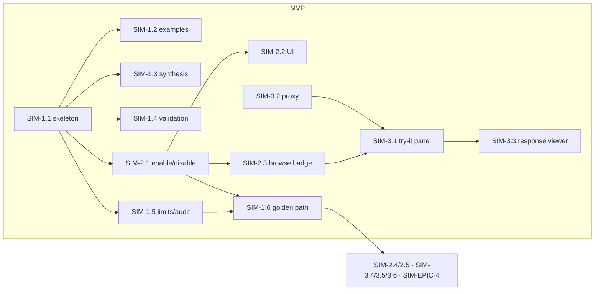

# Roadmap — Hosted Mock Servers & Portal Try-It Console

> **Status:** ✅ **Issues filed on `apiome/apiome`** — umbrella **#4411**, epics
> **#4412–#4415**, and 21 issues **#4416–#4422, #4443–#4456**.
> **Issue ID prefix:** `SIM`. Epics `SIM-EPIC-n`, issues `SIM-n.m`.
> **GitHub title format:** `apiome: [SIM-<epic>.<issue>] <title>`.
> **Recommended labels:** reuse `mock-server`, `playground`, `portal`, `browser`, `rest`,
> `ui`, `versions`, `api-keys`, `mvp`, `epic`.
> **Existing backlog to absorb/cross-link (do NOT duplicate):** #1894 ([Epic] Mock Server),
> #1482 (Stateful Mocking Engine), #1153 (Stateful Mock Store), #2282 (Integrated Mock
> Server P10), #1074 (Try-It-Out Console), #1879–#1883 (Try-It enhancements), #4371
> (MFX-44.5 mock-server try-out). When filing, link these as related/superseded on the
> matching SIM issues.

---

## 0. Source description (request, verbatim)

> Based on my direct competitors for Apiome, create a market analysis of the gaps that
> Apiome doesn't cover, and create ROADMAP files for each of the major features that should
> be implemented, along with gaps that the market doesn't provide that Apiome could. These
> ROADMAPs should then be iterated through in such a way that the create-issues skill could
> be used to generate the issues for the roadmaps. Follow the rules from the create-roadmap
> file to identify the items, products, and features that could — and should — be
> implemented first.

**This roadmap covers gaps G1 + G2** from `MARKET_ANALYSIS_COMPETITIVE_GAPS.md`: every
direct design-first competitor (SwaggerHub auto-mock, Stoplight Prism, Apidog instant cloud
mock, Postman) ships spec-accurate hosted mocks and an interactive try-it console; Apiome's
browse portal is read-only and no mock runtime exists.

## 1. MVP Definition

A tenant can toggle **"Enable mock"** on any published version and immediately gets a
stable URL — `https://mock.<host>/{tenant}/{project}/{version}` — that serves
**spec-accurate responses** (examples first, then schema-synthesized data) for every path
and operation in the spec, honoring content types and status-code selection headers. The
browse portal gains a **Try It** panel on every operation page that fires requests at the
mock (no auth) or at real servers (user-supplied auth), renders the response, and offers
copy-as-`curl`. Mock traffic is rate-limited per tenant and logged to the audit trail.

**Out of MVP** (v2): stateful mocking (CRUD memory), scriptable overrides, chaos/latency
injection, gRPC/AsyncAPI mock transports, per-consumer mock scenarios, OAuth flow helpers
in try-it.

## 2. Epics

### SIM-EPIC-1 — Mock Runtime Core (service + resolver) · #4412

| Issue | Title | Summary | Labels | Par | MVP | Complexity | Modules |
|---|---|---|---|---|---|---|---|
| SIM-1.1 · #4416 | Mock service skeleton & routing | New `apiome-mock` FastAPI service resolving `{tenant}/{project}/{version}` → published spec from DB | `mock-server`, `rest` | N | Y | M | apiome-mock (new), apiome-db |
| SIM-1.2 · #4417 | Example-first response resolver | Serve `examples`/`example` from spec; fall back per media type | `mock-server` | N | Y | M | apiome-mock |
| SIM-1.3 · #4418 | Schema-driven data synthesis | Generate valid payloads from JSON Schema (formats, enums, constraints; seeded/deterministic mode) | `mock-server`, `validation` | Y | Y | L | apiome-mock |
| SIM-1.4 · #4419 | Request validation & 4xx simulation | Validate params/body against spec; return spec-correct 400/415; `Prefer: code=` / `?__status=` selection | `mock-server`, `validation` | Y | Y | M | apiome-mock |
| SIM-1.5 · #4420 | Rate limiting, quotas & audit | Per-tenant RPS caps by license tier; mock hits in audit log + usage counters | `mock-server`, `api-keys`, `monetization` | Y | Y | M | apiome-mock, apiome-db |
| SIM-1.6 · #4421 | Docker/CI wiring & golden-path step | Compose service, healthchecks, golden-path smoke: publish → mock GET | `mock-server`, `automation` | N | Y | S | deploy, .github |

### SIM-EPIC-2 — Mock Management (control plane) · #4413

| Issue | Title | Summary | Labels | Par | MVP | Complexity | Modules |
|---|---|---|---|---|---|---|---|
| SIM-2.1 · #4422 | Enable/disable mock per version (REST + DB) | `versions.mock_enabled` migration + endpoints; only published versions | `rest`, `versions`, `database` | N | Y | S | apiome-rest, apiome-db |
| SIM-2.2 · #4443 | Mock settings UI in Control Panel | Toggle + URL + copy + usage stats on version row / published page | `ui`, `dashboard` | N | Y | S | apiome-ui |
| SIM-2.3 · #4444 | Mock URL surfacing in Browse | Mock badge + base URL on browse spec pages | `browser`, `portal` | Y | Y | S | apiome-browse |
| SIM-2.4 · #4445 | CLI: `apiome mock status/enable/disable` | Manage mocks from the terminal | `devex` | Y | N | S | apiome-cli |
| SIM-2.5 · #4446 | Draft-version private mocks | Mock unpublished drafts behind API key (design-first parallel dev) | `mock-server`, `api-keys` | Y | N | M | apiome-mock, apiome-rest |

### SIM-EPIC-3 — Try-It Console in Browse (absorbs #1074, #1879–#1883) · #4414

| Issue | Title | Summary | Labels | Par | MVP | Complexity | Modules |
|---|---|---|---|---|---|---|---|
| SIM-3.1 · #4447 | Try It panel — request builder | Per-operation form: params, headers, body editor (Monaco), server picker (mock/spec servers/custom) | `playground`, `browser`, `ui` | N | Y | L | apiome-browse |
| SIM-3.2 · #4448 | CORS-safe request proxy | Server-side proxy for cross-origin targets w/ SSRF guardrails (deny internal nets, size/time caps) | `playground`, `rest`, `shield` | N | Y | M | apiome-browse (route) |
| SIM-3.3 · #4449 | Response viewer | Status/headers/body with syntax highlight, timing, size; download body (#1883) | `playground`, `browser` | Y | Y | M | apiome-browse |
| SIM-3.4 · #4450 | Example selector & random data | Prefill from spec examples (#1879); "generate sample" via SIM-1.3 synthesis (#1880) | `playground` | Y | N | S | apiome-browse |
| SIM-3.5 · #4451 | Copy as code snippet | `curl`, JS `fetch`, Python `httpx` generators (#1882) | `playground`, `devex` | Y | N | S | apiome-browse |
| SIM-3.6 · #4452 | Auth helpers | API key/bearer/basic header helpers; values kept session-only, never persisted | `playground`, `shield` | Y | N | M | apiome-browse |

### SIM-EPIC-4 — Stateful & Advanced Mocking (v2; absorbs #1482, #1153) · #4415

| Issue | Title | Summary | Labels | Par | MVP | Complexity | Modules |
|---|---|---|---|---|---|---|---|
| SIM-4.1 · #4453 | Stateful CRUD memory | POST-then-GET coherence per session token; TTL-bound in-memory/pg store (#1153) | `mock-server` | N | N | L | apiome-mock |
| SIM-4.2 · #4454 | Scenario overrides | Per-operation canned responses/sequences defined in UI, keyed by header | `mock-server`, `ui` | Y | N | M | apiome-mock, apiome-ui |
| SIM-4.3 · #4455 | Latency/chaos injection | Configurable delay/error-rate for resilience testing | `mock-server` | Y | N | S | apiome-mock |
| SIM-4.4 · #4456 | Multi-protocol mock transports | AsyncAPI (WebSocket/SSE echo), gRPC reflection mock — after MFI formats land | `mock-server`, `multi-protocol` | Y | N | XL | apiome-mock |

## 3. Detailed Issue Descriptions

### SIM-EPIC-1 — Mock Runtime Core · #4412

**SIM-1.1 Mock service skeleton & routing**
- **Problem:** No runtime exists that can answer HTTP requests according to a stored spec; competitors provision a mock URL the moment a spec exists.
- **Solution/Scope:** New `apiome-mock` Python/FastAPI workspace (mirror `apiome-mcp` layout: uv, ruff, mypy, pytest). Route `/{tenant}/{project}/{version}/{path:path}`; resolve published spec via the same Postgres read path `apiome-mcp` uses; LRU-cache compiled specs with invalidation on publish (listen/notify or TTL). 404s with problem+json when tenant/project/version/path unknown.
- **Acceptance Criteria:** Petstore published version answers `GET /pets` with 200 + JSON matching spec within 50ms warm; unknown route → spec-shaped 404; unit + integration tests green in CI.
- **Parallelism/Dependencies:** Foundation — blocks 1.2–1.6, 2.x. None upstream.
- **Technical Stack:** Python 3.14, FastAPI, psycopg, uv.
- **Epic:** SIM-EPIC-1.

**SIM-1.2 Example-first response resolver**
- **Problem:** Mocks are only credible when they return the author's examples, not random data.
- **Solution/Scope:** Per operation+status+media-type: prefer `examples` (named, first stable), then `example`, then schema `default`/`enum[0]`. `Prefer: example=<name>` header selects a named example (Prism-compatible behavior — source: Stoplight Prism docs).
- **Acceptance Criteria:** Operation with 3 named examples returns deterministic first; header selects named; media-type negotiation honors `Accept`.
- **Parallelism/Dependencies:** After 1.1; parallel with 1.3.
- **Technical Stack:** Python; reuse spec canonical model from `spec_import_engine` where possible.
- **Epic:** SIM-EPIC-1.

**SIM-1.3 Schema-driven data synthesis**
- **Problem:** Most operations lack examples; synthesis must still emit schema-valid, realistic bodies (Apidog's "smart mock" infers from field names — source: apidog.com).
- **Solution/Scope:** JSON-Schema-driven generator honoring type/format/pattern/enum/min-max/required; name-heuristics (email, uuid, createdAt…); `?__seed=` for deterministic output; depth/size caps for recursive schemas.
- **Acceptance Criteria:** Generated bodies validate against their schema for the full examples corpus (`apiome-ui/examples/openapi/*`); recursive schema terminates <100ms.
- **Parallelism/Dependencies:** After 1.1; parallel with 1.2/1.4. Reused by SIM-3.4.
- **Technical Stack:** Python (`hypothesis-jsonschema`-style approach or hand-rolled; no GPL deps).
- **Epic:** SIM-EPIC-1.

**SIM-1.4 Request validation & 4xx simulation**
- **Problem:** A mock that accepts garbage hides client bugs; consumers need spec-true error shapes.
- **Solution/Scope:** Validate path/query/header params + request body against the spec; emit the spec's own 400/415 schema when defined, else problem+json. Forced-status via `Prefer: code=` or `?__status=`.
- **Acceptance Criteria:** Invalid enum param → 400 with spec-declared error body; `?__status=404` returns the operation's 404 example.
- **Parallelism/Dependencies:** After 1.1.
- **Technical Stack:** Python, jsonschema.
- **Epic:** SIM-EPIC-1.

**SIM-1.5 Rate limiting, quotas & audit**
- **Problem:** A public mock endpoint is an abuse vector and a cost center; usage is also a monetization signal (mock quotas differ by tier in SwaggerHub/Apidog pricing).
- **Solution/Scope:** Token-bucket per tenant+IP; limits read from license tier; `429` with `Retry-After`; hits recorded to audit log (sampled) + `mock_usage` daily rollup table for the Control Panel stat.
- **Acceptance Criteria:** Free-tier tenant capped (e.g. 5 rps / 10k req/mo); usage visible via REST; audit rows present.
- **Parallelism/Dependencies:** After 1.1; DB migration required (pairs with 2.1).
- **Technical Stack:** Python, Postgres.
- **Epic:** SIM-EPIC-1.

**SIM-1.6 Docker/CI wiring & golden-path step**
- **Problem:** The repo's definition of "works" is the golden path; mock must join it or it will rot.
- **Solution/Scope:** `docker-compose` service + prod overlay + healthcheck; extend `scripts/golden_path/smoke.py` with *enable mock → GET /pets → assert 200/shape*; publish workflow for the image.
- **Acceptance Criteria:** `golden-path.yml` green including mock step.
- **Parallelism/Dependencies:** After 1.1, 2.1.
- **Technical Stack:** Docker, GitHub Actions.
- **Epic:** SIM-EPIC-1.

### SIM-EPIC-2 — Mock Management · #4413

**SIM-2.1 Enable/disable mock per version**
- **Problem:** Mocks must be opt-in per version with a stable discoverable URL.
- **Solution/Scope:** Migration `versions.mock_enabled boolean default false` (+ `mock_settings jsonb` for v2 knobs); REST `PUT /v1/versions/{id}/mock` + status in version GET; only `published=true` versions eligible (draft case is SIM-2.5).
- **Acceptance Criteria:** Toggle persists; disabled mock returns 404 with "mock disabled" problem body; OpenAPI contract updated (`apiome-rest/openapi.yaml`).
- **Parallelism/Dependencies:** Blocks 2.2/2.3; pairs with 1.5 migration.
- **Technical Stack:** FastAPI, Flyway-style migration in `apiome-db/scripts`.
- **Epic:** SIM-EPIC-2.

**SIM-2.2 Mock settings UI** — toggle + URL + copy button + 30-day usage sparkline on Control Panel → Versions and Published pages. *AC:* toggle round-trips; URL copy toast. *Deps:* 2.1. *Stack:* Next.js, existing dashboard components. **Epic:** SIM-EPIC-2.

**SIM-2.3 Mock URL surfacing in Browse** — "Mock available" pill + base URL + curl one-liner on spec/operation pages; feeds SIM-3.1 server picker. *AC:* pill only when enabled. *Deps:* 2.1. *Stack:* apiome-browse. **Epic:** SIM-EPIC-2.

**SIM-2.4 CLI mock commands** — `apiome mock enable|disable|status <project> <version>`; parity with REST. *Deps:* 2.1. **Epic:** SIM-EPIC-2.

**SIM-2.5 Draft-version private mocks** — mock drafts behind `X-Api-Key` (existing key infra) so frontend teams build against in-design APIs (the core Apidog/Prism parallel-dev story). *Deps:* 2.1, 1.5. **Epic:** SIM-EPIC-2.

### SIM-EPIC-3 — Try-It Console (absorbs #1074, #1879–#1883) · #4414

**SIM-3.1 Request builder panel**
- **Problem:** Browse renders specs but a consumer cannot *call* anything — every competitor portal has try-it (Scalar, Elements, SwaggerHub Portal).
- **Solution/Scope:** New panel on operation pages: server picker (mock URL from 2.3, spec `servers[]`, custom), param form generated from spec, Monaco body editor with schema validation, send via SIM-3.2 proxy. Supersedes #1074 scope.
- **Acceptance Criteria:** GET+POST against mock succeed from a clean browser; params validated client-side before send; a11y: keyboard operable.
- **Parallelism/Dependencies:** Needs 2.3 (server list) + 3.2 (proxy); UI shell can start immediately.
- **Technical Stack:** Next.js 16, Monaco, existing browse design system.
- **Epic:** SIM-EPIC-3.

**SIM-3.2 CORS-safe request proxy**
- **Problem:** Browser can't call arbitrary API hosts (CORS); a naive proxy is an SSRF hole.
- **Solution/Scope:** `POST /api/try-it` route in apiome-browse: allow mock host + spec-declared servers + user-confirmed custom hosts; deny RFC1918/link-local/metadata IPs after DNS resolution; 1MB/10s caps; strip cookies; never log credentials.
- **Acceptance Criteria:** Request to `169.254.169.254` refused; large body truncated with notice; security review checklist passes (`/security-review`).
- **Parallelism/Dependencies:** Blocks 3.1 send; independent otherwise.
- **Technical Stack:** Next.js route handler, undici.
- **Epic:** SIM-EPIC-3.

**SIM-3.3 Response viewer** — status/headers/time/size, pretty+raw body, download (#1883), image/binary handling. *Deps:* 3.1. **Epic:** SIM-EPIC-3.

**SIM-3.4 Example selector & random data** — prefill request from named examples (#1879); "Generate sample" calls synthesis endpoint (#1880 → reuse SIM-1.3 via REST). *Deps:* 3.1, 1.3. **Epic:** SIM-EPIC-3.

**SIM-3.5 Copy as code snippet** — curl/fetch/httpx generated from the composed request (#1882). *Deps:* 3.1. **Epic:** SIM-EPIC-3.

**SIM-3.6 Auth helpers** — scheme-aware inputs from `securitySchemes` (bearer/apiKey/basic); sessionStorage only; red "credentials leave via proxy" notice for custom hosts. *Deps:* 3.1, 3.2. **Epic:** SIM-EPIC-3.

### SIM-EPIC-4 — Stateful & Advanced (v2) · #4415

**SIM-4.1 Stateful CRUD memory** — per-session (`X-Mock-Session`) resource store so POST→GET→DELETE behaves; TTL 1h; absorbs #1482/#1153 scope. *Deps:* EPIC-1. **Epic:** SIM-EPIC-4.
**SIM-4.2 Scenario overrides** — UI-defined canned response sets ("happy path", "quota exceeded") selected by header; stored in `mock_settings`. *Deps:* 2.1, 4.1. **Epic:** SIM-EPIC-4.
**SIM-4.3 Latency/chaos injection** — per-route delay±jitter and error-rate knobs. *Deps:* 4.2. **Epic:** SIM-EPIC-4.
**SIM-4.4 Multi-protocol transports** — AsyncAPI WS/SSE + gRPC mock after MFI canonical model covers them; coordinate with `ROADMAP_MULTI_FORMAT_IMPORT.md` (MFI-EPIC-2). *Deps:* MFI. **Epic:** SIM-EPIC-4.

## 4. Work order

1. **SIM-1.1 → SIM-2.1** (serial foundation: runtime + toggle).
2. **SIM-1.2, SIM-1.3, SIM-1.4, SIM-1.5** in parallel on the runtime; **SIM-3.2** proxy in
   parallel on the browse side.
3. **SIM-2.2, SIM-2.3** (management surfaces) → **SIM-3.1 → SIM-3.3** (console MVP).
4. **SIM-1.6** golden-path gate closes the MVP.
5. v2 wave: SIM-2.4/2.5, SIM-3.4/3.5/3.6, then SIM-EPIC-4 (4.1 → 4.2 → 4.3; 4.4 rides MFI).
