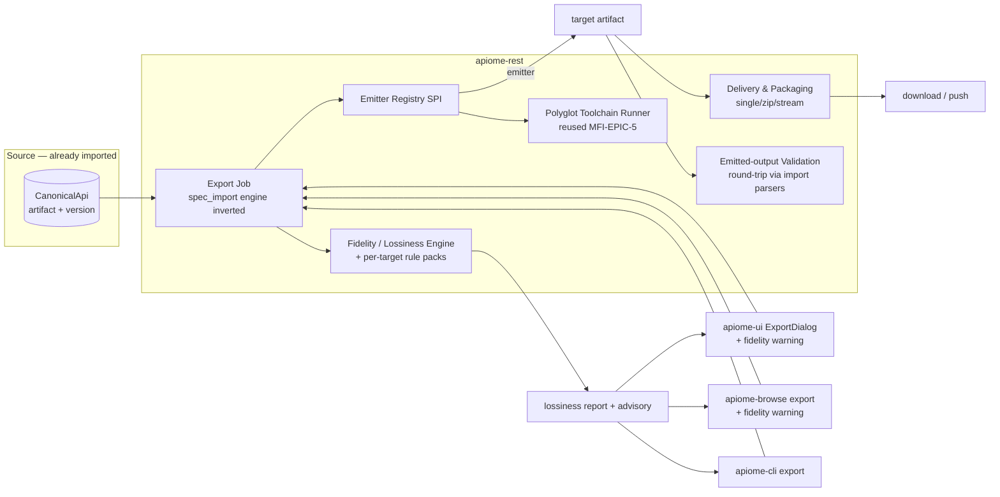
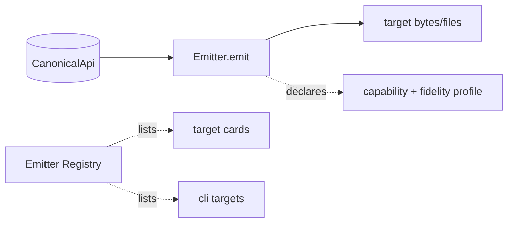
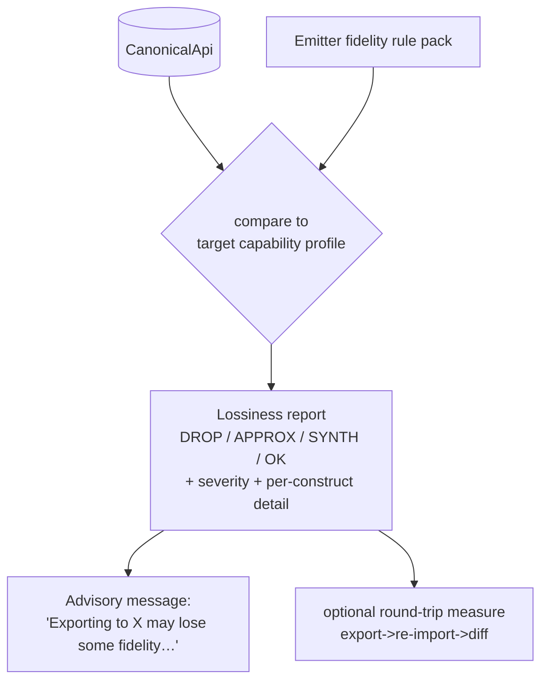
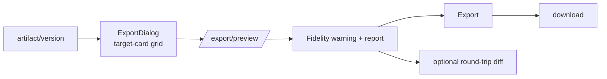
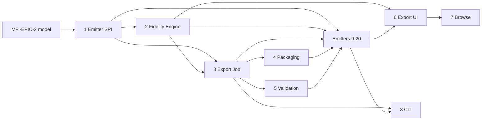

# Roadmap — Multi-Format API Export & Cross-Protocol Transcoding

> **Status:** ✅ **Issues filed on `objectified-project/objectified`** — umbrella **#3813**, epics **#3814–#3833** (MFX-EPIC-1…20), and 84 issues **#3834–#3917** (105 total). Headings below carry their `#number`; epics track children as sub-issues under umbrella #3813 (linked beneath export umbrella #3494).
> **Gap-coverage extension (2026-07-01):** ✅ epics **MFX-EPIC-21…30** (+ add-ons **MFX-14.5**, **MFX-19.6**) filed as **#4125–#4183** (59 more — 164 total) to cover modern data-schema, mainframe, EDI, and XML-schema targets. See *Gap-coverage epics* below.
> **Gap-coverage extension, second pass (2026-07-03):** ✅ epics **MFX-EPIC-31…40** (+ add-ons **MFX-9.5**, **MFX-12.6**, **MFX-13.6**, **MFX-21.6**, **MFX-24.6**) filed as **#4288–#4346** (59 more — 223 total) to mirror the rest of the import catalog (Postman collections, MCP/A2A/agentic-web interfaces, OpenRPC, CloudEvents/xRegistry, FIX Orchestra), add the database & data-lake schema families (SQL DDL/DBML/Prisma/Liquibase; Parquet/BigQuery/Spark/Iceberg), and close functional gaps (git/webhook/object-storage delivery, batch/presets/scheduled export, the MCP export surface). See *Gap-coverage epics — second pass* below.
> **Export Studio UI (2026-07-03):** ✅ epics **MFX-EPIC-41…46** filed as **#4347–#4383** (37 more — 260 total) in `docs/ROADMAP_MULTI_FORMAT_EXPORT_UI.md` — Export Studio shell, Verify workbench, Monaco viewer, test-drive tooling, visualizations, and enterprise operations UX (sub-issues under umbrella **#3813**).
> **Issue ID prefix:** `MFX` (Multi-Format eXport). Epics `MFX-EPIC-n`, issues `MFX-n.m`.
> **GitHub title format:** `apiome: [<epic>.<issue>] <title>`.
> **Recommended labels:** new `roadmap-multi-format-export` + reuse `export`, `multi-protocol`,
> `integrations`, `rest`, `ui`, `browser`, `database`, `python`, `typescript`, `linting`,
> `version-control`, `validation`, `registry`, `devex`.
> **This is the inverse of** `docs/ROADMAP_MULTI_FORMAT_IMPORT.md` (MFI umbrella **#3715**).
> **Design mockup:** [`docs/planning/mockups/multi-format-export/`](planning/mockups/multi-format-export/)
> — the UX below conforms to it.
>
> **UX decisions from the mockup review:**
> - **Export is version-scoped, not a global nav item.** It is an action on the version being viewed
>   (Projects → project → version → Export), because a tenant may have hundreds of projects/versions. *(MFX-6.5)*
> - **Per-target fidelity badges** (`lossless` / `lossy` / `types-only`) are shown on each target card,
>   computed cheaply for the *specific* source from the target's capability profile — before the export job runs. *(MFX-1.2, 2.5, 6.1)*
> - **Version-level fidelity pre-summary** (best-fidelity vs lossy targets) + a **recent-exports** list
>   render on the version view before the dialog opens. *(MFX-6.5)*
> - The fidelity panel shows a **preserved-% ring**, **count chips** (DROP/APPROX/SYNTH/OK), the
>   per-construct report, and an explicit **"Export anyway"** for lossy conversions — in apiome-ui
>   **and** apiome-browse. *(MFX-2, 6.2, 7.2)*

---

## 0. Source description (request, verbatim)

> Multi-Format API Export & Cross-Protocol Transcoding — the mirror of the multi-format IMPORT
> roadmap. Export emits **from** the Normalized internal API model (`CanonicalApi` / `api_artifact`,
> MFI-EPIC-2) **to** any target format. Because import already lands every format in that normalized
> model, this delivers **any-to-any cross-format transcoding** (import OpenAPI → export gRPC; import
> AsyncAPI → export GraphQL) plus same-format round-trip. Targets mirror the import set: OpenAPI/
> Swagger, Arazzo, AsyncAPI, gRPC/Protobuf, GraphQL, SOAP/WSDL, TypeSpec, OData, RAML, API Blueprint,
> Avro/Schema-Registry, Smithy.
>
> **Headline requirement — fidelity/lossiness.** When an API is exported to a different format,
> accuracy may be lost because the destination format cannot represent some source constructs.
> **Include a message in apiome-ui and the browser that the exported target format may lose some
> fidelity from the originally imported data, due to the destination API not allowing for as much
> detail as was provided** — plus a structured, per-construct lossiness report (REST + CLI too). Build
> a first-class Fidelity/Lossiness engine + per-target fidelity rule packs. Reuse the import roadmap's
> normalized model, toolchain runner, versioning/diff, lint engine, and parsers (to validate emitted
> output via round-trip). Cross-link existing export work; document only — do not create issues.

---

## 1. Goal & strategy

Import (MFI, #3715) made apiome **read** 12 formats into one **Normalized API Model**
(`CanonicalApi`). Export is the mirror: **emit `CanonicalApi` → any target format.** The composition
is the prize:

```
                       ┌──────────────── EXPORT (this roadmap, MFX) ───────────────┐
 IMPORT (MFI #3715)    │                                                            │
 OpenAPI ┐             │                                                  ┌─ OpenAPI/Swagger
 AsyncAPI ┤            │                                                  ├─ AsyncAPI
 gRPC     ┤  parse →   │   ┌──────────────────────────┐   emit →         ├─ gRPC / Protobuf
 GraphQL  ┼─ normalize ┼──▶│   CanonicalApi model      │──── emitter ────▶├─ GraphQL
 WSDL     ┤            │   │   (MFI-EPIC-2 tables)     │   + fidelity     ├─ SOAP / WSDL
 OData    ┤            │   └──────────────────────────┘   report         ├─ OData / TypeSpec
 Avro …   ┘            │                                                  ├─ Avro / Smithy
                       │                                                  └─ RAML / API Blueprint …
                       └────────────────────────────────────────────────────────────┘
        ANY source format  ──────────────  any-to-any  ──────────────▶  ANY target format
```

**The hard, novel part is FIDELITY.** Formats are not equally expressive. Converting a rich source
(say a GraphQL schema with unions + non-null wrappers, or an OpenAPI doc with `oneOf`/`discriminator`
+ `pattern`/`min`/`max` constraints) into a less-expressive target (Protobuf has no unions/constraints
and needs field numbers; Avro is *types-only* with no operations; RAML/API Blueprint are REST-only)
**drops or approximates** information. Apiome must (a) **compute** exactly what is lost per
export, (b) **warn the user** in apiome-ui and apiome-browse, and (c) expose the detail via
REST + CLI.

### What already exists that we REUSE (do not rebuild)

| Capability | Where | Reuse for |
|---|---|---|
| **Normalized API Model** (`CanonicalApi`, `api_*` tables) | import roadmap **MFI-EPIC-2** | The single source of truth every emitter reads |
| **Polyglot Toolchain Runner** | import roadmap **MFI-EPIC-5** | Emitters needing external tools (tsp, protoc/buf, smithy, AMF) |
| **Per-format parsers + linters** | import roadmap (MFI-EPIC-8…17) | **Validate emitted output via round-trip** (export→re-import→diff) |
| Generalized versioning + compare/diff | MFI-EPIC-3 / MCP EPIC-18 | Round-trip fidelity diff |
| Async import job engine | `spec_import_engine.py` | **Inverted** into an export job |
| Import wizard (source-card grid) | `ImportDialog.tsx` | Symmetric **ExportDialog** |
| Public browse + read views | `browse_public_routes.py`, `apiome-browse` | Public export |
| Typer CLI + jobs | `apiome-cli` | `apiome export <format>` |
| Flyway migrations | `apiome-db` | Export audit/job tables |

### Existing GitHub issues to RECONCILE / cross-link (avoid duplication)

| Issue | What | Relationship |
|---|---|---|
| **#3494** [Epic] Export & Interoperability | Existing export umbrella | **This roadmap is its detailed plan** — link as parent/related. |
| **#1786** Multi-Format Export | Direct overlap | This roadmap *is* the spec for #1786. |
| **#2249** OpenAPI Export & Import · **#2214** Graph Export & Sharing · **#2185** Batch Import & Export · **#2330** Preset Import/Export | Format/batch export | Fold into MFX targets / pipeline. |
| **#3182** [Epic] Browse & Schema Export (CLI) | Browse + CLI export | Align with MFX-EPIC-7/8. |
| #221 Export to GraphQL (closed) · #222 Export to AsyncAPI (closed) · #2866 `version.export_asyncapi` (MCP) | Prior single-format exports | Supersede/generalize behind the Emitter SPI. |
| #223–#227, #229 (Export to TS/Python/Java/C#/Go/Markdown) | **Code generation** (not spec-format export) | **Different** — out of scope; note the distinction. |
| #3489 Schema Registry & Discovery · #3496 Community & Schema Browser | Registry/browse | Align push-to-registry (MFX-EPIC-4.4) + public export. |

> **Recommendation:** open this under a **`roadmap-multi-format-export`** umbrella that is **linked as a
> child of #3494** and references the MFI import umbrella **#3715** as its symmetric twin.

### The gaps this roadmap closes

1. Export is **format-by-format and ad-hoc** (closed #221/#222, MCP `export_asyncapi`); no pluggable **Emitter SPI**.
2. No **cross-format transcoding** — you can't import OpenAPI and export gRPC today.
3. **No fidelity/lossiness model** — users get no warning when a conversion silently drops detail. *(headline)*
4. No **multi-file packaging** for targets that need it (protobuf packages, WSDL+XSD, Smithy multi-file, Avro subject sets).
5. No **emitted-output validation** (is the produced artifact actually valid in the target format?).
6. No **export surface in apiome-browse**, and no symmetric **ExportDialog**.

---

## 2. MVP definition

**MVP (v1) — "transcode from the model to 5 targets, with honest fidelity warnings":**

1. **Emitter SPI + registry** (MFX-EPIC-1): emitters register; each declares a capability + fidelity profile.
2. **Fidelity/Lossiness engine** (MFX-EPIC-2) — the headline: per-export structured report + the user-facing advisory message.
3. **Transcoding pipeline + export job** (MFX-EPIC-3): pick artifact/version → target → emit → validate → deliver; any-to-any.
4. **Output delivery & packaging** (MFX-EPIC-4) and **emitted-output validation** (MFX-EPIC-5, round-trip).
5. **Export UI** (MFX-EPIC-6) with the fidelity warning + report; **public export** (MFX-EPIC-7); **CLI export** (MFX-EPIC-8).
6. **Five high-value emitters:** **OpenAPI** (9), **AsyncAPI** (11), **GraphQL** (13), **gRPC/Protobuf** (12), **Avro/Schema-Registry** (19) — chosen to exercise REST + event + graph + RPC + data-schema and the *widest* fidelity range (Protobuf/Avro are the lossiest targets, so they prove the fidelity engine).

**v2 / later:** SOAP/WSDL, TypeSpec, OData, Smithy emitters; then legacy RAML, API Blueprint; Arazzo;
push-to-registry delivery (BSR/Schema Registry); round-trip fidelity *scoring* in the catalog.

**Gap-coverage targets (epics 21–30, filed 2026-07-01):** **JSON Schema** (21) and **standalone XSD**
(22) lead the v2 queue — both are near-free reuses of existing mappings and feed other tickets
(19.6 registry subjects, 29.x grammars). Then the enterprise differentiators no mainstream catalog
competitor offers: **COBOL copybook** (23) and **EDI X12/EDIFACT** (24), plus **Thrift** (25),
**FHIR/HL7 v2** (26), **ASN.1** (27). v3 tail: **OMG IDL** (28), **WADL/Google Discovery** (29),
**FlatBuffers/Cap'n Proto** (30).

**Second-pass gap targets (epics 31–40, filed 2026-07-03):** **Postman/Insomnia collections** (31),
**agent interfaces** (32 — MCP tool definitions / A2A Agent Card / agents.json, the MFI-EPIC-18
mirror and the product's stated differentiator), and the **MCP export surface** (40) lead; then
**OpenRPC** (33), **CloudEvents/xRegistry** (34), the **SQL DDL family** (35), and the functional
pair **delivery channels** (38) + **batch/presets/scheduled export** (39). v3: data-lake schemas
(36), FIX Orchestra (37).

---

## 3. Epics overview

| Epic | Theme | Issues | MVP |
|---|---|---|---|
| MFX-EPIC-1 | Emitter SPI & Registry | 1.1–1.4 | ●●● |
| MFX-EPIC-2 | **Fidelity / Lossiness Engine** (headline) | 2.1–2.6 | ●●● |
| MFX-EPIC-3 | Transcoding Pipeline & Export Job | 3.1–3.4 | ●●● |
| MFX-EPIC-4 | Output Delivery & Packaging | 4.1–4.4 | ●●● |
| MFX-EPIC-5 | Emitted-Output Validation (round-trip) | 5.1–5.3 | ●● |
| MFX-EPIC-6 | Export UI — apiome-ui (ExportDialog) | 6.1–6.5 | ●●● |
| MFX-EPIC-7 | Public Export — apiome-browse | 7.1–7.3 | ●● |
| MFX-EPIC-8 | CLI Export + Toolchain reuse | 8.1–8.3 | ●● |
| MFX-EPIC-9 | **OpenAPI / Swagger** emitter | 9.1–9.4 | ●● MVP |
| MFX-EPIC-10 | Arazzo emitter | 10.1–10.4 | ○ v2 |
| MFX-EPIC-11 | **AsyncAPI** emitter | 11.1–11.5 | ●● MVP |
| MFX-EPIC-12 | **gRPC / Protobuf** emitter | 12.1–12.5 | ●● MVP |
| MFX-EPIC-13 | **GraphQL** emitter | 13.1–13.5 | ●● MVP |
| MFX-EPIC-14 | SOAP / WSDL emitter | 14.1–14.4 | ○ v2 |
| MFX-EPIC-15 | TypeSpec emitter | 15.1–15.4 | ○ v2 |
| MFX-EPIC-16 | OData emitter | 16.1–16.4 | ○ v2 |
| MFX-EPIC-17 | RAML emitter (legacy) | 17.1–17.4 | ○ v2 |
| MFX-EPIC-18 | API Blueprint emitter (legacy) | 18.1–18.4 | ○ v2 |
| MFX-EPIC-19 | **Avro / Schema Registry** emitter | 19.1–19.5 | ●● MVP |
| MFX-EPIC-20 | Smithy emitter | 20.1–20.4 | ○ v2 |
| MFX-EPIC-21 | **JSON Schema** emitter (standalone) · #4125 | 21.1–21.5 | ○ v2 (front) |
| MFX-EPIC-22 | **XML Schema (XSD)** emitter (standalone) · #4131 | 22.1–22.6 | ○ v2 (front) |
| MFX-EPIC-23 | **COBOL Copybook** emitter (mainframe) · #4138 | 23.1–23.5 | ○ v2 |
| MFX-EPIC-24 | **EDI** emitters (X12 & EDIFACT) · #4144 | 24.1–24.5 | ○ v2 |
| MFX-EPIC-25 | Apache Thrift emitter · #4150 | 25.1–25.5 | ○ v2 |
| MFX-EPIC-26 | Healthcare emitters (FHIR & HL7 v2) · #4156 | 26.1–26.5 | ○ v2 |
| MFX-EPIC-27 | ASN.1 module emitter · #4162 | 27.1–27.4 | ○ v2 |
| MFX-EPIC-28 | OMG IDL emitter (CORBA/DDS) · #4167 | 28.1–28.4 | ○ v3 |
| MFX-EPIC-29 | Legacy REST descriptors (WADL & Discovery) · #4172 | 29.1–29.4 | ○ v3 |
| MFX-EPIC-30 | Serialization IDLs (FlatBuffers & Cap'n Proto) · #4177 | 30.1–30.4 | ○ v3 |
| MFX-EPIC-31 | **Postman / Insomnia** collection emitter · #4288 | 31.1–31.5 | ○ v2 (front) |
| MFX-EPIC-32 | **Agent interfaces** (MCP / A2A / agentic-web) · #4294 | 32.1–32.5 | ○ v2 (front) |
| MFX-EPIC-33 | OpenRPC emitter (JSON-RPC 2.0) · #4300 | 33.1–33.4 | ○ v2 |
| MFX-EPIC-34 | CloudEvents + xRegistry export · #4305 | 34.1–34.4 | ○ v2 |
| MFX-EPIC-35 | **SQL DDL & database schemas** (DDL/DBML/Prisma/Liquibase) · #4310 | 35.1–35.5 | ○ v2 |
| MFX-EPIC-36 | Data-lake schemas (Parquet/BigQuery/Spark/Iceberg) · #4316 | 36.1–36.5 | ○ v3 |
| MFX-EPIC-37 | FIX Orchestra emitter · #4322 | 37.1–37.4 | ○ v3 |
| MFX-EPIC-38 | **Export delivery channels** (git/webhook/S3) · #4327 | 38.1–38.4 | ○ v2 |
| MFX-EPIC-39 | **Batch, multi-target, presets & scheduled** · #4332 | 39.1–39.5 | ○ v2 |
| MFX-EPIC-40 | **MCP export surface** · #4338 | 40.1–40.3 | ○ v2 (front) |

**Total: 40 epics, ~192 issues** (gap-coverage epics 21–30 + add-ons 14.5/19.6 filed 2026-07-01 as
#4125–#4183; second-pass epics 31–40 + add-ons 9.5/12.6/13.6/21.6/24.6 filed 2026-07-03 as #4288–#4346).

### Fidelity-warning UX (apiome-ui **and** apiome-browse)

```
┌─ Export “Pet Store v1.2” ───────────────────────────────────────────┐
│ Target format:  [ gRPC / Protobuf  ▾ ]                              │
│                                                                     │
│ ⚠  Fidelity notice — exporting to Protobuf may lose detail.         │
│    The destination format can’t represent everything this API       │
│    provides. 7 constructs will be dropped or approximated:          │
│      • oneOf/discriminator on `Payment`  → flattened (DROP)          │
│      • `pattern`/`minLength` constraints → moved to comments (APPROX)│
│      • nullable fields                   → proto3 `optional` (APPROX)│
│      • field numbers                     → auto-assigned (SYNTH)     │
│                                          … [ View full report ]      │
│                                                                     │
│              [ Cancel ]        [ Export anyway ↓ ]                   │
└─────────────────────────────────────────────────────────────────────┘
```

The same advisory + report (preserved-% ring + count chips + per-construct list) renders in
**apiome-browse** for public artifacts (MFX-EPIC-7). Export itself is **invoked from the version
being viewed**, not a global nav item. See the rendered design in
[`docs/planning/mockups/multi-format-export/`](planning/mockups/multi-format-export/).

---

## 4. Architecture



---

# Epics & issues

> Complexity ∈ {S, M, L, XL}. Each emitter epic follows the same template:
> **emit (CanonicalApi → target) → fidelity rule pack → packaging/serialize → emitted-output
> validation/round-trip → UI target card + CLI + fixtures.**

---

## MFX-EPIC-1 — Emitter SPI & Registry  ·  **#3814**

The inverse of the import-source SPI: an **emitter** turns `CanonicalApi` into a target artifact and
declares what it can/can't represent.



| ID | Title | Summary | Labels | Parallel | MVP | Complexity | Affected Modules |
|----|-------|---------|--------|----------|-----|-----------|------------------|
| 1.1 ✅ | Emitter SPI + capability/fidelity profile | interface: emit(model)→files, declare capabilities | export,multi-protocol,rest,python,mvp | N | Y | L | apiome-rest |
| 1.2 ✅ | Emitter registry + REST target list | enumerate emitters for UI/CLI (`GET /export/targets`) | export,multi-protocol,rest,mvp | N | Y | M | apiome-rest |
| 1.3 ✅ | Refactor existing exports behind SPI | move current OpenAPI/MCP export under the SPI | export,multi-protocol,rest | Y | Y | M | apiome-rest |
| 1.4 ✅ | Target selection & defaults | choose target + options; sensible per-format defaults | export,multi-protocol,rest,mvp | Y | Y | S | apiome-rest |

### MFX-1.1 — Emitter SPI + capability/fidelity profile  ·  **#3834**  ·  ✅ **Done**
- **Status.** Implemented in `apiome-rest/src/app/emitter.py` (the `Emitter` ABC + `EmitOptions`/`EmittedFile`/`EmitResult{files[], media_type}` envelope + `CapabilityProfile` + `EmitterDescriptor`/`EmitterTarget` + by-format registry with `register_emitter`/`get_emitter`/`get_emitter_instance`/`available_emit_formats`/`describe_emit_targets`/`load_builtin_emitters`), `apiome-rest/src/app/openapi_emitter.py` (reference emitter — descriptor metadata, OpenAPI capability profile, `emit(api, opts)` returning a single-file bundle), and `apiome-rest/src/app/sample_emitter.py` (no-op acceptance adapter). Profile schema documented in `apiome-rest/docs/emitter_spi.md`; tests in `tests/test_emitter.py`. apiome-rest 1.75.7 → 1.75.8.
- **Problem.** Export is ad-hoc per format; there's no seam to add targets or to reason about what a target can represent.
- **Solution / Scope.** Define an `Emitter` interface in `apiome-rest`: `emit(model: CanonicalApi, opts) → EmitResult{files[], mediaType}`; plus a static **capability/fidelity profile** declaring which canonical constructs the target supports (operations? events? unions? nullability? constraints? field-identity?), consumed by the fidelity engine (EPIC-2). Inverse of the import `ImportSource` SPI (MFI-1.1). Descriptor: key, label, icon, paradigm, single/multi-file, needs-toolchain.
- **Acceptance Criteria.** A no-op emitter registers and appears in the target list; profile schema documented; OpenAPI emitter (9.x) implements it.
- **Dependencies / Parallelism.** Root. Blocks all emitter epics. Depends on MFI-EPIC-2 (model).
- **Technical Stack.** Python, FastAPI.

### MFX-1.2 — Emitter registry + REST target list  ·  **#3835**  ·  ✅ **Done**
- **Status.** Implemented in `apiome-rest/src/app/export_routes.py` (`GET /v1/export/{tenant}/targets?artifact=&version=` via `list_export_targets` + `build_target_fidelity_entries`): every registered emitter's descriptor, capability profile, options schema/defaults (MFX-1.1/1.4), and a cheap per-source fidelity tier (`lossless`/`lossy`/`types-only` + preserved-%) derived from the prediction engine with no emit. Mirrors MFI-1.3's `/import/sources`; new emitters appear automatically. Documented in `apiome-rest/docs/emitter_spi.md`; acceptance tests in `tests/test_export_targets_routes.py`. apiome-rest 1.76.1 → 1.76.2.
- **Problem.** UI/CLI need to discover available targets + their fidelity profile, and the mockup shows a **per-target fidelity badge on every card** (computed for the current source) *before* any job runs.
- **Solution / Scope.** Registry + `GET /export/targets?artifact={id}&version={v}` returning each emitter's descriptor + capability profile **plus a cheap per-target fidelity tier** (`lossless`/`lossy`/`types-only`) derived by comparing the source `CanonicalApi`'s construct classes against each target's capability profile (no full emit). Drives the card badges (6.1) and the version pre-summary (6.5). Mirrors MFI-1.3's `/import/sources`.
- **Acceptance Criteria.** New emitter appears automatically; each target returns a fidelity tier for the given source; OpenAPI→OpenAPI is `lossless`, →Avro is `types-only`.
- **Dependencies / Parallelism.** After 1.1. Blocks 6.x/8.x.
- **Technical Stack.** FastAPI.

### MFX-1.3 — Refactor existing exports behind SPI  ·  **#3836**  ·  ✅ **Done**
- **Status.** Implemented in `apiome-rest/src/app/export_service.py` (`resolve_emit_format`/`resolve_emitter`/`emit_canonical` routing canonical export through the emitter registry; accepts emitter `key` or `format`), with `app.conversion_job.preview_conversion` refactored off the direct `OpenApiEmitter` import. Regression tests in `tests/test_export_service.py`. Documented in `apiome-rest/docs/emitter_spi.md`. apiome-rest 1.75.8 → 1.75.9.
- **Problem.** Current OpenAPI export + MCP `export_asyncapi` (#2866) are bespoke.
- **Solution / Scope.** Move existing export paths behind the Emitter SPI without behavior change; supersede closed #221/#222.
- **Acceptance Criteria.** Existing OpenAPI export still works, now via an emitter; one regression suite green.
- **Dependencies / Parallelism.** After 1.1. Parallel with 1.4.
- **Technical Stack.** Python.

### MFX-1.4 — Target selection & defaults  ·  **#3837**  ·  ✅ **Done**
- **Status.** Implemented in `apiome-rest/src/app/emitter.py` (`options_model`/`default_options`/`options_schema` on `Emitter`, `coerce_emit_options`, `EmitOptionsError`, `EmitterTarget.options_schema` + `default_options` on `describe_emit_targets()`), `apiome-rest/src/app/openapi_emitter.py` (`OpenApiEmitOptions` — `include_paths`/`include_components`/`include_projection_extensions`), `apiome-rest/src/app/sample_emitter.py` (`SampleEmitOptions`), and `apiome-rest/src/app/export_service.py` (`resolve_emit_options`, dict coercion in `emit_canonical`). Documented in `apiome-rest/docs/emitter_spi.md`; tests in `tests/test_emit_options.py`. apiome-rest 1.75.9 → 1.75.10.
- **Problem.** Each target needs options (e.g. proto3 vs editions, CSDL JSON vs XML, AsyncAPI 2 vs 3) with safe defaults.
- **Solution / Scope.** A per-emitter options schema + defaults, surfaced in UI/CLI.
- **Acceptance Criteria.** Options validated; defaults produce a valid artifact.
- **Dependencies / Parallelism.** After 1.1. Parallel with 1.3.
- **Technical Stack.** Python, Pydantic.

---

## MFX-EPIC-2 — Fidelity / Lossiness Engine (headline)  ·  **#3815**

The differentiator. Given a source `CanonicalApi` and a target emitter's capability profile, compute
**exactly what will be lost** and surface it everywhere.



| ID | Title | Summary | Labels | Parallel | MVP | Complexity | Affected Modules |
|----|-------|---------|--------|----------|-----|-----------|------------------|
| 2.1 ✅ | Lossiness report model + severities | DROP/APPROX/SYNTH/OK per construct + severity | export,multi-protocol,version-control,mvp | N | Y | M | apiome-rest |
| 2.2 ✅ | Fidelity computation engine | diff source constructs vs target capability profile | export,multi-protocol,python,mvp | N | Y | L | apiome-rest |
| 2.3 | Fidelity rule-pack SPI | per-target degradation rules (how a construct degrades) | export,multi-protocol,python,mvp | N | Y | M | apiome-rest |
| 2.4 ✅ | User-facing advisory message | the "may lose fidelity" copy + i18n string + thresholds | export,ui,browser,mvp | Y | Y | S | apiome-rest,apiome-ui |
| 2.5 ✅ | Fidelity report REST surfacing | return report from export + a dry-run preview endpoint | export,rest,mvp | Y | Y | S | apiome-rest |
| 2.6 | Round-trip fidelity measurement | export→re-import→diff to quantify actual loss | export,version-control,validation | Y | N | M | apiome-rest |

### MFX-2.1 — Lossiness report model + severities  ·  **#3838**  ·  ✅ **Done**
- **Problem.** "Fidelity loss" must be structured, not prose, so UI/CLI/REST can render and gate on it.
- **Solution / Scope.** A `LossinessReport` = ordered `LossItem{ construct (canonical path), kind: DROP|APPROX|SYNTH|OK, severity: info|warn|critical, message, targetMapping }` + summary counts. `DROP` = unrepresentable (removed); `APPROX` = represented imperfectly (e.g. constraint→comment); `SYNTH` = invented to satisfy target (e.g. protobuf field numbers); `OK` = clean. Stable construct keys reuse the canonical model's keys.
- **Acceptance Criteria.** Report serializes to JSON; counts per kind/severity; stable ordering.
- **Dependencies / Parallelism.** After MFI-EPIC-2. Blocks 2.2.
- **Technical Stack.** Python, Pydantic.

### MFX-2.2 — Fidelity computation engine  ·  **#3839**  ·  ✅ **Done**
- **Problem.** Need to actually compute the report for a given (model, emitter).
- **Solution / Scope.** Walk the `CanonicalApi`; for each construct, consult the emitter's capability profile + rule pack (2.3) to decide DROP/APPROX/SYNTH/OK. Pure function (no I/O) → deterministic, testable. Runs **before** emit (preview) and is attached **to** the emit result.
- **Acceptance Criteria.** For a rich source → Protobuf, reports unions/constraints/nullability/field-numbers correctly; clean REST→OpenAPI reports mostly OK.
- **Dependencies / Parallelism.** After 2.1/2.3. Blocks emitter fidelity packs.
- **Technical Stack.** Python.

### MFX-2.3 — Fidelity rule-pack SPI  ·  **#3840**  ·  ✅ **Done**
- **Problem.** Each target degrades constructs differently; rules must be pluggable per emitter.
- **Solution / Scope.** A `FidelityRulePack` SPI (`app.fidelity_rulepack`): maps canonical constructs → target handling (`OK`/`APPROX how`/`DROP`/`SYNTH`) via one `FidelityVerdict` per operation/channel/type and zero-or-more per field. Default `CapabilityRulePack` derives every verdict from the `CapabilityProfile`; format epics ship their pack alongside the emitter (`Emitter.fidelity_rule_pack`) and the engine consumes it. Reference pack `OpenApiFidelityRulePack` upgrades a source field number from `DROP` to a lossless `APPROX` (`x-field-number`). Cross-paradigm rules included (operations→types-only targets like Avro = DROP all operations).
- **Acceptance Criteria.** SPI documented; a reference pack (OpenAPI) implemented; engine consumes packs.
- **Dependencies / Parallelism.** After 2.1. Blocks 2.2 and emitter packs.
- **Technical Stack.** Python.

### MFX-2.4 — User-facing advisory message  ·  **#3841**  ·  ✅ **Done**
- **Problem.** The user explicitly wants a clear "you may lose fidelity" message in apiome-ui **and** the browser.
- **Solution / Scope.** A canonical advisory string + severity thresholds returned with every cross-format (and lossy same-format) export: e.g. *"Exporting to **{format}** may lose some fidelity. The destination format can't represent everything in this API, so **{n}** construct(s) will be dropped or approximated — review the fidelity report before downloading."* Shared by UI (6.2), browse (7.2), CLI (8.2). Suppressed/relaxed when the report is all-OK (same-format high-fidelity round-trips). **Implemented** as `app.fidelity_advisory` (Python string source: `build_export_advisory(report, target_format, *, min_severity)` → `ExportAdvisory` with `show`/`severity`/`requires_ack`/counts/`headline`/`message`), consumed field-for-field by `apiome-ui/src/app/utils/export-advisory.ts` (presentation helpers only — no re-templating).
- **Acceptance Criteria.** Message reflects real counts; shown when loss > threshold; hidden when lossless; identical wording across UI/browse/CLI.
- **Dependencies / Parallelism.** After 2.2. Blocks 6.2/7.2/8.2.
- **Technical Stack.** Python (string source), TS (consumers).

### MFX-2.5 — Fidelity report REST surfacing  ·  **#3842**  ·  ✅ **Done**
- **Status.** Implemented in `apiome-rest/src/app/export_fidelity.py` (the presentation seam over the MFX-2.2 engine: `ExportFidelityTier` `lossless`/`lossy`/`types-only`, `preserved_percent`, `classify_tier`, the cheap `TargetFidelity` badge via `build_target_fidelity`, and the full `ExportFidelity` envelope — target + tier + `LossinessReport` + MFX-2.4 advisory — via `build_export_fidelity`, all pure/no-emit), `apiome-rest/src/app/export_source.py` (`load_export_source` resolves a tenant/artifact/version to a `CanonicalApi`, reusing the convert path's parse+normalize; `ExportSourceError` maps 404/422), a new `Database.get_version_source_projection` (version-scoped source fields), and `apiome-rest/src/app/export_routes.py` (`GET /v1/export/{tenant_slug}/targets?artifact=&version=` → per-target descriptor + capability profile + options + tier/preserved-% badge; `POST /v1/export/{tenant_slug}/preview` → the full `ExportFidelity` with **no artifact**). The `ExportFidelity` envelope is the shared shape an export job embeds in its result (MFX-3.1/3.2 consume `build_export_fidelity`). Tenant-scoped via `validate_authentication`. Tests in `tests/test_export_fidelity.py`, `tests/test_export_source.py`, `tests/test_export_routes.py`. apiome-rest 1.75.14 → 1.75.15.
- **Problem.** UI/CLI need the report before committing a download, and (per mockup) the version view needs a **fast, per-target fidelity tier + preserved-%** for all targets at once to render card badges and the pre-summary.
- **Solution / Scope.** Two granularities: (1) `GET /export/targets?artifact&version` returns the cheap per-target **tier** + a **preserved-%** estimate for every target (drives 6.1 card badges + 6.5 pre-summary, no emit); (2) `POST /export/preview` (artifact/version+target → full `LossinessReport`, no artifact) for the dialog's detailed panel; and the report is also embedded in the export job result. Tenant-scoped.
- **Acceptance Criteria.** Targets endpoint returns tier + preserved-% per target; preview returns the full report without producing the artifact; export result carries it.
- **Dependencies / Parallelism.** After 2.2, 3.1. Parallel with 2.4.
- **Technical Stack.** FastAPI.

### MFX-2.6 — Round-trip fidelity measurement  ·  **#3843**
- **Problem.** Beyond *predicted* loss, measure *actual* loss by re-importing the emitted artifact.
- **Solution / Scope.** Optionally export → re-import via the matching MFI parser → diff against the source `CanonicalApi` (reuse MFI-EPIC-3 diff) → an empirical loss list that corroborates the predicted report.
- **Acceptance Criteria.** Round-trip diff matches predicted DROPs on fixtures; flagged where they diverge.
- **Dependencies / Parallelism.** After 2.2, MFI parsers + diff. **v2.** Parallel with emitter epics.
- **Technical Stack.** Python.

---

## MFX-EPIC-3 — Transcoding Pipeline & Export Job  ·  **#3816**

Invert the import job engine: select artifact/version → choose target → (preview fidelity) → emit →
validate → deliver. Enables any-to-any.

| ID | Title | Summary | Labels | Parallel | MVP | Complexity | Affected Modules |
|----|-------|---------|--------|----------|-----|-----------|------------------|
| 3.1 ✅ | Export job engine | inverse of `spec_import_engine`: emit→validate→package | export,multi-protocol,rest,python,mvp | N | Y | L | apiome-rest |
| 3.2 ✅ | CanonicalApi → emitter dispatch | resolve emitter, run, attach fidelity report | export,multi-protocol,rest,mvp | N | Y | M | apiome-rest |
| 3.3 ✅ | Any-to-any transcoding guards | source-paradigm ↔ target-paradigm sanity + warnings | export,multi-protocol,validation,mvp | Y | Y | M | apiome-rest |
| 3.4 | Export job status/polling | job lifecycle + result (artifact ref + report) | export,rest,mvp | Y | Y | S | apiome-rest |

### MFX-3.1 — Export job engine  ·  **#3844**  ·  ✅ **Done**
- **Status.** Implemented in `apiome-rest/src/app/export_job_engine.py` (the export-side mirror of `spec_import_engine.py`: in-memory tenant-scoped job store, `ExportJobStartRequest` — artifact/version + target + per-emit options + `dry_run` + `min_severity` — and the pipeline *load source → fidelity envelope → emit → validate → package*, each blocking stage on a worker thread, driven on the engine's own process-lifetime event loop so a job always outlives its request; cancel takes effect at the next stage boundary) and `apiome-rest/src/app/export_job_routes.py` (`POST /v1/export/{tenant_slug}/jobs` → 202 `{job_id, status_path}`; `GET …/jobs` list; `GET …/jobs/{job_id}` → the import-shaped `{job_id, state, percent, events, progress, result}` poll payload; `DELETE …/jobs/{job_id}` cancel — states are the import vocabulary minus two-phase-commit). The result embeds the MFX-2.5 `ExportFidelity` envelope verbatim (`build_export_fidelity`, so a preview and the export agree) plus a metadata-only file manifest; the raw `EmitResult` is retained on the record for the delivery epics (`get_export_job_emit_result`, MFX-4.x). `dry_run` completes after the report with **no artifact** (the async twin of `POST …/preview`). Seams for the later epics: `validate_emitted_result` (MFX-5.1/5.3 — honestly reports `VALIDATION_DEFERRED` today) and `build_result_manifest` (MFX-4.1/4.2). Unknown target/invalid options fail fast at submit (400/422, matching `/export/document`); source failures surface asynchronously as structured `failed` events. Tests in `tests/test_export_job_engine.py`, `tests/test_export_job_routes.py`. apiome-rest 1.76.2 → 1.76.3.
- **Problem.** Export of large artifacts (multi-file, toolchain-backed) needs the same async job lifecycle as import.
- **Solution / Scope.** Mirror `spec_import_engine.py`: submit (artifact/version + target + opts) → run emitter → fidelity report → validate (EPIC-5) → package (EPIC-4) → deliver; status/polling reused. Dry-run = preview only (report, no artifact).
- **Acceptance Criteria.** An emitter runs end-to-end through the job API; status contract matches import.
- **Dependencies / Parallelism.** After 1.1, 2.2. Blocks emitter epics.
- **Technical Stack.** Python async.

### MFX-3.2 — CanonicalApi → emitter dispatch  ·  **#3845**  ·  ✅ **Done**
- **Status.** Implemented in `apiome-rest/src/app/export_dispatch.py` (the reusable, tenant-scoped **dispatch primitive**: `dispatch_export(tenant_id, artifact, version, target, …)` loads the revision's `CanonicalApi` via `load_export_source`, resolves the emitter from the registry, runs it through the Emitter SPI (`emit_canonical`, with `(tenant, artifact)`-scoped field-identity persistence), and attaches the full `ExportFidelity` envelope (`build_export_fidelity` — byte-identical to `POST /export/preview`), returning the two together as an `ExportDispatch`; the loaded-source variant `dispatch_from_source` lets callers that already hold an `ExportSource` reuse the composition without a second lookup, and `dry_run` stops after the report with no artifact) and surfaced synchronously in `apiome-rest/src/app/export_routes.py` (`POST /v1/export/{tenant_slug}/dispatch` → resolved coordinates + fidelity envelope + emitted files **inline** — the one-shot twin of submitting a job and polling, for small artifacts and the `apiome export` CLI). The composition reuses the format seams (`export_source`/`export_service`/`export_fidelity`) rather than re-deriving them; the async `export_job_engine` (MFX-3.1) runs the same composition staged for large/toolchain-backed targets. Typed failures map straight through: `ExportSourceError` (404/422), `ExportError` (400 unknown target / 422 invalid options / 422 empty emit). Tests in `tests/test_export_dispatch.py` (primitive) and `tests/test_export_dispatch_routes.py` (route). apiome-rest 1.76.3 → 1.76.4.
- **Solution / Scope.** Load the artifact's `CanonicalApi` for the chosen version, resolve the emitter from the registry, run it, attach the fidelity report.
- **Acceptance Criteria.** Correct emitter runs; report attached; tenant-scoped.
- **Dependencies / Parallelism.** After 3.1. Blocks emitter epics.
- **Technical Stack.** Python.

### MFX-3.3 — Any-to-any transcoding guards  ·  **#3846**  ·  ✅ **Done**
- **Status.** Implemented in `apiome-rest/src/app/transcoding_guards.py` (the pure, deterministic pre-flight classifier: `classify_transcode(api, emitter, *, report=None)` bands a conversion into a `TranscodeVerdict` — `clean` / `lossy` / `near-empty` / `severe` — from the source model, the target's `CapabilityProfile`, and the MFX-2.2 `LossinessReport`; the returned `TranscodeGuard` pairs the band with the structured *why* — source/target paradigm, the operations/events the target structurally can't carry, the report's dropped/critical counts — and ready-to-render `headline`/`message`/`reasons`. Precedence: **clean** (lossless) → **near-empty** (an operation/event-bearing source to a *types-only* target — only schemas export, warned not blocked, the "operations → Avro" AC) → **severe** (the source's essence is unrepresentable on a non-types-only target — event-only AsyncAPI → gRPC — *or* a `critical` construct drops) → **lossy** (degraded but the operational surface survives). Only `severe` sets `requires_confirmation`; `enforce_transcode_guard(guard, confirmed=…)` raises the typed `TranscodeGuardError` (→ 409) when a severe conversion is not confirmed). Wired into every emit surface: `apiome-rest/src/app/export_dispatch.py` (`dispatch_from_source`/`dispatch_export` gain `confirm`, classify off the fidelity envelope's report so preview and dispatch agree, gate a real emit, and attach the guard to `ExportDispatch`), `apiome-rest/src/app/export_routes.py` (`POST …/preview` now carries the guard for pre-flight; `POST …/dispatch` gains `confirm` and maps `TranscodeGuardError` → **409** with the guard in the body), and `apiome-rest/src/app/export_job_engine.py` (`ExportJobStartRequest.confirm`; the pipeline classifies after fidelity, fails an unconfirmed severe job with a structured `TRANSCODE_CONFIRMATION_REQUIRED` event, and embeds the guard in `ExportJobResult`). A `dry_run`/preview never blocks — it always returns the guard so the surface can prompt. Tests in `tests/test_transcoding_guards.py` (classifier + gate), `tests/test_transcoding_guard_routes.py` (preview + dispatch 409/confirm), and the guard cases appended to `tests/test_export_job_engine.py`. apiome-rest 1.76.4 → 1.76.5.
- **Problem.** Some conversions are nonsensical or extreme-loss (e.g. an event-only AsyncAPI → gRPC, or any operation-bearing API → Avro which is types-only).
- **Solution / Scope.** Pre-flight checks that classify the conversion (clean / lossy / severe / near-empty) and require explicit confirmation (or block) for severe cases, surfacing *why* via the fidelity report.
- **Acceptance Criteria.** Severe conversions require confirm; near-empty (operations→Avro) warns that only schemas export.
- **Dependencies / Parallelism.** After 3.2, 2.2. Parallel with 3.4.
- **Technical Stack.** Python.

### MFX-3.4 — Export job status/polling  ·  **#3847**
- **Solution / Scope.** `GET /export/jobs/{id}` returning state, fidelity report, artifact/download ref. Used by UI/CLI pollers.
- **Acceptance Criteria.** Terminal state returns download ref + report or structured error.
- **Dependencies / Parallelism.** After 3.1. Parallel with 3.3.
- **Technical Stack.** FastAPI.

---

## MFX-EPIC-4 — Output Delivery & Packaging  ·  **#3817**

| ID | Title | Summary | Labels | Parallel | MVP | Complexity | Affected Modules |
|----|-------|---------|--------|----------|-----|-----------|------------------|
| 4.1 | Single-file emit & download | one document; content-type + filename | export,rest,mvp | N | Y | S | apiome-rest |
| 4.2 | Multi-file bundle (zip) | protobuf packages, WSDL+XSD, Smithy, Avro subjects | export,rest,mvp | N | Y | M | apiome-rest |
| 4.3 | Streaming/download & retention | stream large bundles; temp artifact retention | export,rest | Y | Y | S | apiome-rest |
| 4.4 | Push-to-registry delivery | push Avro→Schema Registry, proto→BSR (opt) | export,registry,integrations | Y | N | M | apiome-rest |

*(4.1–4.4 follow the delivery template. Multi-file is mandatory for protobuf (per-package files + imports), WSDL (+ separate XSDs), Smithy (multi-namespace), and Avro (per-subject `.avsc`); deliver as a zip with a manifest. 4.4 (v2) reuses the import discovery clients in reverse to **register** schemas into a live Confluent Schema Registry / Buf Schema Registry.)*

---

## MFX-EPIC-5 — Emitted-Output Validation (round-trip)  ·  **#3818**

| ID | Title | Summary | Labels | Parallel | MVP | Complexity | Affected Modules |
|----|-------|---------|--------|----------|-----|-----------|------------------|
| 5.1 | Validate emitted artifact | parse the output with the matching MFI parser | export,validation,mvp | N | Y | M | apiome-rest |
| 5.2 | Lint emitted artifact | run the target's linter on the output | export,linting | Y | N | S | apiome-rest |
| 5.3 | Validation gating & report | block/warn on invalid output; surface results | export,validation,mvp | Y | Y | S | apiome-rest |

### MFX-5.1 — Validate emitted artifact  ·  **#3852**
- **Problem.** A buggy emitter could produce invalid output; we must guarantee the artifact is legal in its target format.
- **Solution / Scope.** Feed the emitted artifact back through the **matching MFI import parser/validator** (reuse, don't rebuild) to confirm it parses; failures fail the export job with detail.
- **Acceptance Criteria.** Valid output passes; deliberately broken output is caught.
- **Dependencies / Parallelism.** After 3.1, MFI parsers. Blocks 5.3.
- **Technical Stack.** Python (reused MFI parsers).

*(5.2 reuses the MFI lint packs on the emitted output; 5.3 gates delivery and surfaces validation alongside the fidelity report.)*

---

## MFX-EPIC-6 — Export UI — apiome-ui (ExportDialog)  ·  **#3819**

Symmetric to `ImportDialog`. **Carries the fidelity warning (user directive).**



| ID | Title | Summary | Labels | Parallel | MVP | Complexity | Affected Modules |
|----|-------|---------|--------|----------|-----|-----------|------------------|
| 6.1 ✅ | ExportDialog + target-card grid | mirror ImportDialog; pick target + options | export,ui,typescript,mvp | N | Y | M | apiome-ui |
| 6.2 ✅ | Fidelity warning panel + report | advisory message + per-construct DROP/APPROX/SYNTH list | export,ui,mvp | N | Y | M | apiome-ui |
| 6.3 ✅ | Preview + download | preview emitted artifact; download single/zip | export,ui,mvp | Y | Y | S | apiome-ui |
| 6.4 | Round-trip diff view | show what changed if re-imported (uses 2.6) | export,ui,version-control | Y | N | M | apiome-ui |
| 6.5 ✅ | Version-scoped entry points | Export is an action on the viewed version (NOT a global nav item) | export,ui | Y | Y | S | apiome-ui |

### MFX-6.1 — ExportDialog + target-card grid  ·  **#3855**  ·  ✅ **Done**
- **Solution / Scope.** A symmetric `ExportDialog` (reuse `ImportDialog` patterns/tokens): a **12-target card grid** from `GET /export/targets` where **each card shows a per-source fidelity badge** (`lossless`/`lossy`/`types-only`, from 1.2/2.5) so the user sees the trade-off before selecting; numbered stepper (Source → Target → Fidelity → Export); per-target options per 1.4 (e.g. proto3 vs editions, single-file vs multi-file zip). Selecting a target updates the fidelity headline (6.2). Follow `frontend-design` guidance. See the mockup.
- **Acceptance Criteria.** Pick a target → fidelity panel updates → export; each card shows its fidelity tier for the current source; consistent with ImportDialog look & feel.
- **Dependencies / Parallelism.** After 1.2, 2.5. Blocks 6.2.
- **Technical Stack.** Next.js, TanStack Query.

### MFX-6.2 — Fidelity warning panel + report  ·  **#3856**  ·  ✅ **Done**
- **Problem.** **(headline)** The user must see, before downloading, that the target may lose fidelity.
- **Solution / Scope.** Render (per the mockup): the advisory message (2.4) prominently; a **preserved-% ring** and **count chips** (`N dropped · N approximated · N synthesized · N clean`); an expandable per-construct report (DROP/APPROX/SYNTH/OK with source path + how it degrades); and an explicit **"Export anyway"** confirm for lossy conversions. Hidden/relaxed when lossless.
- **Acceptance Criteria.** Warning shows real counts + preserved-%; full report expandable; "Export anyway" required when lossy; absent when clean.
- **Dependencies / Parallelism.** After 6.1, 2.4/2.5. Blocks nothing.
- **Technical Stack.** Next.js.

### MFX-6.3 — Preview + download  ·  **#3857**  ·  ✅ **Done**
- **Status.** Implemented in `apiome-ui`: the Export step now previews the emitted document before any download (`ArtifactPreviewCard.tsx` — filename, scrollable content, size/media-type meta) with the mockup's **"valid · round-trip OK"** status badge (`exportArtifactPreview.ts` — the "valid" half re-parses JSON/YAML client-side, never faking a check for formats without a browser parser; the round-trip half reads the MFX-2.5 loss report: clean → `round-trip OK`, degraded → `lossy round-trip`; the hint line states both bases — the *empirical* server-side round-trip lands with MFX-5.3/6.4). Downloads are on-demand from the preview: the single file, or a `.zip` built client-side by a dependency-free stored-ZIP writer (`zipBundle.ts`, UTF-8 names, deterministic output) that takes the file *list* so multi-file bundles flow through unchanged once MFX-4.2's endpoint returns them. Tests in `tests/exportArtifactPreview.test.ts`, `tests/zipBundle.test.ts` (format-level checks incl. CRC-32 vectors), and `tests/ExportDialog.test.tsx`. apiome-ui 0.52.0 → 0.53.0.

### MFX-6.5 — Version-scoped entry points  ·  **#3859**  ·  ✅ **Done**
- **Status.** Implemented in `apiome-ui`: Export is an action on the viewed revision, **never** a global left-nav item (a tenant may have hundreds of projects/versions) — a new **"Export to another format…"** entry in the version row's actions menu and the version view's **"Export this version"** button both open the `ExportDialog` scoped to that revision (`versions/page.tsx`). The version view (View Spec) now renders `VersionExportPanel.tsx` per the mockup's entry-point screen: the **fidelity pre-summary** — best-fidelity vs lossy targets *for this source*, grouped client-side from `GET /export/targets`' MFX-2.5 tiers (`fidelityPreSummary` in `exportTargetCatalog.ts`, lossy before types-only) — and the **recent-exports** list with fidelity-% badge + relative time (`recentExports.ts`: browser-local per artifact+version, recorded from the dialog's new `onExported` summary; readers swap to the REST export-history query when MFX-46.1 lands). Tests in `tests/VersionExportPanel.test.tsx` and `tests/recentExports.test.ts`, plus MFX-6.5 cases in `tests/ExportDialog.test.tsx` / `tests/exportTargetCatalog.test.ts`. apiome-ui 0.53.0 → 0.54.0.

*(6.3 preview/download incl. the emitted-artifact preview with a "valid · round-trip OK" badge; 6.4 round-trip diff (v2).)*

---

## MFX-EPIC-7 — Public Export — apiome-browse  ·  **#3820**

| ID | Title | Summary | Labels | Parallel | MVP | Complexity | Affected Modules |
|----|-------|---------|--------|----------|-----|-----------|------------------|
| 7.1 ✅ | Public export of published artifacts | export published versions; no auth | export,browser,mvp | N | Y | M | apiome-browse,apiome-rest |
| 7.2 ✅ | Fidelity advisory in browse | same "may lose fidelity" message + report publicly | export,browser,mvp | N | Y | S | apiome-browse |
| 7.3 ✅ | Public download + guards | rate-limit, size caps, published/public only | export,browser,security | Y | Y | S | apiome-browse,apiome-rest |

### MFX-7.1 — Public export of published artifacts  ·  **#3860**  ·  ✅ **Done**
- **Status.** Implemented across `apiome-rest` + `apiome-browse`. REST: a new anonymous export surface `browse_export_routes.py` (`/v1/browse/tenants/{t}/projects/{p}/versions/{v}/export/{targets,preview,document}`) mirroring the authenticated `/v1/export` trio one-for-one but resolved by URL slugs through `load_public_export_source` (`export_source.py`) → `get_public_version_source_projection` (`database.py`), which hard-gates on the public browse predicate (`published IS TRUE AND visibility = 'public'`, undeleted) — private/draft/unknown are a **uniform 404** so anonymous callers can never probe hidden artifacts; the emit runs with `persistence=None` so the public path is strictly read-only. The shared route bodies were extracted for reuse (`build_target_fidelity_entries`, `render_emitted_document` in `export_routes.py`). Browse: an **"Export to another format…"** button on the version view's Specification header opens `PublicExportDialog.tsx` — a target-card grid with tier badges + preserved-% from `/export/targets`, the **"may lose fidelity" warning gated by an explicit "Export anyway" acknowledgement** for any non-lossless target, a JSON/YAML toggle, and a `Content-Disposition`-named download from `/export/document`; framework-free logic in `lib/export/publicExport.ts` (URL builders, tier presentation, warning sentence, filename parsing). Tests: `tests/test_browse_export_public_api.py` + public-loader cases in `tests/test_export_source.py` (rest), `lib/export/__tests__/publicExport.test.ts` (browse). apiome-rest 1.75.32 → 1.76.0; apiome-browse 0.3.0 → 0.4.0. (`/preview` already serves the full advisory envelope for MFX-7.2; rate-limit/size caps land with MFX-7.3.)
- **Solution / Scope.** Allow exporting **published/public** artifacts from `apiome-browse` to any target, reusing the export job + emitters via a public, no-auth, read-only path (reuse `mcp_v_public`/browse read models). Never expose private artifacts.
- **Acceptance Criteria.** Public user exports a published API to a chosen format with the fidelity warning; private artifacts unavailable.
- **Dependencies / Parallelism.** After 3.x, 6.2. Blocks 7.2/7.3.
- **Technical Stack.** Next.js (apiome-browse), FastAPI.

### MFX-7.2 — Fidelity advisory in browse  ·  **#3861**  ·  ✅ **Done**
- **Status.** Implemented in `apiome-browse`: the public export dialog now fetches `POST …/export/preview` when a target is selected and renders `PublicFidelityWarningPanel.tsx` — the same advisory (MFX-2.4) verbatim from the server, preserved-% ring, count chips (`N dropped · N approximated · N synthesized · N clean`), expandable per-construct report (DROP/APPROX/SYNTH/OK with source path + degradation), and explicit "Export anyway" acknowledgement for lossy conversions, matching the ADE's `FidelityWarningPanel`. Framework-free helpers in `lib/export/export-advisory.ts`, `lib/export/exportFidelityPreview.ts`, and `publicExportPreviewUrl` in `publicExport.ts`. Tests in `lib/export/__tests__/export-advisory.test.ts`, `exportFidelityPreview.test.ts`, plus preview URL in `publicExport.test.ts`. apiome-browse 0.4.0 → 0.5.0.
- **Problem.** **(headline)** The browser must carry the same fidelity message as the ADE.
- **Solution / Scope.** Render the identical advisory (2.4) + report in the public export flow.
- **Acceptance Criteria.** Same wording/severity as apiome-ui; report visible publicly.
- **Dependencies / Parallelism.** After 7.1. Parallel with 7.3.
- **Technical Stack.** Next.js.

*(7.3 adds rate-limit/size caps + published-only guards.)*

### MFX-7.3 — Public download + guards  ·  **#3862**  ·  ✅ **Done**
- **Status.** Implemented across `apiome-rest` + `apiome-browse`. REST: `public_export_guards.py` adds a dedicated per-IP rate limit (default 30/min, honours global `rate_limit_enabled`) on all three anonymous `/v1/browse/.../export/*` routes and a configurable download size cap (default 8 MiB, `413` when exceeded) on `/document`; published/public-only access remains the MFX-7.1 loader gate. Browse: `publicExportErrors.ts` maps `429`/`413`/`404` to stable dialog copy; `PublicExportDialog` surfaces server detail when present. Tests: `tests/test_public_export_guards.py`, guard cases in `tests/test_browse_export_public_api.py`, `lib/export/__tests__/publicExportErrors.test.ts`. apiome-rest 1.76.0 → 1.76.1; apiome-browse 0.5.0 → 0.5.1.
- **Solution / Scope.** rate-limit, size caps, published/public only. Follows the epic emitter template — 7.3 adds rate-limit/size caps + published-only guards.
- **Acceptance Criteria.** Implements this step of the emitter and passes the standard contract with round-trip fixtures; consistent with the epic's other steps.
- **Dependencies / Parallelism.** After 7.1. Parallel with 7.2.
- **Technical Stack.** Next.js (apiome-browse), FastAPI.

---

## MFX-EPIC-8 — CLI Export + Toolchain reuse  ·  **#3821**

| ID | Title | Summary | Labels | Parallel | MVP | Complexity | Affected Modules |
|----|-------|---------|--------|----------|-----|-----------|------------------|
| 8.1 | `apiome export <format>` | export an artifact/version to a target; poll | export,devex,python,mvp | N | Y | M | apiome-cli |
| 8.2 | Fidelity report in CLI | print advisory + report; `--force` for lossy | export,devex,mvp | Y | Y | S | apiome-cli |
| 8.3 | Toolchain runner reuse | wire emitters needing tsp/buf/smithy/AMF | export,multi-protocol,infrastructure | Y | N | S | apiome-rest |

### MFX-8.1 — `apiome export <format>`  ·  **#3863**
- **Solution / Scope.** `apiome export <format> <artifact> [--version] [--out file|dir] [--option ...]`; resolves the emitter, polls the export job, writes single file or unzips a bundle.
- **Acceptance Criteria.** Exports from CLI to a chosen format; bundle unpacked; `--json` mode.
- **Dependencies / Parallelism.** After 1.2, 3.4. Blocks 8.2.
- **Technical Stack.** Python, Typer.

### MFX-8.2 — Fidelity report in CLI  ·  **#3864**
- **Problem.** **(headline)** CLI users must also be warned.
- **Solution / Scope.** Print the advisory (2.4) + a concise loss table; require `--force` (or interactive confirm) when the conversion is lossy.
- **Acceptance Criteria.** Lossy export warns + needs `--force`; lossless exports cleanly.
- **Dependencies / Parallelism.** After 8.1, 2.4. Parallel with 8.3.
- **Technical Stack.** Python, Typer.

*(8.3 reuses MFI-EPIC-5 Toolchain Runner for emitters that shell out to tsp/buf/smithy/AMF.)*

---

## MFX-EPIC-9 — OpenAPI / Swagger emitter · MVP  ·  **#3822**

Highest-fidelity REST target (the model's lingua franca). Mostly OK from REST sources; loses
RPC streaming, event channels, gRPC field numbers; can express oneOf/anyOf/discriminator + constraints.

| ID | Title | Summary | Labels | Parallel | MVP | Complexity | Affected Modules |
|----|-------|---------|--------|----------|-----|-----------|------------------|
| 9.1 ✅ | OpenAPI emitter | CanonicalApi → OpenAPI 3.1 (+ 3.0/Swagger opt) | export,multi-protocol,rest,mvp | N | Y | M | apiome-rest |
| 9.2 ✅ | OpenAPI fidelity pack | what OpenAPI can't represent (events/RPC streaming) | export,multi-protocol,mvp | N | Y | S | apiome-rest |
| 9.3 ✅ | Validate + round-trip | re-import via MFI OpenAPI parser; diff | export,validation,mvp | Y | Y | S | apiome-rest |
| 9.4 ✅ | OpenAPI target card + CLI + fixtures | UI/CLI target + round-trip fixtures | export,ui,devex,mvp | Y | Y | S | apiome-ui,apiome-cli |
| 9.5 · #4342 | OpenAPI 3.2 output option | emit OAS 3.2 (webhooks/security); 3.2→3.1 downgrade rules; coordinate #2662 | export,multi-protocol,rest,openapi | Y | N | M | apiome-rest |

### MFX-9.1 — OpenAPI emitter  ·  **#3866**  ·  ✅ **Done**
- **Problem.** Need the canonical REST emitter (and the reference implementation of the SPI).
- **Solution / Scope.** Map `CanonicalApi` operations/types → OpenAPI 3.1 (paths, operations, components/schemas via the existing JSON-Schema/primitives model); option for 3.0/Swagger 2.0 downgrade (which itself loses 3.1 features — feed the fidelity pack). Reuse the existing OpenAPI generation where present.
  - Source: OpenAPI 3.1 — https://spec.openapis.org/oas/v3.1.0.html
- **Acceptance Criteria.** Emits valid 3.1 from a REST source; 3.0/2.0 downgrades flagged as lossy.
- **Dependencies / Parallelism.** After 1.1, 2.3, 3.1. Blocks 9.2/9.3.
- **Technical Stack.** Python.
- **Status.** The reference 3.1 emitter (`apiome-rest/src/app/openapi_emitter.py`) already emitted schema-valid OpenAPI 3.1 (MFI-22.1). This ticket adds the **3.0/Swagger 2.0 downgrade option**: a new `openapi_version` (`"3.1"` default / `"3.0"` / `"2.0"`) field on `OpenApiEmitOptions`, and a pure `apiome-rest/src/app/openapi_downgrade.py` module that projects the emitted 3.1 document onto **OpenAPI 3.0.3** (nullability → `nullable`, numeric exclusive bounds → the draft-4 boolean form, `const` → single-value `enum`, `examples` → `example`, unsupported JSON-Schema keywords dropped) and **Swagger 2.0** (`servers` → `host`/`basePath`/`schemes`, `components.schemas` → `definitions` with rewritten `$ref`s, `requestBody` → a `body` parameter + `consumes`, response `content` → `schema` + `produces`, parameters/headers inlined, `oneOf`/`anyOf`/`not`/nullable dropped). Every 3.1-only construct the older dialect cannot carry is recorded as an `EmitResult.loss` (INFERRED when approximated, NA when unrepresentable) — the "downgrades flagged as lossy" criterion, feeding the fidelity pack (9.2). Both downgrades are pure/deterministic and re-import cleanly through `OpenApiNormalizer` (3.0) / `Swagger2Normalizer` (2.0). Tests in `tests/test_openapi_downgrade.py` and `tests/test_openapi_emitter_versions.py`. apiome-rest 1.75.15 → 1.75.16.

### MFX-9.2 — OpenAPI fidelity pack  ·  **#3867**  ·  ✅ **Done**
- **Solution / Scope.** Rules: event channels (AsyncAPI sources) → DROP/notes; RPC streaming → APPROX (callbacks/notes); gRPC field numbers → DROP; downgrade-to-3.0 (`oneOf` nuance, `examples`) / 2.0 (`nullable`, `oneOf`, multiple content types) → APPROX/DROP.
- **Acceptance Criteria.** Event/RPC source loss reported; 2.0 downgrade enumerates dropped features.
- **Dependencies / Parallelism.** After 9.1, 2.3. Parallel with 9.3.
- **Technical Stack.** Python.
- **Status.** The predictive fidelity pack (MFX-2.3 seam) that surfaces what the OpenAPI target *can't* natively carry — the constructs OpenAPI's flat six-axis `CapabilityProfile` (`events=True`, `operations=True`, `field_identity=False`) hides. The reference `OpenApiFidelityRulePack` (`apiome-rest/src/app/openapi_emitter.py`) now refines the profile-derived default so an **event/RPC source no longer reports a silent lossless export**: an **event channel** and a **pub/sub** operation become documented-only `APPROX`es (surfaced via `x-apiome-event-action` on a non-normative path; protocol bindings/correlation ids dropped), an **RPC streaming** method is an `APPROX` (`x-apiome-streaming` note), a **GraphQL subscription** is a critical `DROP` (no path/verb projection), and a **gRPC field number** stays the lossless `APPROX` MFX-9.1 introduced (preserved as `x-field-number`). These verdicts flow through `compute_lossiness_for_emitter` → the fidelity advisory (MFX-2.4) and target/export fidelity surfaces (MFX-2.5), so the AsyncAPI/gRPC → OpenAPI advisory now honestly reads "may lose fidelity" with per-construct counts. The **2.0 downgrade already enumerates its dropped features** (`nullable`/`oneOf`/`examples`/multiple content types) as `EmitResult` losses via `apiome-rest/src/app/openapi_downgrade.py` (MFX-9.1), satisfying the second criterion at emit time. Tests in `tests/test_fidelity_rulepack.py` (event/RPC/subscription/streaming verdicts) and `tests/test_fidelity_engine.py`. apiome-rest 1.75.16 → 1.75.17.
- **Technical Stack.** Python.

### MFX-9.3 — Validate + round-trip  ·  **#3868**  ·  ✅ **Done**
- **Problem.** A buggy emitter could produce output that is illegal in its own format, and *predicted* fidelity loss (MFX-9.2) is only a prediction until it is *measured* against a real re-import.
- **Solution / Scope.** Re-import the emitted artifact via the matching MFI OpenAPI parser and diff the re-imported model against the source. **Acceptance Criteria.** Valid output passes / broken output is caught; round-trip diff corroborates the predicted DROPs and flags where they diverge.
- **Dependencies / Parallelism.** After 9.1, MFI parsers + diff. Parallel with 9.2.
- **Technical Stack.** Python.
- **Status.** A pure `apiome-rest/src/app/openapi_roundtrip.py` module (`round_trip_openapi(api, *, opts, emit_result) → RoundTripReport`) that composes existing machinery — the OpenAPI emitter (MFX-9.1), the meta-schema validator (`validate_openapi_document`, MFI-22.1), the OpenAPI import source (`OpenApiImportSource`, MFI-1.1), and the compare-any-two canonical diff (`app.diff.diff`, MFI-3.2) — into one emit → validate → re-import → diff loop. The `RoundTripReport` carries a single ordered `RoundTripStatus` (`INVALID` meta-schema failure → `UNPARSEABLE` re-import failure → `LOSSY` → `LOSSLESS`), the empirical `ModelDiff`, and the emitter's *predicted* `losses`, with derived `valid` (schema-clean **and** re-importable — the MFX-5.1 check), `empirically_lossless` (entity diff empty), `predicted_lossless`, and `diverges` (prediction vs. measurement disagree — the MFX-2.6 "flagged where they diverge" flag). A REST/OpenAPI source in normal form round-trips **lossless** (empty diff); a schema-invalid document is `INVALID`; a non-OpenAPI document is `UNPARSEABLE`; a cross-paradigm (event) source round-trips `LOSSY` with the predicted pub/sub-action / channel-binding drops corroborated. The 3.0 and Swagger 2.0 downgrades have no bundled meta-schema, so their re-import through their own normalizer is the validation. Tests in `tests/test_openapi_roundtrip.py`. apiome-rest 1.75.17 → 1.75.18.

### MFX-9.4 — OpenAPI target card + CLI + fixtures  ·  **#3869**  ·  ✅ **Done**
- **Problem.** The OpenAPI emitter (9.1–9.3) had no client surface: no CLI export command and no UI
  metadata for an emitted-artifact target card.
- **Solution / Scope.** A CLI `apiome export` group + the UI export-target language registry + fixtures,
  built strictly on existing REST endpoints (affected modules `apiome-ui`, `apiome-cli` only — no
  apiome-rest change). Coordinate with #2249.
- **Acceptance Criteria.** `apiome export openapi` writes a version's OpenAPI document and surfaces its
  fidelity; a lossy export is flagged; round-trip fixtures back the tests.
- **Status.** Because there is no Emitter-SPI artifact-download endpoint, the CLI composes the two
  surfaces that do exist: the document bytes come from the OpenAPI reconstruction
  (`GET /v1/schema/{tenant}/{project}/{version}`, the same source as `spec export`) and the honest
  fidelity report comes from the emitter registry's dry-run preview
  (`POST /v1/export/{tenant}/preview`, target `openapi`). New CLI `export` group
  (`apiome-cli/src/apiome_cli/commands/export.py`): `export openapi --project P --version V -o FILE`
  writes the document, prints the tier + preserved-% + advisory, and **exits non-zero on a
  lossy/types-only export unless `--force`** (mirroring `convert`; the document is written either way);
  `export targets` lists the registered emitters + per-source fidelity (`GET /v1/export/{tenant}/targets`).
  Reuses `resolve_browse_export_scope` / `fetch_browse_spec` / `write_document_bytes` /
  `build_spec_export_metadata`; new `client/export_registry.py` (HTTP) + `export_output.py` (pure
  rendering/gating). UI adds `apiome-ui/src/app/utils/export-target-language.ts` — the emitter
  `format`/`key` → Monaco language + file extension + download filename map the registry-driven target
  card and any emitted-artifact viewer read (mirrors `catalog-source-language.ts`; the full
  ExportDialog + target-card grid is MFX-EPIC-41, which renders OpenAPI automatically from its backend
  descriptor). Round-trip fixtures in `apiome-cli/tests/fixtures/export-*.json`; tests in
  `tests/test_export_command.py` and `apiome-ui/tests/export-target-language.test.ts`.
  apiome-cli 0.16.0 → 0.17.0, apiome-ui 0.49.4 → 0.49.5.

---

## MFX-EPIC-10 — Arazzo emitter · v2  ·  **#3823**

Arazzo describes **workflows** over operations, not types/endpoints — so emitting Arazzo from a
non-workflow source is **near-empty** unless the model carries workflow info.

| ID | Title | Summary | Labels | Parallel | MVP | Complexity | Affected Modules |
|----|-------|---------|--------|----------|-----|-----------|------------------|
| 10.1 | Arazzo emitter | model workflows → Arazzo description | export,multi-protocol | N | N | M | apiome-rest |
| 10.2 | Arazzo fidelity pack | non-workflow sources → near-empty/DROP | export,multi-protocol | N | N | S | apiome-rest |
| 10.3 | Validate + round-trip | re-import via Arazzo path | export,validation | Y | N | S | apiome-rest |
| 10.4 | Arazzo target card + CLI + fixtures | UI/CLI + fixtures | export,ui,devex | Y | N | S | apiome-ui,apiome-cli |

*(Adapter template. Key fidelity note: Arazzo is workflow-only — exporting a plain REST/RPC/event API yields only whatever sequencing exists; the engine should warn "this target captures workflows, not the full API surface".)*

---

## MFX-EPIC-11 — AsyncAPI emitter · MVP  ·  **#3824**

Event-driven target. Clean from event sources; from REST/RPC sources it **reframes** request/response
as messages (APPROX) and loses HTTP path/verb/status semantics.
Source: https://www.asyncapi.com/docs/reference/specification/v3.1.0

| ID | Title | Summary | Labels | Parallel | MVP | Complexity | Affected Modules |
|----|-------|---------|--------|----------|-----|-----------|------------------|
| 11.1 ✅ | AsyncAPI emitter | model channels/operations/messages → AsyncAPI 3 (+2 opt) | export,multi-protocol,mvp | N | Y | M | apiome-rest |
| 11.2 ✅ | AsyncAPI fidelity pack | REST/RPC→message reframing; HTTP semantics DROP | export,multi-protocol,mvp | N | Y | S | apiome-rest |
| 11.3 | Multi-version (2.6/3.0/3.1) | emit per requested version; 3→2 downgrade losses | export,multi-protocol | Y | N | S | apiome-rest |
| 11.4 ✅ | Validate + round-trip | re-import via MFI AsyncAPI parser; diff | export,validation,mvp | Y | Y | S | apiome-rest |
| 11.5 ✅ | AsyncAPI target card + CLI + fixtures | UI/CLI + fixtures; supersede #222/#2866 | export,ui,devex,mvp | Y | Y | S | apiome-ui,apiome-cli |

### MFX-11.1 — AsyncAPI emitter  ·  **#3874**  ·  ✅ **Done**
- **Solution / Scope.** Map canonical channels/operations/messages → AsyncAPI 3.1 (servers, channels, operations action send/receive, messages with payload schema). For REST/RPC sources, reframe operations as request/reply messages (flagged APPROX by 11.2). Reuse `@asyncapi/parser` (via toolchain runner) to validate output.
- **Acceptance Criteria.** Emits valid AsyncAPI 3 from an event source; REST source emits with documented reframing.
- **Dependencies / Parallelism.** After 1.1, 2.3, 3.1. Blocks 11.2/11.4.
- **Technical Stack.** Python (+ Node for validation).
- **Status.** The AsyncAPI target and inverse of `AsyncApiNormalizer` (MFI-8.2): a pure, deterministic, provenance-tracked `apiome-rest/src/app/asyncapi_emitter.py` (`AsyncApiEmitter`, self-registered under the `asyncapi-3` format key) that walks a `CanonicalApi` → schema-valid **AsyncAPI 3.1** — `info`, `servers` (v3 `host`/`pathname` split + `protocol`, derived from a REST source's URL when absent), `channels` (address, address `parameters`, protocol `bindings`), `operations` (`action: send` for `PUBLISH` / `receive` for `SUBSCRIBE`, bound to their channel by `$ref`), per-channel `messages` (payload `$ref`/inline schema, `headers` object schema rebuilt from the message's header fields, `contentType`), and `components.schemas` from the model's named types (via the shared `SchemaEmitter`; a new public `SchemaEmitter.field_schema` renders the header-object properties). A **native event source is an exact fixed point** of `normalize ∘ emit`. A **non-event (REST/RPC/GraphQL) source is reframed**: each request/response operation becomes an `action: send` whose `reply` block carries the response message, its request/response bodies become the sent/replied messages, and the HTTP method/path/status AsyncAPI cannot carry are enumerated as `EmitResult.losses` (`INFERRED` reframe + synthesized channel, `NA` HTTP binding + response status) for the fidelity pack (11.2) to turn into `APPROX`/`DROP` verdicts. The honest `CapabilityProfile` (`events=True`, `operations=False`) predicts a REST operation as a `DROP` until 11.2 refines it. Both the event and reframed-REST outputs validate against the real `@asyncapi/parser` with zero errors/warnings (the round-trip check 11.4 automates via `parse_asyncapi`). Tests in `tests/test_asyncapi_emitter.py`. apiome-rest 1.75.18 → 1.75.19.

### MFX-11.2 — AsyncAPI fidelity pack  ·  **#3875**  ·  ✅ **Done**
- **Solution / Scope.** Rules: HTTP method/path/status (REST source) → DROP/notes; RPC streaming → channel APPROX; non-message types → components. 
- **Acceptance Criteria.** REST→AsyncAPI loss enumerated.
- **Dependencies / Parallelism.** After 11.1, 2.3. Parallel with 11.4.
- **Technical Stack.** Python.
- **Status.** Ships `AsyncApiFidelityRulePack` (`apiome-rest/src/app/asyncapi_emitter.py`) — the predictive counterpart to `AsyncApiEmitter` (11.1) and the AsyncAPI analogue of `OpenApiFidelityRulePack` (9.2), a `CapabilityRulePack` refinement the fidelity engine consults via the emitter's new `AsyncApiEmitter.fidelity_rule_pack()`. It corrects the profile-derived default (which, because AsyncAPI advertises `operations=False`, predicts every reframed REST/RPC operation a critical `DROP`) to the honest reframing outcome: a REST/RPC request-response exchange → **`APPROX`** (reframed as `action: send` + `reply`, with whichever of the HTTP method/path/response-status the operation carries **enumerated** in the verdict message — the acceptance criterion); an RPC-**streaming** method → `APPROX` (reframed onto a channel, streaming cardinality dropped); native pub/sub operations, event channels, and every named type (records/unions/scalars → `components.schemas`) carried faithfully (inherited). Verdicts line up construct-for-construct with the `EmitResult.losses` the emitter records at emit time, and the pack stays pure/deterministic. Tests in `tests/test_fidelity_rulepack.py` (8 new); docs in `docs/emitter_spi.md`. apiome-rest 1.75.19 → 1.75.20.

### MFX-11.4 — Validate + round-trip  ·  **#3877**  ·  ✅ **Done**
- **Problem.** A buggy emitter could produce output that is illegal AsyncAPI, and the *predicted* reframing loss (MFX-11.2) is only a prediction until it is *measured* against a real re-import.
- **Solution / Scope.** Re-import the emitted artifact via the matching MFI AsyncAPI parser and diff the re-imported model against the source. **Acceptance Criteria.** Valid output passes / broken output is caught; round-trip diff corroborates the predicted reframing losses and flags where they diverge.
- **Dependencies / Parallelism.** After 11.1, MFI-8.1/8.2 parsers + diff. Parallel with 11.2.
- **Technical Stack.** Python.
- **Status.** A pure `apiome-rest/src/app/asyncapi_roundtrip.py` module (`round_trip_asyncapi(api, *, opts, emit_result, runner, timeout) → RoundTripReport`, `async`), the AsyncAPI analogue of `openapi_roundtrip` (9.3), composing existing machinery — the AsyncAPI emitter (11.1), the authoritative `@asyncapi/parser` (`parse_asyncapi`, MFI-8.1), the AsyncAPI normalizer (`AsyncApiNormalizer`, MFI-8.2), and the compare-any-two canonical diff (`app.diff.diff`, MFI-3.2) — into one emit → validate → re-import → diff loop. Unlike OpenAPI (a bundled Python meta-schema), AsyncAPI has no in-process validator: the Node parser *is* the validator, and it also dereferences the document into the canonical JSON the normalizer consumes, so one real parse both proves the artifact is legal AsyncAPI (MFX-5.1) and yields the model to diff — hence the round trip is `async` (the parser drives a subprocess) and raises `AsyncApiParseError` only for *infrastructure* failure (tool unavailable/timeout), never for a merely-invalid document. The `RoundTripReport` carries a single ordered `RoundTripStatus` (`INVALID` parser-rejected → `UNPARSEABLE` normalize failure → `LOSSY` → `LOSSLESS`), the emitted `validation_errors`, the empirical `ModelDiff`, and the emitter's *predicted* `losses`, with derived `valid` (validation-clean **and** re-importable — the MFX-5.1 check), `empirically_lossless` (entity diff empty), `predicted_lossless`, and `diverges` (prediction vs. measurement disagree — the MFX-2.6 "flagged where they diverge" flag). A native event source round-trips **lossless** (empty diff — the `normalize ∘ emit` fixed point proven end to end through the real parser); a parser-rejected document is `INVALID`; a validated-but-unnormalizable document is `UNPARSEABLE`; a cross-paradigm REST source is legal AsyncAPI yet round-trips `LOSSY` with the reframed operation / dropped HTTP-semantics losses corroborated. Tested both with a fake toolchain runner replaying the parser contract (always runs) and, when the Node parser is installed, end to end (`tests/test_asyncapi_roundtrip.py`). apiome-rest 1.75.20 → 1.75.21.

### MFX-11.5 — AsyncAPI target card + CLI + fixtures  ·  **#3878**  ·  ✅ **Done**
- **Solution / Scope.** Make the AsyncAPI emitter (11.1) reachable from the CLI + UI, with round-trip fixtures; supersede the closed #222 (export-to-AsyncAPI) and MCP #2866 (`version.export_asyncapi`).
- **Acceptance Criteria.** `apiome export asyncapi` writes a schema-valid AsyncAPI 3 document with the honest fidelity report; the UI target-card metadata knows AsyncAPI; fixtures cover event (lossless) + REST-reframed (lossy).
- **Dependencies / Parallelism.** After 11.1 (emitter registration) + MFX-2.5 (fidelity surface). Parallel within the epic.
- **Technical Stack.** Python / FastAPI · Typer · Next.js.
- **Status.** The emit surface the `export openapi` command's docstring called out as missing: a new **`POST /v1/export/{tenant}/document`** (`apiome-rest/src/app/export_routes.py`) emits any registered target through the Emitter SPI (`emit_canonical`) and serializes the document JSON (default) or YAML (`Accept: application/yaml`) — the byte source the OpenAPI-only browse reconstruction (`GET /v1/schema/…`) cannot supply for AsyncAPI. The CLI gains **`apiome export asyncapi`** (`apiome-cli/src/apiome_cli/commands/export.py` + `client/export_document.py`): it pairs `/document` for the bytes with the existing `/preview` for the fidelity envelope, exactly mirroring `export openapi`'s two-call shape — a native event source exports **lossless** (exit 0), a REST/RPC source reframes onto channels and exports **lossy** (non-zero exit unless `--force`); `--yaml`/`--accept` pick the serialization and `--output -` keeps stdout byte-safe. On the UI, the registry-driven export target-card **grid** stays deferred to MFX-EPIC-41; this ticket adds the small client-metadata layer that grid (and any emitted-artifact viewer) reads — an `asyncapi` entry in `apiome-ui/src/app/utils/export-target-language.ts` (JSON default, YAML sniffed, `asyncapi.json`/`.yaml` download name; `asyncapi-3` collapses to the base id). Round-trip fixtures under `apiome-cli/tests/fixtures/` (emitted AsyncAPI document + lossless/lossy preview envelopes). Tests: REST route contract (`tests/test_export_routes.py`), CLI command suite (`tests/test_export_asyncapi_command.py`), UI metadata (`tests/export-target-language.test.ts`). apiome-rest 1.75.21 → 1.75.22, apiome-cli 0.17.0 → 0.18.0, apiome-ui 0.49.5 → 0.50.0.

*(11.3 multi-version downgrade losses remains: emit per requested AsyncAPI version with the 3→2 downgrade enumerated.)*

---

## MFX-EPIC-12 — gRPC / Protobuf emitter · MVP  ·  **#3825**

**The lossiest, most important fidelity proving-ground.** Protobuf has **no unions** (oneof is partial),
**no nullability** (proto3 `optional`), **no rich constraints** (no pattern/min/max — APPROX to comments),
**requires field numbers** (SYNTH, must be stable), enums are int-based, no inheritance.
Sources: https://protobuf.dev/ · https://buf.build/docs/

| ID | Title | Summary | Labels | Parallel | MVP | Complexity | Affected Modules |
|----|-------|---------|--------|----------|-----|-----------|------------------|
| 12.1 ✅ | Protobuf emitter | model services/methods/types → `.proto` (+ descriptor) | export,multi-protocol,mvp | N | Y | L | apiome-rest |
| 12.2 ✅ | Stable field-number assignment | deterministic, persisted field numbers (SYNTH) | export,multi-protocol,version-control,mvp | N | Y | M | apiome-rest |
| 12.3 ✅ | Protobuf fidelity pack | unions/nullability/constraints/inheritance loss | export,multi-protocol,mvp | N | Y | M | apiome-rest |
| 12.4 | Multi-file packaging + validate | per-package files + imports; `buf build` validate | export,rest,validation,mvp | Y | Y | M | apiome-rest |
| 12.5 ✅ | gRPC target card + CLI + fixtures | UI/CLI + round-trip fixtures | export,ui,devex,mvp | Y | Y | S | apiome-ui,apiome-cli |
| 12.6 · #4343 | Connect-RPC / gRPC-Gateway flavor options | `google.api.http` annotations from REST bindings (mirror MFI-19.5) | export,multi-protocol | Y | N | S | apiome-rest |

### MFX-12.1 — Protobuf emitter  ·  **#3879**  ·  ✅ **Done**
- **Solution / Scope.** Map services→`service`, operations→`rpc` (streaming flags), types→`message`/`enum`, fields→typed fields. Emit `.proto` (and optionally a `FileDescriptorSet`). Map canonical types → proto scalar/message types; arrays→`repeated`; maps→`map`; optionals→proto3 `optional`.
  - Source: https://protobuf.dev/programming-guides/proto3/
- **Acceptance Criteria.** Emits compilable `.proto` (via `buf build`) for a typed source; streaming preserved.
- **Dependencies / Parallelism.** After 1.1, 2.3, 3.1, 5.x. Blocks 12.2/12.3.
- **Technical Stack.** Python + buf (toolchain runner).
- **Status.** A pure, deterministic, provenance-tracked `apiome-rest/src/app/proto_emitter.py` (`ProtoEmitter`, self-registered under the `proto3` format key) — the inverse of `ProtoNormalizer` (MFI-9.2) and an implementation of the Emitter SPI. It walks a `CanonicalApi` → proto3 source text: identity `namespace` → `package`; `Service`→`service`, each `Operation`→`rpc` whose `StreamingMode` restores the `stream` keyword on the request and/or response (unary / client / server / bidi — the acceptance criterion), plus `idempotency_level`/`deprecated` method options; `RECORD` types → `message` blocks with nesting **reconstructed from the dotted type keys** (`pkg.Outer.Inner` → nested `Inner`), fields carrying their preserved `field_number`, `repeated` for a list, `map<K,V>` for a `MAP`-type reference (the synthetic `*Entry` message is never re-emitted), proto3 `optional`, and `oneof` blocks rebuilt from the field/type `extras`; `ENUM` types → `enum` blocks preserving value numbers and floating a proto3-required zero value first; `reserved` ranges/names restored (message ranges converted half-open→inclusive, enum ranges kept inclusive); referenced well-known types → the right `import`. Constructs proto3 cannot carry — a field `Constraints`, a proto2 `default`, a `UNION` type (approximated as a message wrapping a `oneof`), an event operation, a source field with no number (synthesized), a type outside the file's package — are recorded as `EmitResult.losses` rather than silently dropped, the material the fidelity pack (12.2/12.3) turns into `APPROX`/`DROP` verdicts. `emit()` is pure text (no I/O); the convenience `compile_emitted_descriptor_set` pairs it with `compile_proto_descriptor_set` for the optional `FileDescriptorSet`. A protobuf source is an exact fixed point of `normalize ∘ emit` — verified end to end (emit → `buf build` → re-import via `ProtoNormalizer` → diff) with streaming modes and field numbers preserved, gated on the bundled `buf` like the other toolchain e2e tests. Tests in `tests/test_proto_emitter.py`; docs in `docs/proto_emitter.md`. apiome-rest 1.75.22 → 1.75.23.

### MFX-12.2 — Stable field-number assignment  ·  **#3880**  ·  ✅ **Done**
- **Problem.** Protobuf requires field numbers the source may not have; they must be **stable across exports** or every re-export is wire-incompatible.
- **Solution / Scope.** Deterministically assign + **persist** field numbers per (artifact, message, field) so re-exports reuse them; honor `reserved`; surface as SYNTH in the fidelity report.
- **Acceptance Criteria.** Re-exporting the same artifact yields identical numbers; new fields get new numbers; reported as SYNTH.
- **Dependencies / Parallelism.** After 12.1. Blocks 12.4 stability.
- **Technical Stack.** Python, PostgreSQL.
- **Status.** `apiome-db/scripts/V141__export_field_identities_3880.sql` adds `export_field_identities` (scoped by tenant, project, target, canonical field key). `apiome-rest/src/app/field_identity_store.py` owns allocation (honours source numbers, persisted assignments, and message `reserved` ranges) and DB load/persist helpers. `ProtoEmitOptions.persisted_field_numbers` feeds the pure emitter; `export_service.emit_canonical(..., persistence=…)` loads before proto3 emit and upserts `EmitResult.field_identity_assignments` after. `/v1/export/.../document` passes persistence context automatically. Synthesized numbers remain `LossKind.INFERRED` / fidelity `SYNTH`. Tests in `tests/test_field_identity_store.py` and `tests/test_export_field_identities_migration.py`. apiome-rest 1.75.23 → 1.75.24.

### MFX-12.3 — Protobuf fidelity pack  ·  **#3881**  ·  ✅ **Done**
- **Solution / Scope.** Rules: `oneOf`/union → `oneof` if shape allows else DROP-to-`Any`/notes (APPROX); nullability → proto3 `optional` (APPROX); constraints (pattern/min/max/format) → comments (APPROX/DROP); inheritance/`allOf` → flatten (APPROX); arbitrary JSON → `google.protobuf.Struct` (APPROX); field numbers → SYNTH.
- **Acceptance Criteria.** A rich OpenAPI/GraphQL source enumerates each loss with kind + reason.
- **Dependencies / Parallelism.** After 12.1, 2.3. Parallel with 12.4.
- **Technical Stack.** Python.
- **Status.** The predictive fidelity pack (MFX-2.3 seam) that surfaces what the proto3 target *can't* natively carry — the constructs protobuf's six-axis `CapabilityProfile` (`unions=False`, `nullability=True`, `constraints=False`) hides. The reference `ProtoFidelityRulePack` (`apiome-rest/src/app/proto_emitter.py`) refines the profile-derived default so an **OpenAPI/GraphQL source no longer reports silent union DROPs or missing nullability losses**: a **named union** becomes an honest `APPROX` (`oneof`-bearing message or `google.protobuf.Any` when the shape is ineligible), **nullability/requiredness** and **validation constraints** are `APPROX` (proto3 `optional` / doc comments), **inheritance/allOf/GraphQL interfaces** flatten to a single message (`APPROX`), **arbitrary JSON** maps to `google.protobuf.Struct` (`APPROX`), **field numbers** stay `SYNTH` (MFX-12.2), and **pub/sub operations** are reframed as unary `rpc` (`APPROX`) rather than the capability default's critical `DROP`. Verdicts flow through `compute_lossiness_for_emitter` → the fidelity advisory (MFX-2.4) and target/export fidelity surfaces (MFX-2.5). Tests in `tests/test_fidelity_rulepack.py`. apiome-rest 1.75.24 → 1.75.25.

*(12.4 multi-file packaging (per-package + imports) + `buf build` validation; 12.5 target card + `apiome export grpc` + round-trip fixtures. Coordinate with #1384/#1427.)*

### MFX-12.5 — gRPC target card + CLI + fixtures  ·  **#3883**  ·  ✅ **Done**
- **Solution / Scope.** Make the protobuf emitter (12.1) reachable from the CLI + UI, with round-trip fixtures; the user-facing verb is `grpc`, the REST target is the emitter's `protobuf` key.
- **Acceptance Criteria.** `apiome export grpc` writes a compilable `.proto` document with the honest fidelity report; the UI target-card metadata knows protobuf/gRPC; fixtures cover native gRPC (lossless) + REST/OpenAPI (lossy).
- **Dependencies / Parallelism.** After 12.1 (emitter registration) + MFX-2.5 (fidelity surface). Parallel within the epic.
- **Technical Stack.** Typer · Next.js (client metadata only — no apiome-rest change).
- **Status.** **`apiome export grpc`** (`apiome-cli/src/apiome_cli/commands/export.py`): pairs `POST /v1/export/{tenant}/document` (target `protobuf`) for the `.proto` bytes with `POST /v1/export/{tenant}/preview` for the fidelity envelope — a native gRPC source exports **lossless** (exit 0), a REST/OpenAPI source loses unions/constraints/HTTP semantics and exports **lossy** (non-zero exit unless `--force`); `--output -` keeps stdout byte-safe. UI adds `protobuf`/`grpc`/`proto3` entries in `apiome-ui/src/app/utils/export-target-language.ts` (Monaco `protobuf` grammar, `.proto` extension, `api.proto` download name). Round-trip fixtures under `apiome-cli/tests/fixtures/` (emitted proto document + lossless/lossy preview envelopes). Tests: CLI command suite (`tests/test_export_grpc_command.py`), UI metadata (`tests/export-target-language.test.ts`). apiome-cli 0.18.0 → 0.19.0, apiome-ui 0.50.1 → 0.50.2.

---

## MFX-EPIC-13 — GraphQL emitter · MVP  ·  **#3826**

Graph target. Splits input vs output types; nullability/list wrappers are first-class; no HTTP
path/verb/status (DROP); custom scalars for constrained types (APPROX).
Sources: https://spec.graphql.org/September2025/ · `graphql-core` `print_schema`

| ID | Title | Summary | Labels | Parallel | MVP | Complexity | Affected Modules |
|----|-------|---------|--------|----------|-----|-----------|------------------|
| 13.1 ✅ | GraphQL SDL emitter | model → SDL (Query/Mutation/types) via graphql-core | export,multi-protocol,python,mvp | N | Y | M | apiome-rest |
| 13.2 ✅ | Input/output type splitting | derive input types; map operations→fields | export,multi-protocol,mvp | N | Y | M | apiome-rest |
| 13.3 ✅ | GraphQL fidelity pack | HTTP semantics DROP; constraints→custom scalars | export,multi-protocol,mvp | N | Y | S | apiome-rest |
| 13.4 ✅ | Validate + round-trip | `build_schema` validate; re-import diff | export,validation,mvp | Y | Y | S | apiome-rest |
| 13.5 ✅ | GraphQL target card + CLI + fixtures | UI/CLI + fixtures; supersede #221/#2214 | export,ui,devex,mvp | Y | Y | S | apiome-ui,apiome-cli |
| 13.6 · #4344 | Federation subgraph output mode | subgraph SDL w/ synthesized `@key` (SYNTH); rover composition check | export,multi-protocol | Y | N | M | apiome-rest |

### MFX-13.1 — GraphQL SDL emitter  ·  **#3884**  ·  ✅ **Done**
- **Solution / Scope.** Map canonical types→GraphQL types (object/interface/union/enum/scalar), operations→`Query`/`Mutation` fields (read vs write heuristic), preserving nullability/list wrappers. Serialize via `graphql-core` `print_schema` (guarantees validity).
  - Source: https://github.com/graphql-python/graphql-core
- **Acceptance Criteria.** Emits valid SDL; nullability/list wrappers correct.
- **Dependencies / Parallelism.** After 1.1, 2.3, 3.1. Blocks 13.2/13.4.
- **Technical Stack.** Python (`graphql-core`).
- **Status.** A pure, deterministic, provenance-tracked `apiome-rest/src/app/graphql_emitter.py` (`GraphQlEmitter`, self-registered under the `graphql` format key) — the inverse of `GraphQlNormalizer` (MFI-10.2) and an implementation of the Emitter SPI. It walks a `CanonicalApi` → valid SDL by building a `graphql-core` `GraphQLSchema` programmatically (object/interface/input/union/enum/scalar types; `TypeRef` nullability/list wrappers inverted level-by-level; Graph-native sources reuse their root `Service` types; other paradigms aggregate operations with a read-vs-write heuristic — `QUERY`/`GET` → `Query`, `MUTATION`/other HTTP verbs → `Mutation`) and serializing with `print_schema`. Constructs GraphQL cannot carry (`MAP` types, event pub/sub) are recorded as `EmitResult.losses`. A Graph-native source is an exact fixed point of `normalize ∘ emit`; emission is validated with `validate_schema`. Tests in `tests/test_graphql_emitter.py`; export registry wired via `load_builtin_emitters()`. apiome-rest 1.75.25 → 1.75.26.

### MFX-13.2 — Input/output type splitting  ·  **#3885**  ·  ✅ **Done**
- **Problem.** GraphQL forbids using output object types as inputs; request bodies must become `input` types.
- **Solution / Scope.** Derive `input` types for operation arguments/request bodies; dedupe; name deterministically; report synthesized inputs.
- **Acceptance Criteria.** Operations with body args produce valid `input` types; no output-as-input violations.
- **Dependencies / Parallelism.** After 13.1. Blocks 13.4.
- **Technical Stack.** Python.
- **Status.** `GraphQlEmitter` (`apiome-rest/src/app/graphql_emitter.py`) now maps cross-paradigm `REQUEST` messages to mutation/query arguments and resolves every input position (operation args, request bodies, field args) through `_input_type_for_ref`, which synthesizes deduplicated `{OutputName}Input` types from output `RECORD`s (deterministic naming with collision suffixes), leaves Graph-native `input` types untouched, and records `synthesized-input` / `input-union-unsupported` losses plus `INFERRED` provenance. Nested object references recurse into nested input types; re-emission stays schema-valid via `validate_schema`. Tests in `tests/test_graphql_emitter.py`. apiome-rest 1.75.26 → 1.75.27.

### MFX-13.3 — GraphQL fidelity pack  ·  **#3886**  ·  ✅ **Done**
- **Solution / Scope.** HTTP method/path/status/headers DROP when reframing REST operations to Query/Mutation fields; pattern/min/max/format constraints → custom scalar APPROX; oneOf/union → GraphQL union when member shapes allow else APPROX.
- **Acceptance Criteria.** A rich OpenAPI/REST source enumerates each loss with kind + reason; native graph operations stay lossless.
- **Dependencies / Parallelism.** After 13.1, 2.3. Parallel with 13.4.
- **Technical Stack.** Python.
- **Status.** The predictive fidelity pack (MFX-2.3 seam) that surfaces what the GraphQL target *can't* natively carry — the constructs GraphQL's six-axis `CapabilityProfile` (`events=False`, `constraints=False`) hides. The reference `GraphQlFidelityRulePack` (`apiome-rest/src/app/graphql_emitter.py`) refines the profile-derived default so a **REST/OpenAPI source no longer reports silent HTTP carries or generic constraint demotions**: **HTTP semantics** (method, path, status, headers) become honest `APPROX` reframes to Query/Mutation fields, **validation constraints** map to `custom scalar` (`APPROX`), and **oneOf/unions** stay `OK` when members are object types or `APPROX` when ineligible. Verdicts flow through `compute_lossiness_for_emitter` → the fidelity advisory (MFX-2.4) and target/export fidelity surfaces (MFX-2.5); `GraphQlEmitter` records matching `http-binding`/`http-status`/`http-headers`/`field-constraints` losses at emit time. Tests in `tests/test_fidelity_rulepack.py`. apiome-rest 1.75.27 → 1.75.28.

### MFX-13.4 — Validate + round-trip  ·  **#3887**  ·  ✅ **Done**
- **Problem.** A buggy emitter could produce output that is illegal GraphQL SDL, and *predicted* fidelity loss (MFX-13.3) is only a prediction until it is *measured* against a real re-import.
- **Solution / Scope.** Re-import the emitted SDL via the matching MFI GraphQL parser (`build_schema` + `validate_schema`) and diff the re-imported model against the source. **Acceptance Criteria.** Valid output passes / broken output is caught; round-trip diff corroborates the predicted reframing losses and flags where they diverge.
- **Dependencies / Parallelism.** After 13.1–13.3, MFI parsers + diff. Blocks 13.5.
- **Technical Stack.** Python (`graphql-core`).
- **Status.** A pure `apiome-rest/src/app/graphql_roundtrip.py` module (`round_trip_graphql(api, *, opts, emit_result) → RoundTripReport`) that composes existing machinery — the GraphQL emitter (MFX-13.1), the MFI-10.1 SDL parser (`parse_graphql` / `build_schema` + `validate_schema`), the GraphQL import source (`GraphQlImportSource`, MFI-10.6) and normalizer (MFI-10.2), and the compare-any-two canonical diff (`app.diff.diff`, MFI-3.2) — into one emit → validate → re-import → diff loop. The `RoundTripReport` carries a single ordered `RoundTripStatus` (`INVALID` build/validate failure → `UNPARSEABLE` re-import failure → `LOSSY` → `LOSSLESS`), the empirical `ModelDiff`, and the emitter's *predicted* `losses`, with derived `valid` (schema-clean **and** re-importable — the MFX-5.1 check), `empirically_lossless` (entity diff empty), `predicted_lossless`, and `diverges` (prediction vs. measurement disagree — the MFX-2.6 "flagged where they diverge" flag). A Graph-native source in normal form round-trips **lossless** (empty diff); invalid SDL is `INVALID`; a cross-paradigm REST source round-trips `LOSSY` with its synthesized-input / HTTP-reframing losses corroborated. Tests in `tests/test_graphql_roundtrip.py`. apiome-rest 1.75.28 → 1.75.29.

### MFX-13.5 — GraphQL target card + CLI + fixtures  ·  **#3888**  ·  ✅ **Done**
- **Solution / Scope.** Make the GraphQL SDL emitter (13.1–13.4) reachable from the CLI + UI, with round-trip fixtures; supersede closed #221 and feed #2214.
- **Acceptance Criteria.** `apiome export graphql` writes valid GraphQL SDL with the honest fidelity report; the UI target-card metadata knows GraphQL; fixtures cover native Graph (lossless) + REST/OpenAPI (lossy).
- **Dependencies / Parallelism.** After 13.1–13.4 (emitter + round-trip). Parallel within the epic.
- **Technical Stack.** Typer · Next.js (client metadata only — no apiome-rest change).
- **Status.** **`apiome export graphql`** (`apiome-cli/src/apiome_cli/commands/export.py`): pairs `POST /v1/export/{tenant}/document` (target `graphql`) for the SDL bytes with `POST /v1/export/{tenant}/preview` for the fidelity envelope — a native Graph source exports **lossless** (exit 0), a REST/OpenAPI source loses HTTP semantics and validation constraints and exports **lossy** (non-zero exit unless `--force`); `--output -` keeps stdout byte-safe. UI adds `graphql`/`gql`/`sdl` entries in `apiome-ui/src/app/utils/export-target-language.ts` (Monaco `graphql` grammar, `.graphql` extension, `schema.graphql` download name). Round-trip fixtures under `apiome-cli/tests/fixtures/` (emitted SDL document + lossless/lossy preview envelopes). Tests: CLI command suite (`tests/test_export_graphql_command.py`), UI metadata (`tests/export-target-language.test.ts`). apiome-cli 0.19.0 → 0.20.0, apiome-ui 0.50.2 → 0.50.3.

*(13.5 target card + `apiome export graphql` + fixtures, **superseding closed #221** and feeding #2214.)*

---

## MFX-EPIC-14 — SOAP / WSDL emitter · v2  ·  **#3827**

XML target. JSON-native constructs map to XSD; `oneOf`→`xs:choice`; nullable→`nillable`/`minOccurs=0`;
loses examples; very verbose; needs WSDL+XSD multi-file.

| ID | Title | Summary | Labels | Parallel | MVP | Complexity | Affected Modules |
|----|-------|---------|--------|----------|-----|-----------|------------------|
| 14.1 | WSDL+XSD emitter | model → WSDL 1.1 + XSD types (doc/literal) | export,multi-protocol | N | N | L | apiome-rest |
| 14.2 | WSDL fidelity pack | JSON→XSD mapping losses; example/constraint DROP | export,multi-protocol | N | N | M | apiome-rest |
| 14.3 | Multi-file packaging + validate | WSDL + XSDs zip; WS-I check | export,rest,validation | Y | N | M | apiome-rest |
| 14.4 | WSDL target card + CLI + fixtures | UI/CLI + fixtures | export,ui,devex | Y | N | S | apiome-ui,apiome-cli |
| 14.5 · #4182 | WSDL 2.0 output option | 2.0 mode (interface/binding/service); reuses shared XSD mapping (22.1) | export,multi-protocol,rest | Y | N | S | apiome-rest |

*(Adapter template. Fidelity: prefer document/literal (WS-I); map types→XSD (`xs:choice`/`nillable`/facets); arrays→`maxOccurs`; loses JSON-only constructs + examples. Multi-file WSDL+XSD bundle.)*

---

## MFX-EPIC-15 — TypeSpec emitter · v2  ·  **#3828**

TypeSpec is normally a **source** IDL, not a target. Emit `.tsp` by reverse-mapping the model
(an openapi3→typespec converter exists); for REST sources fidelity is high, otherwise lossy.

| ID | Title | Summary | Labels | Parallel | MVP | Complexity | Affected Modules |
|----|-------|---------|--------|----------|-----|-----------|------------------|
| 15.1 | TypeSpec emitter | model → `.tsp` (models/operations/interfaces) | export,multi-protocol,typescript | N | N | M | apiome-rest |
| 15.2 | TypeSpec fidelity pack | non-REST losses; decorator coverage | export,multi-protocol | N | N | S | apiome-rest |
| 15.3 | Validate (tsp compile) | compile emitted `.tsp` → OpenAPI to validate | export,validation | Y | N | S | apiome-rest |
| 15.4 | TypeSpec target card + CLI + fixtures | UI/CLI + fixtures | export,ui,devex | Y | N | S | apiome-ui,apiome-cli |

*(Adapter template. Validate by compiling the emitted `.tsp` via the toolchain runner and round-tripping the OpenAPI. Note: TypeSpec→back is unusual; consider reusing `@typespec/openapi3` inverse / community openapi3-to-typespec.)*

---

## MFX-EPIC-16 — OData emitter · v2  ·  **#3829**

Entity-centric CSDL. Requires keys; functions/actions for non-CRUD ops; loses event/RPC; CSDL type
system is constrained.

| ID | Title | Summary | Labels | Parallel | MVP | Complexity | Affected Modules |
|----|-------|---------|--------|----------|-----|-----------|------------------|
| 16.1 | CSDL emitter | model → CSDL JSON (+XML) 4.01 | export,multi-protocol | N | N | M | apiome-rest |
| 16.2 | OData fidelity pack | keyless types, RPC/event DROP, type coercion | export,multi-protocol | N | N | M | apiome-rest |
| 16.3 | Validate (OASIS schema) | validate emitted CSDL; round-trip | export,validation | Y | N | S | apiome-rest |
| 16.4 | OData target card + CLI + fixtures | UI/CLI + fixtures | export,ui,devex | Y | N | S | apiome-ui,apiome-cli |

*(Adapter template. Fidelity: entities need a `$Key` — synthesize/flag where absent; non-CRUD operations → Functions/Actions or DROP; CSDL primitive coercion; emit CSDL JSON canonical + optional XML.)*

---

## MFX-EPIC-17 — RAML emitter (legacy) · v2  ·  **#3830**

RAML 1.0 REST-only target (dormant). Loses RPC/event/graph entirely; YAML; resolve via AMF.

| ID | Title | Summary | Labels | Parallel | MVP | Complexity | Affected Modules |
|----|-------|---------|--------|----------|-----|-----------|------------------|
| 17.1 | RAML emitter | model (REST) → RAML 1.0 (via AMF or direct) | export,multi-protocol | N | N | M | apiome-rest |
| 17.2 | RAML fidelity pack | non-REST DROP; type/trait coverage | export,multi-protocol | N | N | S | apiome-rest |
| 17.3 | Validate (AMF) | validate emitted RAML via AMF | export,validation | Y | N | S | apiome-rest |
| 17.4 | RAML target card + CLI + fixtures | UI/CLI + fixtures | export,ui,devex | Y | N | S | apiome-ui,apiome-cli |

*(Adapter template, legacy. Non-REST sources warn "RAML captures REST only". Prefer AMF for emit+validate.)*

---

## MFX-EPIC-18 — API Blueprint emitter (legacy) · v2  ·  **#3831**

Markdown + MSON, REST-only, archived. Highly lossy; primarily a documentation export.

| ID | Title | Summary | Labels | Parallel | MVP | Complexity | Affected Modules |
|----|-------|---------|--------|----------|-----|-----------|------------------|
| 18.1 | API Blueprint emitter | model (REST) → `.apib` (Markdown + MSON) | export,multi-protocol | N | N | M | apiome-rest |
| 18.2 | API Blueprint fidelity pack | MSON type limits; non-REST + constraint DROP | export,multi-protocol | N | N | S | apiome-rest |
| 18.3 | Validate (drafter) | parse emitted `.apib` via drafter (0 warnings) | export,validation | Y | N | S | apiome-rest |
| 18.4 | API Blueprint target card + CLI + fixtures | UI/CLI + fixtures | export,ui,devex | Y | N | S | apiome-ui,apiome-cli |

*(Adapter template, legacy. Position as a human-readable doc export; MSON can't express rich constraints (DROP); validate via drafter.)*

---

## MFX-EPIC-19 — Avro / Schema Registry emitter · MVP  ·  **#3832**

**Data-schema target — types ONLY.** Exporting an operation-bearing API to Avro drops **all**
operations/endpoints/transport (severe loss, surfaced loudly). Nullability→unions; defaults needed for
evolution; no constraints (pattern/min/max DROP); names must be valid; logical types for dates/decimals.
Sources: https://avro.apache.org/docs/1.12.0/specification/ · https://docs.confluent.io/platform/current/schema-registry/develop/api.html

| ID | Title | Summary | Labels | Parallel | MVP | Complexity | Affected Modules |
|----|-------|---------|--------|----------|-----|-----------|------------------|
| 19.1 ✅ | Avro emitter | model types → `.avsc` (records/enums/unions/logical) | export,multi-protocol,mvp | N | Y | M | apiome-rest |
| 19.2 ✅ | Avro fidelity pack | operations DROP (types-only); constraints DROP | export,multi-protocol,mvp | N | Y | M | apiome-rest |
| 19.3 ✅ | Subjects & defaults | per-type subjects; defaults for evolution; naming | export,multi-protocol,registry,mvp | N | Y | M | apiome-rest |
| 19.4 | Validate + (push) | validate `.avsc`; optional register to Schema Registry | export,validation,registry | Y | N | M | apiome-rest |
| 19.5 ✅ | Avro target card + CLI + fixtures | UI/CLI + fixtures | export,ui,devex,mvp | Y | Y | S | apiome-ui,apiome-cli |
| 19.6 · #4183 | Multi-format Schema Registry subjects | publish JSON Schema (21.1) + Protobuf (12.1) subjects, not just Avro | export,registry,integrations | Y | N | M | apiome-rest |

### MFX-19.1 — Avro emitter  ·  **#3909**  ·  ✅ **Done**
- **Solution / Scope.** Map canonical types → Avro records/enums/arrays/maps/unions/fixed; nullability → `["null", T]` unions; dates/decimals → logical types; names sanitized to Avro rules. **Operations/endpoints have no Avro representation** → excluded (reported by 19.2).
- **Acceptance Criteria.** Emits valid `.avsc` for the type set; logical types correct; names valid.
- **Dependencies / Parallelism.** After 1.1, 2.3, 3.1. Blocks 19.2/19.3.
- **Technical Stack.** Python (`fastavro`/`avro`).
- **Status.** A pure, deterministic, provenance-tracked `apiome-rest/src/app/avro_emitter.py` (`AvroEmitter`, self-registered under the `avro` format key) — an implementation of the Emitter SPI. It walks a `CanonicalApi` → one validated `.avsc` per named type (records, enums, unions, maps, fixed/logical scalars); `TypeRef` nullability maps to `["null", T]` unions; JSON-Schema `format` and Avro `extras` map to logical types (date, timestamp-millis, uuid, decimal); field/type names are sanitized to Avro identifier rules. Operations/channels/services are omitted (types-only target; MFX-19.2 reports that loss). Every schema is validated with `fastavro.parse_schema`. Tests in `tests/test_avro_emitter.py`; export registry wired via `load_builtin_emitters()`. apiome-rest 1.75.29 → 1.75.30.

### MFX-19.2 — Avro fidelity pack  ·  **#3910**  ·  ✅ **Done**
- **Problem.** **(headline, extreme case)** Avro is types-only — most of an API can't be expressed.
- **Solution / Scope.** Rules: **all operations/channels/services → DROP** (loud `critical` severity: "only data schemas are exported"); constraints (pattern/min/max/format) → DROP; rich unions/`oneOf` → Avro union if shape allows else APPROX; optional → null-union APPROX; defaults → SYNTH where required for evolution.
- **Acceptance Criteria.** Exporting an operation-bearing API surfaces the critical "types-only" warning + counts; type losses enumerated.
- **Dependencies / Parallelism.** After 19.1, 2.3. Parallel with 19.3.
- **Technical Stack.** Python.
- **Status.** `AvroFidelityRulePack` shipped alongside `AvroEmitter` in `apiome-rest/src/app/avro_emitter.py` (MFX-19.2): operations/channels critical DROP with an explicit "only data schemas are exported" message; validation constraints DROP; eligible unions OK / ineligible APPROX; nullable fields APPROX as `["null", T]` unions; evolution defaults SYNTH. Tests in `tests/test_fidelity_rulepack.py`. apiome-rest 1.75.30 → 1.75.31.

### MFX-19.3 — Subjects & defaults  ·  **#3911**  ·  ✅ **Done**
- **Solution / Scope.** Per-type Confluent Schema Registry subjects on each emitted ``.avsc`` (``RecordNameStrategy`` default ``{qualifiedName}-value``; ``TopicNameStrategy`` / ``TopicRecordNameStrategy`` via emit options); nullable optional fields without source defaults receive synthesized evolution defaults (`default: null` on `["null", T]` unions) with ``INFERRED`` losses + ``DEFAULT`` provenance.
- **Acceptance Criteria.** Each emitted file carries a deterministic registry subject; naming strategy is configurable; evolution-compatible defaults are synthesized where required; schemas remain valid under ``fastavro``.
- **Dependencies / Parallelism.** After 19.1, 19.2. Blocks 19.4.
- **Technical Stack.** Python.
- **Status.** `AvroSubjectNamingStrategy`, extended `AvroEmitOptions` (`subject_naming`, `topic`, `subject_role`), `resolve_avro_subject()`, evolution-default synthesis in `_AvroWriter`, and optional `EmittedFile.subject` metadata in `apiome-rest/src/app/avro_emitter.py` + `emitter.py`. Tests in `tests/test_avro_emitter.py`. apiome-rest 1.75.31 → 1.75.32.

### MFX-19.5 — Avro target card + CLI + fixtures  ·  **#3913**  ·  ✅ **Done**
- **Solution / Scope.** Make the Avro emitter (19.1–19.3) reachable from the CLI + UI, with round-trip fixtures.
- **Acceptance Criteria.** `apiome export avro` writes valid `.avsc` with the honest fidelity report; the UI target-card metadata knows Avro; fixtures cover native data-schema (lossless) + REST/OpenAPI (types-only).
- **Dependencies / Parallelism.** After 19.1–19.3 (emitter + subjects). Parallel within the epic.
- **Technical Stack.** Typer · Next.js (client metadata only — no apiome-rest change).
- **Status.** **`apiome export avro`** (`apiome-cli/src/apiome_cli/commands/export.py`): pairs `POST /v1/export/{tenant}/document` (target `avro`) for the `.avsc` bytes with `POST /v1/export/{tenant}/preview` for the fidelity envelope — a native Avro/data-schema source exports **lossless** (exit 0), a REST/OpenAPI source exports **types-only** (operations/channels omitted; non-zero exit unless `--force`); `--output -` keeps stdout byte-safe. UI adds `avro`/`avsc` entries in `apiome-ui/src/app/utils/export-target-language.ts` (Monaco `json` grammar, `.avsc` extension, `schema.avsc` download name). Round-trip fixtures under `apiome-cli/tests/fixtures/` (emitted `.avsc` document + lossless/types-only preview envelopes). Tests: CLI command suite (`tests/test_export_avro_command.py`), UI metadata (`tests/export-target-language.test.ts`). apiome-cli 0.20.0 → 0.21.0, apiome-ui 0.50.3 → 0.50.4.

*(19.4 validate + optional **push to a live Confluent Schema Registry** (reuse import registry client in reverse, v2 for push); coordinate with #239/#2776/#3489.)*

---

## MFX-EPIC-20 — Smithy emitter · v2  ·  **#3833**

Protocol-agnostic, trait-rich target — can represent **most** of the model (constraints via traits);
emit JSON AST (canonical) and/or `.smithy` IDL.

| ID | Title | Summary | Labels | Parallel | MVP | Complexity | Affected Modules |
|----|-------|---------|--------|----------|-----|-----------|------------------|
| 20.1 | Smithy emitter | model → JSON AST + `.smithy` (services/ops/shapes/traits) | export,multi-protocol | N | N | M | apiome-rest |
| 20.2 | Smithy fidelity pack | trait coverage; protocol-binding gaps | export,multi-protocol | N | N | S | apiome-rest |
| 20.3 | Validate (smithy build) | validate emitted model via Smithy CLI | export,validation | Y | N | S | apiome-rest |
| 20.4 | Smithy target card + CLI + fixtures | UI/CLI + fixtures | export,ui,devex | Y | N | S | apiome-ui,apiome-cli |

*(Adapter template. Smithy is high-fidelity: constraints→constraint traits, nullability→`@default`/`@required`; map paradigm bindings via protocol traits where possible; validate via `smithy build` (toolchain runner).)*

---

# Gap-coverage epics (filed 2026-07-01) — modern, mainframe, EDI & XML-schema targets

> A coverage review against the "major contender for API cataloging" goal found the original 12
> targets missed: the most-demanded standalone **data-type definition** formats (JSON Schema, XSD),
> the **mainframe/EDI** enterprise estate (COBOL copybooks, X12/EDIFACT, HL7), and several live IDL
> ecosystems (Thrift, ASN.1, OMG IDL, FlatBuffers/Cap'n Proto). Epics 21–30 close those gaps;
> add-ons **MFX-14.5 #4182** (WSDL 2.0) and **MFX-19.6 #4183** (multi-format registry subjects)
> extend existing epics. All follow the standard emitter template (emit → fidelity pack → validate →
> target card/CLI/fixtures). **Validation note:** targets without an MFI importer (copybook, EDI,
> FHIR, ASN.1, IDL, .fbs/.capnp, standalone XSD) validate via external toolchain validators
> (cb2xml, FHIR validator, asn1tools, idlc, flatc/capnp, xmlschema) through the MFX-5.1
> alternate-validator seam instead of round-trip re-import.

## MFX-EPIC-21 — JSON Schema emitter (standalone) · v2-front  ·  **#4125**

The single biggest coverage gap: the lingua franca of data-type definitions, already **imported**
(MFI-26.7/26.8) but not exportable. Types-only target; near-lossless type mapping (the canonical
type model is JSON-Schema-based), so it is also the cheapest high-value emitter.

| ID | Title | Summary | Labels | Parallel | MVP | Complexity | Affected Modules |
|----|-------|---------|--------|----------|-----|-----------|------------------|
| 21.1 · #4126 | JSON Schema emitter | types → 2020-12 bundle ($defs) or per-type files; draft-07/-04 downgrades | export,multi-protocol,rest,python | N | N | M | apiome-rest |
| 21.2 · #4127 | JSON Schema fidelity pack | operations DROP (types-only); draft-downgrade keyword losses | export,multi-protocol,python | N | N | S | apiome-rest |
| 21.3 · #4128 | JTD (RFC 8927) output mode | strict codegen-friendly sibling; heavy APPROX | export,multi-protocol,python | Y | N | S | apiome-rest |
| 21.4 · #4129 | Validate + round-trip | metaschema check + re-import via MFI JSON Schema path | export,validation | Y | N | S | apiome-rest |
| 21.5 · #4130 | Target card + CLI + fixtures | UI/CLI/browse + fixtures; feeds 19.6 | export,ui,devex | Y | N | S | apiome-ui,apiome-cli |
| 21.6 · #4345 | Kubernetes CRD structural-schema output mode | $ref inline-expansion; CRD manifest wrap; kubeconform validate | export,multi-protocol,python,infrastructure | Y | N | M | apiome-rest |

## MFX-EPIC-22 — XML Schema (XSD) emitter (standalone) · v2-front  ·  **#4131**

XSD today exists only inside the WSDL bundle (14.3); XML-payload APIs, JAXB pipelines, and
standards bodies want standalone XSDs. Promotes the type→XSD mapping to a shared module
(consumed by MFX-14.1) + ISO 20022 profile + optional RELAX NG/DTD modes.

| ID | Title | Summary | Labels | Parallel | MVP | Complexity | Affected Modules |
|----|-------|---------|--------|----------|-----|-----------|------------------|
| 22.1 · #4132 | Standalone XSD emitter | types → XSD 1.0/1.1 (choice/nillable/facets); shared with WSDL emitter | export,multi-protocol,rest,python | N | N | M | apiome-rest |
| 22.2 · #4133 | XSD fidelity pack | untyped maps→xs:any APPROX; operations DROP (standalone) | export,multi-protocol,python | N | N | S | apiome-rest |
| 22.3 · #4134 | RELAX NG + DTD output modes | lossier XML-schema dialects for older toolchains | export,multi-protocol,python | Y | N | S | apiome-rest |
| 22.4 · #4135 | ISO 20022 message profile | payments/banking message-schema conventions atop XSD | export,multi-protocol,integrations | Y | N | M | apiome-rest |
| 22.5 · #4136 | Validate + round-trip | xmlschema full check (no MFI standalone-XSD importer) | export,validation | Y | N | S | apiome-rest |
| 22.6 · #4137 | Target card + CLI + fixtures | UI/CLI/browse + fixtures | export,ui,devex | Y | N | S | apiome-ui,apiome-cli |

## MFX-EPIC-23 — COBOL Copybook emitter (mainframe) · v2  ·  **#4138**

**The** mainframe data-type definition format (z/OS Connect / CICS / IMS). Heavy fidelity-engine
exercise: PIC lengths/precision SYNTH, OCCURS DEPENDING ON APPROX, unions→REDEFINES, operations DROP.
No mainstream catalog competitor offers this.

| ID | Title | Summary | Labels | Parallel | MVP | Complexity | Affected Modules |
|----|-------|---------|--------|----------|-----|-----------|------------------|
| 23.1 · #4139 | COBOL copybook emitter | types → 01-level layouts; PIC synthesis; OCCURS; name mangling | export,multi-protocol,mainframe,rest,python | N | N | L | apiome-rest |
| 23.2 · #4140 | Copybook fidelity pack | SYNTH lengths/counters/renames; unions→REDEFINES; ops DROP | export,multi-protocol,mainframe,python | N | N | M | apiome-rest |
| 23.3 · #4141 | PL/I include output mode | DCL structures for PL/I shops; shares layout model | export,multi-protocol,mainframe,python | Y | N | S | apiome-rest |
| 23.4 · #4142 | Validate (cb2xml) | parse-validate every emitted copybook via toolchain runner | export,validation,mainframe | Y | N | S | apiome-rest |
| 23.5 · #4143 | Target card + CLI + fixtures | UI/CLI/browse + fixtures (--pli mode) | export,ui,devex,mainframe | Y | N | S | apiome-ui,apiome-cli |

## MFX-EPIC-24 — EDI emitters (ANSI X12 & UN/EDIFACT) · v2  ·  **#4144**

B2B supply chain/retail/logistics/insurance. Exports **implementation-guide schemas** (segment/
element/code-set definitions), not EDI documents — strictly type definitions. Severe-APPROX target;
reuses the critical-advisory tier proven on Avro.

| ID | Title | Summary | Labels | Parallel | MVP | Complexity | Affected Modules |
|----|-------|---------|--------|----------|-----|-----------|------------------|
| 24.1 · #4145 | X12 implementation-guide emitter | types → transaction-set guide (segments/elements/codes) | export,multi-protocol,edi,rest,python | N | N | L | apiome-rest |
| 24.2 · #4146 | UN/EDIFACT message-guide emitter | shared guide core; ORDERS/INVOIC etc. | export,multi-protocol,edi,python | N | N | M | apiome-rest |
| 24.3 · #4147 | EDI fidelity pack | ops DROP; deep nesting flatten; lengths/codes SYNTH | export,multi-protocol,edi,python | N | N | M | apiome-rest |
| 24.4 · #4148 | Validate emitted guides | structural + pyx12/bots spot-checks | export,validation,edi | Y | N | S | apiome-rest |
| 24.5 · #4149 | Target cards + CLI + fixtures | X12 + EDIFACT cards, CLI, fixtures | export,ui,devex,edi | Y | N | S | apiome-ui,apiome-cli |
| 24.6 · #4346 | UBL / Peppol BIS guide mode | UBL message guides atop 22.1 XSD mapping (mirror MFI-20.5) | export,multi-protocol,edi | Y | N | M | apiome-rest |

## MFX-EPIC-25 — Apache Thrift emitter · v2  ·  **#4150**

Still heavily used (Meta-lineage stacks, Hive/Impala metastores). Same shape as Protobuf (EPIC-12);
**reuses the MFX-12.2 stable field-number persistence** — the hard part, already designed.

| ID | Title | Summary | Labels | Parallel | MVP | Complexity | Affected Modules |
|----|-------|---------|--------|----------|-----|-----------|------------------|
| 25.1 · #4151 | Thrift IDL emitter | struct/enum/typedef/union/service → .thrift | export,multi-protocol,rest,python | N | N | M | apiome-rest |
| 25.2 · #4152 | Stable field-id assignment | generalize/reuse 12.2 persisted id store | export,multi-protocol,version-control,python | N | N | S | apiome-rest |
| 25.3 · #4153 | Thrift fidelity pack | constraints→comments; HTTP/event DROP; ids SYNTH | export,multi-protocol,python | N | N | S | apiome-rest |
| 25.4 · #4154 | Validate + round-trip | thrift compile + thriftpy2 parse (no MFI importer) | export,validation | Y | N | S | apiome-rest |
| 25.5 · #4155 | Target card + CLI + fixtures | UI/CLI/browse + id-stability fixture | export,ui,devex | Y | N | S | apiome-ui,apiome-cli |

## MFX-EPIC-26 — Healthcare emitters (FHIR StructureDefinition & HL7 v2) · v2  ·  **#4156**

Healthcare vertical differentiator. FHIR StructureDefinitions (logical models, R4/R5) are the
data-type definition format of healthcare APIs; HL7 v2 segment guides remain dominant in hospital
integration engines.

| ID | Title | Summary | Labels | Parallel | MVP | Complexity | Affected Modules |
|----|-------|---------|--------|----------|-----|-----------|------------------|
| 26.1 · #4157 | FHIR StructureDefinition emitter | logical models R4/R5; enums→ValueSet/CodeSystem; opt. CapabilityStatement | export,multi-protocol,healthcare,rest,python | N | N | L | apiome-rest |
| 26.2 · #4158 | FHIR fidelity pack | ops DROP/CapabilityStatement APPROX; oneOf→value[x] | export,multi-protocol,healthcare,python | N | N | M | apiome-rest |
| 26.3 · #4159 | HL7 v2 segment-definition emitter | segment/field guides (shares 24.x guide infra) | export,multi-protocol,healthcare,python | Y | N | M | apiome-rest |
| 26.4 · #4160 | Validate (official FHIR validator) | gate delivery via toolchain runner | export,validation,healthcare | Y | N | S | apiome-rest |
| 26.5 · #4161 | Target cards + CLI + fixtures | FHIR + HL7 v2 cards, CLI, fixtures | export,ui,devex,healthcare | Y | N | S | apiome-ui,apiome-cli |

## MFX-EPIC-27 — ASN.1 module emitter · v2  ·  **#4162**

Telecom (5G/NAS), LDAP, PKI, aviation. Notably **high-fidelity for constraints** (SIZE/value-range
subtype notation) — one of the few targets where pattern/min/max survive. Types-only.

| ID | Title | Summary | Labels | Parallel | MVP | Complexity | Affected Modules |
|----|-------|---------|--------|----------|-----|-----------|------------------|
| 27.1 · #4163 | ASN.1 emitter | SEQUENCE/CHOICE/ENUMERATED + subtype constraints | export,multi-protocol,mainframe,rest,python | N | N | M | apiome-rest |
| 27.2 · #4164 | ASN.1 fidelity pack | ops DROP; maps DROP/APPROX; constraints largely OK | export,multi-protocol,mainframe,python | N | N | S | apiome-rest |
| 27.3 · #4165 | Validate (asn1tools) | compile every emitted module | export,validation,mainframe | Y | N | S | apiome-rest |
| 27.4 · #4166 | Target card + CLI + fixtures | UI/CLI/browse + fixtures | export,ui,devex,mainframe | Y | N | S | apiome-ui,apiome-cli |

## MFX-EPIC-28 — OMG IDL emitter (CORBA / DDS) · v3  ·  **#4167**

One IDL, two live ecosystems: legacy CORBA estates and modern DDS (ROS 2, industrial, automotive).
IDL 4.2 with a DDS profile option (@key/@optional annotations).

| ID | Title | Summary | Labels | Parallel | MVP | Complexity | Affected Modules |
|----|-------|---------|--------|----------|-----|-----------|------------------|
| 28.1 · #4168 | OMG IDL emitter | struct/union/enum/interface; DDS profile | export,multi-protocol,mainframe,rest,python | N | N | M | apiome-rest |
| 28.2 · #4169 | OMG IDL fidelity pack | constraints→comments; events→topics (DDS) or DROP | export,multi-protocol,mainframe,python | N | N | S | apiome-rest |
| 28.3 · #4170 | Validate (idlc) | parse via cyclonedds idlc / omniidl | export,validation,mainframe | Y | N | S | apiome-rest |
| 28.4 · #4171 | Target card + CLI + fixtures | UI/CLI/browse + fixtures | export,ui,devex,mainframe | Y | N | S | apiome-ui,apiome-cli |

## MFX-EPIC-29 — Legacy REST descriptors (WADL & Google Discovery) · v3  ·  **#4172**

Completeness tier alongside RAML/API Blueprint: WADL (JAX-RS era; XSD grammars via 22.1) and the
Google API Discovery document (generated-client tooling; draft-04 subset via 21.1).

| ID | Title | Summary | Labels | Parallel | MVP | Complexity | Affected Modules |
|----|-------|---------|--------|----------|-----|-----------|------------------|
| 29.1 · #4173 | WADL emitter | resources/methods + XSD grammars (from 22.1) | export,multi-protocol,python | N | N | M | apiome-rest |
| 29.2 · #4174 | Google Discovery emitter | resources/methods/schemas (draft-04 subset from 21.1) | export,multi-protocol,python | Y | N | M | apiome-rest |
| 29.3 · #4175 | Fidelity packs + validation | non-REST DROP ("REST only"); schema/metaschema checks | export,multi-protocol,validation,python | N | N | S | apiome-rest |
| 29.4 · #4176 | Target cards + CLI + fixtures | UI/CLI/browse + fixtures | export,ui,devex | Y | N | S | apiome-ui,apiome-cli |

## MFX-EPIC-30 — Serialization IDL emitters (FlatBuffers & Cap'n Proto) · v3  ·  **#4177**

Performance-oriented serialization schemas (gaming, embedded, robotics). Both reuse the persisted
field-identity store (12.2/25.2); Cap'n Proto also needs a stable @0x file id (SYNTH).

| ID | Title | Summary | Labels | Parallel | MVP | Complexity | Affected Modules |
|----|-------|---------|--------|----------|-----|-----------|------------------|
| 30.1 · #4178 | FlatBuffers schema emitter | table/struct/enum/union → .fbs; persisted ids | export,multi-protocol,python | N | N | M | apiome-rest |
| 30.2 · #4179 | Cap'n Proto schema emitter | struct @N ordinals + stable file id → .capnp | export,multi-protocol,python | Y | N | M | apiome-rest |
| 30.3 · #4180 | Fidelity packs + compile validation | constraints/ops losses; flatc/capnp compile | export,multi-protocol,validation,python | N | N | S | apiome-rest |
| 30.4 · #4181 | Target cards + CLI + fixtures | UI/CLI/browse + id-stability fixtures | export,ui,devex | Y | N | S | apiome-ui,apiome-cli |

---

# Gap-coverage epics — second pass (filed 2026-07-03) — import-mirror, collections, database & delivery

> A second coverage review walked the roadmap against (a) the **import side's actual catalog** —
> built-in sources (Postman) plus MFI-EPIC-18…21 candidates (#3970–#3996) — and (b) the loose
> pre-MFX export issues never reconciled behind the Emitter SPI. It found the "targets mirror the
> import set" promise broken for **Postman collections**, **agent interfaces** (MCP / A2A /
> agentic-web — the product's own stated differentiator), **OpenRPC**, **CloudEvents/xRegistry**
> (whose MFI twin explicitly promises "expose **as** xRegistry"), **FIX Orchestra**, and the entire
> **database/data-lake schema family** (SQL DDL / DBML / Prisma / Liquibase; Parquet / BigQuery /
> Spark / Iceberg) — plus three **functional** gaps: delivery stops at download/registry-push (no
> git/webhook/object-storage), the reconcile table promises #2185 (batch) and #2330 (presets) with
> no implementing issue, and the MCP server surface lost its export tools when #2866/#2867 were
> superseded. Epics **31–40** (+ add-ons **MFX-9.5**, **12.6**, **13.6**, **21.6**, **24.6**) close
> these. All emitter epics follow the standard template (emit → fidelity pack → validate → target
> card/CLI/fixtures); types-only targets reuse the MFX-19.2 critical-advisory tier; targets without
> an MFI importer validate via the MFX-5.1 alternate-validator seam.

## MFX-EPIC-31 — Postman / Insomnia collection emitter · v2-front  ·  **#4288**

Apiome imports Postman collections (built-in source; #2357) but can't export one — the
most-requested consumer format, with five unreconciled pre-MFX asks (#1602, #1440, #1170, #1920,
#1608). Schema→example synthesis is the fidelity story (APPROX/SYNTH, not lossless).

| ID | Title | Summary | Labels | Parallel | MVP | Complexity | Affected Modules |
|----|-------|---------|--------|----------|-----|-----------|------------------|
| 31.1 · #4289 | Postman Collection v2.1 emitter | operations→requests/folders; schemas→example bodies (SYNTH) | export,multi-protocol,rest,python,integrations | N | N | M | apiome-rest |
| 31.2 · #4290 | Collection fidelity pack | schemas→examples APPROX; events/streaming DROP | export,multi-protocol,python | N | N | S | apiome-rest |
| 31.3 · #4291 | Insomnia / Bruno output modes | Insomnia v4 export + Bruno `.bru` zip (reconciles #1608) | export,multi-protocol,python,integrations | Y | N | S | apiome-rest |
| 31.4 · #4292 | Validate + round-trip | collection-schema check + re-import via Postman source | export,validation | Y | N | S | apiome-rest |
| 31.5 · #4293 | Target card + CLI + fixtures | cards + `apiome export postman`; supersede #1602/#1440/#1170/#1920 | export,ui,devex | Y | N | S | apiome-ui,apiome-cli |

## MFX-EPIC-32 — Agent-interface emitters (MCP / A2A / agentic-web) · v2-front  ·  **#4294**

The mirror of MFI-EPIC-18 (#3970): the import side catalogs MCP servers and A2A/ACP descriptors,
but a cataloged API can't be handed *to* an agent as MCP tool definitions, an `agent-card.json`,
or site manifests. The fastest path from "in the catalog" to "usable by an agent".

| ID | Title | Summary | Labels | Parallel | MVP | Complexity | Affected Modules |
|----|-------|---------|--------|----------|-----|-----------|------------------|
| 32.1 · #4295 | MCP tool-definition emitter | operations→MCP tools (inputSchema via 21.1); server descriptor JSON | export,multi-protocol,mcp,agent-protocol,python | N | N | L | apiome-rest |
| 32.2 · #4296 | A2A Agent Card emitter | model→`agent-card.json` (skills/capabilities/auth) | export,multi-protocol,agent-protocol,python | Y | N | M | apiome-rest |
| 32.3 · #4297 | Agentic-web site manifests | agents.json / llms.txt over the published artifact set | export,multi-protocol,agent-protocol,browser,python | Y | N | M | apiome-rest,apiome-browse |
| 32.4 · #4298 | Agent-interface fidelity packs | HTTP→tool-text APPROX; names SYNTH; tool-explosion guard | export,multi-protocol,agent-protocol,python | N | N | M | apiome-rest |
| 32.5 · #4299 | Target cards + CLI + fixtures | `apiome export mcp|a2a`; round-trip via MFI-18 importers | export,ui,devex,mcp,agent-protocol | Y | N | S | apiome-ui,apiome-cli |

## MFX-EPIC-33 — OpenRPC emitter (JSON-RPC 2.0) · v2  ·  **#4300**

Mirrors MFI-19.1 (#3979): the de-facto blockchain/web3 API description. Pure JSON; cheap emitter
reusing the 21.1 schema mapping.

| ID | Title | Summary | Labels | Parallel | MVP | Complexity | Affected Modules |
|----|-------|---------|--------|----------|-----|-----------|------------------|
| 33.1 · #4301 | OpenRPC emitter | services/methods→openrpc.json; one-way→notifications | export,multi-protocol,rest,python | N | N | M | apiome-rest |
| 33.2 · #4302 | OpenRPC fidelity pack | HTTP semantics DROP; streaming DROP; events→notification APPROX | export,multi-protocol,python | N | N | S | apiome-rest |
| 33.3 · #4303 | Validate + round-trip | metaschema + re-import via MFI-19.1 | export,validation | Y | N | S | apiome-rest |
| 33.4 · #4304 | Target card + CLI + fixtures | card + `apiome export openrpc` | export,ui,devex | Y | N | S | apiome-ui,apiome-cli |

## MFX-EPIC-34 — CloudEvents + xRegistry export · v2  ·  **#4305**

MFI-19.2 (#3980) explicitly promises apiome can "import from **and expose as** xRegistry"; the
expose-as half had no owner. Emit registry documents *and* serve a read-only compliant endpoint.

| ID | Title | Summary | Labels | Parallel | MVP | Complexity | Affected Modules |
|----|-------|---------|--------|----------|-----|-----------|------------------|
| 34.1 · #4306 | xRegistry document emitter | channels/messages/types→schema + message-definition registries | export,multi-protocol,registry,python | N | N | M | apiome-rest |
| 34.2 · #4307 | Expose-as-xRegistry API façade | read-only xRegistry REST surface over published artifacts | export,registry,rest,browser,integrations | Y | N | L | apiome-rest,apiome-browse |
| 34.3 · #4308 | Fidelity pack + validation | REST/RPC ops DROP (critical); validate vs xRegistry schemas | export,multi-protocol,validation,python | N | N | S | apiome-rest |
| 34.4 · #4309 | Target card + CLI + fixtures | card + `apiome export xregistry` | export,ui,devex | Y | N | S | apiome-ui,apiome-cli |

## MFX-EPIC-35 — SQL DDL & database-schema emitters · v2  ·  **#4310**

The import side reverse-engineers SQL/live DBs/DBML/Prisma (#2355/#2356/#2358); nothing exports
back. Supersedes closed #228/#108, reconciles #795 (Liquibase). Types-only target family; one
relational projection, four serializations.

| ID | Title | Summary | Labels | Parallel | MVP | Complexity | Affected Modules |
|----|-------|---------|--------|----------|-----|-----------|------------------|
| 35.1 · #4311 | SQL DDL emitter (ANSI + PG/MySQL) | types→CREATE TABLE; constraints→CHECK; nested→JSONB/child tables | export,multi-protocol,database,python | N | N | L | apiome-rest |
| 35.2 · #4312 | DBML + Prisma output modes | same projection → dbml / schema.prisma (mirror of #2358) | export,multi-protocol,database,python | Y | N | M | apiome-rest |
| 35.3 · #4313 | Liquibase / Flyway changelog mode | diff-based incremental changesets (reconciles #795) | export,multi-protocol,database,version-control,python | Y | N | M | apiome-rest |
| 35.4 · #4314 | SQL fidelity pack | ops DROP (critical); projection SYNTH; constraints→CHECK mostly OK | export,multi-protocol,database,python | N | N | M | apiome-rest |
| 35.5 · #4315 | Validate + card + CLI + fixtures | sqlglot per-dialect parse; `apiome export sql --dialect …` | export,validation,ui,devex | Y | N | S | apiome-rest,apiome-ui,apiome-cli |

## MFX-EPIC-36 — Data-lake / analytics schema emitters · v3  ·  **#4316**

Where API payloads land: Parquet/Arrow, BigQuery, Spark StructType, Iceberg. Iceberg reuses the
MFX-12.2 persisted field-identity store for stable field IDs.

| ID | Title | Summary | Labels | Parallel | MVP | Complexity | Affected Modules |
|----|-------|---------|--------|----------|-----|-----------|------------------|
| 36.1 · #4317 | Parquet / Arrow schema emitter | types→Arrow schemas (pyarrow); logical types | export,multi-protocol,database,analytics,python | N | N | M | apiome-rest |
| 36.2 · #4318 | BigQuery + Spark schema modes | table-schema JSON + StructType DDL | export,multi-protocol,database,analytics,python | Y | N | M | apiome-rest |
| 36.3 · #4319 | Iceberg schema emitter | schema JSON w/ persisted stable field IDs (reuses 12.2) | export,multi-protocol,database,analytics,python | Y | N | M | apiome-rest |
| 36.4 · #4320 | Fidelity packs + validation | ops/constraints DROP; unions APPROX; pyarrow/pyiceberg checks | export,multi-protocol,validation,python | N | N | S | apiome-rest |
| 36.5 · #4321 | Target cards + CLI + fixtures | `apiome export parquet|bigquery|spark|iceberg` | export,ui,devex | Y | N | S | apiome-ui,apiome-cli |

## MFX-EPIC-37 — FIX Orchestra emitter (capital markets) · v3  ·  **#4322**

Mirrors MFI-20.4 (#3988) and completes the finance vertical beside ISO 20022 (22.4): emit a
venue's machine-readable FIX dialect. Tag numbers persist via the 12.2 identity store.

| ID | Title | Summary | Labels | Parallel | MVP | Complexity | Affected Modules |
|----|-------|---------|--------|----------|-----|-----------|------------------|
| 37.1 · #4323 | FIX Orchestra emitter | messages/fields/code sets → Orchestra repository XML | export,multi-protocol,integrations,python | N | N | M | apiome-rest |
| 37.2 · #4324 | Orchestra fidelity pack | ops DROP/scenario APPROX; tag numbers SYNTH (persisted) | export,multi-protocol,python | N | N | S | apiome-rest |
| 37.3 · #4325 | Validate (Orchestra XSD) | official XSD gate via alternate-validator seam | export,validation | Y | N | S | apiome-rest |
| 37.4 · #4326 | Target card + CLI + fixtures | card + `apiome export fix-orchestra` | export,ui,devex | Y | N | S | apiome-ui,apiome-cli |

## MFX-EPIC-38 — Export delivery channels (git / webhook / object storage) · v2  ·  **#4327**

EPIC-4 stops at download/zip + registry push; real spec workflows are git-native and
pipeline-driven. Reuses the repository-provider connectors and the #980 webhook/S3 patterns.

| ID | Title | Summary | Labels | Parallel | MVP | Complexity | Affected Modules |
|----|-------|---------|--------|----------|-----|-----------|------------------|
| 38.1 · #4328 | Git repository delivery | bundle → branch + commit + PR w/ fidelity summary | export,integrations,repository,version-control,rest | N | N | L | apiome-rest |
| 38.2 · #4329 | Webhook delivery | HMAC-signed POST w/ retries + SSRF guards | export,integrations,webhook,rest | Y | N | M | apiome-rest |
| 38.3 · #4330 | Object-storage delivery | S3-compatible upload w/ prefix/partitioning + manifest | export,integrations,infrastructure,rest | Y | N | M | apiome-rest |
| 38.4 · #4331 | Delivery profiles + audit | tenant-scoped saved destinations; audited outcomes; feeds 39.4 | export,rest,database,devex | N | N | M | apiome-rest,apiome-db |

## MFX-EPIC-39 — Batch, multi-target, presets & scheduled export · v2  ·  **#4332**

Implements what the reconcile table only promised: #2185 (batch) and #2330 (presets) fold in here,
plus publish-triggered auto-export with a fidelity gate.

| ID | Title | Summary | Labels | Parallel | MVP | Complexity | Affected Modules |
|----|-------|---------|--------|----------|-----|-----------|------------------|
| 39.1 · #4333 | Multi-target export | one version → N targets; combined bundle + fidelity rollup | export,multi-protocol,rest | N | N | M | apiome-rest |
| 39.2 · #4334 | Project / batch export | version-set × targets; partial-failure semantics (folds #2185) | export,rest | Y | N | M | apiome-rest |
| 39.3 · #4335 | Export presets | saved target+options+delivery configs (folds #2330) | export,rest,devex | Y | N | M | apiome-rest,apiome-db |
| 39.4 · #4336 | Auto-export on version publish | preset subscriptions; loss-threshold gate blocks auto-delivery | export,automation,rest,integrations | Y | N | M | apiome-rest |
| 39.5 · #4337 | Batch / preset / schedule UI | multi-select ExportDialog; preset apply; subscription mgmt | export,ui,typescript | Y | N | M | apiome-ui |

## MFX-EPIC-40 — MCP export surface · v2-front  ·  **#4338**

Every surface got an epic except the MCP server: #2866/#2867 (per-format export tools) were
superseded with no generic replacement, so agents can't export — or see fidelity warnings — over MCP.

| ID | Title | Summary | Labels | Parallel | MVP | Complexity | Affected Modules |
|----|-------|---------|--------|----------|-----|-----------|------------------|
| 40.1 · #4339 | Generic export MCP tools | `export.targets` + `version.export` for any registered emitter | export,mcp,rest,python | N | N | M | apiome-rest |
| 40.2 · #4340 | Fidelity advisory + lossy confirm over MCP | advisory in tool results; `allow_lossy` mirrors CLI `--force` | export,mcp,python | N | N | S | apiome-rest |
| 40.3 · #4341 | Surface-parity tests + fixtures + docs | UI/browse/CLI/MCP parity suite; drift fails CI | export,mcp,devex,validation | Y | N | S | apiome-rest |

### Second-pass add-ons to existing epics

| ID | Title | Epic | Summary | Labels | Parallel | MVP | Complexity | Affected Modules |
|----|-------|------|---------|--------|----------|-----|-----------|------------------|
| 9.5 · #4342 | OpenAPI 3.2 output option | EPIC-9 #3822 | emit OAS 3.2 (webhooks/security); 3.2→3.1 downgrade rules; coordinate #2662 | export,multi-protocol,rest,openapi,python | Y | N | M | apiome-rest |
| 12.6 · #4343 | Connect-RPC / gRPC-Gateway flavor | EPIC-12 #3825 | `google.api.http` annotations from REST bindings (mirror MFI-19.5) | export,multi-protocol,python | Y | N | S | apiome-rest |
| 13.6 · #4344 | Federation subgraph output mode | EPIC-13 #3826 | subgraph SDL w/ synthesized `@key` (SYNTH); rover composition check | export,multi-protocol,python | Y | N | M | apiome-rest |
| 21.6 · #4345 | Kubernetes CRD structural-schema mode | EPIC-21 #4125 | $ref inline-expansion; CRD manifest wrap; kubeconform validate | export,multi-protocol,python,infrastructure | Y | N | M | apiome-rest |
| 24.6 · #4346 | UBL / Peppol BIS guide mode | EPIC-24 #4144 | UBL message guides atop 22.1 XSD mapping (mirror MFI-20.5) | export,multi-protocol,edi,python | Y | N | M | apiome-rest |

**Considered and deliberately not filed:** ISO 8583, XML-RPC/ONC-RPC XDR, JSON:API/HAL/Hydra
(convention-level tagging, not emitters), W3C WoT/DTDL (no import twin, no demand signal), API
gateway configs (Kong/APIM/AWS — belongs to the connector epics #1457/#2258), HAR (traffic
capture is inherently import-only), Pact (owned by the contracts roadmap, Epic 5 #4239), and all
code-generation targets (#223–#229 — explicitly a different feature).

---

## 5. Work order (dependency-driven)



**Build order:**

1. **Foundation:** MFX-1.1 (SPI) → 1.2 ‖ MFX-2.1/2.3 → 2.2 (fidelity engine) ‖ MFX-3.1 (export job). Reuses MFI-EPIC-2 model + MFI-EPIC-5 runner.
2. **Cross-cutting:** MFX-2.4/2.5 (advisory + preview) ‖ MFX-4.1/4.2 (delivery) ‖ MFX-5.1/5.3 (validation) ‖ MFX-1.3/1.4.
3. **Surfaces:** MFX-6.1/6.2 (ExportDialog + fidelity warning) ‖ MFX-8.1/8.2 (CLI) ‖ MFX-7.1/7.2 (browse).
4. **MVP emitters (prove the fidelity range):** MFX-EPIC-9 OpenAPI, 11 AsyncAPI, 13 GraphQL, 12 gRPC, 19 Avro — each: emit → fidelity pack → packaging → validate/round-trip → UI/CLI/fixtures.
5. **MVP ships.** Then v2 emitters: SOAP/WSDL → TypeSpec → OData → Smithy → legacy RAML/API Blueprint → Arazzo; then 2.6 round-trip scoring, 4.4 push-to-registry, 6.4 round-trip diff view.
6. **Gap-coverage emitters (epics 21–30, #4125–#4183):** JSON Schema (21) ‖ XSD (22) **first** —
   both are cheap and feed others (19.6 registry subjects; 29.x grammars/schema subsets; 14.5 WSDL 2.0
   reuses 22.1). Then the enterprise differentiators COBOL copybook (23) ‖ EDI X12/EDIFACT (24), and
   Thrift (25) ‖ FHIR/HL7 v2 (26) ‖ ASN.1 (27) — 25.2/30.x reuse the 12.2 field-id store; 26.3 reuses
   the 24.x guide infrastructure. v3 tail: OMG IDL (28) → WADL/Discovery (29) → FlatBuffers/Cap'n
   Proto (30).
7. **Second-pass gap epics (31–40, filed 2026-07-03):** front of queue — **Postman/Insomnia** (31),
   **agent interfaces** (32, the MFI-EPIC-18 mirror), and the **MCP export surface** (40, small).
   Then **OpenRPC** (33, reuses 21.1) ‖ **xRegistry** (34) ‖ **SQL DDL family** (35), and the
   functional pair **delivery channels** (38) → **batch/presets/scheduled** (39, needs 38.4).
   v3 tail: data-lake schemas (36, Iceberg reuses 12.2) → FIX Orchestra (37, tags via 12.2).
   Add-ons ride their host epics: 9.5 (OAS 3.2), 12.6 (Connect-RPC), 13.6 (federation),
   21.6 (K8s CRD), 24.6 (UBL/Peppol).

---

## 6. Cross-cutting risks & decisions

1. **Fidelity is the product.** The lossiness engine (EPIC-2) + per-target packs are the novel,
   highest-risk, highest-value work. Treat the advisory message as a hard requirement in **both**
   apiome-ui and apiome-browse (and CLI/REST) — not an afterthought.
2. **Targets are wildly unequal.** Protobuf/Avro/RAML/API-Blueprint lose a lot; OpenAPI/Smithy/TypeSpec
   lose little. The MVP target set deliberately spans that range so the engine is proven on the worst cases.
3. **Avro is types-only** and **Arazzo is workflow-only** — exporting an operation-bearing API to Avro,
   or a non-workflow API to Arazzo, is near-empty; the pipeline must warn *critically*, not silently emit junk.
4. **Field-number / identity stability** (Protobuf) must be **persisted** or every re-export is a breaking,
   wire-incompatible artifact. Same caution for Avro evolution defaults.
5. **Validate the output** (EPIC-5) by reusing the **import parsers** — never ship an emitter that can
   produce invalid target artifacts.
6. **Don't duplicate** #3494 (Export & Interoperability) / #1786 (Multi-Format Export) — this roadmap is
   their detailed plan; link them. Code-gen exports (#223–#229) are a *different* feature.
7. **Symmetry with import** (#3715): reuse the model, runner, parsers, job engine, and UI patterns —
   building export should be mostly *adapters + fidelity*, not new infrastructure.
8. **Gap targets without MFI importers** (copybook, EDI, FHIR, ASN.1, OMG IDL, .fbs/.capnp,
   standalone XSD, Thrift) cannot round-trip through MFX-5.1's re-import path — they validate via
   external toolchain validators (cb2xml, FHIR validator, asn1tools, idlc, flatc/capnp, xmlschema,
   thrift) through the alternate-validator seam. Adding matching MFI importers later (a symmetric
   import-gap roadmap) upgrades them to full round-trip — and grows the import catalog, which
   the "major contender" positioning wants anyway.
9. **Example-based and tool-based targets (31/32) synthesize, not just drop.** Postman bodies and
   MCP tool names are *invented* from schemas — the SYNTH channel must be as loud as DROP, or the
   export looks more faithful than it is. Determinism matters (same source → same examples/names)
   for diffable re-exports.
10. **Push delivery changes the risk profile (38/39).** Auto-export on publish turns a fidelity
   regression into an automatically-propagated artifact: the loss-threshold gate (39.4) is a hard
   requirement, delivery credentials live in the credential vault, and webhook targets go through
   the SSRF guard. Every delivery attempt is audited.

---

## 7. Sources

- OpenAPI 3.1 — https://spec.openapis.org/oas/v3.1.0.html
- AsyncAPI 3.1 — https://www.asyncapi.com/docs/reference/specification/v3.1.0
- Protobuf / proto3 / Editions · Buf — https://protobuf.dev/programming-guides/proto3/ · https://buf.build/docs/
- GraphQL (Sept 2025) · graphql-core `print_schema` — https://spec.graphql.org/September2025/ · https://github.com/graphql-python/graphql-core
- WSDL/SOAP/XSD — https://www.w3.org/TR/wsdl · https://www.w3.org/TR/xmlschema11-1/
- TypeSpec — https://typespec.io
- OData CSDL 4.01 — https://docs.oasis-open.org/odata/odata-csdl-json/v4.01/odata-csdl-json-v4.01.html
- RAML 1.0 · AMF — https://github.com/raml-org/raml-spec · https://github.com/aml-org/amf
- API Blueprint · drafter — https://github.com/apiaryio/api-blueprint
- Avro 1.12 · Confluent Schema Registry — https://avro.apache.org/docs/1.12.0/specification/ · https://docs.confluent.io/platform/current/schema-registry/develop/api.html
- Smithy 2.0 — https://smithy.io/2.0/spec/
- JSON Schema 2020-12 — https://json-schema.org/specification · JTD — https://www.rfc-editor.org/rfc/rfc8927
- COBOL copybooks / cb2xml — https://github.com/bmTas/cb2xml · z/OS Connect data mapping
- ANSI X12 — https://x12.org/ · UN/EDIFACT — https://unece.org/trade/uncefact/introducing-unedifact
- Apache Thrift IDL — https://thrift.apache.org/docs/idl
- FHIR StructureDefinition — https://hl7.org/fhir/structuredefinition.html · HL7 v2 — https://www.hl7.org/implement/standards/product_brief.cfm?product_id=185
- ASN.1 X.680 — https://www.itu.int/rec/T-REC-X.680 · asn1tools — https://github.com/eerimoq/asn1tools
- OMG IDL 4.2 — https://www.omg.org/spec/IDL/4.2 · ISO 20022 — https://www.iso20022.org/
- WADL — https://www.w3.org/submissions/wadl/ · Google Discovery — https://developers.google.com/discovery/v1/reference/apis
- FlatBuffers — https://flatbuffers.dev/ · Cap'n Proto — https://capnproto.org/language.html
- Postman Collection v2.1 schema — https://schema.postman.com/collection/json/v2.1.0/draft-07/collection.json · Insomnia export — https://docs.insomnia.rest/insomnia/import-export-data · Bruno — https://docs.usebruno.com/
- MCP specification — https://modelcontextprotocol.io/specification · A2A — https://a2a-protocol.org/latest/specification/
- OpenRPC — https://spec.open-rpc.org/ · xRegistry — https://xregistry.io/ · CloudEvents — https://cloudevents.io/
- DBML — https://dbml.dbdiagram.io/docs/ · Prisma schema — https://www.prisma.io/docs/orm/prisma-schema · Liquibase — https://docs.liquibase.com/ · sqlglot — https://github.com/tobymao/sqlglot
- Apache Arrow/Parquet — https://arrow.apache.org/docs/ · BigQuery schemas — https://cloud.google.com/bigquery/docs/schemas · Iceberg — https://iceberg.apache.org/spec/
- FIX Orchestra — https://www.fixtrading.org/standards/fix-orchestra/
- GraphQL federation subgraph spec — https://www.apollographql.com/docs/federation/subgraph-spec · Kubernetes CRD structural schemas — https://kubernetes.io/docs/tasks/extend-kubernetes/custom-resources/custom-resource-definitions/#specifying-a-structural-schema · UBL 2.x — https://docs.oasis-open.org/ubl/UBL-2.1.html · Peppol BIS — https://docs.peppol.eu/poacc/billing/3.0/
- Reused in-repo / sibling roadmap: `ROADMAP_MULTI_FORMAT_IMPORT.md` (MFI umbrella **#3715**, EPIC-2 model, EPIC-5 runner, per-format parsers/linters), `spec_import_engine.py`, `versions`/`quality_*`, `ImportDialog.tsx`/`DashboardSideNav.tsx`, `apiome-browse`, `apiome-cli`, `apiome-db` Flyway.

---

## 8. Related existing issues to reconcile (link, don't duplicate)

- **#3494** [Epic] Export & Interoperability — **parent**; this roadmap is its detailed plan.
- **#1786** Multi-Format Export — this roadmap *is* its spec.
- #2249 OpenAPI Export & Import · #2214 Graph Export & Sharing · #2185 Batch Import & Export · #2330 Preset Import/Export
- #3182 [Epic] Browse & Schema Export (CLI) — align MFX-EPIC-7/8.
- #221 Export to GraphQL (closed) · #222 Export to AsyncAPI (closed) · #2866 MCP `version.export_asyncapi` — supersede behind the Emitter SPI.
- #3489 Schema Registry & Discovery · #3496 Community & Schema Browser — align push-to-registry + public export.
- **Import twin: MFI umbrella #3715** (this is its inverse).
- *Second pass (2026-07-03):* #1602 · #1440 · #1170 · #1920 · #1608 (Postman/Insomnia export asks) — superseded by MFX-EPIC-31;
  #228/#108 (closed SQL export) + #795 (Liquibase) — superseded/reconciled by MFX-EPIC-35;
  #2185 (batch) + #2330 (presets) — implemented by MFX-EPIC-39; #2866/#2867 (closed per-format MCP
  export tools) — generalized by MFX-EPIC-40; #2662 (OpenAPI 3.2 model+export) — coordinate with MFX-9.5;
  #2298/#2355/#2356/#2358 (DB reverse-engineering import) — import twin of MFX-EPIC-35;
  MFI-EPIC-18/19/20 candidates (#3974–#3989) — import twins of MFX-EPIC-32/33/34/37.
- *Out of scope (different feature):* code generation — #223–#227 (TS/Python/Java/C#/Go), #229 (Markdown docs).
