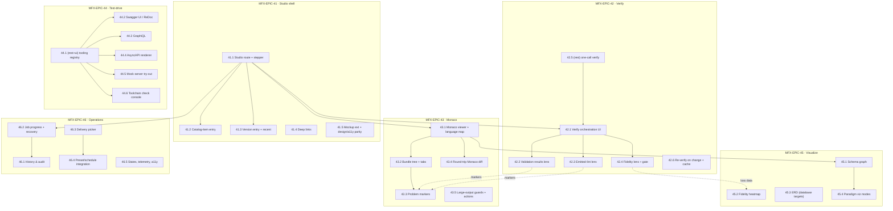
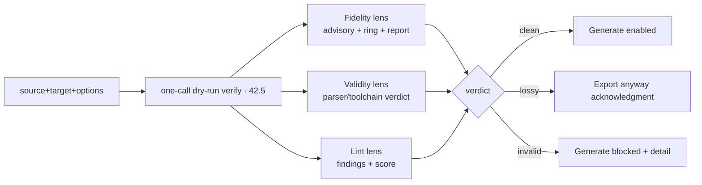
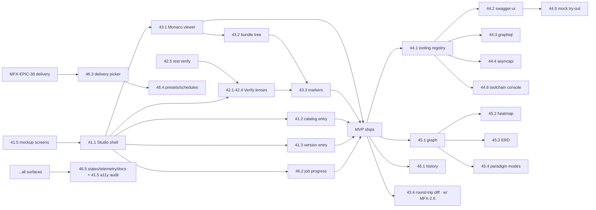

# Roadmap — Multi-Format Export: Export Studio UI (Verify · Test · View · Visualize)

> **Status:** ✅ **Issues filed on `apiome/apiome`** — **#4347–#4383** (37 total: epics
> **#4347, #4353, #4360, #4366, #4373, #4378** = MFX-EPIC-41…46; 31 children), all sub-issues under
> umbrella **#3813**.
> This document enumerates
> the UI/UX work for an enterprise-grade export experience layered over the shipped/planned MFX
> backend (`docs/ROADMAP_MULTI_FORMAT_EXPORT.md`, umbrella **#3813**). It is the export twin of
> `docs/ROADMAP_MULTI_FORMAT_IMPORT_UI.md` (MFI-EPIC-24…27) and goes **beyond** the existing
> ExportDialog mockup parity (MFX-EPIC-6/7): a full **Export Studio** with pre-generation
> verification, per-format test tooling, Monaco viewing, and export visualizations.
> **Issue ID prefix:** `MFX` (consistent with the MFX roadmap). New epics continue the sequence as
> **MFX-EPIC-41…46**; issues `MFX-n.m`.
> **GitHub title format:** `apiome: [<epic>.<issue>] <title>`.
> **Recommended labels:** `roadmap-multi-format-export`, `export`, `ui`, `typescript`, `browser`,
> `devex`, `validation`, `linting`, `multi-protocol`, `playground`, `mock-server`, `testing`,
> `design-system`, `canvas`, `rest`/`python` for enabler issues, `mvp` where flagged.

---

## 0. Source description (request, verbatim)

> Generate a UI/UX that will allow for user friendly creation of exports of cataloged imported
> APIs. This should be a professional design based on the objectified-ui project. This should be
> an enterprise grade export system that allows for imported APIs to be exported to the target
> format specified, even if it's not an OpenAPI project already. It should cover the export
> options in the ROADMAP_MULTI_FORMAT_EXPORT list that already exists. There should be a way to
> validate and verify the output of the file before generation, ability to test the format with
> appropriate testing tools, if available, linting, viewing the format using monaco-editor, and
> so on. If it makes sense to add visualization tools for the export, consider this as options
> as well.

### 0.1 Interpretation & framing

- **"objectified-ui project"** = today's `apiome-ui` (the repo was renamed). "Professional design
  based on" means: reuse the shipped design system — Radix primitives, `DashboardSideNav` /
  `dashboardScreenClasses` tokens, Lucide icons, the `ImportDialog`/`ExportDialog` stepper + card
  grid patterns, and the `frontend-design` guidance — not a novel visual language.
- **"cataloged imported APIs … even if it's not an OpenAPI project already"** = export must be a
  first-class action on **Catalog items** (non-publishable, non-OpenAPI imports: gRPC, GraphQL,
  AsyncAPI, …) **and** on project versions. Today's planned entry point (MFX-6.5 #3859) is
  version-scoped on Projects only; the Catalog detail screen (MFI-EPIC-23/24/25) has **no export
  action**. Because every import lands in `CanonicalApi` (MFI-EPIC-2), a catalog item is just as
  exportable as a project version — the UI is the missing piece.
- **"cover the export options in the ROADMAP_MULTI_FORMAT_EXPORT list"** = the target grid and all
  Studio surfaces are **registry-driven** (`GET /export/targets`, MFX-1.2 #3835): every registered
  emitter — MVP five (OpenAPI, AsyncAPI, GraphQL, gRPC/Protobuf, Avro) through the gap-pass targets
  (JSON Schema, XSD, copybook, EDI, SQL DDL, Postman, MCP/A2A, …, epics 9–40) — appears
  automatically with its per-source fidelity badge. No per-format UI code for the grid.
- **"validate and verify the output before generation"** = a **Verify workbench** stage that runs
  the dry-run pipeline (fidelity preview MFX-2.5 #3842 · emitted-output validation MFX-5.1 #3852 ·
  emitted-artifact lint MFX-5.2 #3853) and renders the results **before** the user commits to
  generating/downloading/delivering the artifact.
- **"test the format with appropriate testing tools, if available"** = a per-target **test-drive**
  layer: Swagger UI/ReDoc for OpenAPI (#2287), GraphiQL for GraphQL SDL (#1365), AsyncAPI React
  renderer for AsyncAPI, mock-server try-out (#1894/#2282), and toolchain checks (buf/tsp/smithy…)
  surfaced with an output console. "If available" is a capability flag per target — the UI shows
  only what the target supports.
- **"viewing the format using monaco-editor"** = read-only Monaco viewing of the emitted artifact
  with per-format syntax highlighting, a **bundle tree** for multi-file outputs (proto packages,
  WSDL+XSD, Avro subjects), inline problem markers from validation/lint, and Monaco **diff** views
  (source↔round-trip). Precedents already in-repo: the Catalog Monaco source viewer (MFI-25.4
  #4089, `catalog-source-language.ts`) and the studio `ExportWizard.tsx` (canvas export) which
  already previews text formats in Monaco.
- **"visualization tools … consider this as options"** = optional, v2-tier visual modes: schema
  graph of the emitted artifact (React Flow, as in Studio/paths), a **fidelity heatmap** overlay
  (where in the API the loss happens), ERD for database targets, channel topology for event
  targets. Aligns with (does not duplicate) #2209/#1754/#1051 which target *cataloged* schemas,
  not emitted artifacts.

### 0.2 What already exists (build on, do NOT rebuild)

| Already owned elsewhere | Where | This roadmap's relationship |
|---|---|---|
| ExportDialog + target-card grid + options | **MFX-6.1 #3855** | Studio embeds/extends the same components; dialog remains the quick path |
| Fidelity warning panel + report (advisory, preserved-% ring, chips) | **MFX-6.2 #3856**, MFX-2.4 #3841 | Reused as the fidelity lens of the Verify workbench |
| Preview + download (emitted preview, valid badge) | **MFX-6.3 #3857** | Superseded-in-place: 43.x deepens it (Monaco, bundle tree, markers) |
| Round-trip diff view | **MFX-6.4 #3858** | 43.4 implements it as a Monaco diff editor within the Studio |
| Version-scoped entry points + pre-summary + recent exports | **MFX-6.5 #3859** | 41.3 wires them to the Studio; 41.2 adds the **catalog** entry |
| Public browse export + advisory + guards | MFX-EPIC-7 #3860–#3862 | Browse gets the *dialog* flow only; Studio is authenticated apiome-ui |
| Batch / preset / schedule UI | **MFX-39.5 #4337** | 46.x integrates presets/schedules into Studio; does not re-spec them |
| Delivery channels backend (git/webhook/S3) + profiles | MFX-EPIC-38 #4327–#4331 | 46.3 is the delivery-destination picker UX over 38.4 profiles |
| Export job engine, dry-run, status | MFX-3.x #3844–#3847 | The Studio's data layer |
| Emitted-output validation / lint / gating (backend) | MFX-5.1–5.3 #3852–#3854 | 42.x is their UI |
| Catalog list/detail UI, Monaco source viewer, LintReportDialog | MFI-EPIC-23–25 (#4010–#4021, #4081–#4093) | Entry points + component reuse (`catalog-source-language.ts`, lint panel patterns) |
| Canvas ExportWizard (PNG/SVG/Mermaid…) | `apiome-ui/src/app/components/ade/studio/ExportWizard.tsx` | Different feature (diagram export); precedent for Monaco-in-export-dialog |
| Design mockup (dialog, fidelity panel, result, browse) | `docs/planning/mockups/multi-format-export/` | Extended by 41.5 with Studio/Verify/Test-drive screens |

### 0.3 Available backend contract (what the UI can call today/soon)

All JWT/tenant-scoped unless noted:

- **Targets** `GET /export/targets?artifact&version` → emitter descriptors + capability profile +
  cheap per-source fidelity tier (`lossless`/`lossy`/`types-only`) + preserved-% estimate (MFX-1.2,
  2.5). Drives the card grid, badges, and pre-summaries.
- **Preview (dry-run)** `POST /export/preview` → full `LossinessReport` without producing the
  artifact (MFX-2.5).
- **Export job** submit → `GET /export/jobs/{id}` → state, fidelity report, validation results,
  artifact/download ref (single file or zip bundle + manifest) (MFX-3.1/3.4, 4.1/4.2).
- **Validation & lint of emitted output** — run inside the job (MFX-5.1/5.2), gating + results
  surfaced on the job (MFX-5.3).
- **Delivery profiles** (when MFX-38.4 lands) → destinations for the deliver step.
- **Catalog** `GET /v1/catalog/{tenant}[/{item}]` → the non-OpenAPI sources (MFI-EPIC-23).

**Enabler gaps this roadmap documents as REST issues** (thin, additive):
1. **One-call Verify orchestration** — the Verify workbench needs preview + validate + lint in a
   single dry-run without downloading an artifact; today validation/lint only run inside a real
   job. → **MFX-42.5 (rest)**.
2. **Per-target tooling capability flags** — which test-drive tools apply to a target
   (`swagger-ui`, `graphiql`, `asyncapi-render`, `mock-server`, `toolchain:{buf,tsp,…}`) must come
   from the emitter descriptor so the UI never hardcodes format knowledge. → **MFX-44.1 (rest)**.
3. **Export history query** — recent exports exist per-version (MFX-6.5); the audit screen needs a
   tenant-wide, filterable listing. → **MFX-46.1 (rest part)**.

### 0.4 The Export Studio concept (one screen model)

```
Projects → version ─┐                                            ┌─ Download
Catalog → item ─────┼─▶  EXPORT STUDIO  (full-height surface)    ├─ Deliver (git PR / webhook / S3 / registry)
Recent exports ─────┘                                            └─ Save preset / schedule
        ┌──────────────────────────────────────────────────────────────────────┐
        │ ① Source          ② Target            ③ Options       ④ Verify       │  numbered stepper
        │ (version/item,    (registry card      (per-emitter    (fidelity +    │  (ImportDialog pattern)
        │  paradigm, stats)  grid + badges)      options form)   validate +    │
        │                                                        lint + gate)  │
        │ ⑤ Review & Generate                                                  │
        │ ┌──────────────┬───────────────────────────────────────────────────┐ │
        │ │ bundle tree  │  Monaco viewer (read-only, per-format language,   │ │
        │ │ (multi-file) │  problem markers, diff mode, test-drive tabs,     │ │
        │ │              │  visualization mode)                              │ │
        │ └──────────────┴───────────────────────────────────────────────────┘ │
        └──────────────────────────────────────────────────────────────────────┘
```

The **ExportDialog (MFX-6.1) remains the quick path** (pick target → fidelity warning → export).
The Studio is the "power path" the dialog's *"Open in Export Studio"* action escalates to — same
registry, same fidelity components, deeper verification/preview/testing. Both are version/item
scoped; neither is a global nav item (MFX-6.5 decision).

---

## 1. MVP Definition

**MVP = an authenticated user exports any cataloged import (catalog item OR project version) to
any registered target with confidence, having seen — before generation — that the output is
valid, lint-clean, and honestly fidelity-scored, and having viewed the artifact in Monaco:**

1. **Entry points:** "Export" on the Catalog item detail (any paradigm — the "not an OpenAPI
   project" case) and on the project version view; both open the Studio pre-scoped to that source.
   *(41.1, 41.2, 41.3)*
2. **Target & options:** registry-driven card grid with per-source fidelity badges + per-emitter
   options form with sensible defaults — every MFX target appears automatically. *(41.1 reusing
   MFX-6.1/1.4)*
3. **Verify before generate:** one Verify step runs dry-run fidelity preview + emitted-output
   validation + emitted-artifact lint, rendered as a three-lens workbench with a single
   go/no-go verdict and the "Export anyway" gate for lossy conversions. *(42.1–42.4 + 42.5 rest)*
4. **View:** the verified artifact renders read-only in Monaco with correct language per format,
   a bundle tree for multi-file outputs, and validation/lint findings as inline problem markers.
   *(43.1–43.3)*
5. **Generate & download:** single file or zip; job progress with structured errors. *(46.2 core +
   MFX-6.3)*

**Explicitly out of MVP** (documented below, v2): test-drive tooling (44.x — ships right after
MVP, OpenAPI Swagger-UI embed first), visualizations (45.x), round-trip Monaco diff (43.4),
delivery destination picker (46.3, needs MFX-38.x), export history & audit screen (46.1), preset/
schedule integration (46.4, needs MFX-39.x), deep links (41.4), mockup extension + a11y audit
pass (41.5 finishes post-MVP).

**Non-goals:** re-specifying ExportDialog/fidelity-panel internals (MFX-6.1/6.2), public-browse
export UX (MFX-EPIC-7), batch/preset/schedule mechanics (MFX-39.x), delivery backends
(MFX-EPIC-38), any emitter/validator behavior (MFX epics 1–5, 9–40), and canvas/diagram image
export (`ExportWizard.tsx` — a different feature).

---

## 2. Epics overview

| Epic | Title | Issues | Theme | MVP |
|---|---|---|---|---|
| **MFX-EPIC-41** #4347 | Export Studio shell & entry points | 41.1–41.5 | Studio route/stepper, catalog + version entries, deep links, design parity | ● core |
| **MFX-EPIC-42** #4353 | Verify workbench (fidelity · validation · lint) | 42.1–42.6 | Pre-generation dry-run, three-lens results, go/no-go gate | ● core |
| **MFX-EPIC-43** #4360 | Monaco artifact viewer & bundle explorer | 43.1–43.5 | Read-only Monaco, language map, bundle tree, problem markers, diff | ● core |
| **MFX-EPIC-44** #4366 | Format test-drive tooling | 44.1–44.6 | Tooling registry, Swagger UI/GraphiQL/AsyncAPI embeds, mock try-out, toolchain console | ○ v2 (44.1/44.2 front) |
| **MFX-EPIC-45** #4373 | Export visualizations | 45.1–45.4 | Schema graph, fidelity heatmap, ERD, paradigm modes | ○ v2 (optional) |
| **MFX-EPIC-46** #4378 | Enterprise operations UX | 46.1–46.5 | History/audit, job progress & recovery, delivery picker, preset/schedule integration, states & a11y | ◐ partial (46.2 core) |



---

# Epics & issues

> Complexity ∈ {S, M, L, XL}. Unless stated otherwise, module = `apiome-ui`
> (`src/app/ade/dashboard/…` + `src/app/components/ade/dashboard/export/…`), stack = Next.js App
> Router, TypeScript, Radix, TanStack Query, `@monaco-editor/react`, Lucide.

---

## MFX-EPIC-41 — Export Studio shell & entry points · #4347

The Studio surface itself: a full-height, stepper-driven route that both entry points (catalog
item, project version) open pre-scoped, matching apiome-ui's design system. The ExportDialog
(MFX-6.1) gains an *"Open in Export Studio"* escalation.

| ID | Title | Summary | Labels | Parallel | MVP | Complexity | Affected Modules |
|----|-------|---------|--------|----------|-----|-----------|------------------|
| 41.4 #4351 | Deep links & resumable Studio state | URL-encoded source/target/options; shareable, reload-safe | export,ui,typescript | Y | N | S | apiome-ui |
| 41.5 #4352 | Mockup extension + design/a11y parity | extend `mockups/multi-format-export` with Studio screens; token/a11y audit | export,ui,design-system | Y | N | M | apiome-ui,docs |

### MFX-41.1 — Export Studio route + stepper shell · #4348
- **Status (done).** Shipped the tenant/version-scoped route `…/ade/dashboard/export/studio`
  with the numbered **Source → Target → Options → Verify → Review & Generate** stepper. The
  ExportDialog's target-card grid and generated options form were extracted into shared
  components (`ExportTargetGrid`, `ExportOptionsForm`) that both the dialog and the Studio mount —
  not a fork. The Options step validates against the emitter schema (`validateExportOptions`,
  including required options); forward-navigation is gated (no Verify without a target, no Generate
  until Verify ran or the user skips with the lossy loss acknowledged); stepper state survives
  navigation. The ExportDialog gained an **"Open in Export Studio"** footer action that carries
  the current source + target selection into the Studio via `exportStudioLink`. The escalation
  also carries the launch **origin** (so the Studio's back link returns to Versions *or* Catalog,
  not always Versions) and, for catalog sources, the **source format**: the redundant same-format
  target is hidden (no GraphQL→GraphQL round-trip) and replaced by an **Original source** option
  that downloads the stored source unchanged (`filterSameFormatTargets` + `OriginalSourceOption`).
  Covered by `ExportStudio.test.tsx`, `exportStudioLink.test.ts`, and new
  `validateExportOptions` / format-matching tests.
- **Problem.** The planned ExportDialog (MFX-6.1) is a modal: right for quick exports, too small
  for verify-then-generate workflows with Monaco viewing, test tools, and visualizations. There is
  no surface where an enterprise user can *work* an export.
- **Solution / Scope.** A dashboard route `…/ade/dashboard/export/studio` (tenant-scoped,
  version/item-scoped via params — never a bare global screen): numbered stepper **Source →
  Target → Options → Verify → Review & Generate**, following the `ImportDialog`/mockup stepper
  pattern and `dashboardScreenClasses` tokens. Target step embeds the same registry-driven
  card grid + per-source fidelity badges as MFX-6.1 (shared component, not a fork); Options step
  renders the per-emitter options schema (MFX-1.4) as a generated form with defaults. Steps gate
  forward-navigation (no Verify until a target is picked; no Generate until Verify ran or the user
  explicitly skips with a lossy-acknowledged flag). ExportDialog gets an *"Open in Export
  Studio"* footer action carrying its current selection.
- **Acceptance Criteria.** Studio opens scoped from either entry with source pre-selected; all
  registered targets render with badges; options form validates against the emitter schema;
  stepper state survives step navigation; dialog escalation carries selection; look-and-feel
  matches the design system (audited against `frontend-design` guidance).
- **Dependencies / Parallelism.** After MFX-6.1 #3855 (shared grid) and MFX-1.2/1.4. Blocks
  41.2/41.3/42.x/43.x. Root of this roadmap.
- **Technical Stack.** Next.js App Router, Radix, TanStack Query.

### MFX-41.2 — Catalog-item export entry (the non-OpenAPI case) · #4349
- **Status (done).** The entry points first shipped ahead of the Studio (#4587's PR) as the
  quick `ExportDialog` path; now that MFX-41.1 has landed, both the catalog list row action
  (**"Export to another format…"**) and the detail idhead **Export** CTA (beside Convert) route
  to the version-scoped **Export Studio** (`exportStudioHref`), pre-scoped to the item and
  carrying the launch **origin** (back-link → Catalog) and **source format** (the redundant
  same-format target is hidden, the original source offered unchanged). The Studio's **Source**
  step now renders catalog-item context for a catalog launch — the `FormatPill`/`ProtocolPill`
  and the normalized service/operation/type/channel counts (`useCatalogSourceContext`) — and
  restates that exporting produces an artifact and never turns the item into a project. The
  Convert/Export distinction remains in the shared UI copy (`CATALOG_EXPORT_VS_CONVERT_COPY`),
  Convert is untouched, and the Studio records each generate in the MFX-6.5 recent-exports store.
  The REST export dispatch is artifact-scoped (no project gate) — no rest fix needed. Covered by
  `ExportStudio.test.tsx` (catalog context), `useCatalogSourceContext.test.tsx`,
  `catalog-item-detail.test.tsx`, and `catalog-projects-boundary.test.ts`.
- **Problem.** The request's core: *"allows for imported APIs to be exported … even if it's not an
  OpenAPI project already."* Catalog items (gRPC/GraphQL/AsyncAPI/… — non-publishable, MFI-EPIC-23)
  have Convert-to-OpenAPI as their only exit; there is no Export action anywhere on the catalog
  surfaces, and MFX-6.5's entry points are Projects-only.
- **Solution / Scope.** Add **Export** as a primary CTA on the catalog detail idhead (beside
  Convert, MFI-25.1) and a row/card action on the catalog list; both open the Studio scoped to the
  item's `CanonicalApi` artifact/version. The Studio's Source step renders catalog-item context
  (format pill, paradigm, summary counts — reuse `FormatPill`/`ProtocolPill`). The target grid's
  fidelity badges are computed for *this* source (an AsyncAPI item shows AsyncAPI/JSON-Schema as
  high-fidelity, Avro as types-only, RAML as REST-only-warned) — making cross-paradigm honesty
  visible at the entry. Distinct from Convert: **Convert mints a Project; Export produces an
  artifact and never mutates the catalog item** — copy must state this.
- **Acceptance Criteria.** A gRPC catalog item exports to (e.g.) OpenAPI with the fidelity flow,
  without ever becoming a project; Export appears on list + detail; Convert remains unchanged;
  the Convert/Export distinction is stated in the UI.
- **Dependencies / Parallelism.** After 41.1; catalog surfaces from MFI-EPIC-23/24/25 (shipped).
  Requires export pipeline accepting catalog artifacts (MFX-3.2 dispatch is artifact-scoped —
  confirm; if project-gated, this issue carries the thin rest fix).
- **Technical Stack.** Next.js, existing catalog components.

### MFX-41.3 — Version entry + recent-exports wiring · #4350
- **Status (done).** The version view's three export paths now land in the Export Studio, keeping
  the quick `ExportDialog` only on the compact row-menu **"Export to another format…"** action.
  (1) **"Export this version"** deep-links to the Studio scoped to the source (`exportStudioHref`,
  origin `versions`). (2) Each **fidelity pre-summary chip** (best-fidelity + lossy rows) links to
  the Studio with that target pre-selected. (3) Each **recent-export row** gains a **"Re-run in
  Studio"** link that reproduces the prior run: it carries the target *and* that run's non-default
  option overrides. To make re-run faithful, the recorded export (`recentExports.ts`) and both
  emitters' `onExported`/`onGenerated` summaries now capture the `changedOptions` payload; the
  Studio deep link carries it as a JSON `options` param (`parseExportStudioOptions`), and the
  Studio seeds those overrides over the target defaults when it pre-selects the target (foreign
  keys ignored). Covered by updated `VersionExportPanel`, `ExportStudio`, `exportStudioLink`,
  `recentExports`, and `ExportDialog` tests.
- **Problem.** MFX-6.5 #3859 defines the version-view entry, pre-summary, and recent-exports list;
  they must open/resume the Studio, not just the dialog.
- **Solution / Scope.** "Export this version" → Studio (dialog remains on the compact action);
  each recent-export row gets *"re-run in Studio"* (pre-fills source/target/options from that run);
  the fidelity pre-summary's per-target chips deep-link to the Studio with that target selected.
- **Acceptance Criteria.** All three paths land in a correctly pre-scoped Studio; re-run
  reproduces the prior configuration.
- **Dependencies / Parallelism.** After 41.1, MFX-6.5. Parallel with 41.2.
- **Technical Stack.** Next.js.

### MFX-41.4 — Deep links & resumable Studio state · #4351
- **Problem.** Enterprise workflows are collaborative: "look at this export config" must be a URL.
- **Solution / Scope.** Encode source (artifact/version), target key, and options (hashed/compact)
  in the Studio URL; reload restores the step; unverifiable state (deleted version, unregistered
  target) degrades with a clear notice. No secrets in URLs (delivery credentials never encoded).
- **Acceptance Criteria.** Copy-link reproduces the session for a teammate with access; stale
  links degrade gracefully; tenant scoping enforced.
- **Dependencies / Parallelism.** After 41.1. Parallel with everything.
- **Technical Stack.** Next.js router, zod-validated URL state.

### MFX-41.5 — Mockup extension + design/a11y parity pass · #4352
- **Problem.** The reference mockup (`docs/planning/mockups/multi-format-export/`) covers the
  dialog, fidelity panel, result, and browse screens — not the Studio, Verify workbench, viewer,
  or test-drive surfaces. Building without a reviewed design invites drift; and the request asks
  for a *professional* enterprise design.
- **Solution / Scope.** Extend the mockup with the Studio screens (stepper, verify three-lens,
  Monaco + bundle tree, test-drive tabs, history) using the same static-HTML approach; then a
  parity/a11y audit of the built surfaces (keyboard flow through the stepper, focus management in
  Monaco containers, ARIA on verdicts/badges, color-contrast on DROP/APPROX/SYNTH/OK chips —
  which must not be color-only).
- **Acceptance Criteria.** Mockup screens reviewed before 42.x/43.x land; audit checklist passes;
  loss-kind chips carry icons/text, not color alone.
- **Dependencies / Parallelism.** Mockup part **first** (feeds 41.1/42.x/43.x); audit part last.
- **Technical Stack.** Static HTML mockup, axe/lighthouse audits.

---

## MFX-EPIC-42 — Verify workbench (fidelity · validation · lint) · #4353

The request's headline beyond MFX: *"validate and verify the output of the file before
generation."* One Verify step orchestrates the dry-run and renders three lenses — **Fidelity**
(what the conversion loses), **Validity** (is the output legal in the target format), **Lint**
(is it idiomatic) — with a single go/no-go verdict gating Generate.



| ID | Title | Summary | Labels | Parallel | MVP | Complexity | Affected Modules |
|----|-------|---------|--------|----------|-----|-----------|------------------|
| 42.2 #4355 | Validation results lens | parser/toolchain verdict, structured errors w/ locations | export,ui,validation,mvp | N | Y | M | apiome-ui |
| 42.3 #4356 | Emitted-artifact lint lens | findings list, severity chips, score; reuse LintReportDialog patterns | export,ui,linting,mvp | Y | Y | M | apiome-ui |
| 42.4 #4357 | Fidelity lens + go/no-go gate | embed MFX-6.2 panel; verdict logic; "Export anyway" acknowledgment | export,ui,mvp | Y | Y | S | apiome-ui |
| 42.5 #4358 | (rest) One-call dry-run verify endpoint | preview+validate+lint in one dry-run, no stored artifact | export,rest,python,validation,mvp | N | Y | M | apiome-rest |
| 42.6 #4359 | Re-verify on change + result caching | option-change invalidation, debounce, cached verdicts per config hash | export,ui,typescript | Y | N | S | apiome-ui |

### MFX-42.1 — Verify orchestration UI · #4354
- **Status (done).** The Studio's Verify step is now a **Verify workbench** (`VerifyWorkbench.tsx`).
  A single **Run verification** action calls the one-call dry-run (`POST /api/export/verify` →
  REST `/export/{tenant}/verify`, MFX-42.5) and yields all three lenses at once — fidelity
  (reusing the MFX-6.2 `FidelityWarningPanel`), emitted-output **validation**, and emitted-artifact
  **lint** — under one go/no-go **verdict banner** (`Clean` / `Lossy — acknowledge to continue` /
  `Invalid — export blocked`, derived in `exportVerify.ts` per the MFX-5.3 gate + MFX-3.3
  severity). Lenses lay out as **tabs-with-badges** (count per lens) on desktop and an
  **accordion** on narrow widths. The verdict gates Generate — `invalid` blocks unconditionally
  (with the validator's structured detail + location), `lossy` needs the acknowledgement, `clean`
  is the green path — and **persists to the Review step** (same banner). Changing the target or an
  option re-locks the gate and clears the verdict (a `useExportVerify` `reset`), so a stale verdict
  can never authorise a generate (auto re-verify + caching remain MFX-42.6). The per-lens rendering
  is scaffolded here for MFX-42.2 (validation) / 42.3 (lint) / 42.4 (fidelity) to deepen. Bump
  apiome-ui 0.58.0 → 0.59.0. *Built ahead of its backend enabler MFX-42.5 (#4358), which is not yet
  implemented; the UI ships against the documented `POST /export/verify` contract with a thin Next
  proxy, mirroring how 41.1–41.3 shipped against their contracts.*
- **Problem.** Verification signals exist (or will) but only inside a committed export job; users
  need them **before** generation, in one place, with one verdict.
- **Solution / Scope.** The Studio's Verify step: a **Run verification** action calling 42.5;
  progress states per lens; a verdict banner (`Clean` / `Lossy — acknowledge to continue` /
  `Invalid — export blocked` per MFX-5.3 gating + MFX-3.3 severity classes); lenses laid out as
  tabs-with-badges (counts per lens) on desktop, accordion on narrow widths. Verify results attach
  to Studio state so Review shows the same verdict.
- **Acceptance Criteria.** One click yields all three lenses + verdict; Generate is disabled until
  verify passes or lossy-acknowledged; invalid output blocks with detail; verdict persists to the
  Review step.
- **Dependencies / Parallelism.** After 41.1, 42.5. Blocks 42.2–42.4 layout.
- **Technical Stack.** Next.js, TanStack Query.

### MFX-42.2 — Validation results lens · #4355
- **Problem.** MFX-5.1/5.3 produce parser/toolchain verdicts with detail; there is no UI for them.
- **Solution / Scope.** Render the emitted-output validation result: overall verdict; structured
  error list (message, file-in-bundle, line/col where the validator provides them, tool identity —
  e.g. `buf build`, `xmlschema`, Postman collection schema); external-toolchain unavailability
  ("validator not installed on server") as a distinct warning state, not silent success. Feeds
  line markers to 43.3.
- **Acceptance Criteria.** Deliberately broken fixtures render actionable errors with locations;
  toolchain-missing renders as warning; zero-error renders a positive verdict.
- **Dependencies / Parallelism.** After 42.1. Parallel with 42.3/42.4.
- **Technical Stack.** Next.js.

### MFX-42.3 — Emitted-artifact lint lens · #4356
- **Problem.** MFX-5.2 lints the emitted artifact with the target's lint packs; findings need the
  same quality UX the import side has (`LintReportDialog`, MFI-25.5 inline lint panel).
- **Solution / Scope.** Findings list grouped by severity/category with rule ids, per-finding
  location (feeds 43.3 markers), and the 0–100 score/grade where the pack provides one; visually
  consistent with the catalog lint panel (shared subcomponents where practical). Distinguishes
  *emitted-artifact* lint from the *source's* catalog lint (copy + link to the source's report).
- **Acceptance Criteria.** Findings render grouped with locations; score/grade consistent with
  catalog lint visuals; empty state ("no lint pack for this target") explicit.
- **Dependencies / Parallelism.** After 42.1; MFX-5.2 backend. Parallel with 42.2.
- **Technical Stack.** Next.js.

### MFX-42.4 — Fidelity lens + go/no-go gate · #4357
- **Problem.** The fidelity panel exists (MFX-6.2); the Verify workbench must embed it and derive
  the gate from it plus the other lenses.
- **Solution / Scope.** Embed the MFX-6.2 panel (advisory, preserved-% ring, DROP/APPROX/SYNTH/OK
  chips, per-construct report) as the Fidelity lens; implement the verdict matrix — invalid ⇒
  block; severe/near-empty (MFX-3.3) ⇒ explicit typed acknowledgment ("export produces a
  types-only artifact"); lossy ⇒ "Export anyway" checkbox; clean ⇒ green path. Acknowledgment
  text mirrors MFX-2.4 wording exactly (single string source).
- **Acceptance Criteria.** Gate behavior matches the matrix on fixture sources (clean OpenAPI→
  OpenAPI; lossy OpenAPI→proto; severe REST→Avro); wording identical to dialog/browse/CLI.
- **Dependencies / Parallelism.** After 42.1, MFX-6.2. Parallel with 42.2/42.3.
- **Technical Stack.** Next.js.

### MFX-42.5 — (rest) One-call dry-run verify endpoint · #4358
- **Problem.** The UI needs preview + validation + lint in one round-trip **without** persisting
  an artifact; today `POST /export/preview` returns only the fidelity report, and validation/lint
  run only inside real jobs (MFX-3.1/5.x).
- **Solution / Scope.** `POST /export/verify` (artifact/version + target + options) → runs the
  emitter to a **temporary** buffer, executes MFX-5.1 validation + 5.2 lint + 2.2 fidelity, and
  returns `{fidelity: LossinessReport, validation, lint, verdict}` discarding the artifact
  (optionally returning it inline under a size cap so 43.x can render the preview from the same
  call). Tenant-scoped, rate-limited (it does real emit work), reuses the MFX-3.1 dry-run seam.
- **Acceptance Criteria.** One call returns all three results + verdict; no artifact/job row
  persisted; inline content honored under the cap with a `truncated` flag; p50 latency documented
  for the five MVP emitters.
- **Dependencies / Parallelism.** After MFX-3.1, 5.1–5.3. Blocks 42.1. The single MVP-critical
  backend enabler of this roadmap.
- **Technical Stack.** FastAPI, Python.

### MFX-42.6 — Re-verify on change + result caching · #4359
- **Problem.** Users iterate on options; stale verdicts must never gate Generate, and identical
  configs shouldn't re-pay verify latency.
- **Solution / Scope.** Hash (source fingerprint, target, options) → cache verify results per
  session; any change invalidates the verdict (Generate re-locks); debounce auto re-verify behind
  an explicit toggle ("verify automatically"); show which config a displayed verdict belongs to.
- **Acceptance Criteria.** Option change re-locks Generate; unchanged config re-entry is instant;
  displayed verdict always matches current config.
- **Dependencies / Parallelism.** After 42.1/42.5.
- **Technical Stack.** TanStack Query cache keys.

---

## MFX-EPIC-43 — Monaco artifact viewer & bundle explorer · #4360

*"Viewing the format using monaco-editor"* — read-only, syntax-highlighted viewing of exactly what
will be (or was) generated, including multi-file bundles, with verification findings as inline
markers. Deepens MFX-6.3's "preview" into a real viewer; implements MFX-6.4's diff as Monaco diff.

| ID | Title | Summary | Labels | Parallel | MVP | Complexity | Affected Modules |
|----|-------|---------|--------|----------|-----|-----------|------------------|
| 43.1 #4361 | Monaco viewer + format→language map | read-only Monaco; proto/graphql/sql/xml/yaml/json/… language registry | export,ui,typescript,mvp | N | Y | M | apiome-ui |
| 43.2 #4362 | Bundle tree + file tabs | zip-manifest tree (proto packages, WSDL+XSD, Avro subjects); tabbed viewing | export,ui,typescript,mvp | N | Y | M | apiome-ui |
| 43.3 #4363 | Problem markers from verify | validation/lint findings → Monaco markers + gutter; lens↔editor cross-nav | export,ui,validation,linting,mvp | N | Y | M | apiome-ui |
| 43.4 #4364 | Round-trip Monaco diff | source vs re-imported emitted artifact side-by-side (implements MFX-6.4) | export,ui,version-control | Y | N | M | apiome-ui |
| 43.5 #4365 | Large-output guards + viewer actions | size caps/virtualization, copy/download-file, wrap/fold, find | export,ui,typescript | Y | N | S | apiome-ui |

### MFX-43.1 — Monaco viewer + format→language map · #4361
- **Problem.** Emitted artifacts span ~20 languages (proto, GraphQL SDL, WSDL/XSD XML, YAML/JSON,
  SQL, RAML, Markdown/apib, thrift, asn.1, copybook…); the existing
  `catalog-source-language.ts` maps only import-side formats.
- **Solution / Scope.** A read-only `@monaco-editor/react` viewer component for the Verify/Review
  steps and the post-generate result; extend the language map into a shared
  `export-target-language.ts` keyed by emitter key + file extension (registry-driven: the emitter
  descriptor's `mediaType`/extensions decide, so new emitters get sane highlighting without UI
  changes; fall back to plaintext). Monaco loaded via the existing dynamic-import pattern
  (`ExportWizard.tsx` precedent) — no SSR, one shared loader.
- **Acceptance Criteria.** Each MVP emitter's output highlights correctly; unknown targets degrade
  to plaintext; theme matches app dark/light; loads lazily.
- **Dependencies / Parallelism.** After 41.1 (+ content from 42.5 or job result). Blocks 43.2–43.5.
- **Technical Stack.** `@monaco-editor/react`, shared language registry util.

### MFX-43.2 — Bundle tree + file tabs · #4362
- **Problem.** Multi-file targets (MFX-4.2: per-package `.proto` + imports, WSDL+XSDs, per-subject
  `.avsc`, Bruno folders) can't be reviewed as one blob.
- **Solution / Scope.** Left-rail file tree driven by the bundle manifest (folder structure,
  per-file size + validation/lint badge counts); click opens in the viewer (tab strip for recent
  files); virtualized for large bundles; the tree is the navigation backbone for 43.3 markers.
- **Acceptance Criteria.** A multi-package proto export navigates per file; badges show per-file
  finding counts; single-file targets skip the tree entirely.
- **Dependencies / Parallelism.** After 43.1. Blocks 43.3.
- **Technical Stack.** Radix tree/scroll primitives.

### MFX-43.3 — Problem markers from verify results · #4363
- **Problem.** Findings in a list are half the story; enterprise users expect IDE behavior —
  squiggles at the offending line.
- **Solution / Scope.** Map 42.2 validation errors and 42.3 lint findings (file + line/col where
  available) onto Monaco markers (`setModelMarkers`) with severity mapping; gutter decorations;
  click a finding in a lens → open file + reveal line; click a marker → highlight the finding.
  Findings without locations stay list-only (no fake positions).
- **Acceptance Criteria.** Located findings round-trip lens↔editor; severities render distinctly;
  no markers fabricated for location-less findings.
- **Dependencies / Parallelism.** After 43.2, 42.2/42.3.
- **Technical Stack.** monaco markers API.

### MFX-43.4 — Round-trip Monaco diff (implements MFX-6.4) · #4364
- **Problem.** MFX-6.4 #3858 specs a round-trip diff view ("what changes if re-imported"); the
  Studio should deliver it as a real side-by-side.
- **Solution / Scope.** Two modes on the viewer: **model diff** (canonical-model diff from MFX-2.6
  rendered as a structured change list — reuse the versions-diff components) and **text diff**
  (Monaco `DiffEditor`: source serialization vs emitted artifact for same-format round-trips).
  Entry from the Fidelity lens ("see what a round-trip changes"). Marked v2 with MFX-2.6.
- **Acceptance Criteria.** Same-format round-trip shows an accurate text diff; cross-format shows
  the structured model diff; predicted DROPs visibly correlate.
- **Dependencies / Parallelism.** After 43.1, MFX-2.6 (v2 backend). Coordinate with #3858 —
  this issue *implements* it; do not double-file scope.
- **Technical Stack.** Monaco DiffEditor.

### MFX-43.5 — Large-output guards + viewer actions · #4365
- **Problem.** Enterprise APIs emit megabyte bundles; Monaco with unbounded content degrades.
- **Solution / Scope.** Per-file size cap with "open raw / download instead" fallback; total
  inline-content budget honoring 42.5's `truncated` flag (fetch-on-demand per file from the job
  artifact); standard actions: copy file, download file, download bundle, toggle wrap, folding,
  find-in-file.
- **Acceptance Criteria.** A deliberately huge fixture stays responsive; truncation is explicit;
  actions work on every file type.
- **Dependencies / Parallelism.** After 43.1/43.2.
- **Technical Stack.** monaco config, streaming fetch.

---

## MFX-EPIC-44 — Format test-drive tooling · #4366

*"Ability to test the format with appropriate testing tools, if available."* A capability-driven
test-drive layer: each target declares which tools apply; the Studio renders only those. Never
hardcode format knowledge in the UI.

| ID | Title | Summary | Labels | Parallel | MVP | Complexity | Affected Modules |
|----|-------|---------|--------|----------|-----|-----------|------------------|
| 44.1 #4367 | (rest+ui) Per-target tooling registry | emitter descriptors declare test tools; UI renders capability-driven tabs | export,rest,ui,devex | N | N | M | apiome-rest,apiome-ui |
| 44.2 #4368 | OpenAPI test-drive (Swagger UI / ReDoc) | embedded interactive docs over the emitted OpenAPI (reconciles #2287) | export,ui,playground | N | N | M | apiome-ui |
| 44.3 #4369 | GraphQL test-drive (GraphiQL) | GraphiQL vs emitted SDL w/ mock resolvers (aligns #1365) | export,ui,playground | Y | N | M | apiome-ui |
| 44.4 #4370 | AsyncAPI test-drive (renderer) | AsyncAPI React component rendering of the emitted doc | export,ui,playground | Y | N | S | apiome-ui |
| 44.5 #4371 | Mock-server try-out | ephemeral mock from emitted artifact; "try it" requests (reconciles #1894/#2282) | export,ui,mock-server,rest | Y | N | L | apiome-ui,apiome-rest |
| 44.6 #4372 | Toolchain check console | run target toolchain checks (buf/tsp/smithy/…) on demand; streamed output panel | export,ui,rest,devex,validation | Y | N | M | apiome-ui,apiome-rest |

### MFX-44.1 — (rest+ui) Per-target tooling registry · #4367
- **Problem.** "If available" must be data, not UI switch statements — otherwise every new emitter
  means UI changes, breaking the registry principle.
- **Solution / Scope.** Extend the emitter descriptor (MFX-1.1/1.2) with
  `testTools: [{kind: swagger-ui|redoc|graphiql|asyncapi-render|mock-server|toolchain, …params}]`;
  `GET /export/targets` carries it; the Studio's Review step renders a **Test drive** tab strip
  from these flags. Server-side tools (mock, toolchain) also flag availability (installed?
  enabled for tenant?) so the UI can show "unavailable on this server" honestly.
- **Acceptance Criteria.** Tool tabs appear/disappear per target from registry data alone; a new
  emitter with declared tools needs zero UI changes; unavailable tools render disabled-with-reason.
- **Dependencies / Parallelism.** After MFX-1.2. Blocks 44.2–44.6. Front of the v2 queue.
- **Technical Stack.** FastAPI (descriptor), Next.js (tab strip).

### MFX-44.2 — OpenAPI test-drive (Swagger UI / ReDoc) · #4368
- **Problem.** The universal expectation for OpenAPI output: browse it as interactive docs before
  shipping it. #2287 asks for Swagger UI/ReDoc preview generally; nothing binds it to exports.
- **Solution / Scope.** Embed Swagger UI (and ReDoc as a read-only alternate) in a Test-drive tab,
  fed the emitted document from the verify buffer/job artifact (blob URL — no server round-trip);
  sandboxed (iframe, CSP; "try it out" requests disabled unless 44.5 provides a mock base URL).
  Applies to OpenAPI 2.0/3.0/3.1(/3.2) targets and any emitter declaring `swagger-ui`.
- **Acceptance Criteria.** Emitted OpenAPI renders in both viewers; no network calls without a
  mock target; large specs stay responsive.
- **Dependencies / Parallelism.** After 44.1, 43.1. Reconciles **#2287** (fold or cross-link).
- **Technical Stack.** `swagger-ui-react`/redoc bundle, sandboxed iframe.

### MFX-44.3 — GraphQL test-drive (GraphiQL) · #4369
- **Problem.** GraphQL consumers judge a schema in GraphiQL; the emitted SDL should be explorable
  (docs, autocomplete) immediately.
- **Solution / Scope.** GraphiQL embedded against a **client-side mock**: build the schema from
  emitted SDL (`graphql`/`@graphql-tools/mock`) with type-appropriate mock resolvers; docs
  explorer + autocomplete work fully offline; clearly labeled "mock data". Aligns with #1365
  (playground for cataloged schemas) — shared embed component, different data source.
- **Acceptance Criteria.** Emitted SDL explorable with working autocomplete/docs; queries return
  mock data; invalid SDL (can't happen post-verify, but defensively) degrades to a notice.
- **Dependencies / Parallelism.** After 44.1, 43.1. Parallel with 44.2.
- **Technical Stack.** graphiql, @graphql-tools/mock.

### MFX-44.4 — AsyncAPI test-drive (renderer) · #4370
- **Problem.** AsyncAPI artifacts are best judged in the standard AsyncAPI documentation renderer.
- **Solution / Scope.** Embed `@asyncapi/react-component` (standalone bundle) rendering the
  emitted AsyncAPI 2/3 document; channels/operations/messages navigable.
- **Acceptance Criteria.** Emitted AsyncAPI renders with navigable channels; versions 2.x and 3.x
  both supported.
- **Dependencies / Parallelism.** After 44.1, 43.1. Parallel with 44.2/44.3.
- **Technical Stack.** @asyncapi/react-component.

### MFX-44.5 — Mock-server try-out · #4371
- **Problem.** "Test the format" at its strongest: hit a live mock of the exported API. The Mock
  Server epics (#1894, #2282, #1156/#1164) plan mocks from *cataloged* specs; exports need an
  ephemeral mock from the *emitted* artifact.
- **Solution / Scope.** For targets a mock backend supports (OpenAPI first; GraphQL via 44.3's
  client mock), a **Start mock** action provisions a short-lived, tenant-scoped mock instance
  from the emitted artifact (reusing the Mock Server infrastructure — this issue is the *binding*,
  not a second mock engine); Swagger UI "try it out" (44.2) targets it; auto-teardown TTL;
  request log panel. If the mock infra isn't deployed, the capability flag (44.1) hides the tab.
- **Acceptance Criteria.** Emitted OpenAPI gets a live mock URL in one click; requests round-trip
  with schema-shaped responses; instances expire; absent infra degrades to hidden/disabled.
- **Dependencies / Parallelism.** After 44.1/44.2 and the Mock Server epic's engine (#1894 — hard
  dependency; coordinate, don't duplicate). Largest test-drive item.
- **Technical Stack.** Next.js; mock-server REST API (existing epic).

### MFX-44.6 — Toolchain check console · #4372
- **Problem.** For IDL targets the authoritative "test" is the format's own toolchain (`buf
  build/lint`, `tsp compile`, `smithy build`, `asn1tools`, drafter…) — already runnable server-side
  (MFX-8.3 / MFI-EPIC-5) but with no on-demand UI.
- **Solution / Scope.** A Test-drive tab listing the target's declared toolchain checks (44.1);
  **Run** executes via the toolchain runner against the verify buffer/job artifact and streams
  stdout/stderr into a console panel (monospace, ANSI-safe, copyable); exit status chips; results
  attach to the verify report. Server availability honestly surfaced (runner's
  `ToolNotAvailableError` → "not installed").
- **Acceptance Criteria.** `buf lint` on an emitted proto bundle streams output and reports exit
  status; missing tool renders as unavailable-with-reason; runs are tenant-scoped + rate-limited.
- **Dependencies / Parallelism.** After 44.1; MFX-8.3 toolchain reuse. Needs a thin rest endpoint
  (`POST /export/verify/{id}/tool-checks/{tool}` or equivalent) — included in this issue.
- **Technical Stack.** FastAPI (runner binding), Next.js console panel.

---

## MFX-EPIC-45 — Export visualizations (optional tier) · #4373

*"If it makes sense to add visualization tools for the export, consider this as options as well."*
It makes sense in four places — all v2, all optional modes on the Review step's viewer, none
blocking export flows.

| ID | Title | Summary | Labels | Parallel | MVP | Complexity | Affected Modules |
|----|-------|---------|--------|----------|-----|-----------|------------------|
| 45.1 #4374 | Emitted-schema graph view | React Flow graph of types/relations in the emitted artifact | export,ui,canvas | N | N | M | apiome-ui |
| 45.2 #4375 | Fidelity heatmap overlay | loss kinds painted onto the schema graph / construct treemap | export,ui,canvas | N | N | M | apiome-ui |
| 45.3 #4376 | ERD mode for database targets | tables/columns/FKs for SQL DDL / DBML / Prisma outputs (MFX-EPIC-35) | export,ui,canvas,database | Y | N | M | apiome-ui |
| 45.4 #4377 | Paradigm-specific viz modes | proto package/import graph; event channel topology; RPC service map | export,ui,canvas,multi-protocol | Y | N | M | apiome-ui |

### MFX-45.1 — Emitted-schema graph view · #4374
- **Problem.** Reviewers grasp structure faster as a graph than as files, especially cross-format
  ("what did my AsyncAPI become in GraphQL?").
- **Solution / Scope.** A **Visualize** tab: React Flow (already app-standard via Studio/paths)
  graph of the emitted artifact's types + references (nodes: types/services; edges: field refs,
  operation I/O), derived from the *canonical model post-conversion* (the fidelity engine's view)
  so it's format-agnostic; auto-layout (dagre/elk per existing canvas patterns); click node →
  reveal in Monaco (43.x). Read-only; distinct from the *catalog* graph work (#2209/#1754 — those
  visualize source schemas; cross-link, share layout utils).
- **Acceptance Criteria.** MVP-emitter outputs render a navigable graph; node click reveals the
  construct in the viewer; 500-type artifacts stay usable (virtualized/clustered).
- **Dependencies / Parallelism.** After 43.1. Blocks 45.2/45.4.
- **Technical Stack.** @xyflow/react, existing layout utils.

### MFX-45.2 — Fidelity heatmap overlay · #4375
- **Problem.** The per-construct loss report is a *list*; showing **where** the API loses fidelity
  is the visualization only apiome can offer (the differentiator, visualized).
- **Solution / Scope.** Overlay the 45.1 graph with loss-kind coloring per node/edge
  (DROP/APPROX/SYNTH/OK, same palette + iconography as the chips — not color-only); legend with
  counts; filter by kind; hover → the LossItem detail; alternate compact **treemap** by construct
  path for large APIs. Data straight from the `LossinessReport` (stable construct keys, MFX-2.1).
- **Acceptance Criteria.** A lossy proto export shows exactly which messages/fields degrade and
  how; filters isolate kinds; matches report counts exactly.
- **Dependencies / Parallelism.** After 45.1, 42.4.
- **Technical Stack.** @xyflow/react overlays.

### MFX-45.3 — ERD mode for database targets · #4376
- **Problem.** SQL DDL/DBML/Prisma outputs (MFX-EPIC-35 #4310) are judged as ER diagrams, not as
  DDL text.
- **Solution / Scope.** When the target is a database family, the Visualize tab renders an ERD:
  tables with column lists (type, NOT NULL, keys), FK edges, junction tables flagged as SYNTH
  (from the fidelity report's projection decisions). Derived from the emitter's relational
  projection metadata (coordinate with MFX-35.1 to expose it in the emit result).
- **Acceptance Criteria.** A SQL export renders a correct ERD incl. synthesized keys/junctions
  marked; toggles between ERD and DDL text preserve selection.
- **Dependencies / Parallelism.** After 45.1; MFX-35.1 metadata. Parallel with 45.4.
- **Technical Stack.** @xyflow/react ERD node types.

### MFX-45.4 — Paradigm-specific viz modes · #4377
- **Problem.** Some targets have structure the generic type graph misses.
- **Solution / Scope.** Three additional modes behind the same tab: **proto package/import graph**
  (files as nodes, imports as edges — pairs with 43.2's tree), **event channel topology**
  (channels ↔ messages ↔ operations for AsyncAPI/xRegistry targets), **RPC service map**
  (services → methods → message types). Modes register per target family via the same descriptor
  capability mechanism as 44.1 (no UI hardcoding).
- **Acceptance Criteria.** Each mode renders for its family and is absent otherwise; mode choice
  persists per target in session.
- **Dependencies / Parallelism.** After 45.1.
- **Technical Stack.** @xyflow/react.

---

## MFX-EPIC-46 — Enterprise operations UX · #4378

The "enterprise grade" wrapper: observable jobs, auditable history, delivery destinations,
preset/schedule integration, and hardened states.

| ID | Title | Summary | Labels | Parallel | MVP | Complexity | Affected Modules |
|----|-------|---------|--------|----------|-----|-----------|------------------|
| 46.1 #4379 | Export history & audit screen | tenant-wide filterable history; per-run fidelity %, verdicts, re-run | export,ui,rest,monitoring | N | N | M | apiome-ui,apiome-rest |
| 46.2 #4380 | Job progress & failure recovery | staged progress, structured errors, retry/resume, partial-bundle handling | export,ui,mvp | N | Y | M | apiome-ui |
| 46.3 #4381 | Delivery destination picker | download vs git PR / webhook / S3 / registry; profile select + result links | export,ui,integrations | Y | N | M | apiome-ui |
| 46.4 #4382 | Preset & schedule integration | save Studio config as preset; subscribe to publish (binds MFX-39.3/39.4/39.5) | export,ui,automation | Y | N | S | apiome-ui |
| 46.5 #4383 | States, empty/error patterns, telemetry & docs | loading/empty/error catalog, usage telemetry, user docs | export,ui,devex,documentation | Y | N | S | apiome-ui,docs |

### MFX-46.1 — Export history & audit screen · #4379
- **Problem.** MFX-6.5 gives a per-version recent list; enterprises need the tenant answer to
  "who exported what, where, with how much loss?".
- **Solution / Scope.** A dashboard screen listing export runs (filter: project/catalog item,
  target, actor, date, delivery channel, verdict): each row shows source@version → target,
  fidelity preserved-%, validation/lint verdicts, delivery outcome, actor; row detail opens the
  stored fidelity/verify report read-only; **Re-run in Studio** (41.3 mechanism). **(rest part)**
  a tenant-wide, paginated `GET /export/jobs?filters…` listing endpoint if MFX-3.4 exposes only
  per-job reads. Coordinates with the MFX-38.4 delivery audit trail.
- **Acceptance Criteria.** Filterable history with per-run verdicts; detail renders stored
  reports; re-run pre-fills the Studio; tenant-scoped.
- **Dependencies / Parallelism.** After 46.2; rest part after MFX-3.4.
- **Technical Stack.** Next.js table patterns, FastAPI (listing).

### MFX-46.2 — Job progress & failure recovery · #4380
- **Problem.** Export is a multi-stage async job (emit → fidelity → validate → package → deliver);
  a spinner is not enterprise-grade, and failures must be actionable.
- **Solution / Scope.** Staged progress in the Studio's Generate phase mirroring MFX-3.1 states;
  per-stage error surfaces (emitter error vs validation gate vs packaging vs delivery) with the
  structured detail from MFX-3.4; **Retry** re-submits the same config; validation-gate failures
  route back to the Verify lenses with results loaded; long-running jobs survive navigation
  (background poll + toast on completion, resume via 41.4 state).
- **Acceptance Criteria.** Each stage visible; each failure class renders its detail + correct
  recovery action; leaving/returning mid-job resumes cleanly.
- **Dependencies / Parallelism.** After 41.1; MFX-3.4. MVP.
- **Technical Stack.** TanStack Query polling, toasts.

### MFX-46.3 — Delivery destination picker · #4381
- **Problem.** MFX-EPIC-38 adds git/webhook/S3 delivery and 38.4 profiles; MFX-4.4 adds registry
  push — none has UI.
- **Solution / Scope.** The Review step's **Deliver** section: Download (default) plus
  profile-driven destinations (38.4 CRUD linked, not re-implemented); per-channel result rendering
  (PR link, webhook receipt, object URL, registry subject/version); destination choices persist
  into presets (46.4). Credentials never rendered; profile management links to its own settings
  surface.
- **Acceptance Criteria.** An export lands as a git PR from the Studio with the PR link shown;
  each channel shows its result artifact; absent profiles → helpful empty state.
- **Dependencies / Parallelism.** After 41.1; MFX-38.1–38.4 (hard dependency). Parallel with 46.4.
- **Technical Stack.** Next.js.

### MFX-46.4 — Preset & schedule integration · #4382
- **Problem.** MFX-39.3/39.4/39.5 (#4335/#4336/#4337) own presets/schedules/batch UI; the Studio
  must feed them rather than duplicate them.
- **Solution / Scope.** "Save as preset" captures the Studio's (targets, options, delivery)
  into MFX-39.3; "auto-export on publish" toggles a 39.4 subscription from the Review step;
  preset apply is an entry into the Studio (Source step pre-resolved). Strictly integration glue —
  scope boundaries with #4337 documented in the issue body.
- **Acceptance Criteria.** Round-trip: Studio → preset → re-open in Studio identical; publish
  subscription created/removed from the Studio; zero duplicated preset CRUD UI.
- **Dependencies / Parallelism.** After MFX-39.3/39.5. Parallel with 46.3.
- **Technical Stack.** Next.js.

### MFX-46.5 — States, empty/error patterns, telemetry & docs · #4383
- **Problem.** The long tail that separates "demo" from "enterprise": consistent skeletons/empty
  states/error surfaces across six new surfaces, usage telemetry, and documentation.
- **Solution / Scope.** State catalog per surface (no target selected, verify never run, no
  history, registry unreachable → dialog fallback parity with `useImportSources`); telemetry
  events (target chosen, verify verdicts, acknowledge-lossy rate, test-drive usage, viz usage) to
  the existing analytics path; user-facing docs page (Studio walkthrough, verdict semantics,
  DROP/APPROX/SYNTH/OK glossary — reusing MFX-2.4 wording).
- **Acceptance Criteria.** Every surface has designed non-happy-path states; telemetry events
  fire; docs published in the app's guide area.
- **Dependencies / Parallelism.** Last; sweeps all epics.
- **Technical Stack.** Next.js, existing analytics/docs infra.

---

## 3. Work order (sequenced)



1. **Design first:** 41.5 mockup extension (Studio, Verify, viewer, test-drive screens) — reviewed
   before build.
2. **MVP core (parallel tracks):** 42.5 (rest one-call verify) ‖ 41.1 Studio shell → {41.2 catalog
   entry ‖ 41.3 version entry} → 42.1–42.4 Verify lenses → 43.1–43.3 Monaco viewer/tree/markers ‖
   46.2 job progress. **MVP ships.**
3. **Test-drive wave (v2-front):** 44.1 tooling registry → 44.2 Swagger UI first, then 44.3/44.4 ‖
   44.6 toolchain console; 44.5 mock try-out when the Mock Server engine (#1894) is available.
4. **Visualize wave (v2, optional):** 45.1 graph → 45.2 fidelity heatmap (the differentiator) →
   45.3 ERD (with MFX-35) ‖ 45.4 paradigm modes.
5. **Operations wave (v2):** 46.1 history/audit; 46.3 delivery picker after MFX-EPIC-38; 46.4
   preset/schedule glue after MFX-39.3/39.5; 43.4 round-trip diff with MFX-2.6.
6. **Hardening:** 46.5 states/telemetry/docs + the 41.5 a11y audit pass.

---

## 4. Cross-cutting risks & decisions

1. **Registry purity.** Every surface (grid, options, test tools, viz modes, languages) must be
   driven by emitter-descriptor data — a single hardcoded format switch in the UI breaks the
   40-epic target catalog's promise that new emitters need no UI work.
2. **Verify is real compute.** 42.5 runs actual emits; rate-limit and cache (42.6), and make cost
   visible (spinner honesty) — but never fake a verdict from stale results.
3. **Dialog vs Studio duality.** Two export surfaces must not drift: shared components for grid,
   badges, fidelity panel, advisory wording (single string source, MFX-2.4); the dialog escalates,
   never forks.
4. **Don't rebuild owned scope.** MFX-6.3/6.4 (preview/diff) are *implemented* by 43.x — reconcile
   those issues rather than double-filing; #4337 owns preset/batch UI (46.4 is glue); the Mock
   Server epic owns the engine (44.5 is a binding); #2287/#1365 fold into 44.2/44.3.
5. **Sandbox third-party embeds.** Swagger UI/GraphiQL/AsyncAPI renderers execute spec-derived
   content — iframe + CSP isolation, no network without an explicit mock target, no tenant tokens
   inside embeds.
6. **Loss semantics are accessible.** DROP/APPROX/SYNTH/OK must never be color-only (chips carry
   text/icons; heatmap has patterned fallback); verdict banners are screen-reader-first.
7. **Catalog export ≠ Convert.** 41.2 must keep the catalog invariant (non-publishable items stay
   in the catalog; export never mints projects/versions) — the DB guarantee (MFI-23.1) already
   enforces it; the UI copy must not blur it.
8. **Monaco payload discipline.** One dynamically-imported Monaco instance app-wide (existing
   pattern); language contributions loaded per need; hard size caps (43.5) before rendering.

---

## 5. Cross-references

- **Backend/spec parent:** `docs/ROADMAP_MULTI_FORMAT_EXPORT.md` — umbrella **#3813**; epics
  MFX-EPIC-1…40 (#3814–#3833, #4125–#4183, #4288–#4346). This roadmap = MFX-EPIC-41…46
  (**#4347–#4383**: epics **#4347, #4353, #4360, #4366, #4373, #4378** + 31 children).
- **Direct build-on:** MFX-EPIC-6 (#3819: 6.1 #3855, 6.2 #3856, 6.3 #3857, 6.4 #3858, 6.5 #3859) ·
  MFX-2.4/2.5 (#3841/#3842) · MFX-3.x (#3844–#3847) · MFX-5.1–5.3 (#3852–#3854) · MFX-8.3 #3865 ·
  MFX-EPIC-38 (#4327–#4331) · MFX-39.3/39.4/39.5 (#4335–#4337).
- **Import-side twins/patterns:** `docs/ROADMAP_MULTI_FORMAT_IMPORT_UI.md` (MFI-EPIC-24…27,
  #4077–#4103; esp. Monaco viewer 25.4 #4089, inline lint 25.5 #4090, stepped modal 26.1 #4094) ·
  catalog surfaces MFI-EPIC-23 (#4010–#4021).
- **Reconciled loose issues:** **#2287** Swagger UI/ReDoc Preview → 44.2 · **#1365** GraphQL
  Playground → 44.3 · **#1894/#2282/#1156/#1164** Mock Server → 44.5 binding · **#2209/#1754/#1051**
  graph visualization → 45.1 alignment · **#1489** Playground Collaboration & Export → cross-link ·
  **#3182** Browse & Schema Export (CLI) → unaffected (CLI surface).
- **Design references:** `docs/planning/mockups/multi-format-export/` (extended by 41.5);
  `apiome-ui` design system (`DashboardSideNav`, `dashboardScreenClasses`, ImportDialog stepper);
  in-repo Monaco precedents (`catalog-source-language.ts`, studio `ExportWizard.tsx`,
  `LintReportDialog.tsx`).
- **Out of scope:** apiome-browse public export UX (MFX-EPIC-7), CLI (MFX-EPIC-8), canvas/diagram
  image export (`ExportWizard.tsx` feature), code generation (#223–#229).

---

## 6. Verification & testing

- **Component tests** (vitest/jsdom, existing patterns): stepper gating, options-form generation
  from emitter schemas, verdict matrix (clean/lossy/severe/invalid), language-map resolution,
  marker mapping, registry-driven tab rendering (tools/viz appear only when declared).
- **Fixture-driven E2E per paradigm:** for each MVP emitter, a golden source → Studio → verify →
  view → generate → download path; a deliberately-broken emitter fixture must block at Verify.
- **Cross-surface parity checks:** advisory wording identical across dialog/Studio/browse/CLI
  (string-source test); fidelity counts equal between the lens, the heatmap, and the REST report.
- **A11y gates (41.5):** axe checks on Studio steps; keyboard-only export completion; chips not
  color-only.
- **Performance budgets:** Studio initial load (Monaco lazy), 1MB single-file and 200-file bundle
  fixtures within defined interaction budgets (43.5).
