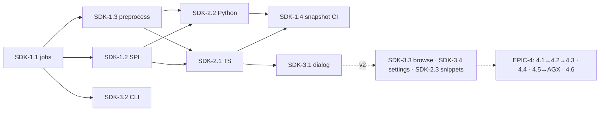

# Roadmap — SDK & Code Generation (Clients, Server Stubs, Packages)

> **Status:** ✅ **Issues filed on `apiome/apiome`** — umbrella **#4457**, epics
> **#4462–#4465**, and 19 issues **#4481–#4500** (non-contiguous: #4489 is unrelated).
> **Issue ID prefix:** `SDK`. Epics `SDK-EPIC-n`, issues `SDK-n.m`.
> **GitHub title format:** `apiome: [SDK-<epic>.<issue>] <title>`.
> **Recommended labels:** reuse `devex`, `export`, `package-manager`, `rest`, `ui`,
> `browser`, `automation`, `templates`, `mvp`, `epic`.
> **Existing backlog to absorb/cross-link (do NOT duplicate):** #2252 (Client SDK
> Generation), #1410 ([Epic] SDK Generation & Distribution), #2364 ([Epic] Code Generation:
> OpenAPI Client SDK Generation), #2246 ([Epic] Engineer DX), #1469 (SDK Documentation
> Generation), plus `FEATURE_ROADMAP_CODE_GENERATION.md` offering ids
> (`code_generation_core`, `schema_to_code`, `paths_code_generation`,
> `crud_operation_stubs`).
> **Related roadmaps:** `ROADMAP_MULTI_FORMAT_EXPORT.md` (MFX — generation is another
> **emitter family** on the export pipeline; reuse its job/queue/UI scaffolding),
> `ROADMAP_AGENT_EXPERIENCE.md` (AGX — the MCP-server artifact type defined here is
> consumed there).

---

## 0. Source description (request, verbatim)

> Based on my direct competitors for Apiome, create a market analysis of the gaps that
> Apiome doesn't cover, and create ROADMAP files for each of the major features that should
> be implemented, along with gaps that the market doesn't provide that Apiome could. These
> ROADMAPs should then be iterated through in such a way that the create-issues skill could
> be used to generate the issues for the roadmaps. Follow the rules from the create-roadmap
> file to identify the items, products, and features that could — and should — be
> implemented first.

**This roadmap covers gap G4** from `MARKET_ANALYSIS_COMPETITIVE_GAPS.md`: **Speakeasy**
(SDKs in 10 languages, Terraform providers, contract tests, MCP servers) and **Fern** (SDKs
+ package publishing + auto MCP; acquired by Postman Jan 2026) made generated SDKs the
expected deliverable of a published spec; SwaggerHub ships classic codegen. Apiome's
marketing already promises "generate code stubs" — nothing is implemented.

## 1. MVP Definition

From any **published OpenAPI version**, a user can generate and download a **typed client
SDK** in **TypeScript** and **Python** — idiomatic naming, auth helpers from
`securitySchemes`, typed request/response models, pagination-friendly iterators where
`x-pagination`/conventions detected, README with install + usage snippets — via (a) a
**Generate SDK** button on the dashboard/browse version page and (b)
`apiome generate sdk --lang ts|python <project>@<version>`. Generation runs as a tracked
job (queue/status/artifact download, mirroring the import-job pattern), is deterministic
for identical inputs, and every artifact embeds provenance (spec version id + generator
version). Server stubs and more languages are v2.

**Out of MVP** (v2): Go/Java/C#/PHP/Ruby, server stubs, package-registry publishing (npm/
PyPI), git-repo PR delivery, Terraform providers, MCP-server artifact (AGX), SDK docs
sites, watch-mode regeneration on publish.

## 2. Epics

### SDK-EPIC-1 — Generation Pipeline Core · #4462

| Issue | Title | Summary | Labels | Par | MVP | Complexity | Modules |
|---|---|---|---|---|---|---|---|
| SDK-1.1 · #4481 | Generator job service & artifact store | Job queue, status API, artifact storage w/ retention + provenance manifest | `rest`, `automation`, `database` | N | Y | L | apiome-rest, apiome-db |
| SDK-1.2 · #4482 | Generator SPI & sandboxing | Pluggable generator interface; containerized/timeboxed execution; determinism contract | `devex`, `shield` | N | Y | L | apiome-rest |
| SDK-1.3 · #4483 | Spec preprocessing for codegen | Resolve $refs, name anonymous schemas, operationId synthesis, x-extension passthrough | `validation`, `export` | Y | Y | M | apiome-rest |
| SDK-1.4 · #4484 | Codegen fixture corpus & snapshot CI | Generate against examples corpus; compile-check artifacts in CI | `automation`, `validation` | Y | Y | M | .github, apiome-rest |

### SDK-EPIC-2 — Language Targets (MVP: TS + Python) · #4463

| Issue | Title | Summary | Labels | Par | MVP | Complexity | Modules |
|---|---|---|---|---|---|---|---|
| SDK-2.1 · #4485 | TypeScript client generator | Typed fetch-based client, discriminated unions, zod-style runtime guards, auth helpers, README | `devex`, `export` | N | Y | XL | generator pkg |
| SDK-2.2 · #4486 | Python client generator | httpx + pydantic v2 models, sync+async, auth helpers, README | `devex`, `export` | Y | Y | XL | generator pkg |
| SDK-2.3 · #4487 | Snippet service | Per-operation usage snippets (ts/python/curl) for docs & try-it reuse | `devex`, `browser` | Y | N | M | apiome-rest |
| SDK-2.4 · #4488 | Go client generator | Idiomatic Go client + examples | `devex`, `export` | Y | N | L | generator pkg |
| SDK-2.5 · #4490 | Server stub generators | FastAPI + Express/Hono stubs w/ validation middleware from spec | `devex`, `export` | Y | N | XL | generator pkg |

### SDK-EPIC-3 — Surfaces (UI, CLI, Browse) · #4464

| Issue | Title | Summary | Labels | Par | MVP | Complexity | Modules |
|---|---|---|---|---|---|---|---|
| SDK-3.1 · #4491 | Generate SDK dialog (dashboard) | Language picker, options, job progress, download; on version/published pages | `ui`, `dashboard` | N | Y | M | apiome-ui |
| SDK-3.2 · #4492 | CLI `apiome generate sdk` | Headless generation + download; CI-friendly | `devex`, `automation` | Y | Y | S | apiome-cli |
| SDK-3.3 · #4493 | Browse "Get SDK" surface | Public download (tenant-permitted) on browse spec pages + snippet tabs | `browser`, `portal` | Y | N | M | apiome-browse |
| SDK-3.4 · #4494 | Generation settings & branding | Package name/namespace, license header, custom user-agent per tenant | `ui`, `governance` | Y | N | S | apiome-ui, apiome-rest |

### SDK-EPIC-4 — Distribution & Lifecycle (v2; absorbs #1410 scope) · #4465

| Issue | Title | Summary | Labels | Par | MVP | Complexity | Modules |
|---|---|---|---|---|---|---|---|
| SDK-4.1 · #4495 | Package publishing pipelines | npm/PyPI publish with tenant credentials; semver mapped from version lines | `package-manager`, `automation` | N | N | L | apiome-rest |
| SDK-4.2 · #4496 | Git delivery (PR mode) | Push regenerated SDK as PR to tenant repo (reuse repository integration creds) | `integrations`, `automation` | Y | N | L | apiome-rest |
| SDK-4.3 · #4497 | Auto-regen on publish | Subscription: new published version → regenerate → deliver (4.1/4.2) | `automation`, `versions` | N | N | M | apiome-rest |
| SDK-4.4 · #4498 | Terraform provider generator | Speakeasy-parity flagship for infra APIs | `devex`, `export` | Y | N | XL | generator pkg |
| SDK-4.5 · #4499 | MCP server artifact | Generate MCP server exposing spec operations as tools (consumed by AGX roadmap) | `ai`, `export` | Y | N | L | generator pkg |
| SDK-4.6 · #4500 | SDK docs generation | Reference docs from generated code (#1469); feeds Slate sites | `documentation`, `devex` | Y | N | M | generator pkg, authoring |

## 3. Detailed Issue Descriptions

### SDK-EPIC-1 — Pipeline Core

**SDK-1.1 Generator job service & artifact store**
- **Problem:** Generation is seconds-to-minutes work producing files — needs jobs, statuses, artifacts, retention; none exist for codegen (import jobs exist and set the pattern).
- **Solution/Scope:** `codegen_jobs` + `codegen_artifacts` tables (tenant, version_id, target, options hash, status, log, artifact ref, provenance manifest); REST: create/get/list/download (zip). Storage local-volume first with S3-compatible interface. Retention per license tier.
- **Acceptance Criteria:** Job lifecycle observable via REST; identical inputs → identical artifact hash (determinism gate); artifacts expire per policy.
- **Parallelism/Dependencies:** Foundation; blocks all.
- **Technical Stack:** FastAPI, Postgres, existing job/worker pattern from spec-import.
- **Epic:** SDK-EPIC-1.

**SDK-1.2 Generator SPI & sandboxing**
- **Problem:** Generators evolve independently and run semi-trusted templates; a crash or hang must not take the platform down.
- **Solution/Scope:** SPI: `generate(canonical_spec, options) -> artifact_dir` with manifest (name, version, languages, options schema); execution in a resource-limited container (CPU/mem/time caps, no network); generator version pinned into provenance.
- **Acceptance Criteria:** Kill-on-timeout test; malicious template cannot reach network; SPI docs allow a community generator to register.
- **Parallelism/Dependencies:** After 1.1; blocks EPIC-2.
- **Technical Stack:** Python, Docker.
- **Epic:** SDK-EPIC-1.

**SDK-1.3 Spec preprocessing for codegen**
- **Problem:** Real specs have anonymous schemas, missing operationIds, unresolved $refs — the classic cause of unusable generated code (why Speakeasy/Fern beat openapi-generator; source: speakeasy comparison post).
- **Solution/Scope:** Deterministic pipeline: bundle refs, synthesize stable operationIds (`get_pets_by_id`), name inline schemas from context (`PetListResponse`), normalize nullable/oneOf patterns, carry x-extensions; emits "codegen readiness" warnings reusable by lint (GOV).
- **Acceptance Criteria:** Examples corpus preprocesses without collision; naming stable across runs.
- **Parallelism/Dependencies:** After 1.1 (parallel with 1.2); shared with MFX emitters where sensible.
- **Technical Stack:** Python, canonical model from `spec_import_engine`.
- **Epic:** SDK-EPIC-1.

**SDK-1.4 Fixture corpus & snapshot CI** — generate TS+Python for `apiome-ui/examples/openapi/*` on every PR; `tsc --noEmit` + `mypy` compile gates; snapshot diffs reviewed. *Deps:* 1.1–1.3, 2.1/2.2 (grows with them). **Epic:** SDK-EPIC-1.

### SDK-EPIC-2 — Language Targets

**SDK-2.1 TypeScript client generator**
- **Problem:** TS is the highest-demand SDK target (Speakeasy makes it the flagship, incl. MCP); "download our TS SDK" is the portal moment that converts consumers.
- **Solution/Scope:** Fetch-based, zero-heavy-deps client: typed models (discriminated unions for oneOf+discriminator), runtime validation guards, per-scheme auth helpers, retry/backoff hooks, ESM+CJS build config, README with install/usage per operation group. Supersedes #2364/#2252 scope.
- **Acceptance Criteria:** Petstore SDK compiles strict; live call against SIM mock succeeds in an e2e test; bundle < 50KB min+gz for petstore.
- **Parallelism/Dependencies:** Needs 1.2/1.3. Blocks 3.1 usefulness.
- **Technical Stack:** Template-driven generation (Jinja-style) or AST emit; decision spike inside issue.
- **Epic:** SDK-EPIC-2.

**SDK-2.2 Python client generator** — httpx sync+async, pydantic v2 models, typed exceptions per error response, README; same AC pattern vs mock. *Deps:* 1.2/1.3. **Epic:** SDK-EPIC-2.

**SDK-2.3 Snippet service** — `GET /v1/versions/{id}/snippets/{operationId}?lang=` returns install+call snippet; consumed by browse operation pages and SIM-3.5 try-it copy-as-code (single source of truth). *Deps:* 2.1/2.2 templates. **Epic:** SDK-EPIC-2.

**SDK-2.4 Go client generator** — most-requested third language for infra buyers. *Deps:* 1.2/1.3. **Epic:** SDK-EPIC-2.

**SDK-2.5 Server stub generators** — FastAPI + Express/Hono skeletons with request validation and typed handler interfaces (`crud_operation_stubs` offering); design-first teams scaffold implementations from the spec. *Deps:* 1.3. **Epic:** SDK-EPIC-2.

### SDK-EPIC-3 — Surfaces

**SDK-3.1 Generate SDK dialog** — on Versions/Published pages: language cards, options (package name — from 3.4 defaults), progress via job polling, download button, history list of prior artifacts. *AC:* full flow e2e in Playwright. *Deps:* 1.1, one of 2.1/2.2. **Epic:** SDK-EPIC-3.

**SDK-3.2 CLI `apiome generate sdk`** — `--lang`, `--out`, `--wait`; exits non-zero on job failure; enables CI packaging. *Deps:* 1.1 REST. **Epic:** SDK-EPIC-3.

**SDK-3.3 Browse "Get SDK"** — public artifact download for tenants that allow it (per-project setting), plus snippet tabs on operations (2.3); the consumer-side conversion loop. *Deps:* 3.1 plumbing, 2.3. **Epic:** SDK-EPIC-3.

**SDK-3.4 Generation settings & branding** — tenant/project defaults: package scope/name pattern, license header, user-agent; stored + merged into job options. *Deps:* 1.1. **Epic:** SDK-EPIC-3.

### SDK-EPIC-4 — Distribution & Lifecycle (v2)

**SDK-4.1 Package publishing** — encrypted tenant registry creds; publish job step with dry-run; semver derived from version line + regen counter; provenance in package metadata. *Deps:* EPIC-2 stable. **Epic:** SDK-EPIC-4.
**SDK-4.2 Git delivery (PR mode)** — reuse repository OAuth integrations to open PRs with regenerated SDK; Speakeasy/Fern's stickiest workflow. *Deps:* 4.1 packaging layout. **Epic:** SDK-EPIC-4.
**SDK-4.3 Auto-regen on publish** — subscription table + worker: publish event → generate matrix → deliver; failures to dead-letter like webhooks. *Deps:* 4.1/4.2. **Epic:** SDK-EPIC-4.
**SDK-4.4 Terraform provider generator** — resources/data-sources from CRUD conventions + x-terraform hints; big differentiator for platform-infra APIs (Speakeasy's enterprise wedge). *Deps:* 1.3 maturity. **Epic:** SDK-EPIC-4.
**SDK-4.5 MCP server artifact** — generate a runnable MCP server whose tools are the spec's operations (schemas → tool input schemas; auth injected via env); artifact consumed/hosted by `ROADMAP_AGENT_EXPERIENCE.md` (AGX-EPIC-2). *Deps:* 2.1 (TS base). **Epic:** SDK-EPIC-4.
**SDK-4.6 SDK docs generation** — typed reference docs from generated code, publishable through Slate (#1469, `ROADMAP_AUTHORING_PLATFORM.md`). *Deps:* 2.x. **Epic:** SDK-EPIC-4.

## 4. Work order

1. **SDK-1.1 → SDK-1.2 ∥ SDK-1.3** (pipeline).
2. **SDK-2.1 ∥ SDK-2.2** with **SDK-1.4** growing alongside; **SDK-3.2** early (thin), **SDK-3.1** once TS lands. MVP done.
3. v2: SDK-2.3 → SDK-3.3; SDK-3.4; then EPIC-4 (4.1→4.2→4.3 distribution track; 4.4/4.5/4.6 parallel; 4.5 hands off to AGX).
