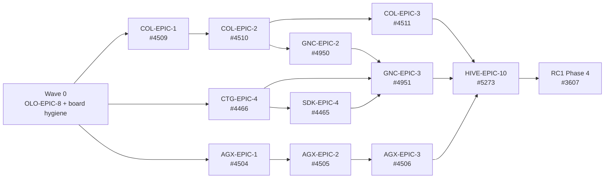

# RC5 — Epic Order of Execution & Demonstration Scripts

> **Purpose.** One page that answers two questions: *which epic do we do next*, and *how do we
> show it works when it's done*. Every epic below links to its GitHub issue and to a
> `DEMONSTRATION_EPIC_*.md` script written to be recorded as a video.
>
> **Sequencing authority:** [`private-suite/docs/roadmaps/RC5_OOE.md`](../../private-suite/docs/roadmaps/RC5_OOE.md)
> (ticket-level order) and `ROADMAP_NEXT_PRODUCT_SEQUENCE.md` (portfolio phase order). This
> document is the epic-level view of the same plan plus the demo scripts.
>
> **Written:** 2026-09-07 · **Milestone:** [`RC5`](https://github.com/apiome/apiome/milestone/2),
> due 2026-10-31 · 84 open (49 epics/umbrellas · 35 leaf tickets), 69 closed

---

## 1. The order, in one table

Waves 1–5 each own a lane. After Wave 0 the **Assurance→SDK**, **Collaboration→Git** and
**Agent** lanes run in parallel; only the release gate needs all three.

| # | Epic | Tickets | Lane | Demo script |
|---|---|---|---|---|
| 0 | [OLO-EPIC-8 · Database-driven auth provider configuration #4966](https://github.com/apiome/apiome/issues/4966) | 1 | Wave 0 | [DEMONSTRATION_EPIC_4966](DEMONSTRATION_EPIC_4966.md) |
| 1 | [CTG-EPIC-4 · Contract Verification #4466](https://github.com/apiome/apiome/issues/4466) | 5 | Assurance | [DEMONSTRATION_EPIC_4466](DEMONSTRATION_EPIC_4466.md) |
| 2 | [SDK-EPIC-4 · Distribution & Lifecycle #4465](https://github.com/apiome/apiome/issues/4465) † | 7 | Assurance→SDK | [DEMONSTRATION_EPIC_4465](DEMONSTRATION_EPIC_4465.md) |
| 3 | [COL-EPIC-1 · Comments & Threads #4509](https://github.com/apiome/apiome/issues/4509) | 4 | Collaboration | [DEMONSTRATION_EPIC_4509](DEMONSTRATION_EPIC_4509.md) |
| 4 | [COL-EPIC-2 · Review & Approval #4510](https://github.com/apiome/apiome/issues/4510) | 4 | Collaboration | [DEMONSTRATION_EPIC_4510](DEMONSTRATION_EPIC_4510.md) |
| 5 | [COL-EPIC-3 · Notifications #4511](https://github.com/apiome/apiome/issues/4511) | 2 | Collaboration | [DEMONSTRATION_EPIC_4511](DEMONSTRATION_EPIC_4511.md) |
| 6 | [GNC-EPIC-2 · Git Provider Synchronization #4950](https://github.com/apiome/apiome/issues/4950) | 3 | Collaboration→Git | [DEMONSTRATION_EPIC_4950](DEMONSTRATION_EPIC_4950.md) |
| 7 | [GNC-EPIC-3 · Team Flow Completion #4951](https://github.com/apiome/apiome/issues/4951) | 1 | Collaboration→Git | [DEMONSTRATION_EPIC_4951](DEMONSTRATION_EPIC_4951.md) |
| 8 | [AGX-EPIC-1 · Spec → MCP Tool Compiler #4504](https://github.com/apiome/apiome/issues/4504) | 4 | Agent | [DEMONSTRATION_EPIC_4504](DEMONSTRATION_EPIC_4504.md) |
| 9 | [AGX-EPIC-2 · Managed MCP Invocation Runtime #4505](https://github.com/apiome/apiome/issues/4505) | 3 | Agent | [DEMONSTRATION_EPIC_4505](DEMONSTRATION_EPIC_4505.md) |
| 10 | [AGX-EPIC-3 · Agent Identity, Quotas & Analytics #4506](https://github.com/apiome/apiome/issues/4506) | 4 | Agent | [DEMONSTRATION_EPIC_4506](DEMONSTRATION_EPIC_4506.md) |
| 11 | [HIVE-EPIC-10 · Quality, accessibility & cleanup #5273](https://github.com/apiome/apiome/issues/5273) ‡ | 5 | Release gate | [DEMONSTRATION_EPIC_5273](DEMONSTRATION_EPIC_5273.md) |
| 12 | [RC1 Phase 4 · Stabilization & Release Gate #3607](https://github.com/apiome/apiome/issues/3607) | 3 | Release gate | [DEMONSTRATION_EPIC_3607](DEMONSTRATION_EPIC_3607.md) |

† SDK-EPIC-4's demo covers the whole SDK lane, including four open leaves whose parent epics
([SDK-EPIC-2 #4463](https://github.com/apiome/apiome/issues/4463),
[SDK-EPIC-3 #4464](https://github.com/apiome/apiome/issues/4464)) were closed in RC4 while their
children stayed open. Fix that hygiene wart or accept it, but the demo is one story either way.

‡ **HIVE-EPIC-10 is currently unmilestoned.** It is listed here because
[HIVE-10.2 Accessibility sweep #5338](https://github.com/apiome/apiome/issues/5338) is the same
work as [RC1-4.3 #3622](https://github.com/apiome/apiome/issues/3622). Pull it into RC5 and do it
once, or drop it and do the a11y pass twice.

---

## 2. Wave 0 — before any epic starts

No demo script. This is board hygiene plus one test ticket, and it takes an afternoon.

| Do | Detail |
|---|---|
| Close 31 finished epics | Every non-`Future` child is closed; §3.2 of [`RC5_OOE.md`](../../private-suite/docs/roadmaps/RC5_OOE.md) lists them. Drops RC5 from 84 open to ~53. |
| Move 3 v2 epics **out** of RC5 | [AGX-EPIC-4 #4507](https://github.com/apiome/apiome/issues/4507), [COL-EPIC-4 #4512](https://github.com/apiome/apiome/issues/4512), [OLO-EPIC-9 #4983](https://github.com/apiome/apiome/issues/4983) — all children are v2; they block their umbrellas from ever closing. |
| Move 5 CTG tickets **into** RC5 | [#4479](https://github.com/apiome/apiome/issues/4479), [#4480](https://github.com/apiome/apiome/issues/4480), [#4489](https://github.com/apiome/apiome/issues/4489), [#4501](https://github.com/apiome/apiome/issues/4501), [#4502](https://github.com/apiome/apiome/issues/4502) — Wave 1's actual content, still sitting in `Future`. |
| Milestone HIVE-EPIC-10 | [#5273](https://github.com/apiome/apiome/issues/5273) into RC5 — see ‡ above. |
| ~~Ship [OLO-8.9 #4975](https://github.com/apiome/apiome/issues/4975)~~ ✅ | Done. The last open leaf in the OLO tree — closes [OLO-EPIC-8 #4966](https://github.com/apiome/apiome/issues/4966), then the [OLO umbrella #4184](https://github.com/apiome/apiome/issues/4184) once OLO-EPIC-9 is re-milestoned. |

---

## 3. Per-epic execution order

Each block is the order to pick tickets up. `∥` means "can run in parallel with the row above".

### Wave 0 — [OLO-EPIC-8 #4966](https://github.com/apiome/apiome/issues/4966)

| # | Ticket | Depends on |
|---|---|---|
| 1 | [OLO-8.9 · Provider-config e2e + parity tests #4975](https://github.com/apiome/apiome/issues/4975) ✅ | 8.6/8.7 ✅, [8.8 #4974](https://github.com/apiome/apiome/issues/4974) ✅ |

**Closes:** OLO-EPIC-8, then the [OLO umbrella #4184](https://github.com/apiome/apiome/issues/4184)
once [OLO-EPIC-9 #4983](https://github.com/apiome/apiome/issues/4983) is re-milestoned.
**Exit:** DB↔`.env` precedence is covered by a green journey; a forged admin cookie fails closed.

### Wave 1 — [CTG-EPIC-4 #4466](https://github.com/apiome/apiome/issues/4466)

| # | Ticket | Depends on |
|---|---|---|
| 1 | [CTG-4.1 · Consumer contract registry #4479](https://github.com/apiome/apiome/issues/4479) | CTG-EPIC-1 ✅ classifier |
| 2 | ∥ [CTG-4.3 · Provider verification vs live #4489](https://github.com/apiome/apiome/issues/4489) | ECA-2.1 runner ✅, SIM-1.3/1.4 ✅ |
| 3 | [CTG-4.2 · Consumer-aware breaking analysis #4480](https://github.com/apiome/apiome/issues/4480) | 4.1 |
| 4 | [CTG-4.4 · Scheduled verification & alerts #4501](https://github.com/apiome/apiome/issues/4501) | 4.3, CTG-3.3 webhooks ✅ |
| 5 | [CTG-4.5 · Deploy-gating status API #4502](https://github.com/apiome/apiome/issues/4502) | 4.2 + 4.4 (partial ok) |

**Closes:** CTG-EPIC-4 → [CTG umbrella #4458](https://github.com/apiome/apiome/issues/4458).
**Exit:** CI reports "breaks N of M consumers"; live drift is caught on demand and on schedule;
`GET …/gate` returns one auditable verdict. [GNC-EPIC-3](https://github.com/apiome/apiome/issues/4951) consumes that endpoint.

### Wave 2 — [SDK-EPIC-4 #4465](https://github.com/apiome/apiome/issues/4465) (+ four orphaned leaves)

| # | Ticket | Depends on |
|---|---|---|
| 1 | [SDK-3.4 · Generation settings & branding #4494](https://github.com/apiome/apiome/issues/4494) | SDK-1.1 ✅ — first, because 3.3 and 4.1 read its defaults |
| 2 | [SDK-3.3 · Browse "Get SDK" surface #4493](https://github.com/apiome/apiome/issues/4493) | 3.4, [SDK-2.3 snippets #4487](https://github.com/apiome/apiome/issues/4487) ✅ |
| 3 | ∥ [SDK-2.4 · Go client generator #4488](https://github.com/apiome/apiome/issues/4488) | SDK-1.2/1.3 ✅ |
| 4 | ∥ [SDK-2.5 · Server stub generators #4490](https://github.com/apiome/apiome/issues/4490) | SDK-1.3 ✅ |
| 5 | [SDK-4.1 · Package publishing pipelines #4495](https://github.com/apiome/apiome/issues/4495) | 2.4 (three-language layout), 3.4 branding |
| 6 | [SDK-4.2 · Git delivery (PR mode) #4496](https://github.com/apiome/apiome/issues/4496) | 4.1; reuse REPO-1.3 OAuth ✅ — **no second credential store** |
| 7 | [SDK-4.3 · Auto-regen on publish #4497](https://github.com/apiome/apiome/issues/4497) | 4.1/4.2 |

**Closes:** SDK-EPIC-4 for RC5 (4.4/4.5/4.6 are `Future`).
**Exit:** a published version is fetchable as TS/Python/Go from Browse, publishes to npm/PyPI with
provenance, arrives as a PR, and regenerates itself on the next publish.

### Wave 3 — [COL-EPIC-1 #4509](https://github.com/apiome/apiome/issues/4509) → [COL-EPIC-2 #4510](https://github.com/apiome/apiome/issues/4510) → [COL-EPIC-3 #4511](https://github.com/apiome/apiome/issues/4511)

| # | Ticket | Depends on |
|---|---|---|
| 1 | [COL-1.1 · Comment data model & REST #4513](https://github.com/apiome/apiome/issues/4513) | **Foundation — blocks 9 tickets.** Include the source-revision digest GNC needs |
| 2 | [COL-1.2 · Studio thread UI #4514](https://github.com/apiome/apiome/issues/4514) | 1.1 |
| 3 | ∥ [COL-1.4 · Anchor resilience #4516](https://github.com/apiome/apiome/issues/4516) | 1.1 |
| 4 | [COL-1.3 · Project Discussion panel #4515](https://github.com/apiome/apiome/issues/4515) | 1.1; deep-link format from 1.2 |
| 5 | [COL-2.1 · Review request model & lifecycle #4517](https://github.com/apiome/apiome/issues/4517) | 1.1 — this track can start as soon as 1.1 lands |
| 6 | [COL-2.2 · Review page UI #4518](https://github.com/apiome/apiome/issues/4518) | 2.1; classified diff from CTG-1.3 ✅ |
| 7 | [COL-2.3 · Approval policy & publish gate #4519](https://github.com/apiome/apiome/issues/4519) | 2.1; GOV-2.5 ✅ gate pattern |
| 8 | ∥ [COL-2.4 · Review status surfaces #4520](https://github.com/apiome/apiome/issues/4520) | 2.1 |
| 9 | [COL-3.1 · Notification model & fan-out #4521](https://github.com/apiome/apiome/issues/4521) | 1.1 + 2.1 event sources |
| 10 | [COL-3.2 · In-app notification center #4522](https://github.com/apiome/apiome/issues/4522) | 3.1 |

**Closes:** COL-EPIC-1/2/3 for RC5 (3.3/3.4 are `Future`), then the
[COL umbrella #4508](https://github.com/apiome/apiome/issues/4508) once COL-EPIC-4 is re-milestoned.
**Exit:** a thread survives rename and orphans cleanly on delete; publish is blocked until required
approvals exist; a spec change visibly invalidates a stale approval; reviewers are notified in-app.

### Wave 4 — [GNC-EPIC-2 #4950](https://github.com/apiome/apiome/issues/4950) → [GNC-EPIC-3 #4951](https://github.com/apiome/apiome/issues/4951)

| # | Ticket | Depends on |
|---|---|---|
| 1 | [GNC-2.1 · Branch-to-draft binding #4737](https://github.com/apiome/apiome/issues/4737) | COL-1.x/2.x; REPO-1.x ✅, RAR capture ✅ |
| 2 | [GNC-2.2 · Provider webhook and status adapter #4738](https://github.com/apiome/apiome/issues/4738) | 2.1; reuse REPO-4.3/4.7 signed webhooks ✅. GitHub first |
| 3 | [GNC-2.3 · Three-way spec synchronization #4739](https://github.com/apiome/apiome/issues/4739) | 2.1, 2.2 — **no write-back path in this PR** |
| 4 | [GNC-3.1 · API change check suite #4740](https://github.com/apiome/apiome/issues/4740) | 2.2; CTG-2.2 ✅, GOV-2.5 ✅, SGD-2.1 manifest ✅, **CTG-4.5 (Wave 1)** |

**Closes:** GNC-EPIC-2, GNC-EPIC-3, [GNC umbrella #4949](https://github.com/apiome/apiome/issues/4949).
**Exit:** one active binding per draft; no webhook can overwrite an active draft; conflicts show
base/incoming/current with source locations; reruns are idempotent.

### Wave 5 — [AGX-EPIC-1 #4504](https://github.com/apiome/apiome/issues/4504) → [AGX-EPIC-2 #4505](https://github.com/apiome/apiome/issues/4505) → [AGX-EPIC-3 #4506](https://github.com/apiome/apiome/issues/4506)

Rows 1–3 are three independent foundations and may start during Wave 2.

| # | Ticket | Depends on |
|---|---|---|
| 1 | [AGX-1.1 · Operation→tool mapping engine #4529](https://github.com/apiome/apiome/issues/4529) + [AGX-1.4 · corpus #4532](https://github.com/apiome/apiome/issues/4532) co-developed | Canonical model ✅ |
| 2 | ∥ [AGX-2.2 · Upstream auth vault #4534](https://github.com/apiome/apiome/issues/4534) | Independent; reuse V2-MCP-20.2 encryption ✅ |
| 3 | ∥ [AGX-3.1 · Agent key kind + scopes #4537](https://github.com/apiome/apiome/issues/4537) | Independent; extends `api_keys` (CTG-2.3 ✅, MTG-1.3 ✅) |
| 4 | [AGX-1.2 · Tool selection & curation model #4530](https://github.com/apiome/apiome/issues/4530) | 1.1 |
| 5 | [AGX-2.1 · Invocation proxy #4533](https://github.com/apiome/apiome/issues/4533) | 1.1, 1.2, 2.2, 3.1 — **the hard core (XL)** |
| 6 | [AGX-2.3 · Safety rails #4535](https://github.com/apiome/apiome/issues/4535) | 2.1; SSRF policy shared with SIM-3.2 ✅ |
| — | [AGX-2.4 · Mock-target mode #4536](https://github.com/apiome/apiome/issues/4536) ✅ | Already shipped 2026-08-26 with the mock consolidation — a quarter of AGX-EPIC-2 is done before the epic starts |
| 7 | ∥ [AGX-3.3 · Invocation audit & usage rollups #4539](https://github.com/apiome/apiome/issues/4539) | 2.1 |
| 8 | [AGX-3.2 · Quotas & rate limits #4538](https://github.com/apiome/apiome/issues/4538) | 3.1, 3.3 counters; license tier OLO-5.x ✅ |
| 9 | [AGX-3.4 · Agent usage UI #4540](https://github.com/apiome/apiome/issues/4540) | 1.2, 3.1, 3.3 |
| 10 | [AGX-1.3 · Description enrichment pass #4531](https://github.com/apiome/apiome/issues/4531) | 1.1 — last; human-reviewable only |

**Closes:** AGX-EPIC-1/2/3 for RC5, then the
[AGX umbrella #4503](https://github.com/apiome/apiome/issues/4503) once AGX-EPIC-4 is re-milestoned.
**Exit:** tool schemas are deterministic and MCP-valid; upstream credentials are write-only and
never returned; SSRF/method/size/timeout controls enforced; agent keys produce quota + audit records.

### Release gate — [HIVE-EPIC-10 #5273](https://github.com/apiome/apiome/issues/5273) → [RC1 Phase 4 #3607](https://github.com/apiome/apiome/issues/3607)

| # | Ticket | Depends on |
|---|---|---|
| 1 | [HIVE-10.2 · Accessibility sweep #5338](https://github.com/apiome/apiome/issues/5338) | Page epics landed |
| 2 | ∥ [HIVE-10.3 · Motion pass and reduced-motion #5339](https://github.com/apiome/apiome/issues/5339) | Page epics landed |
| 3 | ∥ [HIVE-10.4 · Empty-state art, copy and voice #5340](https://github.com/apiome/apiome/issues/5340) | Can run per-epic as they land |
| 4 | [HIVE-10.5 · Ship the design system as a route #5341](https://github.com/apiome/apiome/issues/5341) | HIVE-EPIC-2 |
| 5 | [HIVE-10.6 · Legacy cleanup #5342](https://github.com/apiome/apiome/issues/5342) | **Last.** Every page epic landed |
| 6 | [RC1-4.1 · Private beta / dogfood #3620](https://github.com/apiome/apiome/issues/3620) | **Start at Wave 0 and run continuously** |
| 7 | [RC1-4.2 · Bug burn-down #3621](https://github.com/apiome/apiome/issues/3621) | 4.1 triage. Triage the OLO-7.3 security follow-ups [#4960](https://github.com/apiome/apiome/issues/4960)–[#4963](https://github.com/apiome/apiome/issues/4963) here |
| 8 | [RC1-4.3 · Performance & accessibility pass #3622](https://github.com/apiome/apiome/issues/3622) | After HIVE-10.2, which is the a11y half of it |

**Closes:** HIVE-EPIC-10 and RC1 Phase 4 — the RC5 exit checklist.

---

## 4. Epics that need no work and no demo

31 RC5 epics are finished for RC5 purposes: every non-`Future` child is closed, and they stay
open only because `Future` children are still linked. They are listed with their remaining
children in §3.2 of [`RC5_OOE.md`](../../private-suite/docs/roadmaps/RC5_OOE.md). Close them in
Wave 0.

Families: `REPO-EPIC-1/3/5` · `V2-MCP-EPIC-15/16/18–25` · `MFI-EPIC-4/7/22/23/25/26/28` ·
`MFX-EPIC-2/3/4/5/6/8/11/19/43` · `SGD` · `GOV`.

## 5. Explicitly out of RC5

| Pack | Open | Why it's out |
|---|---:|---|
| [FMT-EPIC-5…11](https://github.com/apiome/apiome/issues/5405) — format expansion | 43 | Unmilestoned. Genuine scope beyond the RC; at current burn it consumes the whole remaining window. |
| [HIVE-EPIC-9 · Admin console #5272](https://github.com/apiome/apiome/issues/5272) | 7 | Unmilestoned. Admin-surface redesign, not RC-gating. |
| [OLO-EPIC-9 · Expanded SSO catalog #4983](https://github.com/apiome/apiome/issues/4983) | 38 | Country-provider long tail; explicitly non-MVP. |

**This is the one real decision in RC5.** These 88 open issues are not in the milestone but are
where recent capacity has gone. Either defer them past RC5 in writing, or move the 2026-10-31 date.

---

## 6. How to use the demonstration scripts

Each `DEMONSTRATION_EPIC_*.md` follows the format of
[`../MOCK_DEMO_SCRIPT.md`](../MOCK_DEMO_SCRIPT.md):

- a **run sheet** — acts, the beat each one lands, and a time budget;
- a **PREP** section for everything that must be true before recording;
- **ACT**s built from **DO** (what to click or type) and **SAY** (the narration beat, to be
  rewritten in your own voice — not read aloud verbatim);
- a **RESCUE** section for what to do when a beat fails on camera;
- **IF ASKED** for the questions that always come.

> **Every script is written ahead of the work.** Routes, control labels and outputs come from the
> tickets' acceptance criteria, not from a running build. Walk each script once against the shipped
> UI and correct it *before* you record — then the correction is also a review of whether the epic
> actually delivered what it promised.

**Recording order** follows the table in §1. Videos 3–5 (COL) and 6–7 (GNC) each tell one
continuous story, so record them in the same session with the same seeded tenant.
