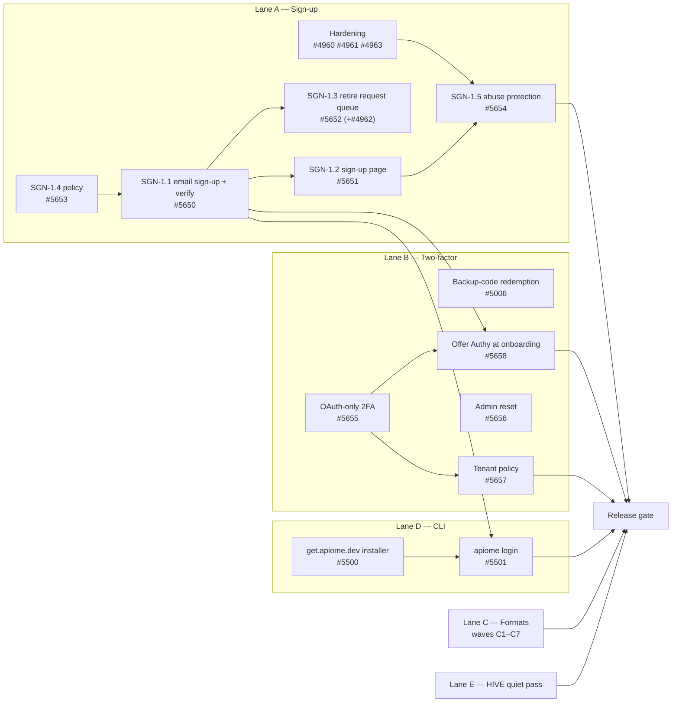

# RC6 — Order of Execution

> **Purpose.** One page that answers *what do we pick up next, in what order, and when is RC6
> done*. It is the ticket-level plan for the [`RC6` milestone](https://github.com/apiome/apiome/milestone/6).
>
> **Written:** 2026-10-07 · **Milestone:** RC6 — 86 open, 15 closed after this triage.
> **Predecessor:** RC5 ([milestone 2](https://github.com/apiome/apiome/milestone/2), due 2026-10-31) —
> its 40 open items are umbrella epics; closing them is RC5 work, not RC6 scope.

---

## 1. What RC6 is

RC6 makes Apiome something a stranger can **sign up for, secure, and bring any spec into**:

| Lane | Outcome | Tickets |
| --- | --- | --- |
| **A — Sign-up** | Anyone can create an account and a workspace with email + password or OAuth, under an installation sign-up policy, with abuse protection | [SGN-EPIC-1 #5649](https://github.com/apiome/apiome/issues/5649) + 5 children, 4 auth-hardening follow-ups |
| **B — Two-factor** | Authy / authenticator-app 2FA offered at sign-up, usable by every account, recoverable | [#2553](https://github.com/apiome/apiome/issues/2553) + 4 TFA children, [#5006](https://github.com/apiome/apiome/issues/5006) |
| **C — Formats** | The rest of the format-matrix expansion: gateways, code-first types, client workspaces, EDI/vertical, IoT/semantic web, mainframe, and the data-platform emitters | FMT-EPIC-6…11 (36 children) + [#4311](https://github.com/apiome/apiome/issues/4311), [#4312](https://github.com/apiome/apiome/issues/4312) |
| **D — CLI onboarding** | A new user installs the CLI in one line and signs in from it | [#5500](https://github.com/apiome/apiome/issues/5500), [#5501](https://github.com/apiome/apiome/issues/5501) |
| **E — Quiet pass** | HIVE-11/12/13: list-page density, shell and launcher fit, brand gates (already in RC6) | [#5594](https://github.com/apiome/apiome/issues/5594), [#5595](https://github.com/apiome/apiome/issues/5595), [#5596](https://github.com/apiome/apiome/issues/5596) |

The lanes are independent until the release gate. A and B meet at onboarding (TFA-1.4 needs
SGN-1.1); D needs A's email sign-up to be worth announcing.

---

## 2. Wave 0 — board hygiene (done with this document)

| Done | Detail |
| --- | --- |
| ✅ Created the sign-up epic | [SGN-EPIC-1 #5649](https://github.com/apiome/apiome/issues/5649) with SGN-1.1…1.5 (#5650–#5654); #4960–#4963 linked under it |
| ✅ Split the Authy umbrella | TOTP for Authy already shipped (#5005, #5014). The remaining gaps are TFA-1.1…1.4 (#5655–#5658) under [#2553](https://github.com/apiome/apiome/issues/2553), plus #5006 (still parented by OLO-EPIC-9 #4983) |
| ✅ Moved into RC6 | #2553, #5006, #4960–#4963, FMT-EPIC-6…11 (#5406–#5411) and their 36 open children, #4311, #4312, #5500, #5501 |
| ✅ Closed FMT-EPIC-5 #5405 | All six children were closed; its follow-on emitters (#4311, #4312) moved to RC6 |
| ✅ Milestoned the stragglers | 45 unmilestoned issues to `Future`: the long-tail OLO sign-in providers (OLO-9.8…9.49), Enterprise SSO (OLO-9.10…9.12), SMS 2FA (OLO-9.51, v2) and the admin-console redesign (HIVE-EPIC-9). Every open issue has a milestone again |

**Note:** FMT-10.2…11.4 were each filed twice. The closed copies (#5474, #5476, #5478, #5481,
#5483, #5485, #5487) are the duplicates; the open issues linked below are the live ones.

**Before Lane C starts:** confirm the `pending-adapter` corpus entries
(`apiome-ui/examples/`, `load_corpus(feature="pending-adapter")`) cover each format below. Each
adapter ticket flips its entries from `adapter_key: null` to the real key.

---

## 3. Lane A — Sign-up ([SGN-EPIC-1 #5649](https://github.com/apiome/apiome/issues/5649))

**Today:** only OAuth sign-up is self-service, and only while `AUTH_SIGNUP_DISABLED` is unset. Email
"sign-up" files a request (`createSignupRequest`) that a super-admin approves by hand, marking the
address verified without a click. Better Auth credential sign-up is configured but off
(`disableSignUp: true`), and no verification email exists.

| # | Ticket | Depends on | Notes |
| --- | --- | --- | --- |
| A1 | [SGN-1.4 Sign-up policy #5653](https://github.com/apiome/apiome/issues/5653) | — | DB-first `open` / `invite_only` / `closed` + allowed domains; env flag stays the fallback. Enforced for email **and** OAuth |
| A2 | [SGN-1.1 Email + password sign-up with verification #5650](https://github.com/apiome/apiome/issues/5650) | A1 (or the env flag) | SendGrid verification link → first-tenant onboarding. No enumeration. Off when no email sender is configured |
| A3 | [SGN-1.2 Sign-up page #5651](https://github.com/apiome/apiome/issues/5651) | A2 | `/signup`: every enabled provider + the email form; policy-aware copy |
| A3 ∥ | [SGN-1.3 Retire the legacy request queue #5652](https://github.com/apiome/apiome/issues/5652) | A2 | Removes `createSignupRequest` and the admin Signups tab; invites pending requesters. Resolves [#4962](https://github.com/apiome/apiome/issues/4962) |
| A4 | [#4960 Encrypt OAuth tokens & PATs at rest](https://github.com/apiome/apiome/issues/4960) | — | `sev:high`, already accepted — can start on day one |
| A4 ∥ | [#4961 Public Suffix List for callbacks & cookie domain](https://github.com/apiome/apiome/issues/4961) · [#4963 Link-route CSRF, tenant fail-closed, proxy scoping](https://github.com/apiome/apiome/issues/4963) | — | Must land before sign-up is announced |
| A5 | [SGN-1.5 Abuse protection #5654](https://github.com/apiome/apiome/issues/5654) | A3, A4 | Rate limits, disposable-domain blocklist, optional Turnstile, audit events |

**Lane A is done when** a stranger on a clean stack signs up with email + password, verifies,
onboards into their own workspace with no admin involved — and `closed` stops every path.

---

## 4. Lane B — Two-factor, Authy first ([#2553](https://github.com/apiome/apiome/issues/2553))

**Today:** TOTP works. Profile → Security → Two-factor enrols Authy / Google Authenticator by
QR, and `/login/2fa` verifies the code. Email OTP is the second method when SendGrid is configured.
**Gaps:** backup codes are generated but cannot be redeemed at login. OAuth-only users have no
password, so they cannot enrol, and the OAuth sign-in path skips the second factor. No admin can
reset a locked-out user, and no tenant can require 2FA.

| # | Ticket | Depends on | Notes |
| --- | --- | --- | --- |
| B1 | [#5006 Backup codes, trusted devices, lockout](https://github.com/apiome/apiome/issues/5006) | — | Redeeming a backup code at `/login/2fa` is the recovery path — do it first |
| B1 ∥ | [TFA-1.1 2FA for OAuth-only accounts #5655](https://github.com/apiome/apiome/issues/5655) | — | Re-auth instead of password; second factor after OAuth sign-in |
| B1 ∥ | [TFA-1.2 Admin reset of a user's 2FA #5656](https://github.com/apiome/apiome/issues/5656) | — | Server-side admin check, audit, session revoke |
| B2 | [TFA-1.4 Offer Authy at onboarding, skippable #5658](https://github.com/apiome/apiome/issues/5658) | A2, TFA-1.1 | #2553's original ask: optional, re-enable from the profile |
| B3 | [TFA-1.3 Tenant policy — require 2FA #5657](https://github.com/apiome/apiome/issues/5657) | TFA-1.1 | Grace period, compliance on the members list. Fast-follow inside RC6 |

Out of scope: SMS OTP ([#5071](https://github.com/apiome/apiome/issues/5071), v2, `Future`).

**Lane B is done when** a new user is offered Authy during onboarding, an OAuth-only user can enrol,
a lost phone is recoverable with a backup code or an admin reset, and #2553 can be closed.

---

## 5. Lane C — The remaining formats

Every format below already has pending corpus fixtures. Each ticket registers an adapter (or
emitter) on the import-source / emitter SPI with no engine change, flips its corpus entries live,
and appears in `GET /v1/import/sources` / `GET /v1/export/targets` and the generated
[Supported formats](https://apiome.github.io/apiome/bring-in/supported-formats) page. The waves go
from most-requested by API teams to longest tail. **Run one wave at a time, and within a wave pick
up the `∥` rows in parallel.**

### C1 — Gateways & infrastructure ([FMT-EPIC-7 #5407](https://github.com/apiome/apiome/issues/5407))

| # | Ticket | Depends on |
| --- | --- | --- |
| 1 | [FMT-7.6 Shared GatewayConfigDocument middle #5460](https://github.com/apiome/apiome/issues/5460) | — (extends the shared gateway middle from FMT-2.2 / IXH-7.8) |
| 2 | [FMT-7.1 AWS API Gateway import #5455](https://github.com/apiome/apiome/issues/5455) **MVP** | 7.6 |
| 3 ∥ | [FMT-7.2 Azure API Management #5456](https://github.com/apiome/apiome/issues/5456) · [FMT-7.3 Apigee #5457](https://github.com/apiome/apiome/issues/5457) | 7.6 |
| 4 ∥ | [FMT-7.4 Envoy xDS / Istio #5458](https://github.com/apiome/apiome/issues/5458) · [FMT-7.5 Traefik, NGINX, HAProxy, Consul, Tyk #5459](https://github.com/apiome/apiome/issues/5459) | 7.6 |
| 5 | [FMT-7.7 Gateway emit modes #5461](https://github.com/apiome/apiome/issues/5461) | 7.1–7.5 |

### C2 — Code-first & type systems ([FMT-EPIC-8 #5408](https://github.com/apiome/apiome/issues/5408))

| # | Ticket | Depends on |
| --- | --- | --- |
| 1 | [FMT-8.6 Inference provenance & confidence labelling #5467](https://github.com/apiome/apiome/issues/5467) | — (every code-first adapter emits these labels) |
| 2 ∥ | [FMT-8.4 Pydantic #5465](https://github.com/apiome/apiome/issues/5465) · [FMT-8.2 Zod #5463](https://github.com/apiome/apiome/issues/5463) | 8.6 |
| 3 | [FMT-8.1 TypeScript declarations #5462](https://github.com/apiome/apiome/issues/5462) | 8.6 |
| 4 | [FMT-8.3 tRPC routers #5464](https://github.com/apiome/apiome/issues/5464) | 8.1, 8.2 (router inputs are TS / Zod types) |
| 5 | [FMT-8.5 CUE, Pkl, Dhall #5466](https://github.com/apiome/apiome/issues/5466) | 8.6 |

### C3 — Client workspaces ([FMT-EPIC-10 #5410](https://github.com/apiome/apiome/issues/5410)) ∥ data-platform emitters

| # | Ticket | Depends on |
| --- | --- | --- |
| 1 ∥ | [FMT-10.2 Thunder Client #5475](https://github.com/apiome/apiome/issues/5475) · [FMT-10.1 Hoppscotch #5473](https://github.com/apiome/apiome/issues/5473) | — (reuse the Postman collection projection) |
| 2 | [FMT-10.3 SoapUI / ReadyAPI #5477](https://github.com/apiome/apiome/issues/5477) | — (reuses WSDL intake) |
| 3 | [FMT-10.4 Client-workspace emit modes #5479](https://github.com/apiome/apiome/issues/5479) | 10.1–10.3 |
| ∥ | [MFX-35.1 SQL DDL emitter #4311](https://github.com/apiome/apiome/issues/4311) → [MFX-35.2 DBML + Prisma #4312](https://github.com/apiome/apiome/issues/4312) | — (closes the data-platform round trip opened by FMT-5.6) |

### C4 — B2B / EDI / vertical ([FMT-EPIC-6 #5406](https://github.com/apiome/apiome/issues/5406))

| # | Ticket | Depends on |
| --- | --- | --- |
| 1 | [FMT-6.1 UN/EDIFACT #5445](https://github.com/apiome/apiome/issues/5445) **MVP** | — (sits beside the shipped X12 adapter) |
| 2 | [FMT-6.5 TRADACOMS, ODETTE/VDA, EANCOM profiles #5449](https://github.com/apiome/apiome/issues/5449) | 6.1 |
| 3 ∥ | [FMT-6.2 SAP IDoc #5446](https://github.com/apiome/apiome/issues/5446) · [FMT-6.3 SWIFT MT #5447](https://github.com/apiome/apiome/issues/5447) · [FMT-6.6 NACHA / SEPA #5450](https://github.com/apiome/apiome/issues/5450) · [FMT-6.9 FIX Orchestra #5453](https://github.com/apiome/apiome/issues/5453) | — |
| 4 ∥ | [FMT-6.4 HL7 v3 / CDA #5448](https://github.com/apiome/apiome/issues/5448) · [FMT-6.8 NCPDP #5452](https://github.com/apiome/apiome/issues/5452) · [FMT-6.7 DICOM #5451](https://github.com/apiome/apiome/issues/5451) | — (healthcare group; DICOM is XL, start it early in the wave) |
| 5 | [FMT-6.10 Implementation-guide capability statements #5454](https://github.com/apiome/apiome/issues/5454) | all of 6.x |

### C5 — Industrial, IoT & semantic web ([FMT-EPIC-9 #5409](https://github.com/apiome/apiome/issues/5409))

| # | Ticket | Depends on |
| --- | --- | --- |
| 1 ∥ | [FMT-9.2 MQTT Sparkplug B #5469](https://github.com/apiome/apiome/issues/5469) · [FMT-9.3 ROS 2 interfaces #5470](https://github.com/apiome/apiome/issues/5470) | — (Protobuf / IDL reuse) |
| 2 ∥ | [FMT-9.4 SHACL, JSON-LD, OWL/RDFS #5471](https://github.com/apiome/apiome/issues/5471) · [FMT-9.5 LwM2M / IPSO, Matter #5472](https://github.com/apiome/apiome/issues/5472) | — |
| 3 | [FMT-9.1 OPC UA NodeSet2 #5468](https://github.com/apiome/apiome/issues/5468) | — (XL; XML reader from FMT-EPIC-4) |

### C6 — Mainframe long tail ([FMT-EPIC-11 #5411](https://github.com/apiome/apiome/issues/5411))

| # | Ticket | Depends on |
| --- | --- | --- |
| 1 ∥ | [FMT-11.3 VSAM / CICS BMS #5484](https://github.com/apiome/apiome/issues/5484) · [FMT-11.4 Natural / ADABAS DDM #5486](https://github.com/apiome/apiome/issues/5486) | — (copybook adapter reuse) |
| 2 ∥ | [FMT-11.1 PL/I `%INCLUDE` #5480](https://github.com/apiome/apiome/issues/5480) · [FMT-11.2 IMS DBD / PSB #5482](https://github.com/apiome/apiome/issues/5482) | — |

### C7 — Close the format epics

Close FMT-EPIC-6…11 as their children close. Re-run `generate_supported_formats_doc.py` and
`generate_format_counts.py` (README, portal and browse facet counts) and check the corpus parity
gate (FMT-1.4): no `pending-adapter` entries are left.

**Cut line.** Lane C is 38 tickets, with nine XL. If RC6 has to ship before Lane C finishes,
waves C1–C3 and FMT-6.1 (the two MVP adapters and the most-requested families) are the floor.
C4's remainder, C5 and C6 then move to RC7 as whole waves — **don't ship half a wave**.

---

## 6. Lane D — CLI onboarding

| # | Ticket | Depends on |
| --- | --- | --- |
| D1 | [#5500 get.apiome.dev install script](https://github.com/apiome/apiome/issues/5500) | — |
| D2 | [#5501 `apiome login`](https://github.com/apiome/apiome/issues/5501) | D1; Lane A's A2, so a new user can go sign-up → `apiome login` → `apiome import` |

---

## 7. Lane E — HIVE quiet pass (already in RC6)

Follow the order in [`docs/ROADMAP_HIVE_11_QUIET_PASS.md`](../ROADMAP_HIVE_11_QUIET_PASS.md):
HIVE-11.1 StatusStrip → 11.2 → 11.5 primitives → list pages 11.3, 11.4, 11.6–11.11; HIVE-12.1 →
12.2 → 12.3–12.6; HIVE-13.x gates last. Two touch points with this release:

- **HIVE-11.9** (Members) and **TFA-1.3** (tenant 2FA policy) both change the members page. Land
  HIVE-11.9 first, so the compliance column goes onto the quiet layout.
- **HIVE-12.5 / 12.6** (launcher) — the new sign-up lands new users on the launcher. Do 12.5 before
  Lane A's A3 is announced.

---

## 8. Release gate

RC6 is ready to tag when:

- [ ] Lanes A, B and D are closed. Lane C is closed down to the cut line, with the rest moved to
      RC7 by whole wave.
- [ ] HIVE-EPIC-11/12/13 are closed.
- [ ] A clean-stack journey passes: **sign up (email) → verify → onboard → enrol Authy → sign out →
      sign in with code → `apiome login` → import an AWS API Gateway export and a Zod schema →
      export to Kong**.
- [ ] `yarn docs:check` is green, and the release-notes post for RC6 is generated by tagging `RC6`
      (`.github/workflows/apiome-release-notes.yml`).
- [ ] The What's new feed (`apiome-ui/public/WHATS_NEW.md`) is bumped to RC6.
